# Active Directory 環境を構成する

---

## 演習の意図
    演習ガイドを参照して演習の意図をあらかじめ確認してください

## 演習における役割と、環境のパラメータ
- X: ご自身のPod番号
- Windows Webサーバー役: WinSrv1(WSrv1-yyMMddX)
- クライアント デスクトップ環境: WinClient(WC1-yyMMddX)

## 注意
- 手順例の画像は<B>pod255</B>に準拠したパラメータのものです
- 手順内の<B>X</B>表記はご自身のpod番号に読み替えてください

---

## 1. (オプション)ドメインコントローラーの状態を確認する  
この項目の手順は省略できます。  
興味のある方のみ行ってください。  

1. Active Directory ドメイン コントローラー(WinSrv1)の管理画面に接続する 

1. PowerShellを起動する  
    1. [スタートメニュー]を右クリックし、コンテキストメニュー内の[Windows PowerShell(管理者)]をクリックする  
    1. [ユーザー アカウント制御]のポップアップで[はい]をクリックする  
    1. Windows PowerShellのウィンドウが表示されたことを確認する  

1. 以下のコマンドを実行し、EXAMPLEドメインの管理者アカウント(admin)でログインしていることを確認する  
    ＞ ***whoami***  

    ```
    PS C:\Windows\system32> whoami
    example\admin
    PS C:\Windows\system32>
    ```

1. 以下のコマンドを実行し、Windows Server1(WinSrv1)がActive Directory ドメイン コントローラーとして認識されていることを確認する  
    ＞ ***netdom query dc***  

    ```
    PS C:\Windows\system32> netdom query dc
    ドメインにアカウントがあるドメイン コントローラーの一覧:

    WSrv1-230802255
    コマンドは正しく完了しました。

    PS C:\Windows\system32>
    ```
1. 以下のコマンドを実行し、ドメイン コントローラーの状態を診断する    
    ＞ ***dcdiag***  

    > 【補足】  
    > dcdiagは、ドメインコントローラーの各機能についてステータスを検査するツールです。  
    > ドメインコントローラーが起動した直後には"失敗"が多数記録される場合がありますが、時間の経過により問題は自然解消します。  
    > なお、今回の演習環境においては"DFSREvent"機能の"失敗"は無視できます。   

    ```
    PS C:\Windows\system32> dcdiag

    ディレクトリ サーバー診断

    初期セットアップを実行しています:
    ホーム サーバーの検索を試みています...
    ホーム サーバー = WSrv1-230802255
    * AD フォレストが識別されました。
    初期情報の収集が完了しました。

    必須の初期テストを実行しています

    サーバーをテストしています: Default-First-Site-Name\WSrv1-230802255
        テストを開始しています: Connectivity
            ......................... WSrv1-230802255 はテスト Connectivity に合格しました

    プライマリ テストを実行しています

    サーバーをテストしています: Default-First-Site-Name\WSrv1-230802255
        テストを開始しています: Advertising
            ......................... WSrv1-230802255 はテスト Advertising に合格しました
        テストを開始しています: FrsEvent
            ......................... WSrv1-230802255 はテスト FrsEvent に合格しました
        テストを開始しています: DFSREvent
            SYSVOL の共有後、この 24 時間以内に発生した警告またはエラー イベントがあります。 SYSVOL レプリケーション失敗の 問題があると、グループ ポリシーの問題が発生する場合 があります。
            ......................... WSrv1-230802255 はテスト DFSREvent に失敗しました
        テストを開始しています: SysVolCheck
            ......................... WSrv1-230802255 はテスト SysVolCheck に合格しました
        テストを開始しています: KccEvent
            ......................... WSrv1-230802255 はテスト KccEvent に合格しました
        テストを開始しています: KnowsOfRoleHolders
            ......................... WSrv1-230802255 はテスト KnowsOfRoleHolders に合格しました
        テストを開始しています: MachineAccount
            ......................... WSrv1-230802255 はテスト MachineAccount に合格しました
        テストを開始しています: NCSecDesc
            ......................... WSrv1-230802255 はテスト NCSecDesc に合格しました
        テストを開始しています: NetLogons
            ......................... WSrv1-230802255 はテスト NetLogons に合格しました
        テストを開始しています: ObjectsReplicated
            ......................... WSrv1-230802255 はテスト ObjectsReplicated に合格しました
        テストを開始しています: Replications
            ......................... WSrv1-230802255 はテスト Replications に合格しました
        テストを開始しています: RidManager
            ......................... WSrv1-230802255 はテスト RidManager に合格しました
        テストを開始しています: Services
            ......................... WSrv1-230802255 はテスト Services に合格しました
        テストを開始しています: SystemLog
            ......................... WSrv1-230802255 はテスト SystemLog に合格しました
        テストを開始しています: VerifyReferences
            ......................... WSrv1-230802255 はテスト VerifyReferences に合格しました


    パーティション テストを実行しています: ForestDnsZones
        テストを開始しています: CheckSDRefDom
            ......................... ForestDnsZones はテスト CheckSDRefDom に合格しました
        テストを開始しています: CrossRefValidation
            ......................... ForestDnsZones はテスト CrossRefValidation に合格しました

    パーティション テストを実行しています: DomainDnsZones
        テストを開始しています: CheckSDRefDom
            ......................... DomainDnsZones はテスト CheckSDRefDom に合格しました
        テストを開始しています: CrossRefValidation
            ......................... DomainDnsZones はテスト CrossRefValidation に合格しました

    パーティション テストを実行しています: Schema
        テストを開始しています: CheckSDRefDom
            ......................... Schema はテスト CheckSDRefDom に合格しました
        テストを開始しています: CrossRefValidation
            ......................... Schema はテスト CrossRefValidation に合格しました

    パーティション テストを実行しています: Configuration
        テストを開始しています: CheckSDRefDom
            ......................... Configuration はテスト CheckSDRefDom に合格しました
        テストを開始しています: CrossRefValidation
            ......................... Configuration はテスト CrossRefValidation に合格しました

    パーティション テストを実行しています: example
        テストを開始しています: CheckSDRefDom
            ......................... example はテスト CheckSDRefDom に合格しました
        テストを開始しています: CrossRefValidation
            ......................... example はテスト CrossRefValidation に合格しました

    エンタープライズ テストを実行しています: example.local
        テストを開始しています: LocatorCheck
            ......................... example.local はテスト LocatorCheck に合格しました
        テストを開始しています: Intersite
            ......................... example.local はテスト Intersite に合格しました
    PS C:\Windows\system32>
    ```


---

## 2. Active Directory ドメインユーザーを作成する  

1. Active Directoryユーザー 管理コンソールを起動する 
    1. Active Directory ドメイン コントローラー(WinSrv1)の管理画面に接続する  
    1. サーバーマネージャーウィンドウ右上の[ツール]をクリックする  
    1. メニュー内の[Active Directoryユーザーとコンピューター]をクリックし、Active Directoryユーザー管理コンソールを起動する  
    1. [Active Directoryユーザーとコンピューター]が起動したことを確認する

1. 新しいOU(組織単位) "Employees" を作成する
    1. 左側コンソールツリーの[Active Directory ユーザーとコンピューター]-[example.local]をクリックして選択する    
    1. [example.local]を右クリックし、コンテキストメニュー内の[新規作成]-[組織単位(OU)]をクリックする 
    1. [新しいオブジェクト - 組織単位 (OU)]ウィンドウが起動したことを確認する  
    1. [新しいオブジェクト - 組織単位 (OU)]ウィンドウで、以下のパラメータを入力する

        | 項目 | パラメータ |
        | :----- | :----- |
        | 名前 | Employees |

        - [x] 間違って削除されないようにコンテナーを保護する  

    1. [新しいオブジェクト - 組織単位 (OU)]ウィンドウで、[OK]をクリックする    
    1. 左側コンソールツリーを参照し、[Active Directory ユーザーとコンピューター]-[example.local]-[Employees]が作成されたことを確認する  


1. 新しいユーザー "Tom" を作成する
    1. 左側コンソールツリーの[Active Directory ユーザーとコンピューター]-[example.local]-[Employees]をクリックして選択する    
    1. [Employees]を右クリックし、コンテキストメニュー内の[新規作成]-[ユーザー]をクリックする 
    1. [新しいオブジェクト - ユーザー]ウィンドウが起動したことを確認する  
    1. [新しいオブジェクト - ユーザー]ウィンドウで、以下のパラメータを入力する
        | 項目 | パラメータ |
        | :----- | :----- |
        | 姓 | <空欄> |
        | 名 | Tom |
        | イニシャル | <空欄> |
        | フル ネーム | Tom |
        | ユーザーログオン名 | Tom@example.local |
        | ユーザーログオン名(Windows2000より以前) | EXAMPLE\Tom |
    1. [新しいオブジェクト - ユーザー]ウィンドウで、[次へ]をクリックする  

    1. [新しいオブジェクト - ユーザー]ウィンドウで、以下のパラメータを入力する

        | 項目 | パラメータ |
        | :----- | :----- |
        | パスワード | Pa$$w0rd |
        | パスワードの確認入力 | Pa$$w0rd |

        - [ ] ユーザーは次回ログオン時にパスワード変更が必要    
        - [ ] ユーザーはパスワードを変更できない  
        - [x] パスワードを無期限にする    
        - [ ] アカウントは無効  

    1. [新しいオブジェクト - ユーザー]ウィンドウで、[次へ]をクリックする 

    1. [新しいオブジェクト - ユーザー]ウィンドウで、[完了]をクリックする 

    1. 左側コンソールツリーの[Active Directory ユーザーとコンピューター]-[example.local]-[Employees]をクリックして選択し、画面の右側ペインにユーザー"Tom"が表示されていることを確認する  


1. 新しいユーザー "Jerry" を作成する
    1. 左側コンソールツリーの[Active Directory ユーザーとコンピューター]-[example.local]-[Employees]をクリックして選択する    
    1. [Employees]を右クリックし、コンテキストメニュー内の[新規作成]-[ユーザー]をクリックする 
    1. [新しいオブジェクト - ユーザー]ウィンドウが起動したことを確認する  
    1. [新しいオブジェクト - ユーザー]ウィンドウで、以下のパラメータを入力する
        | 項目 | パラメータ |
        | :----- | :----- |
        | 姓 | <空欄> |
        | 名 | Jerry |
        | イニシャル | <空欄> |
        | フル ネーム | Jerry |
        | ユーザーログオン名 | Jerry@example.local |
        | ユーザーログオン名(Windows2000より以前) | EXAMPLE\Jerry |
    1. [新しいオブジェクト - ユーザー]ウィンドウで、[次へ]をクリックする  

    1. [新しいオブジェクト - ユーザー]ウィンドウで、以下のパラメータを入力する

        | 項目 | パラメータ |
        | :----- | :----- |
        | パスワード | Pa$$w0rd |
        | パスワードの確認入力 | Pa$$w0rd |

        - [ ] ユーザーは次回ログオン時にパスワード変更が必要    
        - [ ] ユーザーはパスワードを変更できない  
        - [x] パスワードを無期限にする    
        - [ ] アカウントは無効  

    1. [新しいオブジェクト - ユーザー]ウィンドウで、[次へ]をクリックする 

    1. [新しいオブジェクト - ユーザー]ウィンドウで、[完了]をクリックする 

    1. 左側コンソールツリーの[Active Directory ユーザーとコンピューター]-[example.local]-[Employees]をクリックして選択し、画面の右側ペインにユーザー"Jerry"が表示されていることを確認する  


---

## 3. Windows ClientをActive Directoryドメインに参加させる  

1. Windows Clientに"admin"で接続する  
    1. Windows Client(WinClient)の管理画面に "admin" で接続する 
    1. [スタートメニュー]を右クリックし、コンテキストメニュー内の[Windows PowerShell(管理者)]をクリックする  
    1. [ユーザー アカウント制御]のポップアップで[はい]をクリックする  
    1. Windows PowerShellのウィンドウが表示されたことを確認する  
    1. 以下のコマンドを実行し、クライアント デスクトップ環境役のコンピュータ(WC1)に "admin" で接続していることを確認する  
        ＞ ***hostname***  
        ＞ ***whoami***         
        > 【補足】  
        > クライアント デスクトップ環境役のコンピュータであるWinClientは、"WC1-yyMMddX(年月日とPod番号)"形式のホスト名が設定されています。  


1. Windows PowerShellで以下のコマンドを実行し、Windows ClientがActive Directoryドメイン名をDNS名前解決できることを確認する  
    ＞ ***nslookup example.local***  

    ```
    PS C:\Windows\system32> nslookup example.local
    サーバー:  UnKnown
    Address:  10.255.1.104

    名前:    example.local
    Addresses:  10.255.1.104
            10.255.0.104

    PS C:\Windows\system32>
    ```

    > 【補足】  
    > "名前:example.local" の "Addresses" として、Windows Server 1 のIPアドレス(10.X.1.104)が解決できていることを確認します。    


1. [システムのプロパティ]設定画面を起動する
    1. [スタートメニュー]-[Windows システム ツール]-[コントロール パネル]をクリックする  
    1. [コントロール パネル]が起動したことを確認する  
    1. [システムとセキュリティ]をクリックする  
    1. [システム]をクリックする  
    1. [設定 - 詳細情報]ウィンドウが起動したことを確認する  
    1. [設定 - 詳細情報]ウィンドウ右端の"関連設定"の[システムの詳細設定]をクリックする  
    1. [システムのプロパティ]ウィンドウが起動したことを確認する  


---

## 3. Active Directory グループを作成する  

1. Active Directoryユーザー 管理コンソールを起動する 
    1. Active Directory ドメイン コントローラー(WinSrv1)の管理画面に接続する  
    1. [Active Directoryユーザーとコンピューター]を起動する

1. 新しいOU(組織単位) "Groups" を作成する
    1. 左側コンソールツリーの[Active Directory ユーザーとコンピューター]-[example.local]をクリックして選択する    
    1. [example.local]を右クリックし、コンテキストメニュー内の[新規作成]-[組織単位(OU)]をクリックする 
    1. [新しいオブジェクト - 組織単位 (OU)]ウィンドウが起動したことを確認する  
    1. [新しいオブジェクト - 組織単位 (OU)]ウィンドウで、以下のパラメータを入力する

        | 項目 | パラメータ |
        | :----- | :----- |
        | 名前 | Groups |

        - [x] 間違って削除されないようにコンテナーを保護する  

    1. [新しいオブジェクト - 組織単位 (OU)]ウィンドウで、[OK]をクリックする    
    1. 左側コンソールツリーを参照し、[Active Directory ユーザーとコンピューター]-[example.local]-[Groups]が作成されたことを確認する  


1. 新しいグループ "G_Friends" を作成する
    1. 左側コンソールツリーの[Active Directory ユーザーとコンピューター]-[example.local]-[Groups]をクリックして選択する    
    1. [Groups]を右クリックし、コンテキストメニュー内の[新規作成]-[グループ]をクリックする 
    1. [新しいオブジェクト - グループ]ウィンドウが起動したことを確認する  
    1. [新しいオブジェクト - グループ]ウィンドウで、以下のパラメータを入力する
        | 項目 | パラメータ |
        | :----- | :----- |
        | グループ名 | G_Friends |
        | グループ名(Windows2000より以前) | G_Friends |

        グループのスコープ:  
        - [ ] ドメイン ローカル  
        - [x] グローバル  
        - [ ] ユニバーサル  

        グループの種類:  
        - [ ] セキュリティ  
        - [x] 配布  

    1. [新しいオブジェクト - グループ]ウィンドウで、[OK]をクリックする  

    1. 左側コンソールツリーの[Active Directory ユーザーとコンピューター]-[example.local]-[Groups]をクリックして選択し、画面の右側ペインにグループ"G_Friends"が表示されていることを確認する  


1. 新しいグループ "G_SystemAdmins" を作成する
    1. 左側コンソールツリーの[Active Directory ユーザーとコンピューター]-[example.local]-[Groups]をクリックして選択する    
    1. [Groups]を右クリックし、コンテキストメニュー内の[新規作成]-[グループ]をクリックする 
    1. [新しいオブジェクト - グループ]ウィンドウが起動したことを確認する  
    1. [新しいオブジェクト - グループ]ウィンドウで、以下のパラメータを入力する
        | 項目 | パラメータ |
        | :----- | :----- |
        | グループ名 | G_SystemAdmins |
        | グループ名(Windows2000より以前) | G_SystemAdmins |

        グループのスコープ:  
        - [ ] ドメイン ローカル  
        - [x] グローバル  
        - [ ] ユニバーサル  

        グループの種類:  
        - [ ] セキュリティ  
        - [x] 配布  

    1. [新しいオブジェクト - グループ]ウィンドウで、[OK]をクリックする  

    1. 左側コンソールツリーの[Active Directory ユーザーとコンピューター]-[example.local]-[Groups]をクリックして選択し、画面の右側ペインにグループ"G_SystemAdmins"が表示されていることを確認する  


1. 新しいグループ "DL_xxx" を作成する
    1. 左側コンソールツリーの[Active Directory ユーザーとコンピューター]-[example.local]-[Groups]をクリックして選択する    
    1. [Groups]を右クリックし、コンテキストメニュー内の[新規作成]-[グループ]をクリックする 
    1. [新しいオブジェクト - グループ]ウィンドウが起動したことを確認する  
    1. [新しいオブジェクト - グループ]ウィンドウで、以下のパラメータを入力する
        | 項目 | パラメータ |
        | :----- | :----- |
        | グループ名 | G-Friends |
        | グループ名(Windows2000より以前) | G-Friends |

        グループのスコープ:  
        - [ ] ドメイン ローカル  
        - [x] グローバル  
        - [ ] ユニバーサル  

        グループの種類:  
        - [ ] セキュリティ  
        - [x] 配布  

    1. [新しいオブジェクト - グループ]ウィンドウで、[OK]をクリックする  

    1. 左側コンソールツリーの[Active Directory ユーザーとコンピューター]-[example.local]-[Groups]をクリックして選択し、画面の右側ペインにグループ"G-Friends"が表示されていることを確認する  


---
---
---


## 1. Windows ClientのActive Directoryドメイン参加の準備
この手順では、Windows ClientをActive Directoryドメインに参加させる準備をします。


## 4. Windows ClientのActive Directoryドメイン参加の準備
この手順では、Windows ClientをActive Directoryドメインに参加させる準備をします。

1. Clientのネットワーク設定を変更する   
    1. 操作コンピュータを変更するため、演習環境のトップページに戻る  
    1. Windows Client(WinClient)の管理画面に "admin" で接続する   

1. PowerShellを起動する  
    1. [スタートメニュー]を右クリックし、コンテキストメニュー内の[Windows PowerShell(管理者)]をクリックする  
    1. [ユーザー アカウント制御]のポップアップで[はい]をクリックする  
    1. 以下のコマンドを実行し、Windowsクライアント役のコンピュータ(WinClient)に接続していることを確認する  
        ＞ ***hostname***  
        
        > 【補足】  
        > クライアント デスクトップ環境役のコンピュータであるWinClientは、"WC1-yyMMddX(年月日とPod番号)"形式のホスト名が設定されています。  

1. PowerShellでDNSサーバーの設定を変更する

    1. 以下のコマンドを実行し、変更前のネットワーク設定を確認する  
        ＞ ipconfig /all  


        > 【補足】  
        > このコンピュータには、2つのネットワークアダプター(管理接続作業用NW, 内部NW)が構成されています。
        > "内部NW" アダプターの優先DNSサーバーの設定を、この後のコマンドで変更します。   

    1. 以下のコマンドを実行し、問い合わせ先のDNSサーバーをWindows Server1(WinSrv1)に変更する  
        ＞ ***Set-DnsClientServerAddress -InterfaceAlias "内部NW" -ServerAddresses ("10.X.1.104")***  


---  
---  
---  


## 1. Windows Webサーバー構築の準備
この演習では、Windows Server2(WinSrv2)をWindows Webサーバーとして構築します。  

1. Windows Webサーバー(WinSrv2)の管理画面に接続する  
1. [スタートメニュー]を右クリックし、コンテキストメニュー内の[Windows PowerShell(管理者)]をクリックする  
1. [ユーザー アカウント制御]のポップアップで[はい]をクリックする  
1. Windows PowerShellのウィンドウが表示されたことを確認する  
1. 以下のコマンドを実行し、Windowsファイルサーバー役のコンピュータ(WinSrv2)に接続していることを確認する  
    ＞ ***hostname***  
    
    > 【補足】  
    > Windowsファイルサーバー役のコンピュータであるWinSrv2には、"WSrv2-yyMMddX(年月日とPod番号)"形式のホスト名が設定されています。  

---

## 2. Webサーバー(IIS)の役割を追加  
1. 役割と機能の追加ウィザードを開始する  
    1. [スタートメニュー]をクリックする  
    1. スタートメニュー内の[サーバー マネージャー]をクリックし、サーバーマネージャを起動する    
    1. サーバーマネージャーのダッシュボード画面内の[役割と機能の追加]をクリックする   
        <kbd>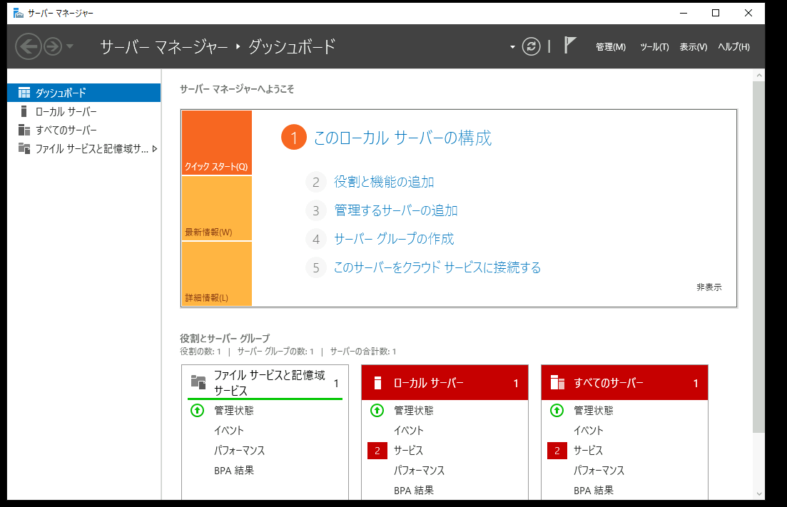</kbd> 
    1. [役割と機能の追加ウィザード]ウィンドウが起動したことを確認する  
        <kbd>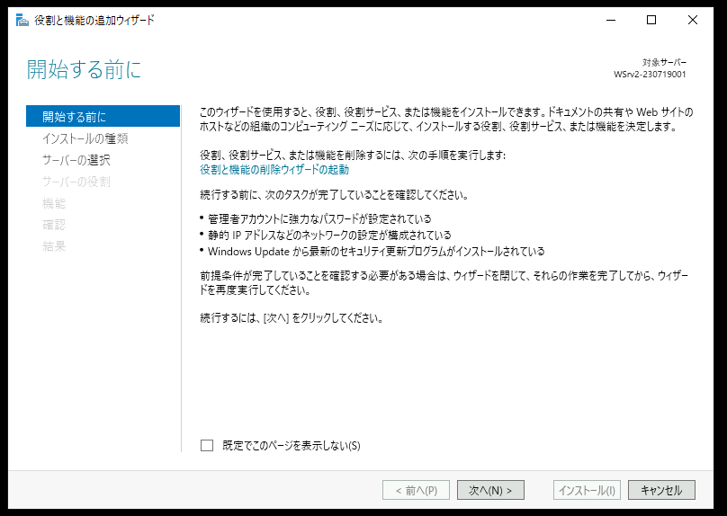</kbd> 


## 3. Webサーバー(IIS)インストール後の動作確認  
1. IIS管理コンソールを起動する  
    1. サーバーマネージャーウィンドウ右上の[ツール]をクリックする  
    1. メニュー内の[インターネット インフォメーション サービス(IIS) マネージャー]をクリックし、IIS管理コンソールを起動する  
        <kbd>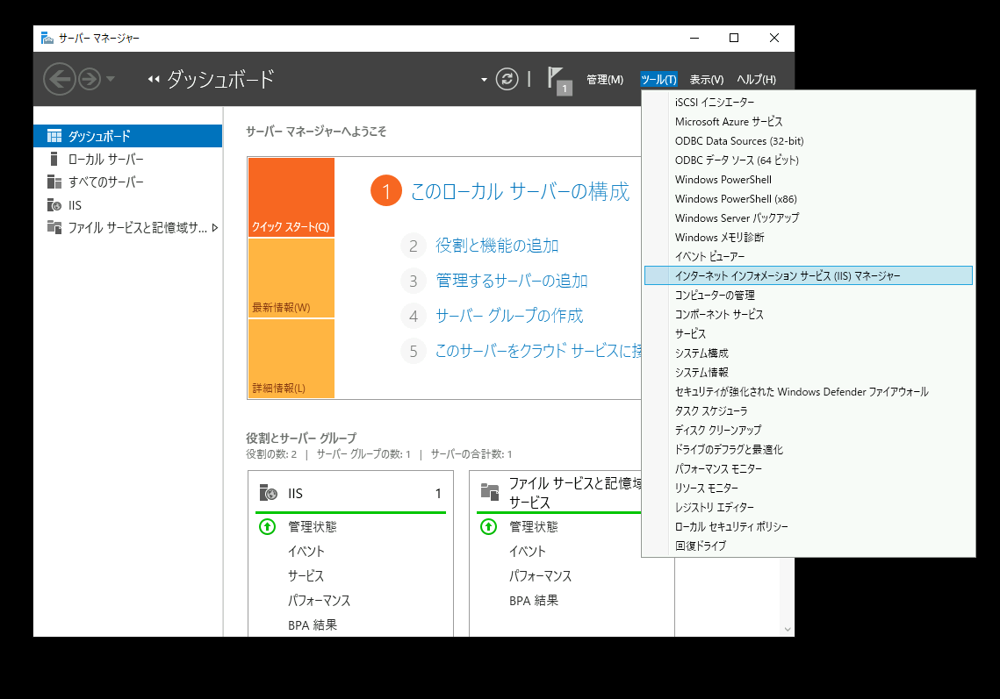</kbd> 
    1. [インターネット インフォメーション サービス(IIS) マネージャー]が起動したことを確認する
    1. 左側コンソールツリーの[＜サーバー名＞]-[サイト]-[Default Web Site]をクリックする  
    1. ウィンドウ右側ペインの[操作]メニューの[Webサイトの管理]-[再起動]をクリックし、エラーが発生しないことを確認する  
        <kbd>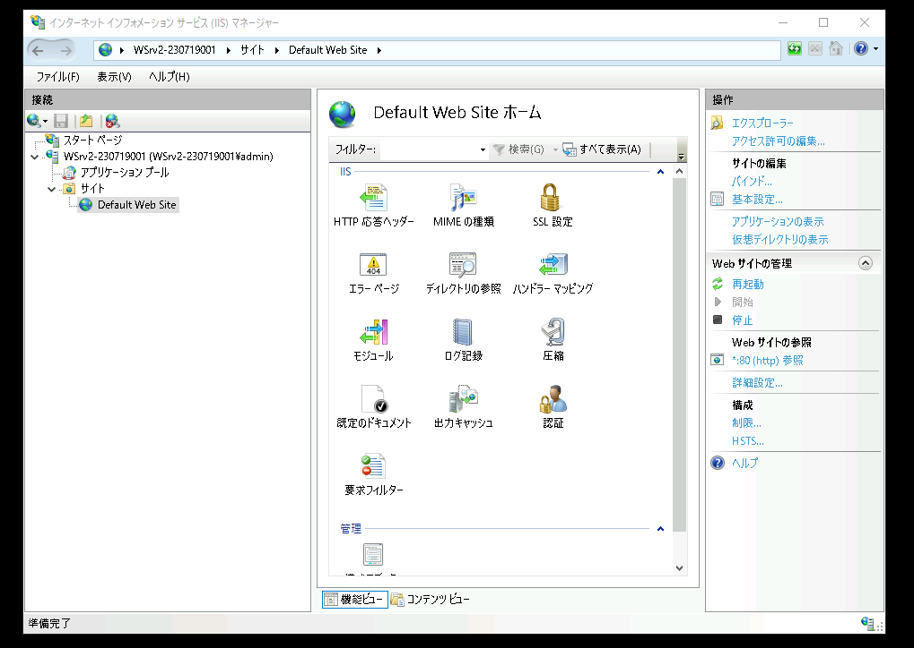</kbd> 

1. Web コンテンツ フォルダを確認する
    1. ファイル エクスプローラーを起動する   
    1. "C:\\inetpub" フォルダにアクセスする   
        > 【補足】  
        > "C:\\inetpub" フォルダは、IISインストール時に自動的に作成されます。  
        > このフォルダには、IISのサービス提供に必要なファイルが保存されています。  
    1. "C:\\inetpub" フォルダ内の "wwwroot" フォルダにアクセスする  
        > 【補足】  
        > "C:\\inetpub\\wwwroot" フォルダは、IISの "Default Web Site" のWeb コンテンツ フォルダです。   
    1. IISの初期Webページのファイルが作成されていることを確認する
        <kbd>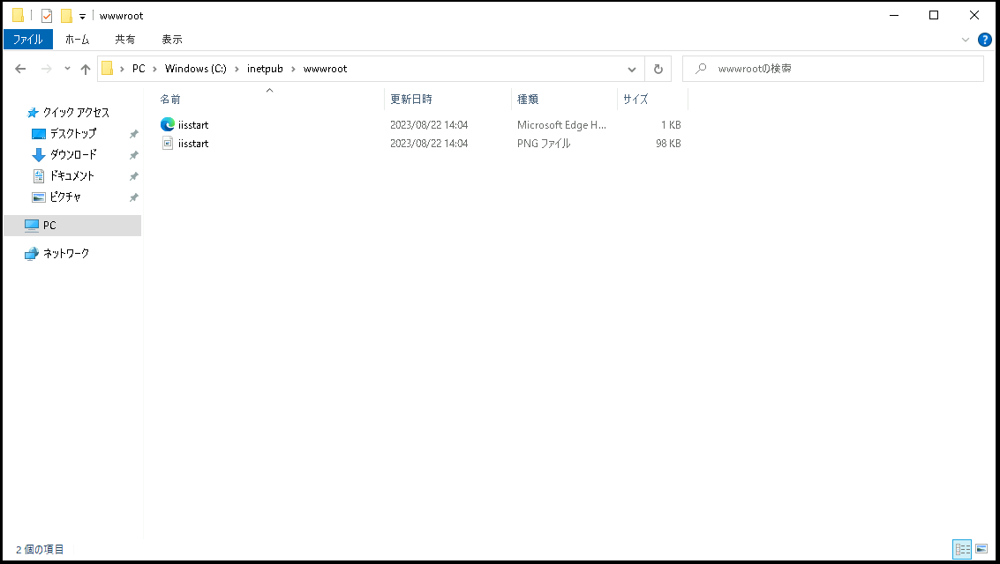</kbd> 

1. ClientのWebブラウザからWebアクセスする  
    1. 操作コンピュータを変更するため、演習環境のトップページに戻る  
    1. Windows Client(WinClient)の管理画面に "admin" で接続する   
    1. WinClientでWebブラウザ(Google Chrome)を起動する  
    1. Webブラウザのアドレス欄に [http://10.X.1.105] と入力し、[Enter]キーを押下する  
    1. IISの初期Webページが表示されることを確認する  
        <kbd>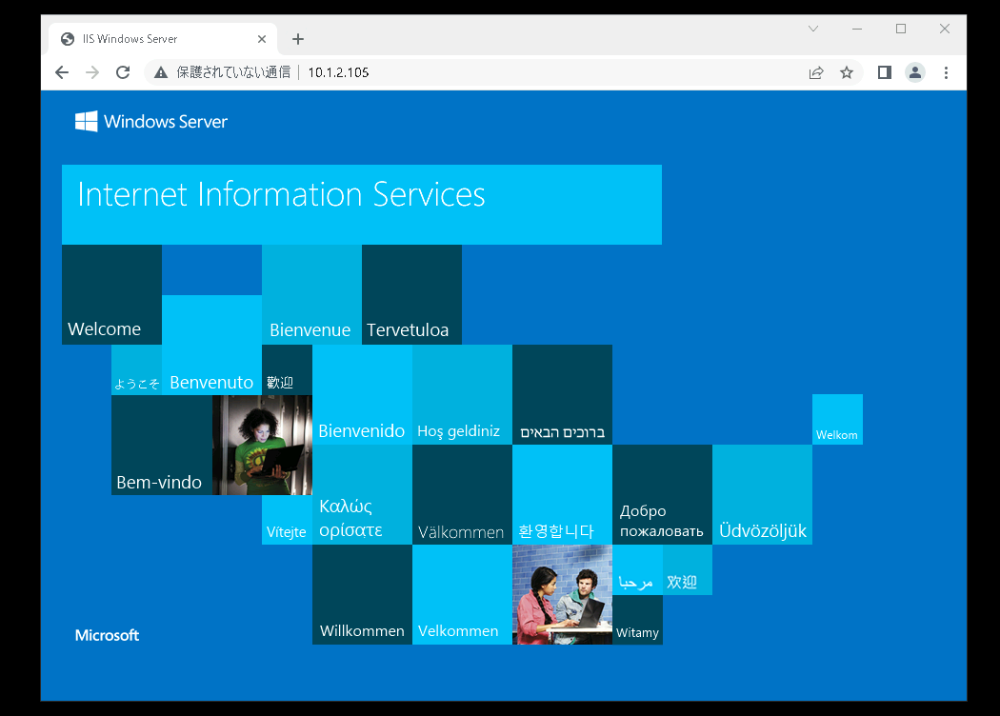</kbd> 


## 4. Webコンテンツを作成して公開する

1. Webコンテンツ作成のため、Webコンテンツフォルダにアクセスする  
    1. 操作コンピュータを変更するため、演習環境のトップページに戻る  
    1. Windows Webサーバー(WinSrv2)の管理画面に接続する  
    1. "C:\\inetpub" フォルダにアクセスする  

1. WebコンテンツフォルダのNTFSアクセス権を変更し、管理者アカウント(admin)にフルコントロール許可を与える  
    1. "wwwroot" フォルダ("C:\\inetpub\\wwwroot")をクリックし、右クリック コンテキストメニューの[プロパティ]をクリックする
    1. [プロパティ]ウィンドウの[セキュリティ]タブをクリックする  
    1. [編集]をクリックする  
    1. [wwwrootのアクセス許可]ウィンドウが表示されたことを確認する  
    1. [追加]をクリックする  
    1. [ユーザーまたはグループの選択]ウィンドウが表示されたことを確認する  
    1. "選択するオブジェクト名を入力してください" の欄に "admin" と入力する  
    1. [名前の確認]をクリックする  
    1. "<コンピュータ名>￥admin" の表記に下線がついたことを確認する  
    1. [OK]をクリックする  
    1. [wwwrootのアクセス許可]ウィンドウで、"admin"が追加されていることを確認する  
    1. [admin]をクリックして選択する  
    1. [wwwrootのアクセス許可]ウィンドウ下部の "アクセス許可" を参照し、"フルコントロール" の "許可" にチェックをつける  
        <kbd>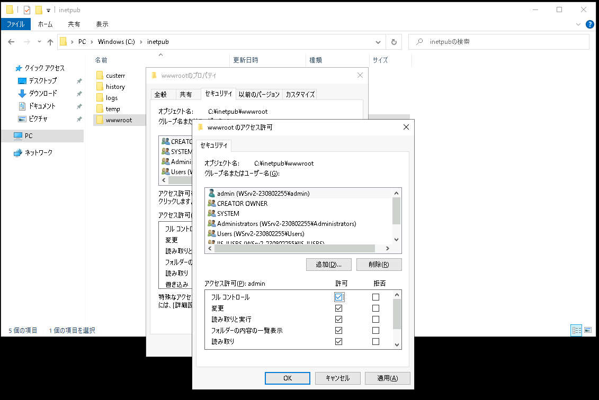</kbd> 
    1. [wwwrootのアクセス許可]ウィンドウで、[OK]をクリックする  
    1. [プロパティ]ウィンドウで、"admin"が追加されていることを確認する  
        <kbd>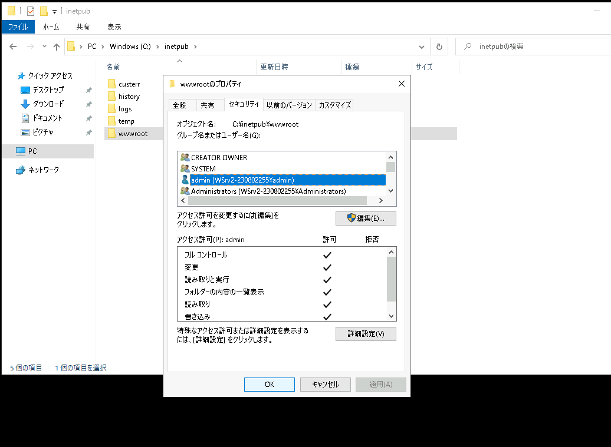</kbd> 
    1. [プロパティ]ウィンドウで、[OK]をクリックする  

1. ファイル エクスプローラの設定を変更し、ファイルの拡張子を表示させる  
    1. ファイル エクスプローラ上部メニューの[表示]タブをクリックする  
    1. [表示/非表示]項目の[ファイル名拡張子]のチェックを有効化する
        <kbd>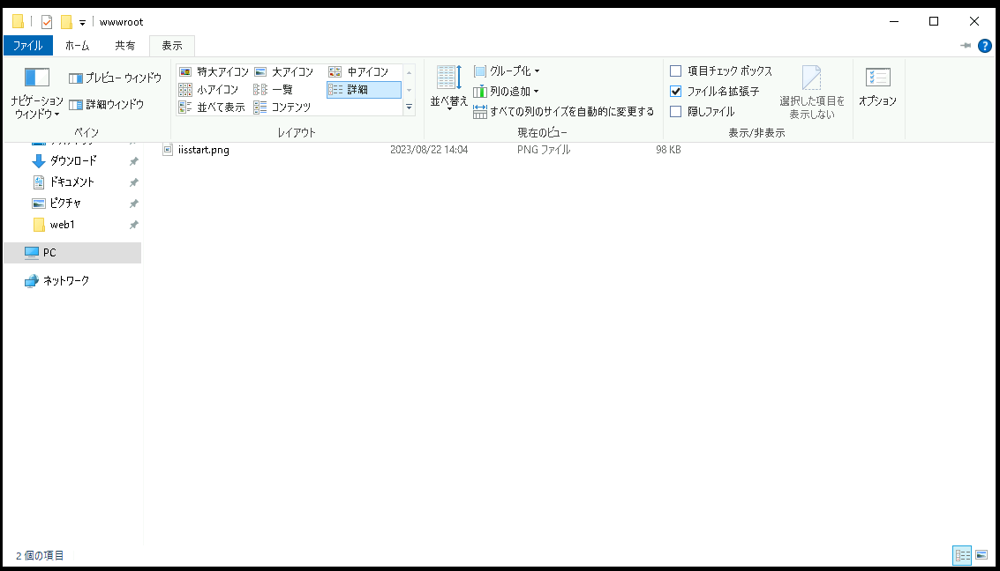</kbd> 

1. Webコンテンツとしてテキストファイル("C:\\inetpub\\wwwroot\\web1\\document.txt")を作成する
    1. 右クリック コンテキストメニューの[新規作成]-[フォルダー]をクリックする
    1. 作成された新しいフォルダの名前を "web1" に変更する  
        <kbd>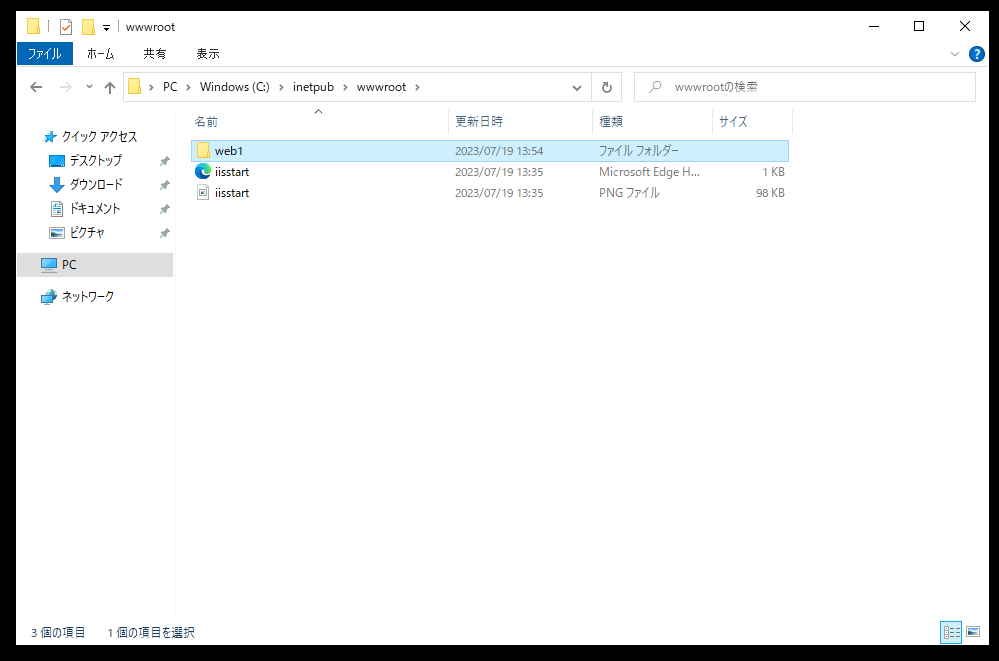</kbd> 
    1. "web1"フォルダ("C:\\inetpub\\wwwroot\\web1\\")にアクセスする
    1. 右クリック コンテキストメニューの[新規作成]-[テキスト ドキュメント]をクリックする
    1. 作成された新しいテキストファイルの名前を "document.txt" に変更する  

1. テキストファイル("C:\\inetpub\\wwwroot\\web1\\document.txt")に任意の文字列を記入して保存する
        <kbd>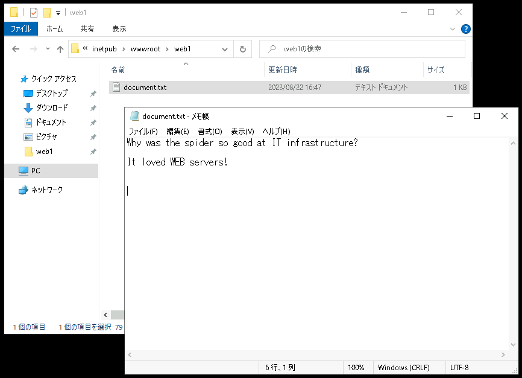</kbd> 

1. ClientのWebブラウザからWebアクセスする  
    1. 操作コンピュータを変更するため、演習環境のトップページに戻る  
    1. Windows Client(WinClient)の管理画面に "admin" で接続する   
    1. WinClientでWebブラウザ(Google Chrome)を起動する  
    1. Webブラウザのアドレス欄に [http://10.X.2.105/web1/document.txt] と入力し、[Enter]キーを押下する  
    1. Webコンテンツとして"document.txt"を参照できたことを確認する  
        <kbd>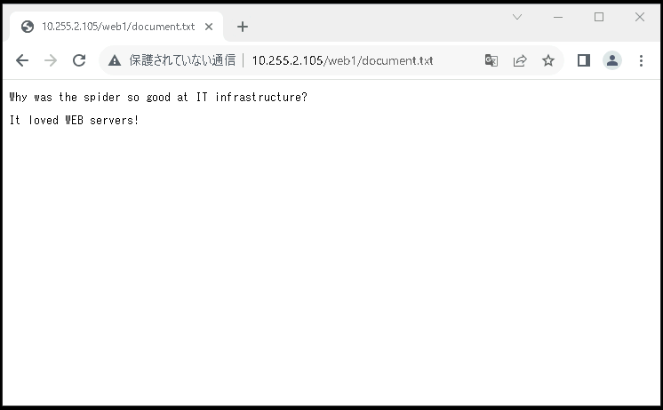</kbd> 


## 5. HTMLファイルを作成してWebコンテンツとして公開する  

1. HTMLファイル作成のため、Webコンテンツフォルダにアクセスする  
    1. 操作コンピュータを変更するため、演習環境のトップページに戻る  
    1. Windows Webサーバー(WinSrv2)の管理画面に接続する  
    1. "C:\\inetpub\\wwwroot\\web1" フォルダにアクセスする  

1. テキストファイルの拡張子を変更して、HTMLファイルを作成する  
    1. 右クリック コンテキストメニューの[新規作成]-[テキスト ドキュメント]をクリックする  
    1. 作成された新しいテキストファイルの名前を "index.html" に変更する  

        > 【補足】  
        > ファイルの拡張子を ".txt" から ".html" に変更すると、警告のポップアップが表示されます。  
        > ポップアップで[はい]をクリックします。  

        <kbd>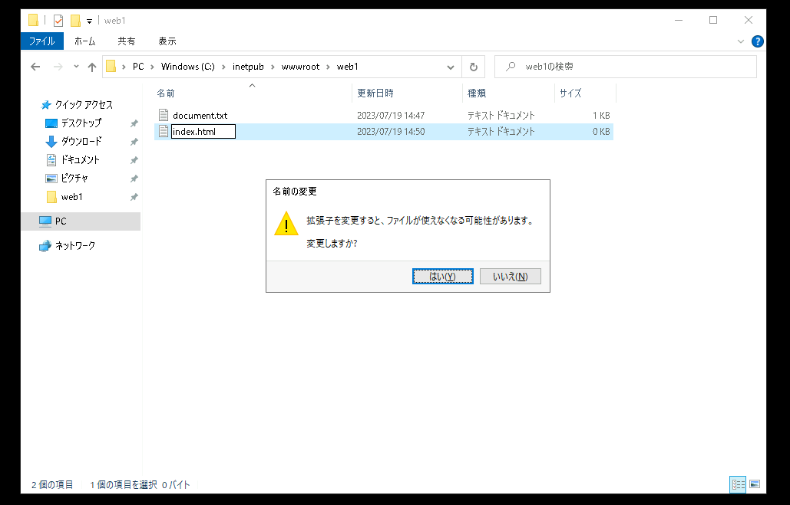</kbd> 

1. HTMLファイルをメモ帳(notepad.exe)で編集する  
    1. "index.html" ファイルをクリックして選択する
    1. 右クリック コンテキストメニューの[プログラムから開く]-[別のプログラムを選択]をクリックする  
        <kbd>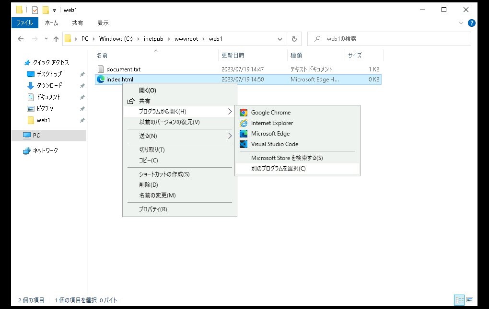</kbd> 
    1. [このファイルを開く方法を選んでください]ウィンドウが表示されたことを確認する  
    1. [その他のアプリ]をクリックする  
    1. メニュー内の[メモ帳]をクリックして選択し、[OK]をクリックする  
        <kbd>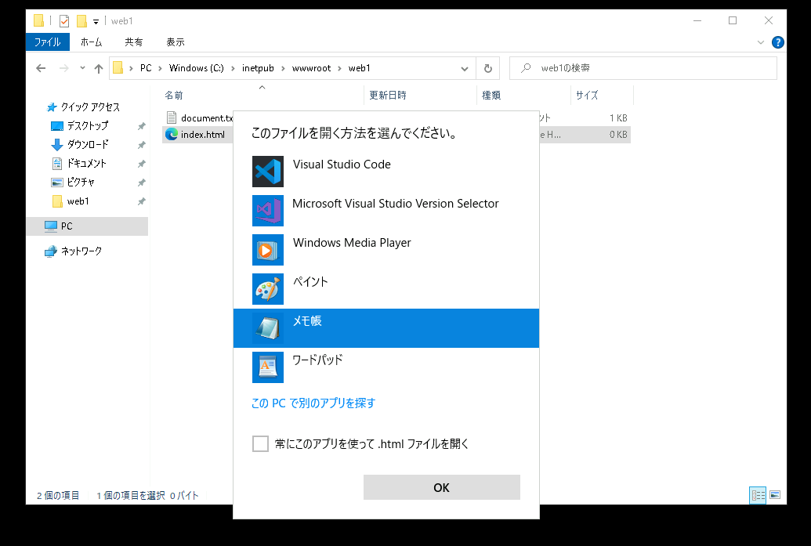</kbd> 
    1. メモ帳で "index.html" ファイルを開いたことを確認する
        <kbd>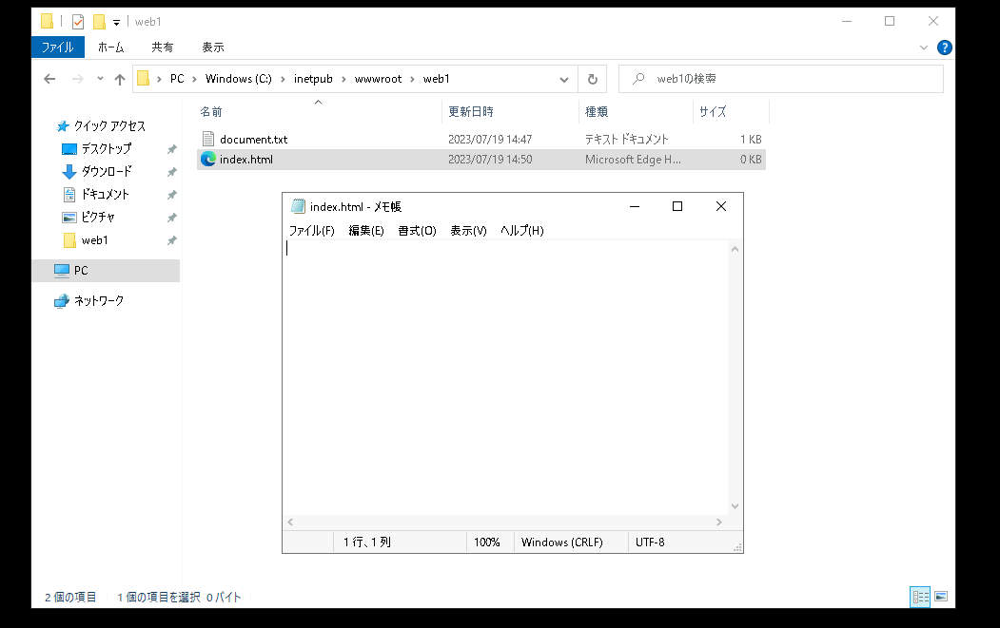</kbd> 


1. HTMLテキストを記述する  
    1. "index.html" ファイルに以下のHTMLテキストを記述する  

        ```
        <html>

        <font size="7">
        Let's HTML document!
        </font>

        

        <a href="document.txt">
        link
        </a>

        </html>
        ```

        <kbd>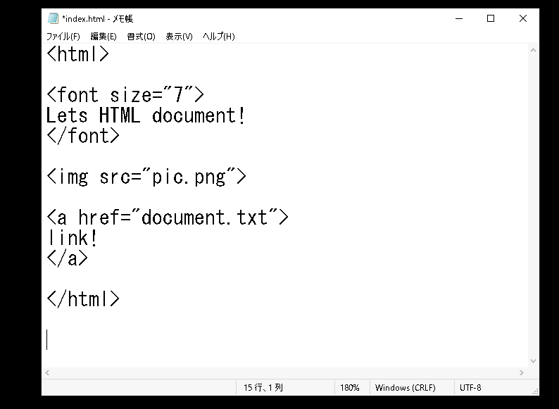</kbd>

    1. "index.html" ファイルを上書き保存する  


1. 画像ファイルを作成する  
    1. [Windowsメニュー] - [Windowsアクセサリ] - [ペイント] をクリックし、ペイントツールを起動する
        <kbd>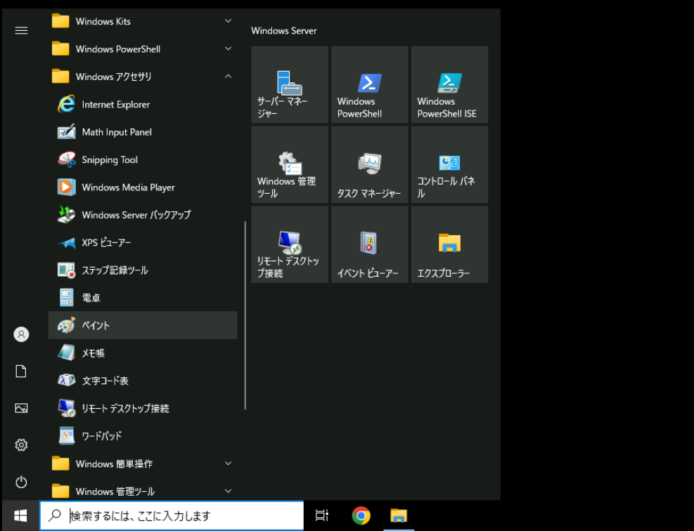</kbd> 
    1. Webコンテンツとして任意の絵を描画する    
        <kbd>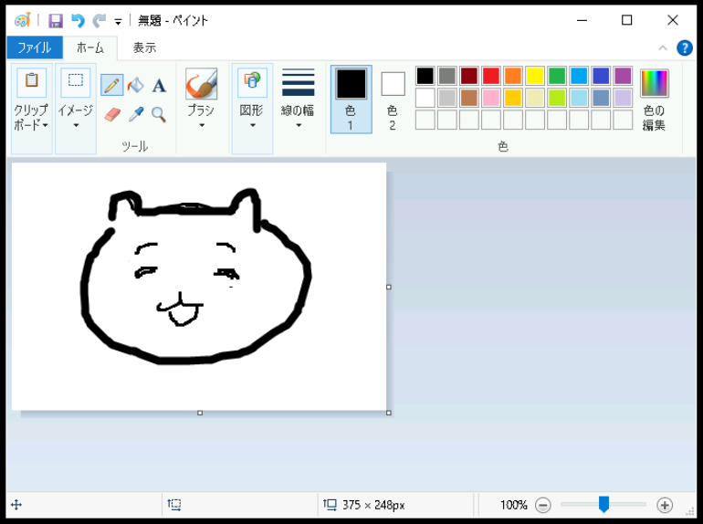</kbd>  
    1. ペイントで作成した絵を、web1フォルダにpic.pngとして保存する  
        <kbd>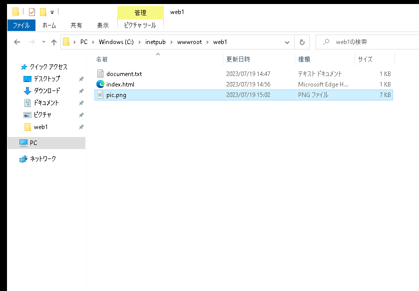</kbd>  


1. ClientのWebブラウザからWebアクセスする  
    1. 操作コンピュータを変更するため、演習環境のトップページに戻る  
    1. Windows Client(WinClient)の管理画面に "admin" で接続する   
    1. WinClientでWebブラウザ(Google Chrome)を起動する  
    1. Webブラウザのアドレス欄に [http://10.X.2.105/web1/index.html] と入力し、[Enter]キーを押下する  
    1. Webコンテンツとして"index.html"を参照できたことを確認する  
        <kbd>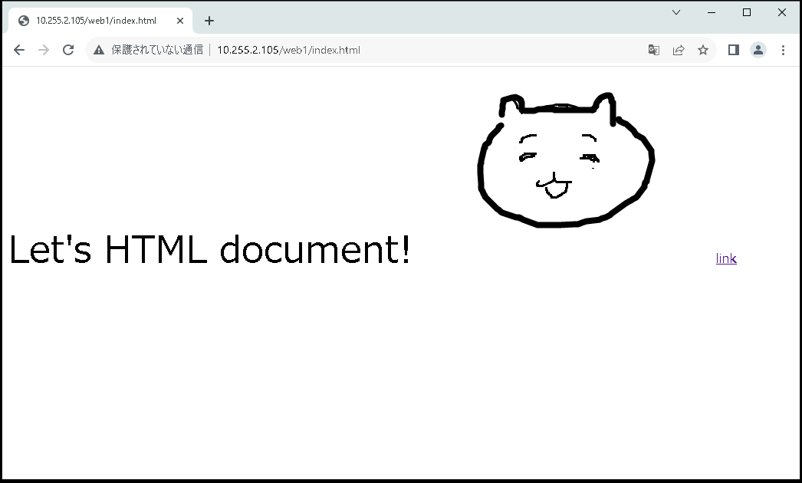</kbd> 
        > 【動作テストの観点】  
        > 作成したWebコンテンツが利用できることを確認する  

        - [x] HTMLタグによる文字のフォント変更が有効であること  
        - [x] Webページのなかで画像を表示できること  
        - [x] リンクをクリックし、document.txtページに遷移できること  
                

## 6. Virtual Hostingで複数のWebサイトを提供する  
 
1. WebサーバーでIIS管理ツールを起動する  
    1. 操作コンピュータを変更するため、演習環境のトップページに戻る  
    1. Windows Webサーバー(WinSrv2)の管理画面に接続する  
    1. サーバーマネージャーウィンドウ右上の[ツール]をクリックする  
    1. メニュー内の[インターネット インフォメーション サービス(IIS) マネージャー]をクリックし、IIS管理コンソールを起動する     

1. 新しいサイトを追加する
    1. 左側コンソールツリーの[＜サーバー名＞]-[サイト]をクリックする   
    1. 右クリック コンテキストメニューの[Webサイトの追加]をクリックする  
        <kbd>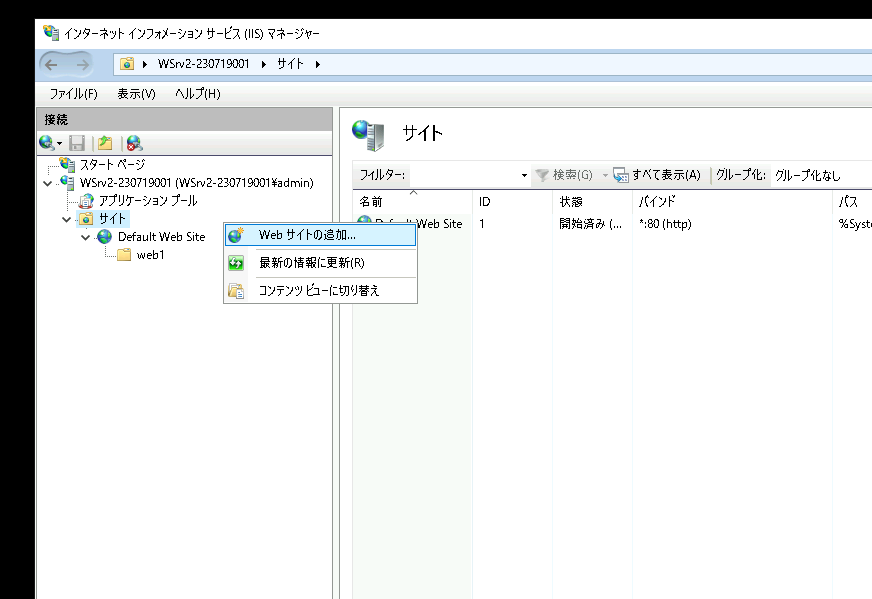</kbd> 
    1. [Webサイトの追加]ウィンドウが表示されたことを確認する  
    1. 以下のパラメータを入力する

        | 項目 | パラメータ |
        | :----- | :----- |
        | サイト名 | Web Share |
        | アプリケーション プール | <既定値> |
        | 物理パス | C:\\Share |  
        | 種類 | http |
        | IPアドレス | 未使用のIPアドレスすべて |  
        | ポート | 1080 |  
        | ホスト名 | <空欄> |  
        - [x] Webサイトを直ちに開始する  

        <kbd>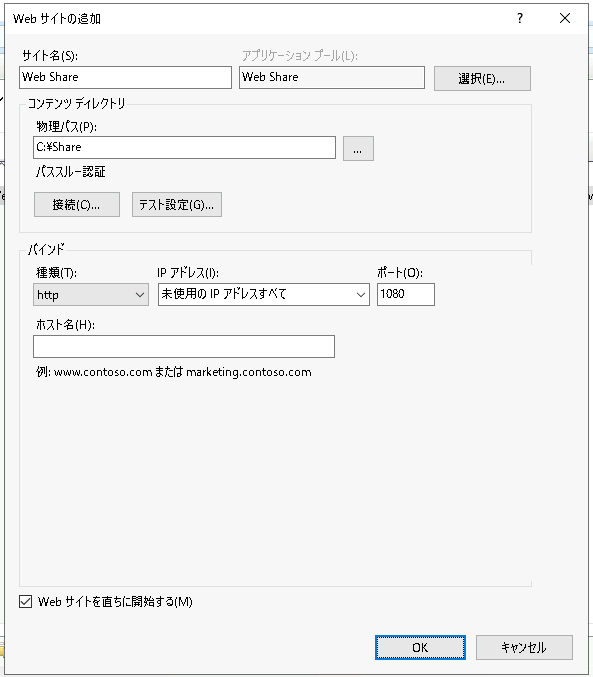</kbd> 

    1. "Web Share" の Webサイトが追加されたことを確認する
        <kbd>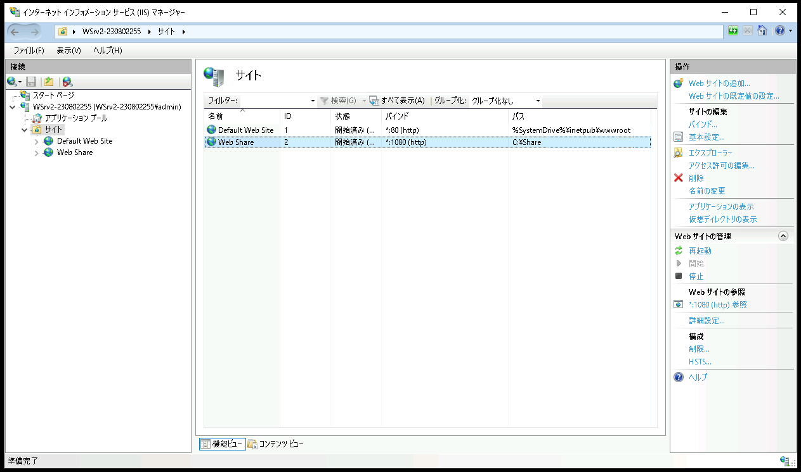</kbd> 

    1. 追加したサイト(Web Share)の待ち受けポート番号を確認する  

        1. [スタートメニュー]を右クリックし、コンテキストメニュー内の[Windows PowerShell(管理者)]をクリックする  
        1. [ユーザー アカウント制御]のポップアップで[はい]をクリックする  
        1. Windows PowerShellのウィンドウが表示されたことを確認する  
        1. 以下のコマンドを実行し、Webサーバーが1080ポートで待ち受けしていることを確認する  
            ＞ ***netstat -ano***     
            > 【補足】  
            > netstatはネットワーク関連のステータス情報を表示するコマンドです。  
            > -ano オプションを付与することで、OSが待ち受け(リスニング)しているポート番号とプロセスの対応を確認できます。  

            <kbd>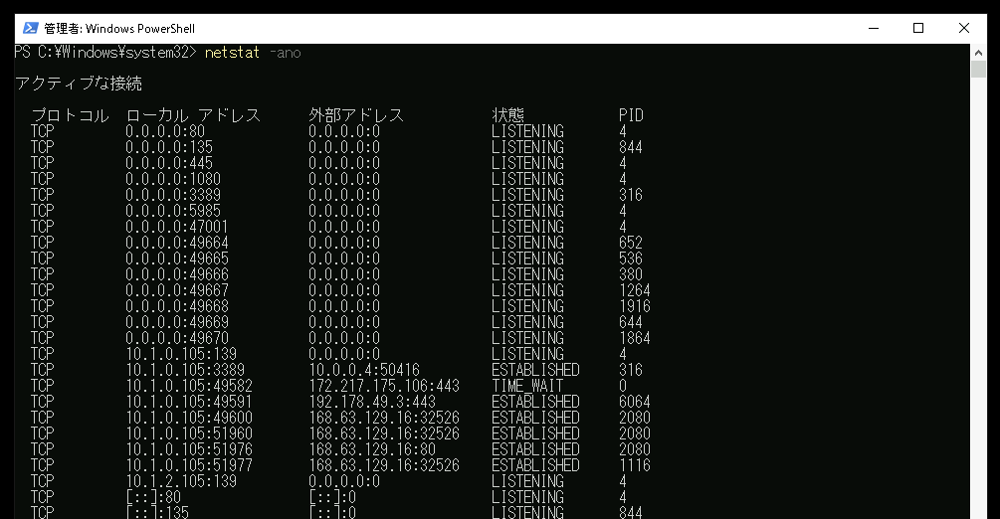</kbd>   
            
            > 【確認ポイント】  
            - [x] ローカルアドレス "0.0.0.0:1080" のエントリが存在することを確認する

    <!--
    不要 
    1. "C:\\Share"のNTFSアクセス権を構成する    
        1. "Web Share" のコンテンツディレクトリ("C:\\Share")をクリックし、右クリック コンテキストメニューの[プロパティ]をクリックする
        1. [プロパティ]ウィンドウの[セキュリティ]タブをクリックする  
        1. [編集]をクリックする  
        1. [Shareのアクセス許可]ウィンドウが表示されたことを確認する  
        1. [追加]をクリックする  
        1. [ユーザーまたはグループの選択]ウィンドウが表示されたことを確認する  
        1. "選択するオブジェクト名を入力してください" の欄に "IIS_IUSRS" と入力する  
        1. [名前の確認]をクリックする  
        1. "<コンピュータ名>￥IIS_IUSRS" の表記に下線がついたことを確認する  
            <kbd>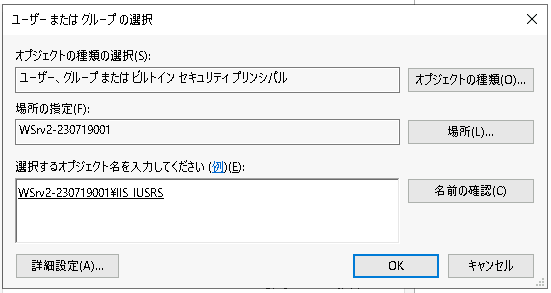</kbd> 
        1. [OK]をクリックする  
        1. [Shareのアクセス許可]ウィンドウで、"IIS_IUSRS"が追加されていることを確認する  
        1. [Shareのアクセス許可]ウィンドウで、[OK]をクリックする  
        1. [プロパティ]ウィンドウで、"IIS_IUSRS"が追加されていることを確認する  
            <kbd>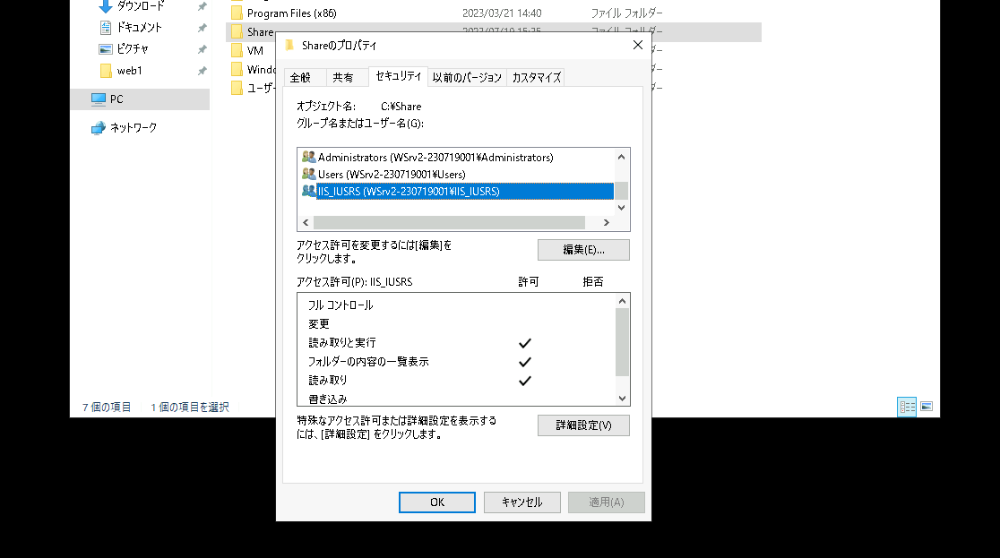</kbd> 
        1. [プロパティ]ウィンドウで、[OK]をクリックする  
    -->


1. ClientのWebブラウザからWebアクセスする  
    1. 操作コンピュータを変更するため、演習環境のトップページに戻る  
    1. Windows Client(WinClient)の管理画面に "admin" で接続する   
    1. WinClientでWebブラウザ(Google Chrome)を起動する  
    1. Webブラウザのアドレス欄に [http://10.X.2.105:1080/cheese.txt] と入力し、[Enter]キーを押下する  
    1. Webコンテンツとして"cheese.txt"を参照できたことを確認する  
        <kbd>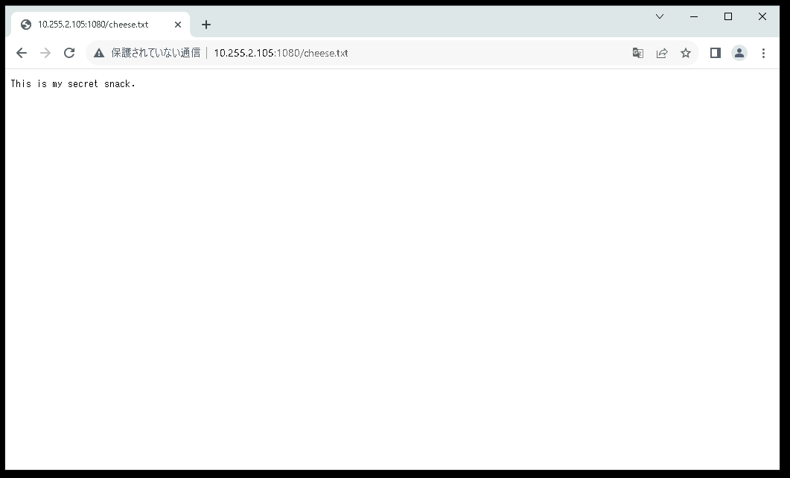</kbd>   
        > 【動作テストの観点】  
        > Web Shareのサイトのコンテンツにアクセスできたことを確認する    

        - [x] ポート番号1080を指定したアドレスでアクセスできること  

    1. Webブラウザのアドレス欄に [http://10.X.2.105:1080/] と入力し、[Enter]キーを押下する  

    1. トップページの情報はまだ参照できないことを確認する  
        <kbd>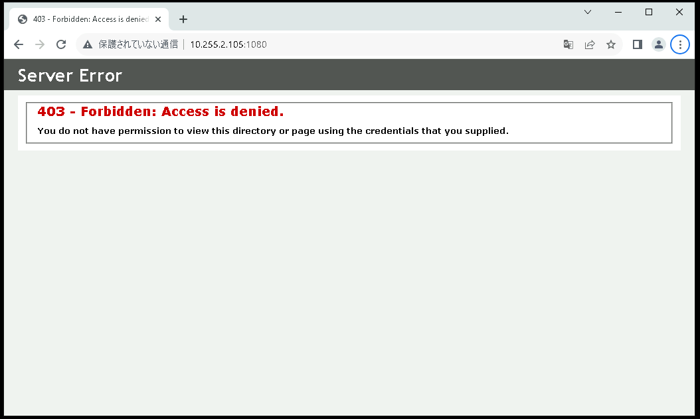</kbd>   
        > 【補足】  
        > 次の手順でディレクトリ参照を有効化することで、トップページにもアクセスできるようになります。    

---  

## 7. ディレクトリ参照を使用する

1. WebサーバーでIIS管理ツールを起動する  
    1. 操作コンピュータを変更するため、演習環境のトップページに戻る  
    1. Windows Webサーバー(WinSrv2)の管理画面に接続する  
    1. サーバーマネージャーウィンドウ右上の[ツール]をクリックする  
    1. メニュー内の[インターネット インフォメーション サービス(IIS) マネージャー]をクリックし、IIS管理コンソールを起動する     

1. "Web Share"サイトでディレクトリ参照を有効化する  
    1. 左側コンソールツリーの[＜サーバー名＞]-[サイト]-[Web Share]をクリックする  
    1. ウィンドウ中央ペインの[ディレクトリ参照]をダブルクリックする  
        <kbd>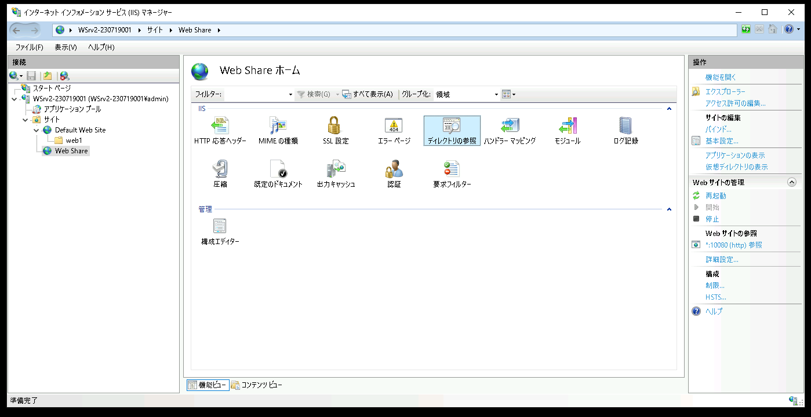</kbd> 
    1. ウィンドウ右側ペインの[操作]メニューの[有効にする]をクリックする  
        <kbd>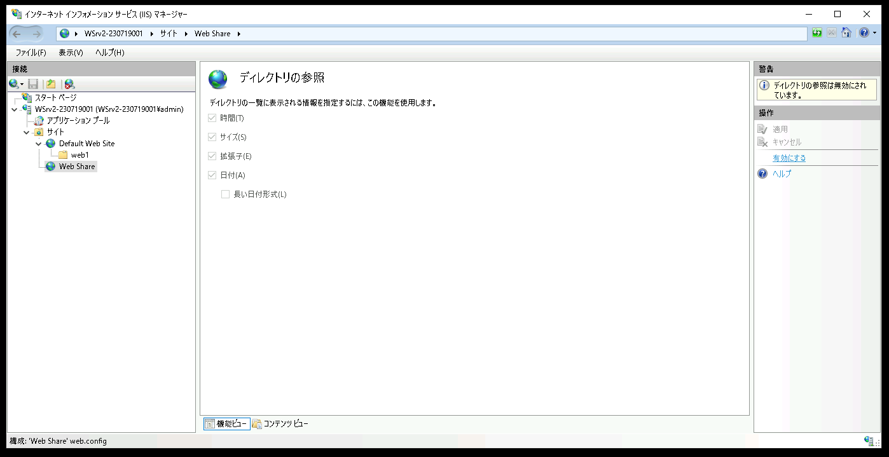</kbd> 
    1. ディレクトリ参照が有効化されたことにより、ウィンドウ中央ペインの項目のチェックボックスのグレーアウトが解除されていたことを確認する  
        <kbd>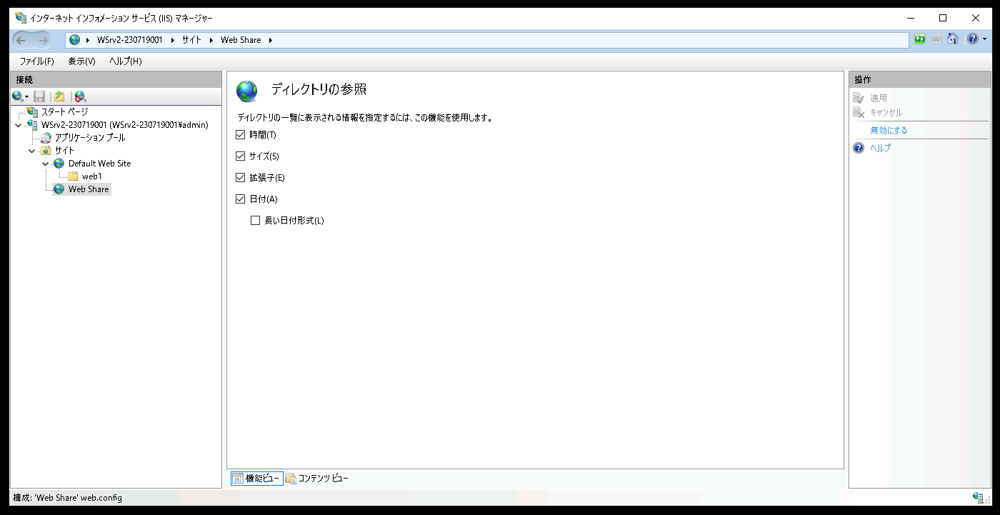</kbd> 

1. ClientのWebブラウザからWebアクセスする  
    1. 操作コンピュータを変更するため、演習環境のトップページに戻る  
    1. Windows Client(WinClient)の管理画面に "admin" で接続する   
    1. WinClientでWebブラウザ(Google Chrome)を起動する  
    1. Webブラウザのアドレス欄に [http://10.X.2.105:1080/] と入力し、[Enter]キーを押下する  
    1. ディレクトリ参照により、トップページにアクセスすることでWebコンテンツフォルダに保存されたファイル一覧を参照できたことを確認する  
        <kbd>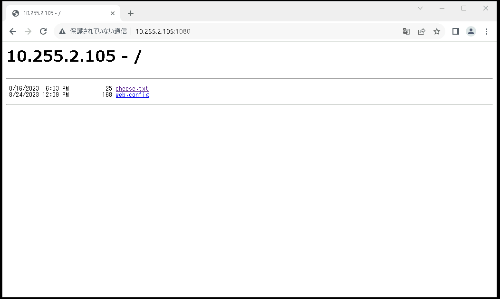</kbd>   

1. IISのconfigファイル(web.config)を非表示にする  
    1. 操作コンピュータを変更するため、演習環境のトップページに戻る  
    1. Windows Webサーバー(WinSrv2)の管理画面に接続する  
    1. "C:\\Share" フォルダにアクセスする  
    1. "web.config" ファイルをクリックして選択し、右クリック コンテキストメニューの[プロパティ]をクリックする  
    1. [全般]タブの[隠しファイル]のチェックボックスを有効化する  
        <kbd>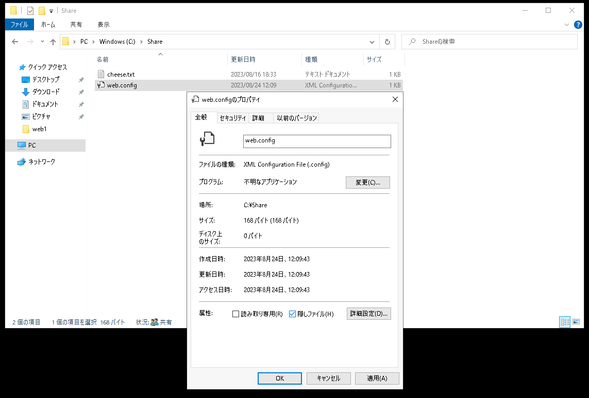</kbd> 
    1. [プロパティ]ウィンドウの[OK]をクリックする  
    1. "web.config"ファイルがファイルエクスプローラ ウィンドウで非表示状態になったことを確認する  
    1. ファイル エクスプローラの設定を変更して隠しファイルを表示状態にして、"web.config" が削除されていないことを確認する  
        1. ファイル エクスプローラ上部メニューの[表示]タブをクリックする  
        1. [表示/非表示]項目の[隠しファイル]のチェックを有効化する
            <kbd>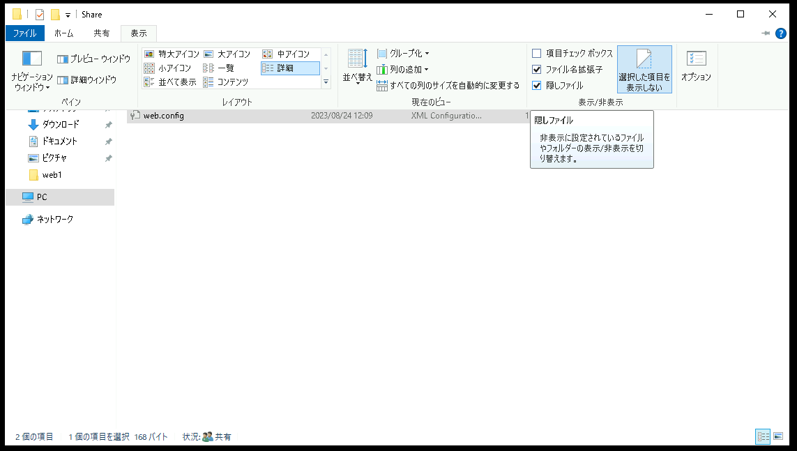</kbd> 
    1. "web.config"ファイルがファイルエクスプローラ ウィンドウで表示されていることを確認する  


1. ClientのWebブラウザからWebアクセスする  
    1. 操作コンピュータを変更するため、演習環境のトップページに戻る  
    1. Windows Client(WinClient)の管理画面に "admin" で接続する   
    1. WinClientでWebブラウザ(Google Chrome)を起動する  
    1. Webブラウザのアドレス欄に [http://10.X.2.105:1080/] と入力し、[Enter]キーを押下する  
    1. "web.config"ファイルが表示されていないことを確認する  
        > 【補足】  
        > 画面に変化がない場合は、Chromeの画面をリロード(再読み込み)してください。    
            <kbd>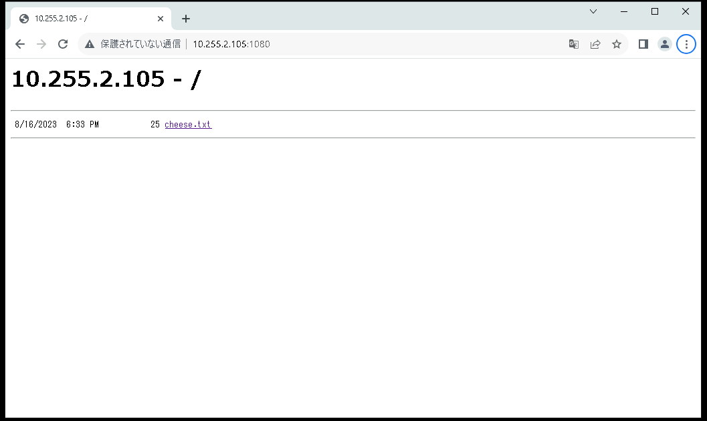</kbd> 

---  

## 8. エラーページをカスタマイズする

1. 変更前のエラーページを確認する    
    1. WinClientでWebブラウザ(Google Chrome)を起動する  
    1. Webブラウザのアドレス欄に [http://10.X.2.105:1080/missurl.txt] と入力し、[Enter]キーを押下する  
    1. IISの既定のエラーページが表示される状態であることを確認する  
        <kbd>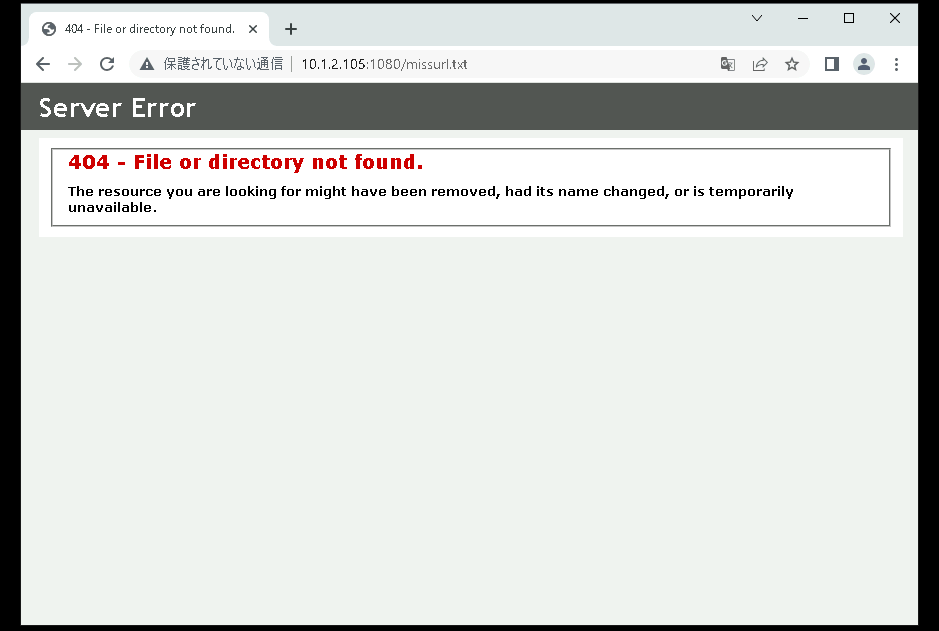</kbd> 

1. エラーページ ファイルを作成する  
    1. 操作コンピュータを変更するため、演習環境のトップページに戻る  
    1. Windows Webサーバー(WinSrv2)の管理画面に接続する  
    1. "C:\\Share" フォルダにアクセスする  
    1. 右クリック コンテキストメニューの[新規作成]-[テキスト ドキュメント]をクリックする  
    1. 作成された新しいテキストファイルの名前を "404err.html" に変更する  
    1. "404err.html" ファイルをクリックして選択する  
    1. 右クリック コンテキストメニューの[プログラムから開く]-[別のプログラムを選択]をクリックする  
    1. [このファイルを開く方法を選んでください]ウィンドウが表示されたことを確認する  
    1. [その他のアプリ]をクリックする  
    1. メニュー内の[メモ帳]をクリックして選択し、[OK]をクリックする  
    1. メモ帳で "404err.html" ファイルを開いたことを確認する
    1. "404err.html" ファイルに以下のHTMLテキストを記述する  

        ```
        <html>
        <meta charset="UTF-8">

        指定されたファイルがありません。

        <a href="/">トップページ</a>に戻ってください。

        </html>
        ```

        <kbd>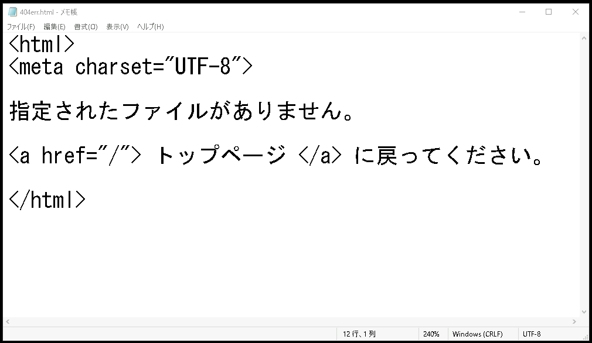</kbd>

    1. "404err.html" ファイルを上書き保存する  
    

1. Webサイト(Web Share)の設定のエラーページを設定する  
    1. IIS管理コンソールを起動する 
    1. 左側コンソールツリーの[＜サーバー名＞]-[サイト]-[Web Share]をクリックする  
    1. ウィンドウ中央ペインの[エラー ページ]をダブルクリックする  
        <kbd>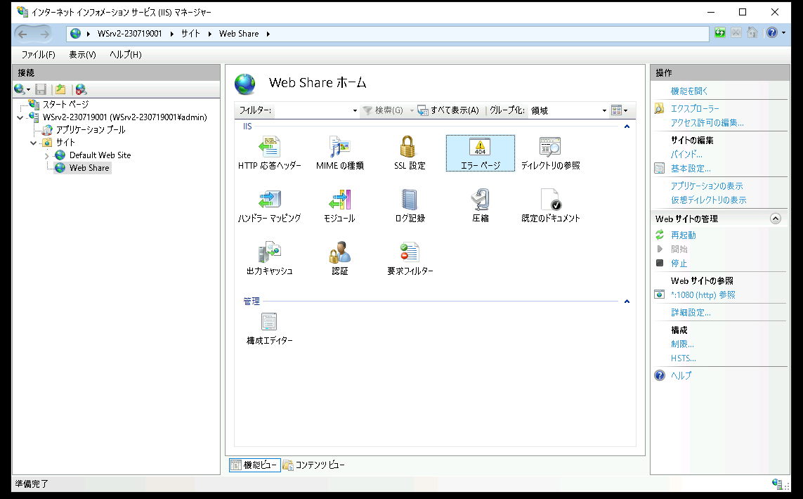</kbd>  

    1. ウィンドウ中央ペインで、状態コード[404]のエントリをクリックして選択する
        <kbd>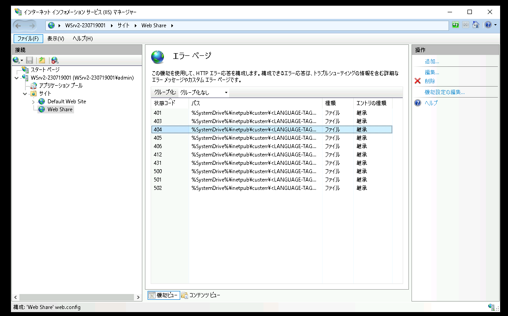</kbd>  

    1. ウィンドウ右側ペインの[操作]メニューの[編集]をクリックする  
    1. [カスタムエラーページの編集]ウィンドウが表示されたことを確認する
    1. 以下のパラメータを入力する
        応答動作:  
        - [ ] 静的ファイルのコンテンツをエラー応答に挿入する
        - [x] このサイトでURLを実行する  
        - [ ] 302リダイレクトによる応答  

        
        | 項目 | パラメータ |
        | :----- | :----- | 
        | URL(サイトのルートに対する相対パス) | /404err.html |        

        <kbd>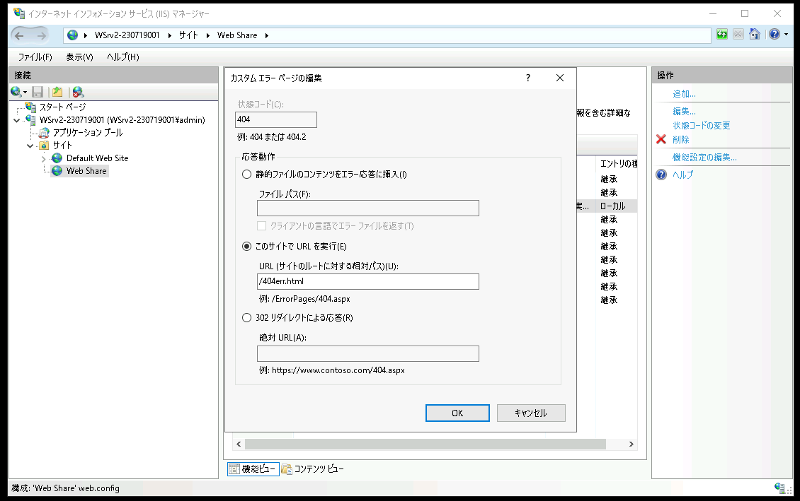</kbd>  

    1. [カスタムエラーページの編集]ウィンドウで、[OK]をクリックする  
    1. 状態コード[404]のエントリのパスが "/404err.html" であることを確認する
        <kbd>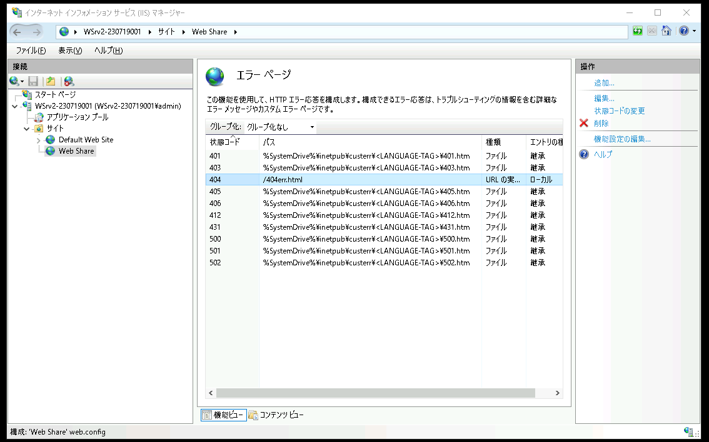</kbd> 


1. ClientのWebブラウザから、存在しないアドレスにWebアクセスする  
    1. 操作コンピュータを変更するため、演習環境のトップページに戻る  
    1. Windows Client(WinClient)の管理画面に "admin" で接続する   
    1. WinClientでWebブラウザ(Google Chrome)を起動する  
    1. Webブラウザのアドレス欄に [http://10.X.2.105:1080/missurl.txt] と入力し、[Enter]キーを押下する   
    1. カスタムしたエラーページが表示されることを確認する   
        > 【補足】  
        > 画面に変化がない場合は、Chromeの画面をリロード(再読み込み)してください。   


        <kbd>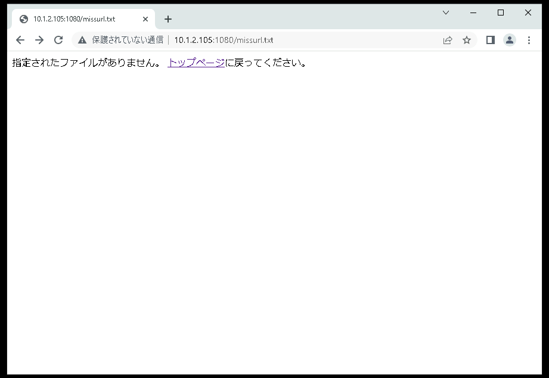</kbd> 


## 9. IISの役割サービス(基本認証、HTTPリダイレクト)を追加インストールする


1. 役割と機能の追加ウィザードを開始する  
    1. 操作コンピュータを変更するため、演習環境のトップページに戻る  
    1. Windows Webサーバー(WinSrv2)の管理画面に接続する   
    1. [スタートメニュー]をクリックする  
    1. スタートメニュー内の[サーバー マネージャー]をクリックし、サーバーマネージャを起動する    
    1. サーバーマネージャーのダッシュボード画面内の[役割と機能の追加]をクリックする   
    1. [役割と機能の追加ウィザード]ウィンドウが起動したことを確認する  

1. Webサーバー(IIS)の役割サービスを追加する
    1. [役割と機能の追加ウィザード]ウィンドウの[開始する前に]画面で、[次へ]をクリックする  
    1. [インストールの種類]画面で、[次へ]をクリックする  
    1. [サーバーの選択]画面で、[次へ]をクリックする  
    1. [サーバーの役割]画面で、以下のパラメータを追加選択する  

        - [x] [Webサーバー(IIS)]-[Webサーバー]-[HTTP共通機能]-[HTTPリダイレクト]  
        - [x] [Webサーバー(IIS)]-[Webサーバー]-[セキュリティ]-[基本認証]  
        <kbd>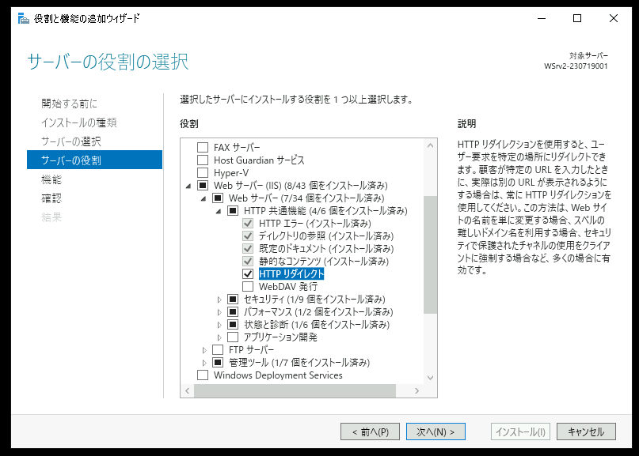</kbd> 
        <kbd>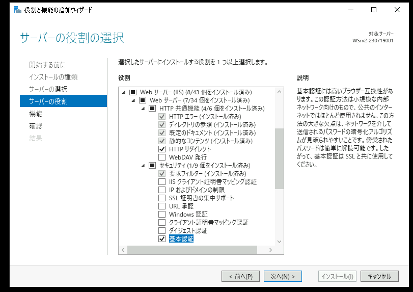</kbd>    

    1. [サーバーの役割]画面で、上のパラメータを選択したことを確認し、[次へ]をクリックする  
    1. [機能の選択]画面で、[次へ]をクリックする  
    1. [確認]画面で、[インストール]をクリックする  
        <kbd>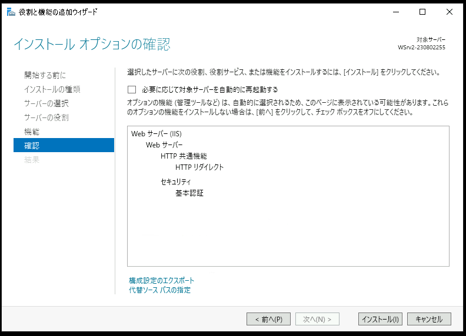</kbd> 
    1. [結果]画面で、インストール進捗を示すプログレスバーが右端に到達するまで数分間待機する  
    1. [結果]画面で、インストールが正常に完了したことを確認し、[閉じる]をクリックする  
 

## 10. HTTPリダイレクトを構成する  

1. 新しい仮想ディレクトリのためのフォルダ(C:\\inetpub\\oldpage)を作成する
    1. ファイルエクスプローラで "C:\\inetpub" にアクセスする  
    1. 新しいフォルダを作成する  
    1. 作成したフォルダの名前を "oldpage" に変更する  
        <kbd>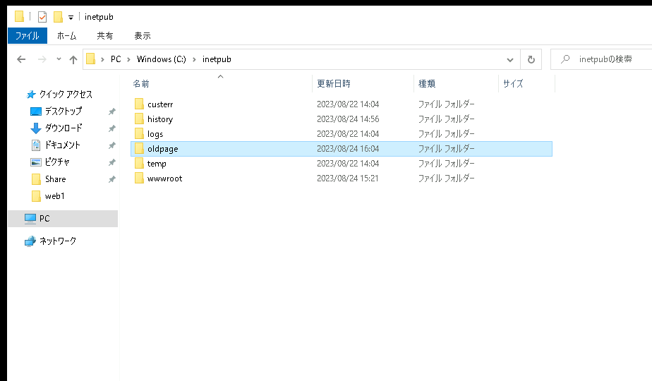</kbd> 

1. 新しい仮想ディレクトリ("oldpage")を追加する  
    1. IIS管理コンソール(インターネット インフォメーション サービス(IIS) マネージャー)をすでに起動している場合は、IIS管理コンソールのウィンドウを閉じて終了し、再度IIS管理コンソールを起動する  
    > 【補足】  
    > 前の手順で追加インストールした役割サービスを管理コンソール画面に表示するために、IIS管理コンソールの再起動が必要です。  
    1. 左側コンソールツリーの[＜サーバー名＞]-[サイト]-[Default Web Site]をクリックする  
    1. 右クリック コンテキストメニューの[仮想ディレクトリの追加]をクリックする  
        <kbd>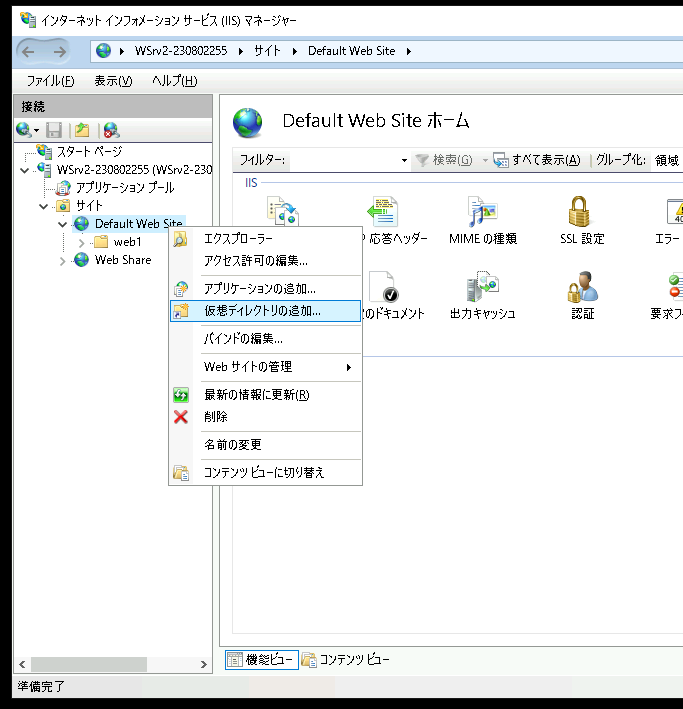</kbd> 
    1. [仮想ディレクトリの追加]ウィンドウが表示されたことを確認する  
    1. 以下のパラメータを入力する  

        | 項目 | パラメータ |  
        | :----- | :----- |  
        | エイリアス | oldpage |    
        | 物理パス | C:\\inetpub\\oldpage |      

        <kbd>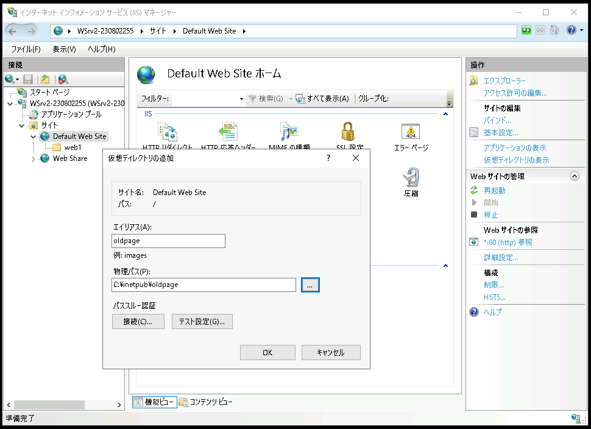</kbd> 

    1. [仮想ディレクトリの追加]ウィンドウで[OK]をクリックする  

1. HTTPリダイレクトを構成する
    1. 左側コンソールツリーの[＜サーバー名＞]-[サイト]-[Default Web Site]-[oldpage]をクリックする  
    1. ウィンドウ中央ペインの[HTTPリダイレクト]をダブルクリックする  
        <kbd>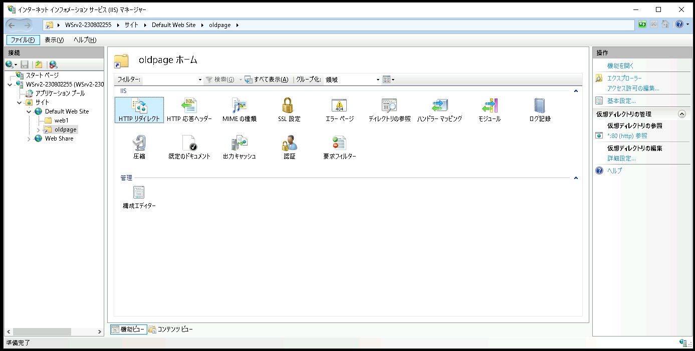</kbd> 

    1. 以下のパラメータを入力する  

        - [x] このリダイレクト先に要求をリダイレクト
        | 項目 | パラメータ |  
        | :----- | :----- |  
        | <アドレス欄> | http://10.X.2.105:1080/ |       

        <kbd>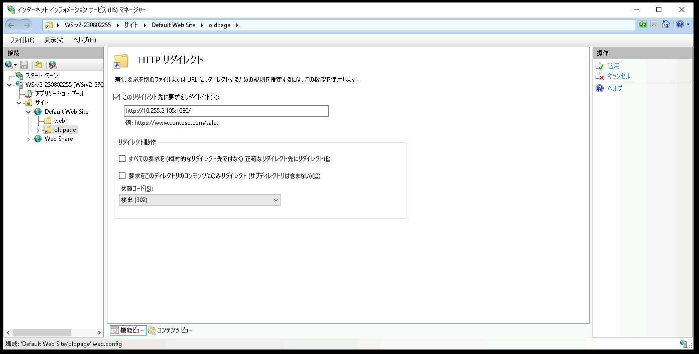</kbd> 

    1. ウィンドウ右側ペインの[操作]メニューの[適用]をクリックする  

1. ClientのWebブラウザから仮想ディレクトリ(oldpage)にWebアクセスし、リダイレクトの動作を確認する    
    1. 操作コンピュータを変更するため、演習環境のトップページに戻る  
    1. Windows Client(WinClient)の管理画面に "admin" で接続する   
    1. WinClientでWebブラウザ(Google Chrome)を起動する  
    1. Webブラウザのアドレス欄に [http://10.X.2.105/oldpage] と入力し、[Enter]キーを押下する  
        <kbd>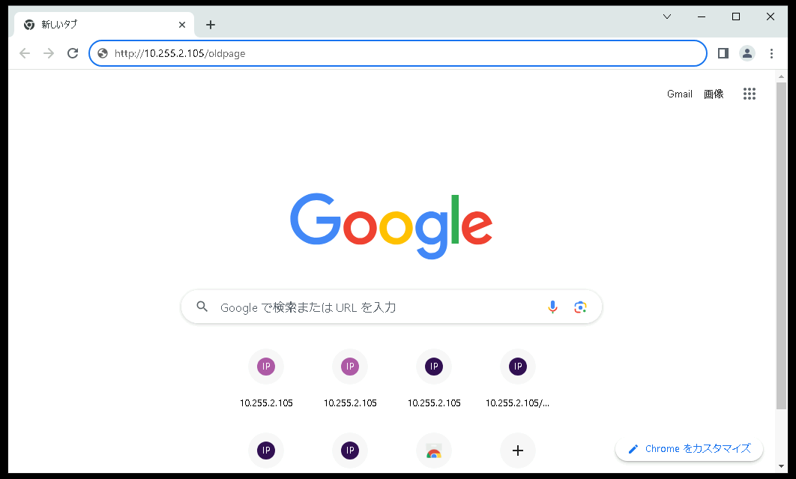</kbd> 
    1. HTTPリダイレクト処理により、別のWebサイト (http://10.X.2.105:1080/) に接続したことを確認する  
        <kbd>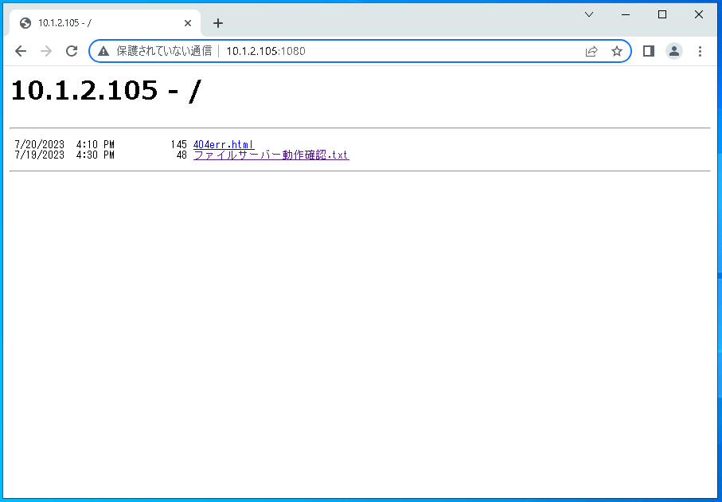</kbd> 

---

## 11. HTTP基本認証を構成する  

1. 認証の設定変更メニューを表示する      
    1. 操作コンピュータを変更するため、演習環境のトップページに戻る  
    1. Windows Webサーバー(WinSrv2)の管理画面に接続する   
    1. IIS管理コンソールを起動する  
    1. 左側コンソールツリーの[＜サーバー名＞]-[サイト]-[Default Web Site]-[web1]をクリックする  
    1. ウィンドウ中央ペインの[認証]をダブルクリックする  
        <kbd>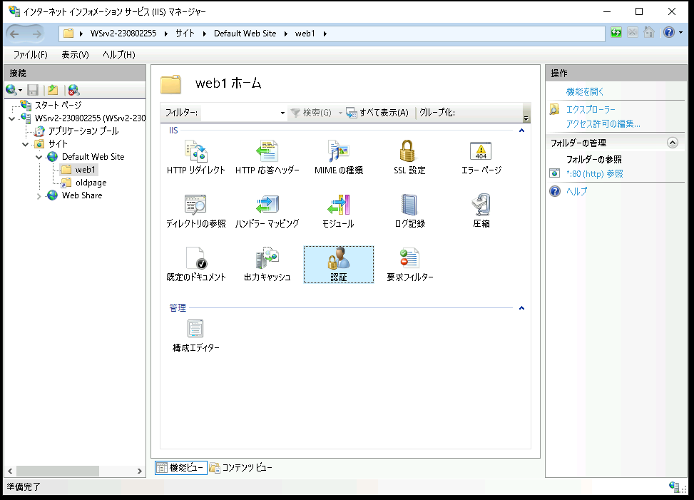</kbd>  

1. HTTP基本認証を有効化する    
    1. ウィンドウ中央ペインで、[基本認証]のエントリをクリックして選択する  
        <kbd>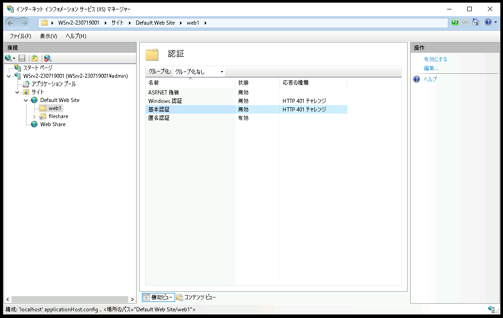</kbd>  
    1. ウィンドウ右側ペインの[操作]メニューの[有効にする]をクリックする  

    1. [基本認証]のエントリの状態が "有効" であることを確認する  
        <kbd>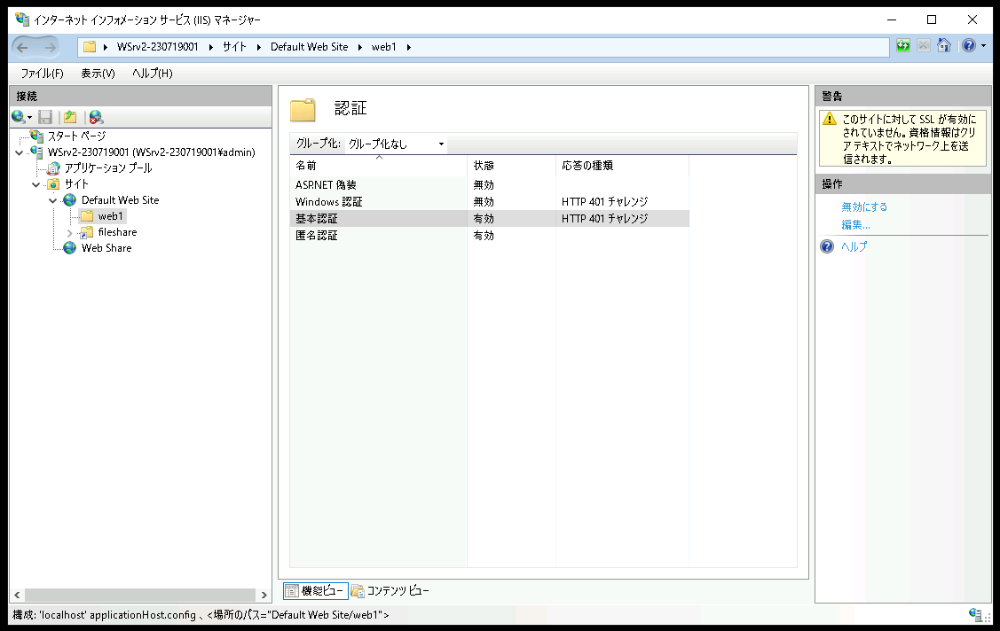</kbd>  

1. 匿名アクセス(匿名認証)を無効にする    
    1. ウィンドウ中央ペインで、[匿名認証]のエントリをクリックして選択する  
        <kbd>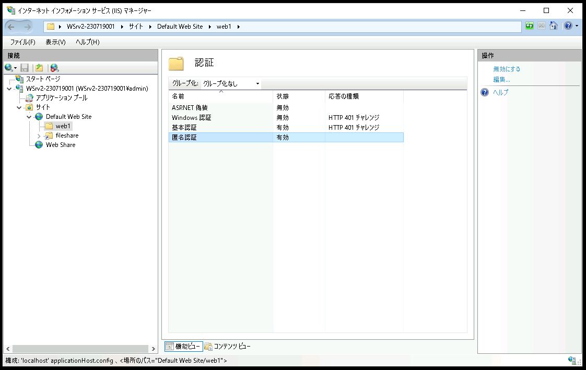</kbd>  
    1. ウィンドウ右側ペインの[操作]メニューの[無効にする]をクリックする  
    1. [匿名認証]のエントリの状態が "無効" であることを確認する  
        <kbd>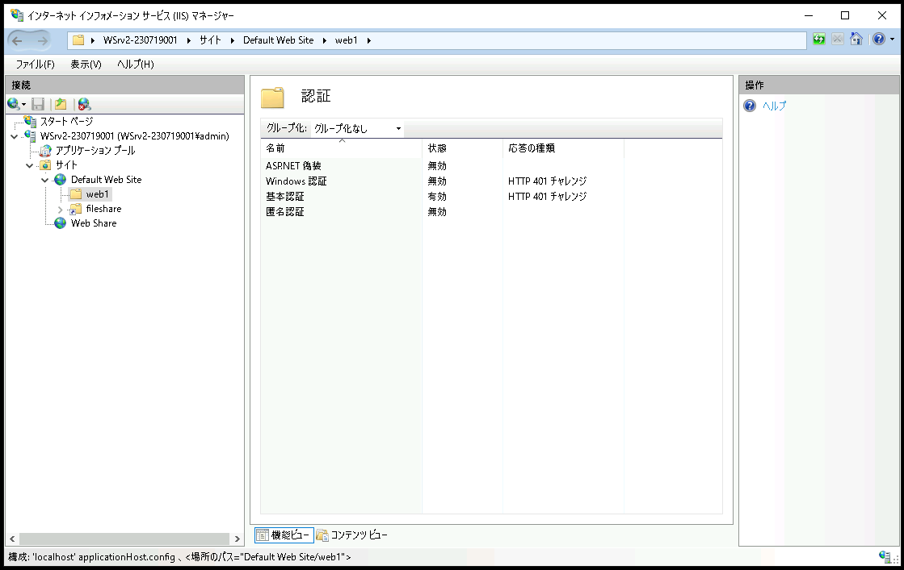</kbd>  

1. ClientのWebブラウザから仮想ディレクトリ(web1)にWebアクセスし、基本認証の動作を確認する    
    1. 操作コンピュータを変更するため、演習環境のトップページに戻る  
    1. Windows Client(WinClient)の管理画面に "admin" で接続する   
    1. WinClientでWebブラウザ(Google Chrome)を起動する  
    1. Webブラウザのアドレス欄に [http://10.X.2.105/web1] と入力し、[Enter]キーを押下する  
    1. 認証情報を入力するポップアップが表示されたことを確認する  
        <kbd>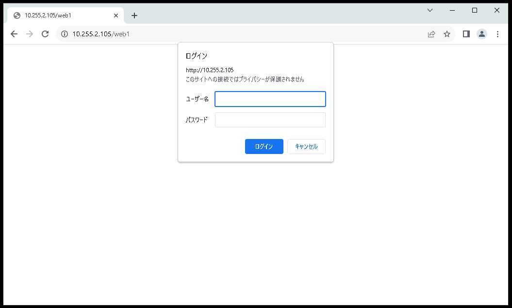</kbd> 
    1. 以下のパラメータを入力する  
        | 項目 | パラメータ |  
        | :----- | :----- |  
        | ユーザー名 | Tom |   
        | パスワード | Pa$$w0rd |   
    1. 上のパラメータを入力し、[ログイン]をクリックする  
    1. 基本認証を経て、Webコンテンツを利用できることを確認する
        <kbd></kbd> 


---

## 演習完了  
ここまでの手順で、以下の項目を学習できました。
- [x] Webサーバー(IIS)の役割を追加する
- [x] Webコンテンツを公開する
- [x] HTMLファイルを作成する
- [x] 複数のWebサイトをホストする
- [x] ディレクトリ参照を構成する
- [x] エラーページを変更する
- [x] HTTPリダイレクトを構成する
- [x] 基本認証を構成する


