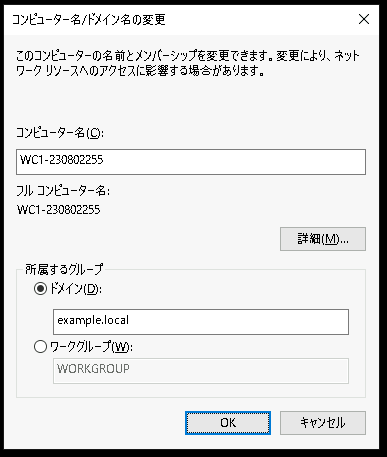
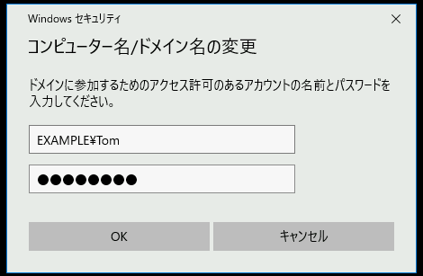
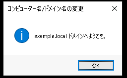
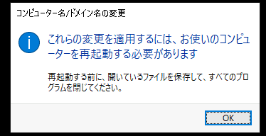
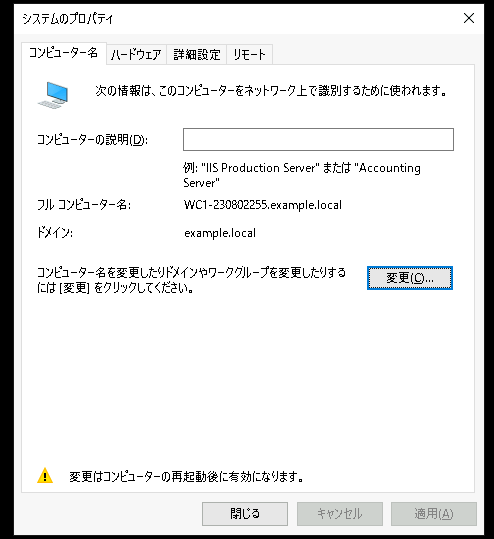
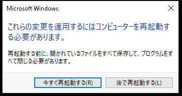
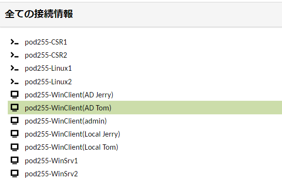

# Active Directory 環境を構成する

---

## 演習の意図
    演習ガイドを参照して演習の意図をあらかじめ確認してください

## 演習における役割と、環境のパラメータ
- X: ご自身のPod番号
- Windows Webサーバー役: WinSrv1(WSrv1-yyMMddX)
- クライアント デスクトップ環境: WinClient(WC1-yyMMddX)

## 注意
- 手順例の画像は<B>pod255</B>に準拠したパラメータのものです
- 手順内の<B>X</B>表記はご自身のpod番号に読み替えてください

---

## 1. (オプション)ドメインコントローラーの状態を確認する  
この項目の手順は省略できます。  
興味のある方のみ行ってください。  

1. Active Directory ドメイン コントローラー(WinSrv1)の管理画面に接続する 

1. PowerShellを起動する  
    1. [スタートメニュー]を右クリックし、コンテキストメニュー内の[Windows PowerShell(管理者)]をクリックする  
    1. [ユーザー アカウント制御]のポップアップで[はい]をクリックする  
    1. Windows PowerShellのウィンドウが表示されたことを確認する  

1. 以下のコマンドを実行し、EXAMPLEドメインの管理者アカウント(admin)でログインしていることを確認する  
    ＞ ***whoami***  

    ```
    PS C:\Windows\system32> whoami
    example\admin
    PS C:\Windows\system32>
    ```

1. 以下のコマンドを実行し、Windows Server1(WinSrv1)がActive Directory ドメイン コントローラーとして認識されていることを確認する  
    ＞ ***netdom query dc***  

    ```
    PS C:\Windows\system32> netdom query dc
    ドメインにアカウントがあるドメイン コントローラーの一覧:

    WSrv1-230802255
    コマンドは正しく完了しました。

    PS C:\Windows\system32>
    ```
1. 以下のコマンドを実行し、ドメイン コントローラーの状態を診断する    
    ＞ ***dcdiag***  

    > 【補足】  
    > dcdiagは、ドメインコントローラーの各機能についてステータスを検査するツールです。  
    > ドメインコントローラーが起動した直後には"失敗"が多数記録される場合がありますが、時間の経過により問題は自然解消します。  
    > なお、今回の演習環境においては"DFSREvent"機能の"失敗"は無視できます。   

    ```
    PS C:\Windows\system32> dcdiag

    ディレクトリ サーバー診断

    初期セットアップを実行しています:
    ホーム サーバーの検索を試みています...
    ホーム サーバー = WSrv1-230802255
    * AD フォレストが識別されました。
    初期情報の収集が完了しました。

    必須の初期テストを実行しています

    サーバーをテストしています: Default-First-Site-Name\WSrv1-230802255
        テストを開始しています: Connectivity
            ......................... WSrv1-230802255 はテスト Connectivity に合格しました

    プライマリ テストを実行しています

    サーバーをテストしています: Default-First-Site-Name\WSrv1-230802255
        テストを開始しています: Advertising
            ......................... WSrv1-230802255 はテスト Advertising に合格しました
        テストを開始しています: FrsEvent
            ......................... WSrv1-230802255 はテスト FrsEvent に合格しました
        テストを開始しています: DFSREvent
            SYSVOL の共有後、この 24 時間以内に発生した警告またはエラー イベントがあります。 SYSVOL レプリケーション失敗の 問題があると、グループ ポリシーの問題が発生する場合 があります。
            ......................... WSrv1-230802255 はテスト DFSREvent に失敗しました
        テストを開始しています: SysVolCheck
            ......................... WSrv1-230802255 はテスト SysVolCheck に合格しました
        テストを開始しています: KccEvent
            ......................... WSrv1-230802255 はテスト KccEvent に合格しました
        テストを開始しています: KnowsOfRoleHolders
            ......................... WSrv1-230802255 はテスト KnowsOfRoleHolders に合格しました
        テストを開始しています: MachineAccount
            ......................... WSrv1-230802255 はテスト MachineAccount に合格しました
        テストを開始しています: NCSecDesc
            ......................... WSrv1-230802255 はテスト NCSecDesc に合格しました
        テストを開始しています: NetLogons
            ......................... WSrv1-230802255 はテスト NetLogons に合格しました
        テストを開始しています: ObjectsReplicated
            ......................... WSrv1-230802255 はテスト ObjectsReplicated に合格しました
        テストを開始しています: Replications
            ......................... WSrv1-230802255 はテスト Replications に合格しました
        テストを開始しています: RidManager
            ......................... WSrv1-230802255 はテスト RidManager に合格しました
        テストを開始しています: Services
            ......................... WSrv1-230802255 はテスト Services に合格しました
        テストを開始しています: SystemLog
            ......................... WSrv1-230802255 はテスト SystemLog に合格しました
        テストを開始しています: VerifyReferences
            ......................... WSrv1-230802255 はテスト VerifyReferences に合格しました


    パーティション テストを実行しています: ForestDnsZones
        テストを開始しています: CheckSDRefDom
            ......................... ForestDnsZones はテスト CheckSDRefDom に合格しました
        テストを開始しています: CrossRefValidation
            ......................... ForestDnsZones はテスト CrossRefValidation に合格しました

    パーティション テストを実行しています: DomainDnsZones
        テストを開始しています: CheckSDRefDom
            ......................... DomainDnsZones はテスト CheckSDRefDom に合格しました
        テストを開始しています: CrossRefValidation
            ......................... DomainDnsZones はテスト CrossRefValidation に合格しました

    パーティション テストを実行しています: Schema
        テストを開始しています: CheckSDRefDom
            ......................... Schema はテスト CheckSDRefDom に合格しました
        テストを開始しています: CrossRefValidation
            ......................... Schema はテスト CrossRefValidation に合格しました

    パーティション テストを実行しています: Configuration
        テストを開始しています: CheckSDRefDom
            ......................... Configuration はテスト CheckSDRefDom に合格しました
        テストを開始しています: CrossRefValidation
            ......................... Configuration はテスト CrossRefValidation に合格しました

    パーティション テストを実行しています: example
        テストを開始しています: CheckSDRefDom
            ......................... example はテスト CheckSDRefDom に合格しました
        テストを開始しています: CrossRefValidation
            ......................... example はテスト CrossRefValidation に合格しました

    エンタープライズ テストを実行しています: example.local
        テストを開始しています: LocatorCheck
            ......................... example.local はテスト LocatorCheck に合格しました
        テストを開始しています: Intersite
            ......................... example.local はテスト Intersite に合格しました
    PS C:\Windows\system32>
    ```


---

## 2. Active Directory ドメインユーザーを作成する  

1. Active Directoryユーザー 管理コンソールを起動する 
    1. Active Directory ドメイン コントローラー(WinSrv1)の管理画面に接続する  
    1. サーバーマネージャーウィンドウ右上の[ツール]をクリックする  
    1. メニュー内の[Active Directoryユーザーとコンピューター]をクリックし、Active Directoryユーザー管理コンソールを起動する  
    1. [Active Directoryユーザーとコンピューター]が起動したことを確認する

1. 新しいOU(組織単位) "Employees" を作成する
    1. 左側コンソールツリーの[Active Directory ユーザーとコンピューター]-[example.local]をクリックして選択する    
    1. [example.local]を右クリックし、コンテキストメニュー内の[新規作成]-[組織単位(OU)]をクリックする 
    1. [新しいオブジェクト - 組織単位 (OU)]ウィンドウが起動したことを確認する  
    1. [新しいオブジェクト - 組織単位 (OU)]ウィンドウで、以下のパラメータを入力する

        | 項目 | パラメータ |
        | :----- | :----- |
        | 名前 | Employees |

        - [x] 間違って削除されないようにコンテナーを保護する  

    1. [新しいオブジェクト - 組織単位 (OU)]ウィンドウで、[OK]をクリックする    
    1. 左側コンソールツリーを参照し、[Active Directory ユーザーとコンピューター]-[example.local]-[Employees]が作成されたことを確認する  


1. 新しいユーザー "Tom" を作成する
    1. 左側コンソールツリーの[Active Directory ユーザーとコンピューター]-[example.local]-[Employees]をクリックして選択する    
    1. [Employees]を右クリックし、コンテキストメニュー内の[新規作成]-[ユーザー]をクリックする 
    1. [新しいオブジェクト - ユーザー]ウィンドウが起動したことを確認する  
    1. [新しいオブジェクト - ユーザー]ウィンドウで、以下のパラメータを入力する
        | 項目 | パラメータ |
        | :----- | :----- |
        | 姓 | <空欄> |
        | 名 | Tom |
        | イニシャル | <空欄> |
        | フル ネーム | Tom |
        | ユーザーログオン名 | Tom@example.local |
        | ユーザーログオン名(Windows2000より以前) | EXAMPLE\Tom |
    1. [新しいオブジェクト - ユーザー]ウィンドウで、[次へ]をクリックする  

    1. [新しいオブジェクト - ユーザー]ウィンドウで、以下のパラメータを入力する

        | 項目 | パラメータ |
        | :----- | :----- |
        | パスワード | Pa$$w0rd |
        | パスワードの確認入力 | Pa$$w0rd |

        - [ ] ユーザーは次回ログオン時にパスワード変更が必要    
        - [ ] ユーザーはパスワードを変更できない  
        - [x] パスワードを無期限にする    
        - [ ] アカウントは無効  

    1. [新しいオブジェクト - ユーザー]ウィンドウで、[次へ]をクリックする 

    1. [新しいオブジェクト - ユーザー]ウィンドウで、[完了]をクリックする 

    1. 左側コンソールツリーの[Active Directory ユーザーとコンピューター]-[example.local]-[Employees]をクリックして選択し、画面の右側ペインにユーザー"Tom"が表示されていることを確認する  


<!--
1. 新しいユーザー "Jerry" を作成する
    1. 左側コンソールツリーの[Active Directory ユーザーとコンピューター]-[example.local]-[Employees]をクリックして選択する    
    1. [Employees]を右クリックし、コンテキストメニュー内の[新規作成]-[ユーザー]をクリックする 
    1. [新しいオブジェクト - ユーザー]ウィンドウが起動したことを確認する  
    1. [新しいオブジェクト - ユーザー]ウィンドウで、以下のパラメータを入力する
        | 項目 | パラメータ |
        | :----- | :----- |
        | 姓 | <空欄> |
        | 名 | Jerry |
        | イニシャル | <空欄> |
        | フル ネーム | Jerry |
        | ユーザーログオン名 | Jerry@example.local |
        | ユーザーログオン名(Windows2000より以前) | EXAMPLE\Jerry |
    1. [新しいオブジェクト - ユーザー]ウィンドウで、[次へ]をクリックする  

    1. [新しいオブジェクト - ユーザー]ウィンドウで、以下のパラメータを入力する

        | 項目 | パラメータ |
        | :----- | :----- |
        | パスワード | Pa$$w0rd |
        | パスワードの確認入力 | Pa$$w0rd |

        - [ ] ユーザーは次回ログオン時にパスワード変更が必要    
        - [ ] ユーザーはパスワードを変更できない  
        - [x] パスワードを無期限にする    
        - [ ] アカウントは無効  

    1. [新しいオブジェクト - ユーザー]ウィンドウで、[次へ]をクリックする 

    1. [新しいオブジェクト - ユーザー]ウィンドウで、[完了]をクリックする 

    1. 左側コンソールツリーの[Active Directory ユーザーとコンピューター]-[example.local]-[Employees]をクリックして選択し、画面の右側ペインにユーザー"Jerry"が表示されていることを確認する  
-->

--- 

## 3. Active Directory グループを作成する  

1. Active Directoryユーザー 管理コンソールを起動する 
    1. Active Directory ドメイン コントローラー(WinSrv1)の管理画面に接続する  
    1. [Active Directoryユーザーとコンピューター]を起動する

1. 新しいOU(組織単位) "Groups" を作成する
    1. 左側コンソールツリーの[Active Directory ユーザーとコンピューター]-[example.local]をクリックして選択する    
    1. [example.local]を右クリックし、コンテキストメニュー内の[新規作成]-[組織単位(OU)]をクリックする 
    1. [新しいオブジェクト - 組織単位 (OU)]ウィンドウが起動したことを確認する  
    1. [新しいオブジェクト - 組織単位 (OU)]ウィンドウで、以下のパラメータを入力する

        | 項目 | パラメータ |
        | :----- | :----- |
        | 名前 | Groups |

        - [x] 間違って削除されないようにコンテナーを保護する  

    1. [新しいオブジェクト - 組織単位 (OU)]ウィンドウで、[OK]をクリックする    
    1. 左側コンソールツリーを参照し、[Active Directory ユーザーとコンピューター]-[example.local]-[Groups]が作成されたことを確認する  


<!--
1. 新しいグループ "G_Friends" を作成する
    1. 左側コンソールツリーの[Active Directory ユーザーとコンピューター]-[example.local]-[Groups]をクリックして選択する    
    1. [Groups]を右クリックし、コンテキストメニュー内の[新規作成]-[グループ]をクリックする 
    1. [新しいオブジェクト - グループ]ウィンドウが起動したことを確認する  
    1. [新しいオブジェクト - グループ]ウィンドウで、以下のパラメータを入力する
        | 項目 | パラメータ |
        | :----- | :----- |
        | グループ名 | G_Friends |
        | グループ名(Windows2000より以前) | G_Friends |

        グループのスコープ:  
        - [ ] ドメイン ローカル  
        - [x] グローバル  
        - [ ] ユニバーサル  

        グループの種類:  
        - [ ] セキュリティ  
        - [x] 配布  

    1. [新しいオブジェクト - グループ]ウィンドウで、[OK]をクリックする  

    1. 左側コンソールツリーの[Active Directory ユーザーとコンピューター]-[example.local]-[Groups]をクリックして選択し、画面の右側ペインにグループ"G_Friends"が表示されていることを確認する  
-->


1. 新しいグループ "G_SystemAdmins" を作成する
    1. 左側コンソールツリーの[Active Directory ユーザーとコンピューター]-[example.local]-[Groups]をクリックして選択する    
    1. [Groups]を右クリックし、コンテキストメニュー内の[新規作成]-[グループ]をクリックする 
    1. [新しいオブジェクト - グループ]ウィンドウが起動したことを確認する  
    1. [新しいオブジェクト - グループ]ウィンドウで、以下のパラメータを入力する
        | 項目 | パラメータ |
        | :----- | :----- |
        | グループ名 | G_SystemAdmins |
        | グループ名(Windows2000より以前) | G_SystemAdmins |

        グループのスコープ:  
        - [ ] ドメイン ローカル  
        - [x] グローバル  
        - [ ] ユニバーサル  

        グループの種類:  
        - [ ] セキュリティ  
        - [x] 配布  

    1. [新しいオブジェクト - グループ]ウィンドウで、[OK]をクリックする  

    1. 左側コンソールツリーの[Active Directory ユーザーとコンピューター]-[example.local]-[Groups]をクリックして選択し、画面の右側ペインにグループ"G_SystemAdmins"が表示されていることを確認する  


1. 新しいグループ "DL_WinClient_FullControl" を作成する
    1. 左側コンソールツリーの[Active Directory ユーザーとコンピューター]-[example.local]-[Groups]をクリックして選択する    
    1. [Groups]を右クリックし、コンテキストメニュー内の[新規作成]-[グループ]をクリックする 
    1. [新しいオブジェクト - グループ]ウィンドウが起動したことを確認する  
    1. [新しいオブジェクト - グループ]ウィンドウで、以下のパラメータを入力する
        | 項目 | パラメータ |
        | :----- | :----- |
        | グループ名 | DL_WinClient_FullControl |
        | グループ名(Windows2000より以前) | DL_WinClient_FullControl |

        グループのスコープ:  
        - [ ] ドメイン ローカル  
        - [x] グローバル  
        - [ ] ユニバーサル  

        グループの種類:  
        - [ ] セキュリティ  
        - [x] 配布  

    1. [新しいオブジェクト - グループ]ウィンドウで、[OK]をクリックする  

    1. 左側コンソールツリーの[Active Directory ユーザーとコンピューター]-[example.local]-[Groups]をクリックして選択し、画面の右側ペインにグループ"G-Friends"が表示されていることを確認する  


--- 

## 4. Active Directory グループのメンバーシップを構成する    

1. Active Directoryユーザー 管理コンソールを起動する 
    1. Active Directory ドメイン コントローラー(WinSrv1)の管理画面に接続する  
    1. [Active Directoryユーザーとコンピューター]を起動する


1. "G_SystemAdmins" グループに、"Tom"と"Jerry" を所属させる  
    1. 左側コンソールツリーの[Active Directory ユーザーとコンピューター]-[example.local]-[Groups]をクリックして選択する  
    1. 画面の右側ペインの[G_SystemAdmins]をクリックして選択する      
    1. [G_SystemAdmins]を右クリックし、コンテキストメニュー内の[プロパティ]をクリックする  
    1. [G_SystemAdminsのプロパティ]ウィンドウが起動したことを確認する  
    1. [G_SystemAdminsのプロパティ]ウィンドウで、[メンバー]タブをクリックして選択する  
    1. [メンバー]タブで、[追加]をクリックする  
    1. [ユーザー、連絡先、コンピュータ、サービスアカウントまたはグループの選択]ウィンドウが表示されたことを確認する
    1. [ユーザー、連絡先、コンピュータ、サービスアカウントまたはグループの選択]ウィンドウで、以下のパラメータを入力する
        | 項目 | パラメータ |
        | :----- | :----- |
        | 選択するオブジェクトを入力してください | Tom |
    1. [ユーザー、連絡先、コンピュータ、サービスアカウントまたはグループの選択]ウィンドウで、[名前の確認]をクリックする  
    1. "Tom" の名前の確認に成功し、"Tom(Tom@example.local)"表記に下線がついたことを確認する  
    1. [ユーザー、連絡先、コンピュータ、サービスアカウントまたはグループの選択]ウィンドウで、[OK]をクリックする  
    1. [G_SystemAdminsのプロパティ]ウィンドウの"所属するメンバー"の欄に"Tom"が追加されたことを確認する  

    1. [メンバー]タブで、[追加]をクリックする  
    1. [ユーザー、連絡先、コンピュータ、サービスアカウントまたはグループの選択]ウィンドウが表示されたことを確認する
    1. [ユーザー、連絡先、コンピュータ、サービスアカウントまたはグループの選択]ウィンドウで、以下のパラメータを入力する
        | 項目 | パラメータ |
        | :----- | :----- |
        | 選択するオブジェクトを入力してください | Jerry |
    1. [ユーザー、連絡先、コンピュータ、サービスアカウントまたはグループの選択]ウィンドウで、[名前の確認]をクリックする  
    1. "Jerry" の名前の確認に成功し、"Jerry(Jerry@example.local)"表記に下線がついたことを確認する  
    1. [ユーザー、連絡先、コンピュータ、サービスアカウントまたはグループの選択]ウィンドウで、[OK]をクリックする  
    1. [G_SystemAdminsのプロパティ]ウィンドウの"所属するメンバー"の欄に"Jerry"が追加されたことを確認する   

    1. [G_SystemAdminsのプロパティ]ウィンドウで、[OK]をクリックする  


1. "DL_WinClient_FullControl" グループに、"G_SystemAdmins" グループを所属させる  
    1. 左側コンソールツリーの[Active Directory ユーザーとコンピューター]-[example.local]-[Groups]をクリックして選択する  
    1. 画面の右側ペインの[DL_WinClient_FullControl]をクリックして選択する      
    1. [DL_WinClient_FullControl]を右クリックし、コンテキストメニュー内の[プロパティ]をクリックする  
    1. [DL_WinClient_FullControlのプロパティ]ウィンドウが起動したことを確認する  
    1. [DL_WinClient_FullControlのプロパティ]ウィンドウで、[メンバー]タブをクリックして選択する  
    1. [メンバー]タブで、[追加]をクリックする  
    1. [ユーザー、連絡先、コンピュータ、サービスアカウントまたはグループの選択]ウィンドウが表示されたことを確認する
    1. [ユーザー、連絡先、コンピュータ、サービスアカウントまたはグループの選択]ウィンドウで、以下のパラメータを入力する
        | 項目 | パラメータ |
        | :----- | :----- |
        | 選択するオブジェクトを入力してください | G_SystemAdmins |
    1. [ユーザー、連絡先、コンピュータ、サービスアカウントまたはグループの選択]ウィンドウで、[名前の確認]をクリックする  
    1. "G_SystemAdmins" の名前の確認に成功し、"G_SystemAdmins"表記に下線がついたことを確認する  
    1. [ユーザー、連絡先、コンピュータ、サービスアカウントまたはグループの選択]ウィンドウで、[OK]をクリックする  
    1. [DL_WinClient_FullControlのプロパティ]ウィンドウの"所属するメンバー"の欄に"G_SystemAdmins"が追加されたことを確認する  
    1. [DL_WinClient_FullControlのプロパティ]ウィンドウで、[OK]をクリックする  


---

## Windows ClientをActive Directoryドメインに参加させる  

1. Windows Clientに"admin"で接続する  
    1. Windows Client(WinClient)の管理画面に "admin" で接続する 
    1. [スタートメニュー]を右クリックし、コンテキストメニュー内の[Windows PowerShell(管理者)]をクリックする  
    1. [ユーザー アカウント制御]のポップアップで[はい]をクリックする  
    1. Windows PowerShellのウィンドウが表示されたことを確認する  
    1. 以下のコマンドを実行し、クライアント デスクトップ環境役のコンピュータ(WC1)に "admin" で接続していることを確認する  
        ＞ ***hostname***  
        ＞ ***whoami***         
        > 【補足】  
        > クライアント デスクトップ環境役のコンピュータであるWinClientは、"WC1-yyMMddX(年月日とPod番号)"形式のホスト名が設定されています。  


1. Windows PowerShellで以下のコマンドを実行し、Windows ClientがActive Directoryドメイン名をDNS名前解決できることを確認する  
    ＞ ***nslookup example.local***  

    ```
    PS C:\Windows\system32> nslookup example.local
    サーバー:  UnKnown
    Address:  10.255.1.104

    名前:    example.local
    Addresses:  10.255.1.104
            10.255.0.104

    PS C:\Windows\system32>
    ```

    > 【補足】  
    > "名前:example.local" の "Addresses" として、Windows Server 1 のIPアドレス(10.X.1.104)が解決できていることを確認します。    


1. [システムのプロパティ]設定画面を起動する  
    1. [スタートメニュー]を右クリックし、コンテキストメニュー内の[システム]をクリックする  
    1. [設定 - 詳細情報]ウィンドウが起動したことを確認する  
    1. [設定 - 詳細情報]ウィンドウ右端の"関連設定"の[このPCの名前を変更(詳細設定)]をクリックする  
    1. [システムのプロパティ]ウィンドウが起動したことを確認する  

1. コンピュータをActive Directoryドメイン(example.local)に参加させる
    1. [システムのプロパティ]ウィンドウの[コンピューター名]タブの[変更]をクリックする  
    1. [コンピューター名/ドメイン名の変更]ウィンドウが起動したことを確認する  
    1. [コンピューター名/ドメイン名の変更]ウィンドウで、"所属するグループ"の設定を以下のパラメータに変更する  

        - [x] ドメイン   
            | example.local |
            | :----- |

        - [ ] ワークグループ  

        <kbd></kbd> 
    1. [コンピューター名/ドメイン名の変更]ウィンドウで、[OK]をクリックする  
    1. [Windowsセキュリティ]ウィンドウが起動したことを確認する  
    1. [Windowsセキュリティ]ウィンドウで、以下のパラメータを入力する  

        | 項目 | パラメータ |
        | :----- | :----- |
        | ユーザー名 | EXAMPLE\Tom |
        | パスワード | Pa$$w0rd |

        <kbd></kbd> 

    1. [Windowsセキュリティ]ウィンドウで、[OK]をクリックする   

    1. 一時的に演習環境の画面表示が不安定になりますが、数十秒で接続が安定します  

    1. [コンピューター名/ドメイン名の変更]ポップアップで、[OK]をクリックする  

        <kbd></kbd> 

    1. [コンピューター名/ドメイン名の変更]ポップアップで、[OK]をクリックする  

        <kbd></kbd> 

    1. [システムのプロパティ]ウィンドウで、[閉じる]をクリックする   

        <kbd></kbd> 


    1. [Microsoft Windows]ポップアップで、[今すぐ再起動する]をクリックする   

        <kbd></kbd> 

    1. 一時的に演習環境の画面表示が途絶えますが、数十秒で接続が安定します  


---  

## Windows ClientのActive Directoryドメイン参加後の確認

1. Windows Clientに"admin"で接続する  
    1. Windows Client(WinClient)の管理画面に "admin" で接続する 

1. [システムのプロパティ]設定画面を起動する  
    1. [スタートメニュー]を右クリックし、コンテキストメニュー内の[システム]をクリックする  
    1. [設定 - 詳細情報]ウィンドウが起動したことを確認する  
    1. [設定 - 詳細情報]ウィンドウ右端の"関連設定"の[このPCの名前を変更(詳細設定)]をクリックする  
    1. [システムのプロパティ]ウィンドウが起動したことを確認する  
    1. [システムのプロパティ]ウィンドウの[コンピューター名]タブを参照し、コンピューターの状態を確認する     
        > 【動作テストの観点】  
        > コンピューターのActive Directoryドメインに参加できていることを確認する  

        - [x] "ドメイン名:" が "example.local" であること  
                
---  

## "DL_WinClient_FullControl"グループにWindows Clientの管理者権限を付与する  

1. Windows Clientに"admin"で接続し、[ローカルユーザーとグループ]管理コンソールを起動する    
    1. Windows Client(WinClient)の管理画面に "admin" で接続する 
    1. [スタートメニュー]を右クリックし、コンテキストメニュー内の[Windows PowerShell(管理者)]をクリックする  
    1. [ユーザー アカウント制御]のポップアップで[はい]をクリックする  
    1. Windows PowerShellのウィンドウが表示されたことを確認する  。  
    1. Windows PowerShellで以下のコマンドを実行し、[ローカルユーザーとグループ]管理コンソールを起動する  
        ＞ ***lusrmgr.msc***    

1. ローカル Adminsitrators グループに、"DL_WinClient_FullControl"グループをメンバーとして所属させる    
    1. 左側コンソールツリーの[ローカル ユーザーとグループ]-[グループ]をクリックする  
    1. 中央ペインのユーザーの一覧を参照し、[Administrators]をクリックして選択する
    1. 右クリック コンテキストメニューの[プロパティ]をクリックする  
    1. [Administratorsのプロパティ]ウィンドウで、[追加]をクリックする  
    1. [ユーザー、コンピュータ、サービスアカウントまたはグループの選択]ウィンドウが表示されたことを確認する  
    1. "選択するオブジェクト名を入力してください" の欄に "DL_WinClient_FullControl" と入力する  
    1. [名前の確認]をクリックする  
    1. [Windowsセキュリティ]ウィンドウが起動したことを確認する  
    1. [Windowsセキュリティ]ウィンドウで、以下のパラメータを入力する  

        | 項目 | パラメータ |
        | :----- | :----- |
        | ユーザー名 | EXAMPLE\Tom |
        | パスワード | Pa$$w0rd |

    1. [Windowsセキュリティ]ウィンドウで、[OK]をクリックする  
    1. "DL_WinClient_FullControl" の表記に下線がついたことを確認する  
    1. [OK]をクリックする  
    1. [Administratorsのプロパティ]ウィンドウの "所属するメンバー" に "EXAMPLE\DL_WinClient_FullControl" が表示されていることを確認する
    1. [Administratorsのプロパティ]ウィンドウで、[OK]をクリックする  
    1. [ローカルユーザーとグループ]管理コンソールを終了します。


---  

## Active Directory ドメインユーザーでWindows Clientにログインする

1. EXAMPLE\Tom でログインする  
    1. 操作コンピュータを変更するため、演習環境のトップページに戻る  
    1. Windows Client(WinClient)の管理画面に "AD Tom" で接続する  
        <kbd></kbd> 

1. ユーザーアカウントの情報を確認する      
    1. Windows PowerShellで以下のコマンドを実行し、Active Directory ドメインユーザーの"Tom"でログインしていることを確認する   
        ＞ ***whoami***    

        ```
        PS C:\Users\tom.EXAMPLE> whoami
        example\tom
        PS C:\Users\tom.EXAMPLE>        
        ```

    > 【補足1】  
    > "ローカルユーザーのTom" と "Active DirectoryドメインユーザーのTom(example\tom)" は全く別のアカウントです。  
    > そのため、 "ローカルユーザーのTom" が FileServerの動作確認のためにデスクトップにコピーしたファイルは、"Active DirectoryドメインユーザーのTom(example\tom)"のデスクトップには存在しません。    
    > これは、Windows Clientログイン時のユーザー プロファイルが異なるためです。  

    > 【補足2】  
    > "ローカルユーザーのTom" が "whoami" コマンドを実行した場合は、以下の出力を得ます。
    > ローカルユーザーのアカウント名は "<ローカルコンピュータ名>\ユーザー名" の形式です。  
    >
    > PS C:\Users\Tom> whoami
    > wc1-230802255\tom
    > PS C:\Users\Tom>


---  


---
---
---
