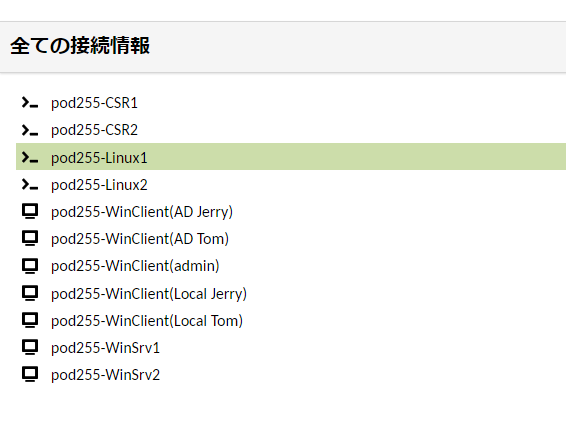

# Linux ServerでDNSサーバーを構築する

---

## 演習の意図
    演習ガイドを参照して演習の意図をあらかじめ確認してください

## 演習における役割と、環境のパラメータ
- X: ご自身のPod番号  
- Linux DNSサーバー役: Linux1  
    - example.comゾーンの権威サーバー   

- Windows DNSサーバー役: WinSrv1(WSrv1-yyMMddX)  
    - example.local ゾーンの権威サーバーとして、"sub.example.local" ゾーンをLinux1に委譲する    
    - Linux2にDNS問い合わせをフォワーディングする  

- クライアント デスクトップ環境: WinClient(WC1-yyMMddX)
    - WinSrv1を優先DNSサーバーとして問い合わせに使用する  


## 注意
- 手順例の画像は<B>pod255</B>に準拠したパラメータのものです
- 手順内の<B>X</B>表記はご自身のpod番号に読み替えてください

---


## Linux Server 1(Linux1)にBINDをインストールする

1. Linux1の管理画面に接続する  
    <kbd></kbd>


1. BINDをインストールする
    ＞ ***sudo yum -y install bind bind-util***  

    <details>
    <summary>[参考]yum実行時のログ出力例 (クリックで表示):</summary>

        ```
        [admin@linux1 ~]$ sudo yum -y install bind bind-utils
        Loaded plugins: langpacks
        Resolving Dependencies
        --> Running transaction check
        ---> Package bind.x86_64 32:9.11.4-26.P2.el7_9.14 will be installed
        --> Processing Dependency: bind-libs-lite(x86-64) = 32:9.11.4-26.P2.el7_9.14 for package: 32:bind-9.11.4-26.P2.el7_9.14.x86_64
        --> Processing Dependency: bind-libs(x86-64) = 32:9.11.4-26.P2.el7_9.14 for package: 32:bind-9.11.4-26.P2.el7_9.14.x86_64
        --> Processing Dependency: python-ply for package: 32:bind-9.11.4-26.P2.el7_9.14.x86_64
        ---> Package bind-utils.x86_64 32:9.11.4-26.P2.el7_9.13 will be updated
        ---> Package bind-utils.x86_64 32:9.11.4-26.P2.el7_9.14 will be an update
        --> Running transaction check
        ---> Package bind-libs.x86_64 32:9.11.4-26.P2.el7_9.13 will be updated
        ---> Package bind-libs.x86_64 32:9.11.4-26.P2.el7_9.14 will be an update
        --> Processing Dependency: bind-license = 32:9.11.4-26.P2.el7_9.14 for package: 32:bind-libs-9.11.4-26.P2.el7_9.14.x86_64
        ---> Package bind-libs-lite.x86_64 32:9.11.4-26.P2.el7_9.13 will be updated
        ---> Package bind-libs-lite.x86_64 32:9.11.4-26.P2.el7_9.14 will be an update
        ---> Package python-ply.noarch 0:3.4-11.el7 will be installed
        --> Running transaction check
        ---> Package bind-license.noarch 32:9.11.4-26.P2.el7_9.13 will be updated
        ---> Package bind-license.noarch 32:9.11.4-26.P2.el7_9.14 will be an update
        --> Finished Dependency Resolution

        Dependencies Resolved

        ========================================================================================================================================================================================
        Package                                    Arch                               Version                                              Repository                                     Size
        ========================================================================================================================================================================================
        Installing:
        bind                                       x86_64                             32:9.11.4-26.P2.el7_9.14                             updates-openlogic                             2.3 M
        Updating:
        bind-utils                                 x86_64                             32:9.11.4-26.P2.el7_9.14                             updates-openlogic                             262 k
        Installing for dependencies:
        python-ply                                 noarch                             3.4-11.el7                                           base-openlogic                                123 k
        Updating for dependencies:
        bind-libs                                  x86_64                             32:9.11.4-26.P2.el7_9.14                             updates-openlogic                             158 k
        bind-libs-lite                             x86_64                             32:9.11.4-26.P2.el7_9.14                             updates-openlogic                             1.1 M
        bind-license                               noarch                             32:9.11.4-26.P2.el7_9.14                             updates-openlogic                              92 k

        Transaction Summary
        ========================================================================================================================================================================================
        Install  1 Package (+1 Dependent package)
        Upgrade  1 Package (+3 Dependent packages)

        Total download size: 4.1 M
        Downloading packages:
        Delta RPMs disabled because /usr/bin/applydeltarpm not installed.
        (1/6): bind-9.11.4-26.P2.el7_9.14.x86_64.rpm                                                                                                                     | 2.3 MB  00:00:00     
        (2/6): bind-libs-9.11.4-26.P2.el7_9.14.x86_64.rpm                                                                                                                | 158 kB  00:00:00     
        (3/6): bind-license-9.11.4-26.P2.el7_9.14.noarch.rpm                                                                                                             |  92 kB  00:00:00     
        (4/6): bind-utils-9.11.4-26.P2.el7_9.14.x86_64.rpm                                                                                                               | 262 kB  00:00:00     
        (5/6): bind-libs-lite-9.11.4-26.P2.el7_9.14.x86_64.rpm                                                                                                           | 1.1 MB  00:00:00     
        (6/6): python-ply-3.4-11.el7.noarch.rpm                                                                                                                          | 123 kB  00:00:00     
        ----------------------------------------------------------------------------------------------------------------------------------------------------------------------------------------
        Total                                                                                                                                                   9.1 MB/s | 4.1 MB  00:00:00     
        Running transaction check
        Running transaction test
        Transaction test succeeded
        Running transaction
        Updating   : 32:bind-license-9.11.4-26.P2.el7_9.14.noarch                                                                                                                        1/10 
        Updating   : 32:bind-libs-lite-9.11.4-26.P2.el7_9.14.x86_64                                                                                                                      2/10 
        Updating   : 32:bind-libs-9.11.4-26.P2.el7_9.14.x86_64                                                                                                                           3/10 
        Installing : python-ply-3.4-11.el7.noarch                                                                                                                                        4/10 
        Installing : 32:bind-9.11.4-26.P2.el7_9.14.x86_64                                                                                                                                5/10 
        Updating   : 32:bind-utils-9.11.4-26.P2.el7_9.14.x86_64                                                                                                                          6/10 
        Cleanup    : 32:bind-utils-9.11.4-26.P2.el7_9.13.x86_64                                                                                                                          7/10 
        Cleanup    : 32:bind-libs-9.11.4-26.P2.el7_9.13.x86_64                                                                                                                           8/10 
        Cleanup    : 32:bind-libs-lite-9.11.4-26.P2.el7_9.13.x86_64                                                                                                                      9/10 
        Cleanup    : 32:bind-license-9.11.4-26.P2.el7_9.13.noarch                                                                                                                       10/10 
        Verifying  : 32:bind-libs-lite-9.11.4-26.P2.el7_9.14.x86_64                                                                                                                      1/10 
        Verifying  : 32:bind-utils-9.11.4-26.P2.el7_9.14.x86_64                                                                                                                          2/10 
        Verifying  : python-ply-3.4-11.el7.noarch                                                                                                                                        3/10 
        Verifying  : 32:bind-license-9.11.4-26.P2.el7_9.14.noarch                                                                                                                        4/10 
        Verifying  : 32:bind-9.11.4-26.P2.el7_9.14.x86_64                                                                                                                                5/10 
        Verifying  : 32:bind-libs-9.11.4-26.P2.el7_9.14.x86_64                                                                                                                           6/10 
        Verifying  : 32:bind-license-9.11.4-26.P2.el7_9.13.noarch                                                                                                                        7/10 
        Verifying  : 32:bind-utils-9.11.4-26.P2.el7_9.13.x86_64                                                                                                                          8/10 
        Verifying  : 32:bind-libs-lite-9.11.4-26.P2.el7_9.13.x86_64                                                                                                                      9/10 
        Verifying  : 32:bind-libs-9.11.4-26.P2.el7_9.13.x86_64                                                                                                                          10/10 

        Installed:
        bind.x86_64 32:9.11.4-26.P2.el7_9.14                                                                                                                                                  

        Dependency Installed:
        python-ply.noarch 0:3.4-11.el7                                                                                                                                                        

        Updated:
        bind-utils.x86_64 32:9.11.4-26.P2.el7_9.14                                                                                                                                            

        Dependency Updated:
        bind-libs.x86_64 32:9.11.4-26.P2.el7_9.14                 bind-libs-lite.x86_64 32:9.11.4-26.P2.el7_9.14                 bind-license.noarch 32:9.11.4-26.P2.el7_9.14                

        Complete!
        [admin@linux1 ~]$ 
        ```

    </details>


1. インストールされたパッケージを確認する  
    ＞ ***yum list installed | grep bind***  

    ```
    [admin@linux1 ~]$ yum list installed | grep bind
    bind.x86_64                    32:9.11.4-26.P2.el7_9.14       @updates-openlogic             
    (略)
    [admin@linux1 ~]$ 
    ```

    > 【確認ポイント】
    > 'bind.x86_64' の行が表示されることを確認する  


1. インストールされたBIND(named)ツールがコマンドから実行可能であることを確認する    
    ＞ ***named -v***  

    ```
    [admin@linux1 ~]$ named -v
    BIND 9.11.4-P2-RedHat-9.11.4-26.P2.el7_9.14 (Extended Support Version) <id:7107deb>
    [admin@linux1 ~]$ 
    ```

    > 【確認ポイント】
    > 'named -v' コマンドの実行結果が出力されることを確認する    


1. BIND(named)サービスのStatusを確認する  
    ＞ ***systemctl status named***  
    
    ```
    [admin@linux1 ~]$ systemctl status named
    ● named.service - Berkeley Internet Name Domain (DNS)
        Loaded: loaded (/usr/lib/systemd/system/named.service; disabled; vendor preset: disabled)
        Active: inactive (dead)
    [admin@linux1 ~]$ 
    ```
 
    > 【確認ポイント】  
    > 'Active:' が 'inactive (dead)'であることを確認する  
    - [x] BIND(named)が、サービスとして認識されていること  
    - [x] BIND(named)サービスが、まだ起動していないこと  

---  


## "example.com"ゾーン ファイルを構成する   

1. "example.com"ゾーン ファイルを作成する  
    ＞ ***sudo touch /etc/named/example.com.db***  

1. "example.com"ゾーン ファイル("/etc/named/example.com.db")のバックアップを作成する  
    ＞ ***sudo cp /etc/named/example.com.db /etc/named/example.com.db.bak***  

1. "example.com"ゾーン ファイル("/etc/named/example.com.db")に、DNSゾーン情報を記述する    
    ＞ ***sudo vi /etc/named/example.com.dbf***  
    ＞ ***sudo diff /etc/named/example.com.db /etc/named/example.com.db.bak***

    ```
    [admin@linux1 ~]$ sudo vi /etc/named/example.com.db
    [admin@linux1 ~]$ sudo diff /etc/named/example.com.db /etc/named/example.com.db.bak
    1,14d0
    < @TTL  300
    < @     IN  SOA     ns.example.com. (
<   <                   1; Serial
    <                   600; Refresh
    <                   600; Retry
    <                   600; Exprie
    <                   300 ); Negativa Cache TTL
    < ;
    < @     IN  NS      ns.example.com.
    < ns    IN  A       10.255.1.102
    < www   IN  A       10.255.2.105
    < 
    < 
    < 
    [admin@linux1 ~]$ 
    ```

    /etc/named/example.com.db の情報(サンプルconfig)
    ```
    $TTL    300
    @       IN      SOA     ns.example.com. (
                            1       ; Serial
                            600     ; Refresh
                            600     ; Retry
                            600     ; Expire
                            300 )   ; Negative Cache TTL
    ;
    @       IN      NS      ns.example.com.
    ns      IN      A       10.X.1.102
    www     IN      A       10.X.2.105
    ```

    > 【補足1】  
    > ゾーンファイルにFQDNを記述する際は、文字列末尾のドットを見落とさないように注意しましょう。  
    > 例:
    > 　　`ns.example.com.`　　←末尾のcomの右の '.' は必須
    
    > 【補足2】  
    > 上のサンプルconfigに記述された'X'は、自身のPod番号に置き換えてください。

    > 【補足3】  
    > ゾーンファイル内のスペースやインデント(行頭の空白による字下げ)は必須ではありませんが、可読性を保つために一定間隔の空白を挿入するのが一般的です。
    > Tabキーもしくは複数個の半角スペースを使用してください。

---  

## BINDを構成する  

1. BINDの構成ファイル("/etc/named.conf")のバックアップを作成する  
    ＞ ***sudo cp /etc/named.conf /etc/named.conf.bak***  

1. BIND(named)のconfigファイルを編集し、"example.com"ゾーンファイルをインポートさせる     
    ＞ ***sudo cp /etc/samba/smb.conf /etc/samba/smb.conf.bak***  
    ＞ ***sudo vi /etc/samba/smb.conf***  
    ＞ ***diff /etc/samba/smb.conf /etc/samba/smb.conf.bak***  


## ゾーンファイルを作成する  

## サービスの起動を確認する  


## DNSフォワーディングを構成する  
1.1 

## ACLを構成する
NW1からは受け付けるが、NW2からは受け付けない


# レコード変更とキャッシュ削除
CSRのレコード変更でいいかな
フォワーディングしてからのほうがいいかな


---  

## 演習完了  
ここまでの手順で、以下の項目を学習できました。  
- [x] Windows DNSサーバーにDNSレコードを登録する  
- [x] セカンダリDNSサーバーを構成する  

- [x] (オプション) Linux DNSでACLを実装する  
- [x] 再帰問い合わせを実装する

