# Windows ServerでDNSサーバーを構築する

---

## 演習の意図
    演習ガイドを参照して演習の意図をあらかじめ確認してください

## 演習における役割と、環境のパラメータ
- X: ご自身のPod番号
- Windows DNSサーバー役: WinSrv1(WSrv1-yyMMddX)
    - example.local ゾーンの権威サーバー(プライマリ)  
- Windows DNSサーバー役: WinSrv2(WSrv2-yyMMddX)
    - example.local ゾーンの権威サーバー(セカンダリ)  
    - sub.example.local ゾーンの権威サーバー

- クライアント デスクトップ環境: WinClient(WC1-yyMMddX)

## 注意
- 手順例の画像は<B>pod255</B>に準拠したパラメータのものです
- 手順内の<B>X</B>表記はご自身のpod番号に読み替えてください

---

## Windows ServerでDNSサーバーを構築する   

## Wndows Server 1のDNSサーバーの状態を確認する
Active Directoryドメインコントローラー構築時に自動的にDNSサーバーの役割も追加されています。  
"example.local" Active Directoryドメインのサービスを提供するために、DNSサーバーには "example.local" DNSゾーンが構成されていることを確認します。  

    <!--
        Active DirectoryのセクションでDNSの学習を深堀しすぎるのを防止するために、Active Directory学習後にDNSを学習します。  
    -->

1. DNSサーバー管理コンソールを起動する
    1. [スタートメニュー]をクリックする  
    1. スタートメニュー内の[サーバー マネージャー]をクリックし、サーバーマネージャを起動する  
    1. サーバーマネージャーウィンドウ右上の[ツール]をクリックする  
    1. メニュー内の[DNS]をクリックし、DNSサーバー管理コンソール(DNSマネージャー)を起動する  

        <kbd>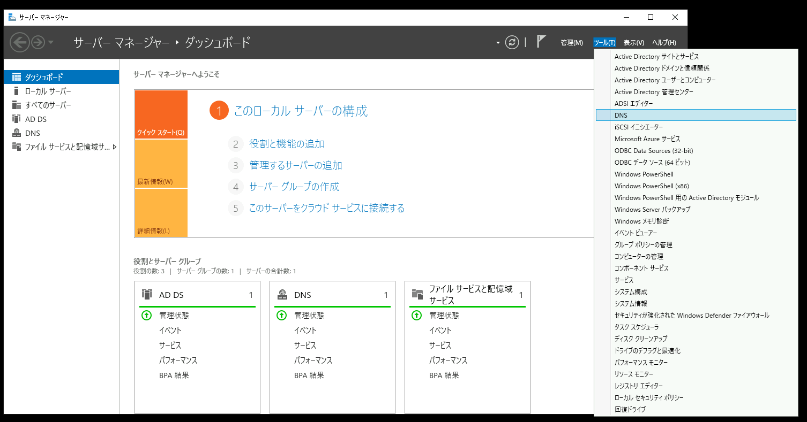</kbd> 
        <kbd>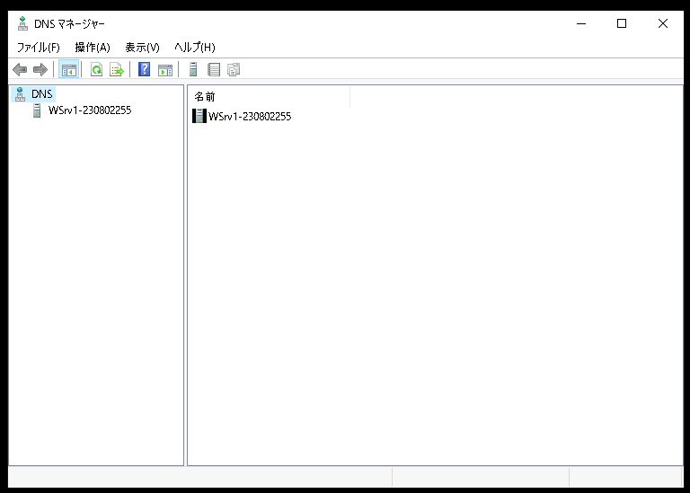</kbd> 

1. 左側コンソールツリーの[DNS]-[<サーバー名>]-[前方参照ゾーン]-[example.local]をクリックして選択する  

1. "example.local" ゾーンが作成されていることを確認する  

    > 【補足】  
    > "example.local"ゾーンと"_msdcs.example.local"ゾーンの、2つのゾーンがDNSサーバーに作成されています。    
    > DNSサーバーの演習で操作するのは、"example.local"ゾーンのみです。    
    > "_msdcs.example.local"ゾーンは、Active Directoryのために作成される特殊なDNSゾーンであり、演習では操作しません。  

1. "example.local" ゾーンに登録されているDNSレコードを確認する  

    > 【補足】  
    > "example.local"ゾーンは、Active Directoryドメインサービスのために使用されています。  
    > Active Directoryドメインに参加するコンピュータ(Active Directoryドメインコントローラーやメンバー)の情報が、自動的に登録されています。  

---  

## Windows Server 2にDNSサーバー役割をインストールする  
1. 役割と機能の追加ウィザードを開始する  
    1. [スタートメニュー]をクリックする  
    1. スタートメニュー内の[サーバー マネージャー]をクリックし、サーバーマネージャを起動する    
    1. サーバーマネージャーのダッシュボード画面内の[役割と機能の追加]をクリックする   
    1. [役割と機能の追加ウィザード]ウィンドウが起動したことを確認する  

1. DNSサーバーの役割を追加する
    1. [役割と機能の追加ウィザード]ウィンドウの[開始する前に]画面で、[次へ]をクリックする  
    1. [インストールの種類]画面で、[次へ]をクリックする  
    1. [サーバーの選択]画面で、[次へ]をクリックする  
    1. [サーバーの役割]画面で、以下のパラメータを選択する  

        - [x] DNSサーバー   
    
        > 【補足1】  
        > "DNSサーバー"のチェックをつけると、[DNSサーバーに必要な機能を追加しますか？]の確認ポップアップが表示されます。  
        > [DNSサーバーに必要な機能を追加しますか？]ウィンドウで、[機能の追加] をクリックします。   

        > 【補足2】  
        > [役割と機能の追加ウィザード - 検証結果]のポップアップが表示され、静的IPアドレスが設定されていない旨を警告されます。  
        > この演習環境においては、この警告は無視して作業を継続できます。  
        > [役割と機能の追加ウィザード - 検証結果]ウィンドウで、[続行]をクリックします。  
           
        <kbd>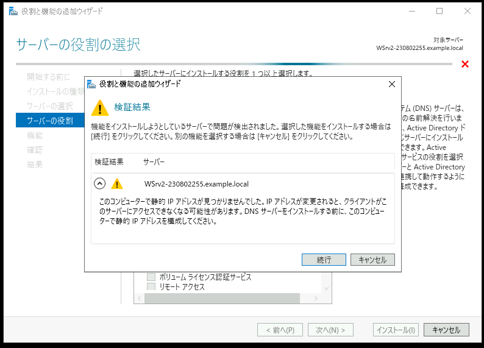</kbd> 

    1. [サーバーの役割]画面で、上のパラメータを選択したことを確認し、[次へ]をクリックする  
        <kbd>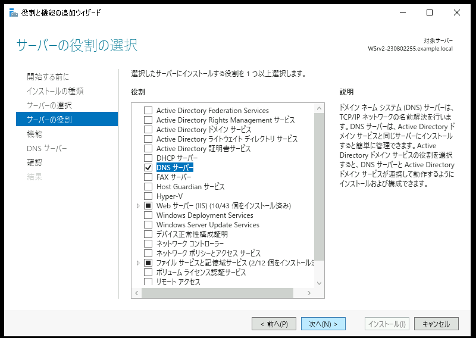</kbd> 
    1. [機能の選択]画面で、[次へ]をクリックする  
    1. [DNSサーバー]画面で、[次へ]をクリックする   
    1. [確認]画面で、[インストール]をクリックする  
    1. [結果]画面で、インストール進捗を示すプログレスバーが右端に到達するまで数分間待機する  

        > 【補足】  
        > このインストール処理には、数分～かかる場合があります。   
        > その間に次の項目の作業を進めてください。  

    1. [結果]画面で、インストールが正常に完了したことを確認し、[閉じる]をクリックする  

---  

## Windows Server 1の "example.local"ゾーンにDNSレコードを登録する    

1. Windows Server 1(WinSrv1)の管理画面に接続する  
1. [DNSマネージャー]を起動する  
1. 左側コンソールツリーの[DNS]-[<サーバー名>]-[前方参照ゾーン]-[example.local]をクリックして選択する  

1. "example.local"ゾーンにAレコードを作成する
    1. [DNS]-[<サーバー名>]-[前方参照ゾーン]-[example.local]を右クリックし、コンテキストメニュー内の[その他の新しいレコード]をクリックする  
        <kbd>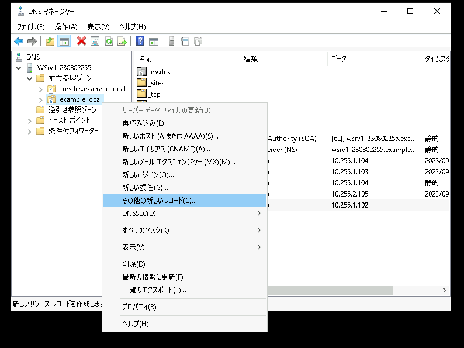</kbd> 
    1. [リソース レコードの種類]ウィンドウが表示されたことを確認する  
    1. "リソースレコードの種類:"として、[Host(AまたはAAAA)]をクリックして選択する  
        <kbd>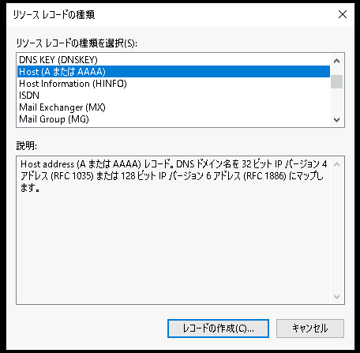</kbd> 
    1. [リソース レコードの種類]ウィンドウで、[レコードの作成]をクリックする  
    1. [新しいリソース レコード]ウィンドウが表示され、[ホスト(A)]タブが表示されていることを確認する  
        <kbd>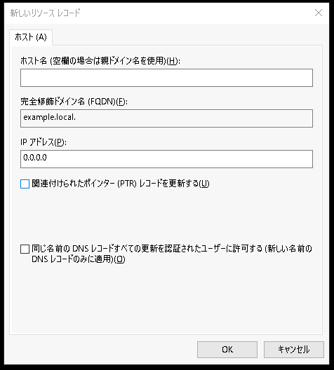</kbd> 
    1. [新しいリソース レコード]ウィンドウで、以下のパラメータを入力する  

        | 名前 | 完全修飾ドメイン名 | IPアドレス |   
        | :----- | :----- | :----- |  
        | Linux1 | Linux1.example.local | 10.X.1.102 | 

        - [ ] 関連付けられたポインター(PTR)レコードを作成する    
        - [ ] 同じ名前のDNSレコードすべての更新を認証されたユーザーに許可する

        <kbd>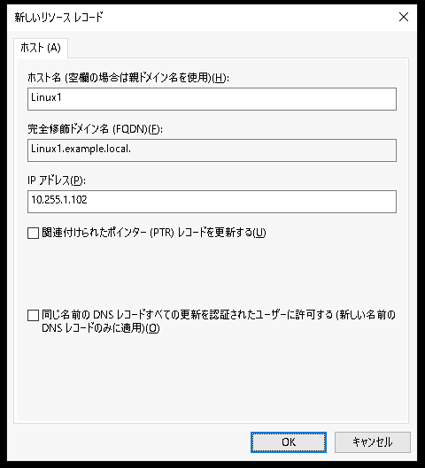</kbd> 
    1. [新しいリソース レコード]ウィンドウで、[OK]をクリックする  
    1. [example.local]ゾーンにAレコードが作成されていることを確認する  
        <kbd>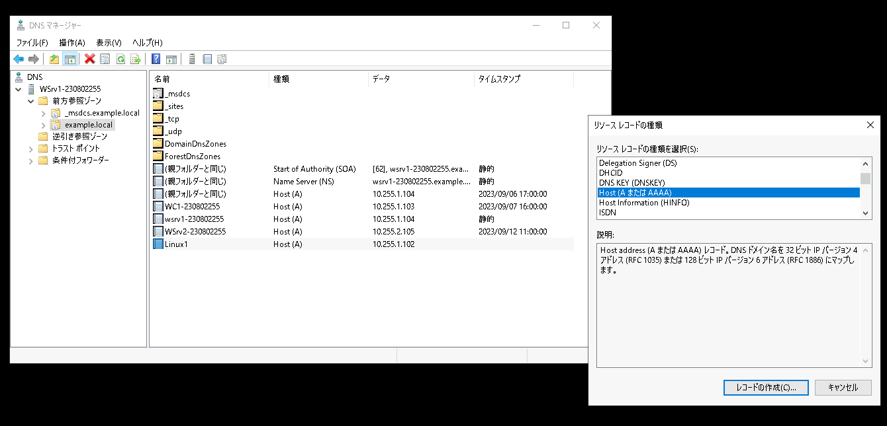</kbd>  
    
    1. [リソース レコードの種類]ウィンドウで、"リソースレコードの種類:"として、[Host(AまたはAAAA)]をクリックして選択する  
    1. ここまでと同じ手順を繰り返し、以下の "新規Aレコード 一覧"表 のすべてのAレコードを作成する  

        新規Aレコード 一覧:
        | 名前 | 完全修飾ドメイン名 | IPアドレス |   
        | :----- | :----- | :----- |  
        | Linux1 | Linux1.example.local | 10.X.1.102 |  
        | Linux2 | Linux2.example.local | 10.X.3.106 |   
        | CSR1 | CSR1.example.local | 10.X.2.253 |
        | CSR2 | CSR2.example.local | 10.X.2.254 |     

    1. "新規Aレコード 一覧"表 のすべてのAレコードが作成されたことを確認する  

        <kbd>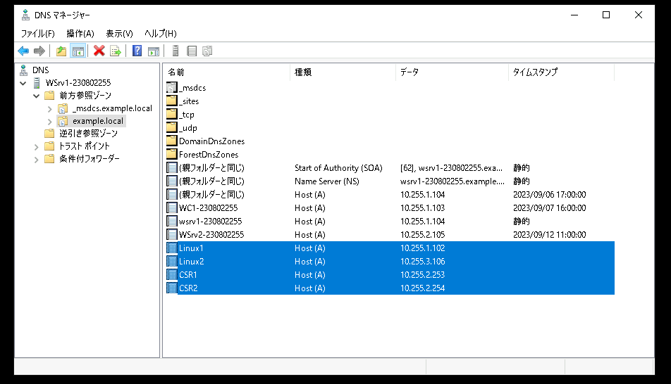</kbd>  

1. "example.local"ゾーンにCNAMEレコードを作成する
    1. [DNS]-[<サーバー名>]-[前方参照ゾーン]-[example.local]を右クリックし、コンテキストメニュー内の[その他の新しいレコード]をクリックする  
        <kbd></kbd> 
    1. [リソース レコードの種類]ウィンドウが表示されたことを確認する  
    1. "リソースレコードの種類:"として、[Alias(CNAME)]をクリックして選択する  
        <kbd>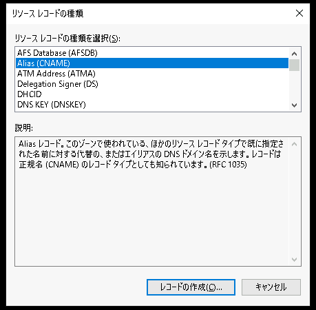</kbd> 
    1. [リソース レコードの種類]ウィンドウで、[レコードの作成]をクリックする  
    1. [新しいリソース レコード]ウィンドウが表示され、[Alias(CNAME)]タブが表示されていることを確認する  
        <kbd>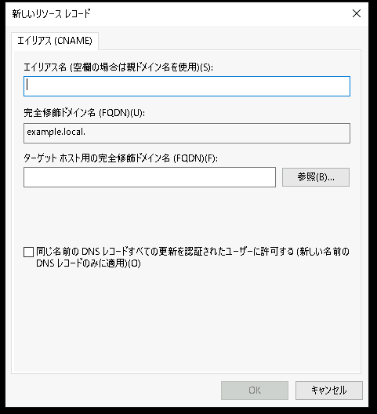</kbd> 
    1. [新しいリソース レコード]ウィンドウで、以下のパラメータを入力する  

        新規CNAMEレコード 一覧:
        | エイリアス名 | 完全修飾ドメイン名 | ターゲット ホスト用の完全修飾ドメイン名  |
        | :----- | :----- | :----- |
        | AD | AD.example.local | WSrv1-yyMMddX(年月日とPod番号).example.local |

        - [ ] 同じ名前のDNSレコードすべての更新を認証されたユーザーに許可する

        > 【補足】  
        > [参照]をクリックすることで、"ターゲット ホスト用の完全修飾ドメイン名"のパラメータを、DNSゾーン内に作成済みのレコードから検索して入力させることができます    
        > 手順:   
        > ①[新しいリソース レコード]ウィンドウで、[参照]をクリックする  
        > ②[参照]ウィンドウが表示されたことを確認する  
        > ③"レコード:"の項目の[<サーバー名>]をダブルクリックする  
        > ④"レコード:"の項目の[前方参照ゾーン]をダブルクリックする  
        > ⑤"レコード:"の項目の[example.local]をダブルクリックする  
        > ⑥"レコード:"の項目の[WSrv1-yyMMddX(年月日とPod番号).example.local]をダブルクリックする  
        > ⑦[新しいリソース レコード]ウィンドウの"ターゲット ホスト用の完全修飾ドメイン名"のパラメータが入力されていることを確認する  

        <kbd>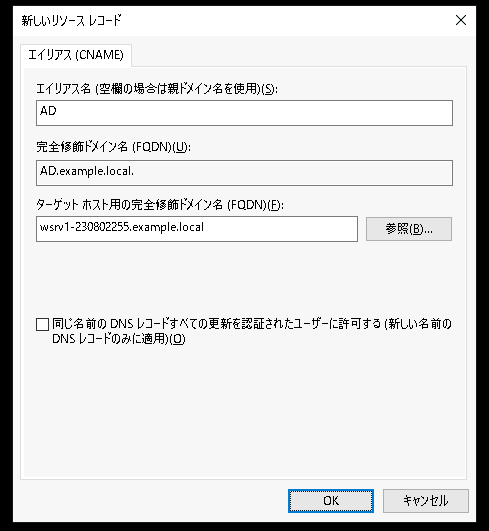</kbd> 

    1. [新しいリソース レコード]ウィンドウで、[OK]をクリックする  

    1. [example.local]ゾーンにCNAMEレコードが作成されていることを確認する  
        <kbd>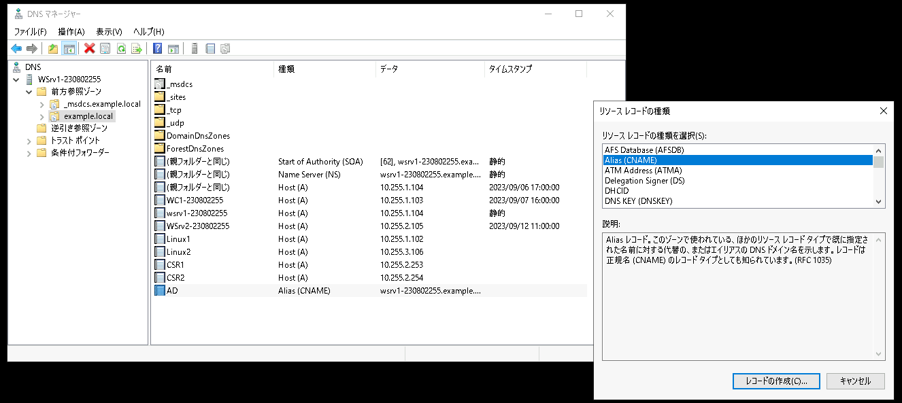</kbd>  
    
    1. [リソース レコードの種類]ウィンドウで、"リソースレコードの種類:"として、[Alias(CNAME)]をクリックして選択する  
    1. ここまでと同じ手順を繰り返し、以下の "新規CNAMEレコード 一覧"表 のすべてのCNAMEレコードを作成する  

        新規CNAMEレコード 一覧:
        | エイリアス名 | 完全修飾ドメイン名 | ターゲット ホスト用の完全修飾ドメイン名  |
        | :----- | :----- | :----- |
        | AD | AD.example.local | WSrv1-yyMMddX(年月日とPod番号).example.local |
        | Web1 | Web1.example.local | WSrv2-yyMMddX(年月日とPod番号).example.local |
        | Web2 | Web2.example.local | Linux1.example.local |
        | File1 | File1.example.local | WSrv2-yyMMddX(年月日とPod番号).example.local |
        | File2 | File2.example.local | Linux1.example.local |
        | DNS1 | DNS1.example.local | WSrv1-yyMMddX(年月日とPod番号).example.local |
        | DNS2 | DNS2.example.local | WSrv2-yyMMddX(年月日とPod番号).example.local |    
        | DNS3 | DNS3.example.local | Linux2.example.local |    

    1. "新規CNAMEレコード 一覧"表 のすべてのCNAMEレコードが作成されたことを確認する  

        <kbd>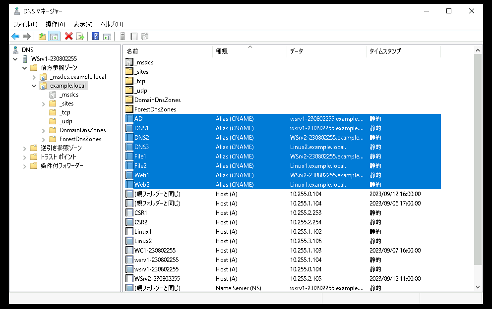</kbd>  

---  

## Windows Server 2でセカンダリDNSサーバーを構成する

1. Windows Server 1で、セカンダリDNSサーバー(Windows Server 2)へのゾーン転送を許可する  
    1. Windows Server 1(WinSrv1)の管理画面に接続する  
    1. [DNSマネージャー]を起動する  
    1. 左側コンソールツリーの[DNS]-[<サーバー名>]-[前方参照ゾーン]-[example.local]をクリックして選択する  
    1. [DNS]-[<サーバー名>]-[前方参照ゾーン]-[example.local]を右クリックし、コンテキストメニュー内の[プロパティ]をクリックする  
    1. [example.localのプロパティ]ウィンドウが表示されたことを確認する  
    1. [example.localのプロパティ]ウィンドウで、[ゾーンの転送]タブをクリックする  
    1. [example.localのプロパティ]ウィンドウの[ゾーンの転送]タブで、以下のパラメータを選択する
        
        配置操作を選択してください:  
        - [x] ゾーン転送を許可するサーバー:  
            - [x] すべてのサーバー    
            - [ ] ネーム サーバー タブの一覧にあるサーバーのみ      
            - [ ] 次のサーバーのみ
        
                <kbd>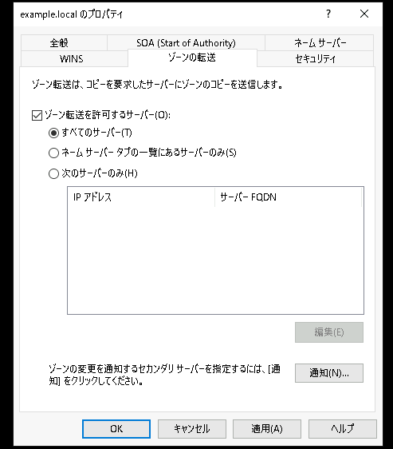</kbd> 
    1. [example.localのプロパティ]ウィンドウで、[OK]をクリックする  

1. Windows Server 2 を "example.local" のセカンダリDNSサーバーとして構成する  
    1. Windows Server 2(WinSrv2)の管理画面に接続する  
    1. [DNSマネージャー]を起動する 
    1. 左側コンソールツリーの[DNS]-[<サーバー名>]-[前方参照ゾーン]をクリックして選択する 
    1. [DNS]-[<サーバー名>]-[前方参照ゾーン]を右クリックし、コンテキストメニュー内の[新しいゾーン]をクリックする  
        <kbd>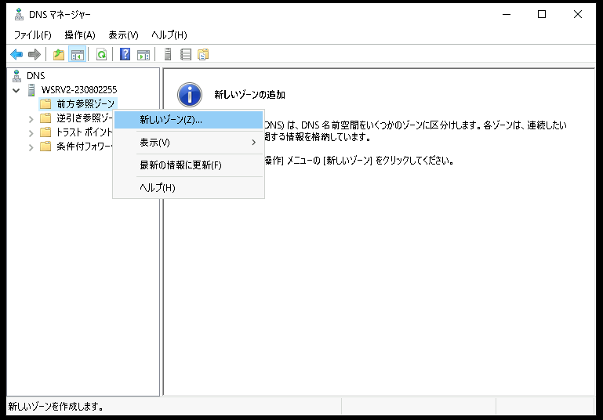</kbd> 
    1. [新しいゾーン ウィザード]ウィンドウが表示されたことを確認する  
        <kbd>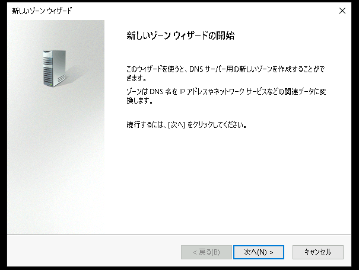</kbd> 
    1. [新しいゾーン ウィザードの開始]画面で、[次へ]をクリックする  
    1. [ゾーンの種類]画面で、以下のパラメータを選択する  
        作成するゾーンの種類を選択してください:  
            - [ ] プライマリ ゾーン  
            - [x] セカンダリ ゾーン  
            - [ ] スタブ ゾーン  
            - [ ] Active Directoryにゾーンを格納する  
        <kbd>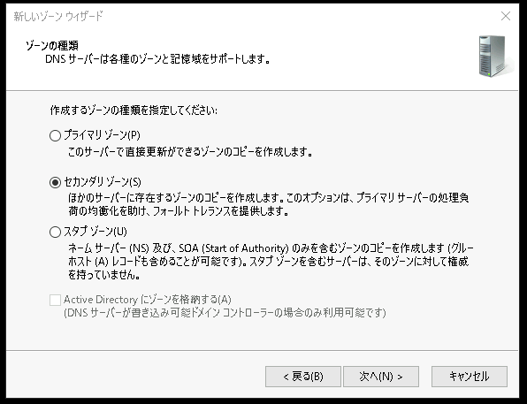</kbd> 

    1. [ゾーンの種類]画面で、[次へ]をクリックする  

    1. [ゾーン名]画面で、以下のパラメータを入力する  
        | 項目 | パラメータ |
        | :----- | :----- |
        | ゾーン名 | example.local |

        <kbd>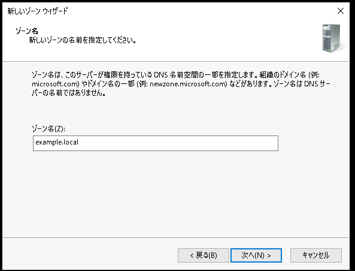</kbd> 
    1. [ゾーン名]画面で、[次へ]をクリックする  

    1. [マスターDNSサーバー]画面で、以下のパラメータを入力する  

        | 項目 | パラメータ |
        | :----- | :----- |
        | マスター サーバー| 10.X.255.104 |

        <kbd>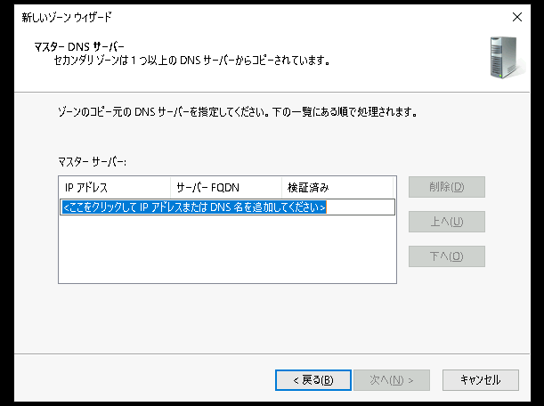</kbd> 
        <kbd>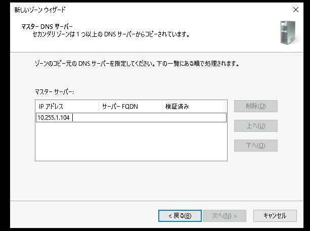</kbd> 
        <kbd>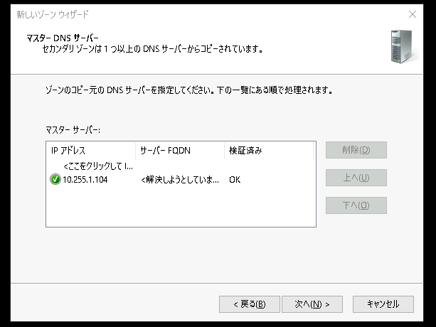</kbd> 

    1. [マスターDNSサーバー]画面で、[次へ]をクリックする  
    1. [新しいゾーン ウィザードの完了]画面で、[完了]をクリックする  
        <kbd>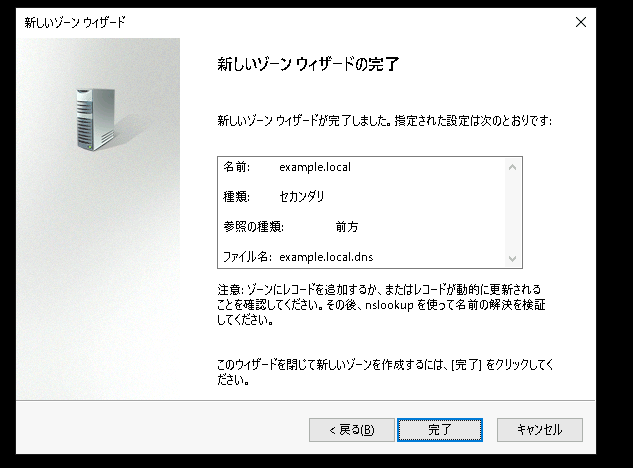</kbd> 

1. セカンダリDNSサーバーでゾーン転送の動作を確認する    
    1. Windows Server 2(WinSrv2)の管理画面に接続する  
    1. [DNSマネージャー]を起動する 
    1. 左側コンソールツリーの[DNS]-[<サーバー名>]-[前方参照ゾーン]-[example.local]をクリックして選択する  
    1. 右側ペインのDNSレコード一覧に、Windows Server 1(プライマリDNSサーバー)と同じ情報が表示されることを確認する       

        > 【補足】
        > もしもゾーン転送処理が完了していない場合は、 [example.local]を右クリックし、コンテキストメニュー内の[マスターから転送]をクリックします。  

        <kbd>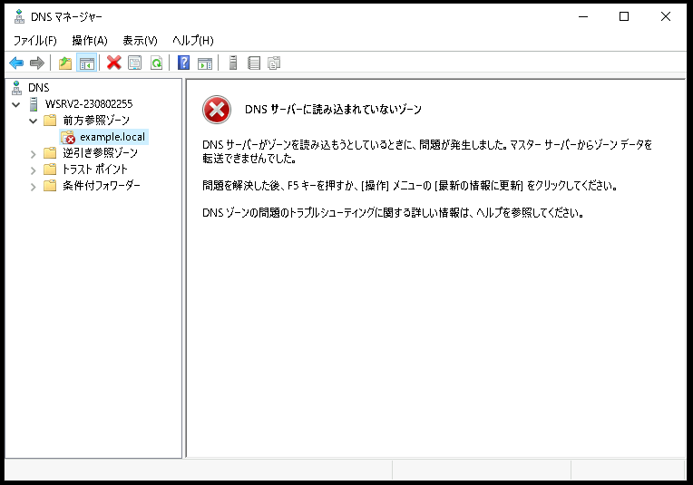</kbd>  
        <kbd>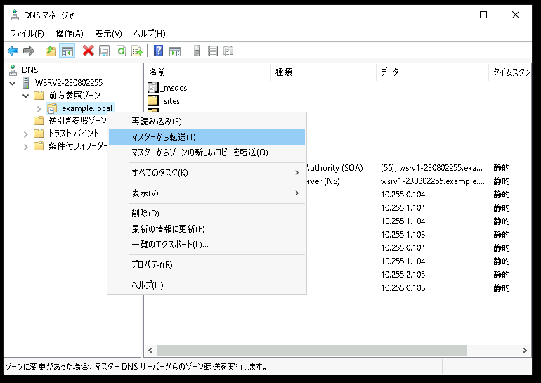</kbd>  

    1. セカンダリDNSサーバーでは、ゾーンに新しいレコードを作成できないことを確認する  
        > 【補足】
        > [example.local]を右クリックして表示されるコンテキストメニュー内に、レコードを作成する操作項目が表示されません。
        > セカンダリDNSサーバーは読み取り専用のゾーンデータベースを保有しているためです。  

---  

## Windows Server 1からWindows Server 2に"sub.example.local"ゾーンを委任する  

1. Windows Server 2に、"sub.example.local"ゾーンを構成する  
    1. Windows Server 2(WinSrv2)の管理画面に接続する  
    1. [DNSマネージャー]を起動する  
    1. 左側コンソールツリーの[DNS]-[<サーバー名>]-[前方参照ゾーン]をクリックして選択する    
    1. [DNS]-[<サーバー名>]-[前方参照ゾーン]を右クリックし、コンテキストメニュー内の[新しいゾーン]をクリックする  
        <kbd>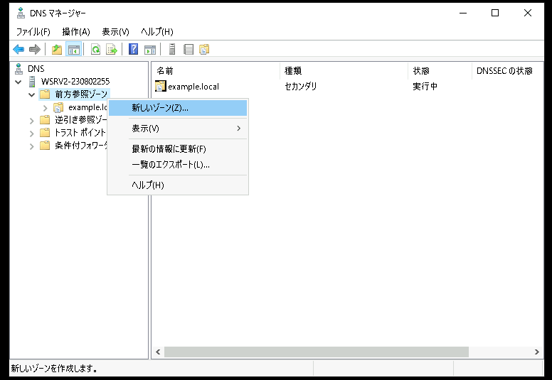</kbd>
    1. [新しいゾーン ウィザード]ウィンドウが表示されたことを確認する  
    1. [新しいゾーン ウィザードの開始]画面で、[次へ]をクリックする  
    1. [ゾーンの種類]画面で、以下のパラメータを選択する  
        
        作成するゾーンの種類を選択してください:  
            - [x] プライマリ ゾーン  
            - [ ] セカンダリ ゾーン  
            - [ ] スタブ ゾーン  
            - [ ] Active Directoryにゾーンを格納する  

        <kbd>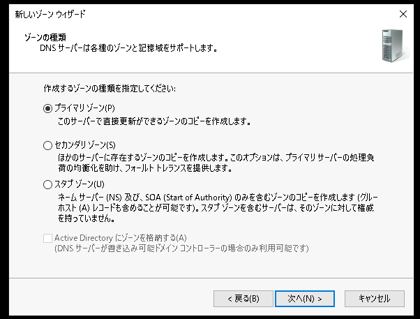</kbd> 

    1. [ゾーンの種類]画面で、[次へ]をクリックする  

    1. [ゾーン名]画面で、以下のパラメータを入力する  
        
        | 項目 | パラメータ |
        | :----- | :----- |
        | ゾーン名 | sub.example.local |

        <kbd>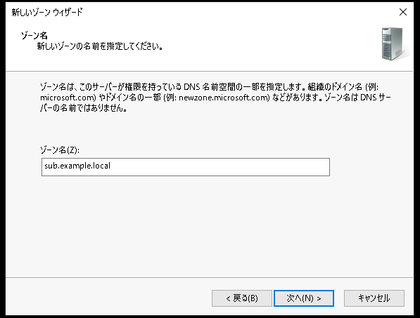</kbd> 

    1. [ゾーン名]画面で、[次へ]をクリックする  

    1. [ゾーン ファイル]画面で、[次へ]をクリックする  
        <kbd>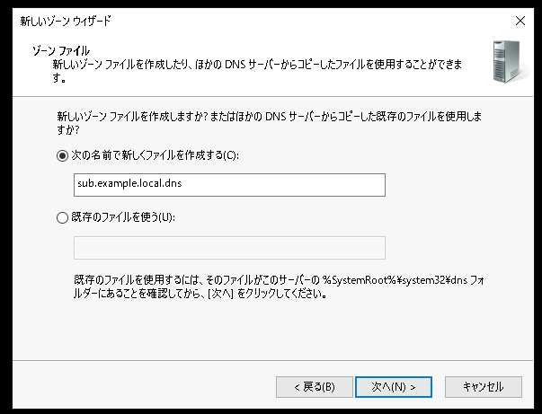</kbd>

    1. [動的更新]画面で、[次へ]をクリックする  
        <kbd>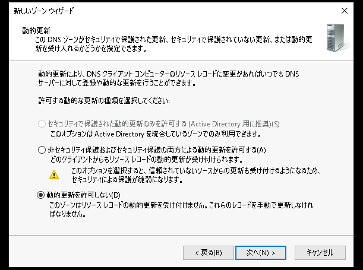</kbd>

    1. [新しいゾーン ウィザードの完了]画面で、[完了]をクリックする  
        <kbd>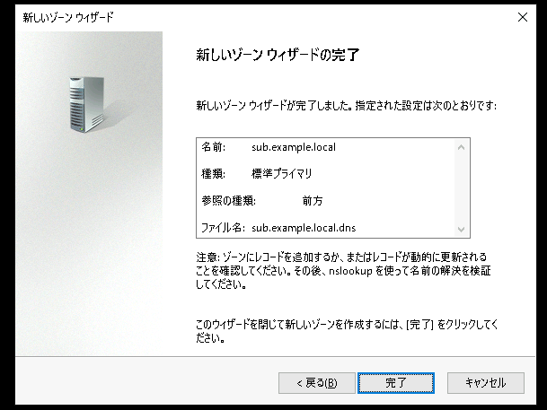</kbd> 

1. "sub.example.local"ゾーンにDNSレコードを登録する  
    1. Windows Server 2(WinSrv2)の管理画面に接続する  
    1. [DNSマネージャー]を起動する  
    1. [DNS]-[<サーバー名>]-[前方参照ゾーン]-[sub.example.local]を右クリックし、コンテキストメニュー内の[その他の新しいレコード]をクリックする  
    1. [リソース レコードの種類]ウィンドウが表示されたことを確認する  
    1. "リソースレコードの種類:"として、[Alias(CNAME)]をクリックして選択する  
    1. [リソース レコードの種類]ウィンドウで、[レコードの作成]をクリックする  
    1. [新しいリソース レコード]ウィンドウが表示され、[Alias(CNAME)]タブが表示されていることを確認する  
    1. [新しいリソース レコード]ウィンドウで、以下のパラメータを入力する  

        新規CNAMEレコード 一覧:
        | エイリアス名 | 完全修飾ドメイン名 | ターゲット ホスト用の完全修飾ドメイン名  |
        | :----- | :----- | :----- |
        | Proxy | Proxy.sub.example.local | Linux1.example.local |

        - [ ] 同じ名前のDNSレコードすべての更新を認証されたユーザーに許可する

    1. [新しいリソース レコード]ウィンドウで、[OK]をクリックする  

    1. [sub.example.local]ゾーンにCNAMEレコードが作成されていることを確認する  
        <kbd>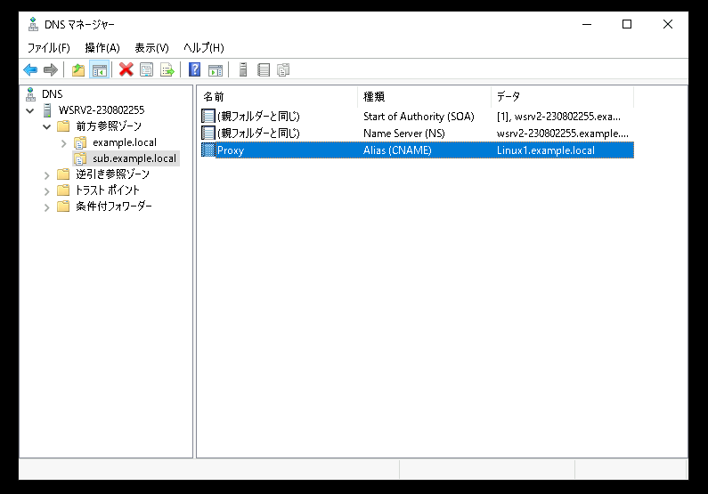</kbd>

1. Windows Server 1で、サブドメインの委任を作成する    
    1. Windows Server 1(WinSrv1)の管理画面に接続する  
    1. [DNSマネージャー]を起動する  
    1. 左側コンソールツリーの[DNS]-[<サーバー名>]-[前方参照ゾーン]-[example.local]をクリックして選択する  
    1. [DNS]-[<サーバー名>]-[前方参照ゾーン]-[example.local]を右クリックし、コンテキストメニュー内の[新しい委任]をクリックする  
        <kbd>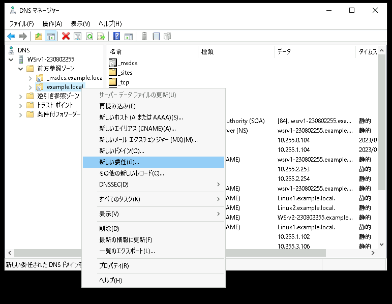</kbd>  
    1. [新しい委任]ウィンドウが表示されたことを確認する  
        <kbd>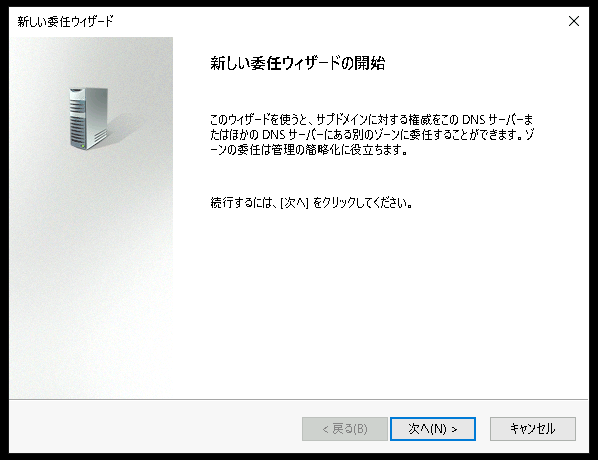</kbd>  
    1. [新しい委任ウィザードの開始]画面で、[次へ]をクリックする  
    1. [委任されたドメイン名]画面で、以下のパラメータを入力する  

        | 項目 | パラメータ |
        | :----- | :----- |
        | 委任されたドメイン | sub |
        | 完全修飾ドメイン名(FQDN)| sub.example.local |

        <kbd>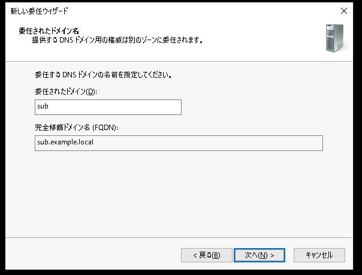</kbd>  

    1. [委任されたドメイン名]画面で、[次へ]をクリックする  
    1. [ネームサーバー]画面で、[追加]をクリックする  
        <kbd>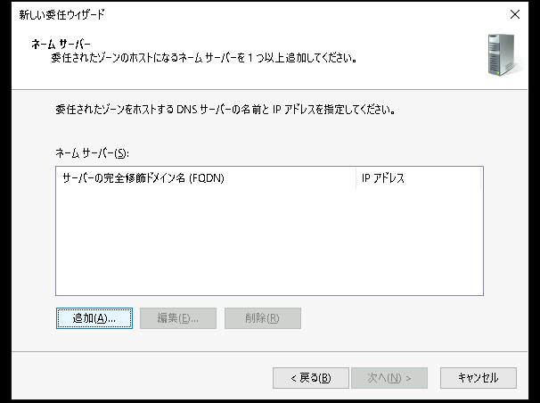</kbd>  

    1. [新規ネーム サーバー レコード]ウィンドウが表示されたことを確認する  
        <kbd>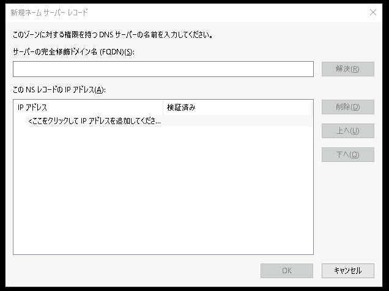</kbd>  

    1. [新規ネーム サーバー レコード]ウィンドウの "サーバーの完全修飾ドメイン名(FQDN)" の項目で、"DNS2.example.local (Windows Server 2)"と入力する  

        | 項目 | パラメータ |
        | :----- | :----- |
        | サーバーの完全修飾ドメイン名(FQDN) | DNS2.example.local |

        <kbd>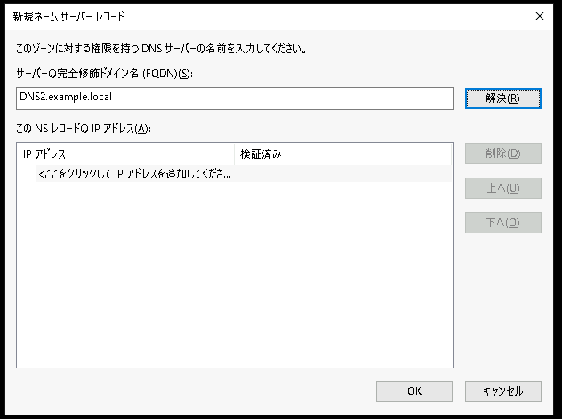</kbd>  

    1. [解決]をクリックし、DNSサーバーの検証が "OK" になることを確認する  
        <kbd>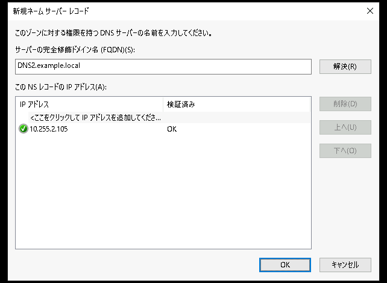</kbd>  

    1. [新規ネーム サーバー レコード]ウィンドウで、[OK]をクリックする  

    1. [ネームサーバー]画面で、[次へ]をクリックする  
        <kbd>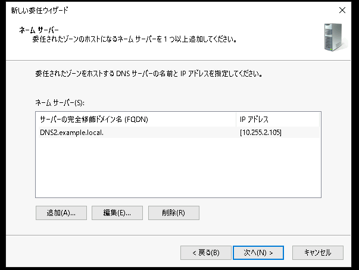</kbd>  

    1. [新しい委任ウィザードの完了]画面で、[完了]をクリックする  
        <kbd>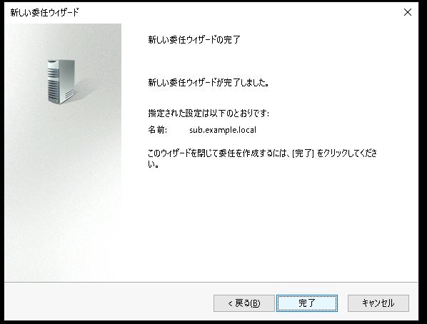</kbd>  

1. 
1. Windows Server 1で委譲する
1. Windows Server 1で、セカンダリDNSサーバー(Windows Server 2)へのゾーン転送を許可する  

1. Windows Server 2でゾーンをつくる （できるか？）

--- 

## 名前解決の動作を確認する  

1. nslookupで名前解決を問い合わせる  
1. セカンダリにも問い合わせる  
 

# レコード変更とキャッシュ削除
CSRのレコード変更でいいかな

---  

## 演習完了  
ここまでの手順で、以下の項目を学習できました。  
- [x] Windows DNSサーバーにDNSレコードを登録する  
- [x] セカンダリDNSサーバーを構成する  

