# Linux Serverでファイルサーバーを構築する
---

## シナリオ
この演習では、Linux Serverでファイルサーバーを構築する手順を学習します。   


"/share" フォルダを作成し、クライアントからアクセス可能な共有フォルダとしてネットワークに公開します。  
ファイルサービスを提供するソフトウェアとしては、Samba(samba.x86_64 0:4.10.16-24.el7_9)を使用します。  

共有フォルダにアクセスするユーザーアカウントとして"Tom"と"Jerry"を作成し、Sambaユーザーデータベースに登録することで、WindowsクライアントからLinuxのファイルサーバーにアクセスできます。

ファイルサーバーの動作確認として、Clientから共有フォルダにアクセスしてファイルの読み書きをテストします。  


## 演習の意図
    演習ガイドを参照して演習の意図をあらかじめ確認してください


## 演習における役割と、環境のパラメータ
- X: ご自身のPod番号
- Linuxファイルサーバー役: Linux1  
- クライアント デスクトップ環境: WinClient(WC1-yyMMddX)


## 注意
- 手順例の画像は<B>pod255</B>に準拠したパラメータのものです
- 手順内の<B>X</B>表記はご自身のpod番号に読み替えてください

---

## SELinuxを無効化する
1. SELinuxの状態を確認する
    ＞ ***sestatus***  
    

    > 【確認ポイント】
    > 'Current Mode:'が'enforcing'であることを確認する  
    > 'Mode from config file:'が'enforcing'であることを確認する  
    > 


1. SELinuxをOS起動時に無効にする  
    ＞ ***sudo cp /etc/selinux/config /etc/selinux/config_bak***   
    ＞ ***sudo vi /etc/selinux/config***  
    ＞ ***diff /etc/selinux/config /etc/selinux/config_bak***   

    ```
    [admin@linux1 ~]$ diff /etc/selinux/config /etc/selinux/config_bak
    7c7
    < SELINUX=disabled
    ---
    > SELINUX=enforcing
    [admin@linux1 ~]$   
    ```

1. SELinuxを一時的に無効にする   
    ＞ ***sudo setenforce 0***   

1. SELinuxの状態を確認する  
    ＞ ***sestatus***  

    > 【確認ポイント】
    > 'Current Mode:'が'permissive'であることを確認する  
    > 'Mode from config file:'が'disabled'であることを確認する  


## Sambaをインストールする  

1. Sambaをインストールする
    ＞ ***sudo  yum  -y  install  samba.x86_64  0:4.10.16-24.el7_9***  

1. インストールされたパッケージを確認する
    ＞ ***yum list installed | grep samba***  

    > 【確認ポイント】
    > 'samba.x86_64' が '4.10.16-24.el7_9' であることを確認する

1. Samba(smb)サービスのStatusを確認する
    ＞ ***systemctl status smb***  

    > 【確認ポイント】
    > 'Active:' が 'inactive (dead)'であることを確認する
    - [x] Samba(smb)が、サービスとして認識されていること
    - [x] Samba(smb)サービスが、まだ起動していないこと

## 共有フォルダ(/share)を作成する

1. ルート直下にshareフォルダを作成する
    ＞ ***sudo mkdir /share***  

1. '/share'のパーミッションを変更する

    1. 変更前の '/share' のパーミッションを確認する
        ＞ ***ls -al /***  
    > 【確認ポイント】
    > '/share' のパーミッション 'drwxr-xr-x' であることを確認する   
    - [x] 一般ユーザ(Others)が書き込み権限(w)を持っていないこと  


    1. '/share' のパーミッションを変更し、Userに書き込み権限を与える
        ＞ ***sudo chmod o+w /share***  

    1. 変更後の '/share' のパーミッションを確認する
        ＞ ***ls -al /***  
    > 【確認ポイント】
    > '/share' のパーミッション 'drwxr-xrwx' であることを確認する   
    - [x] 一般ユーザ(Others)が書き込み権限(w)を有すること  


## ユーザー(TomとJerry)を作成する

1. 'Tom'を作成する
    ＞ ***sudo useradd Tom***  
    ＞ ***sudo passwd Tom***  
    ＞ Changing password for user Tom.  
    ＞ New password: ***＜パスワード 'Pa$$w0rd' を入力する＞***  
    ＞ BAD PASSWORD: The password is shorter than 9 characters   
    ＞ Retype new password: ***＜パスワード 'Pa$$w0rd' を入力する＞***  
    ＞ passwd: all authentication tokens updated successfully.   

    > 【補足】
    > 'BAD PASSWORD'の警告は無視してください。

1. 作成した'Tom'でログインできることを確認する
    ＞ ***su - Tom***  
    ＞ Password: ***＜パスワード 'Pa$$w0rd' を入力する＞*** 
    ＞ ***whoami***  
    ＞ exit

    > 【補足】
    > [admin@linux1 ~]$ su - Tom  
    > Password:   
    > Last login: Thu Aug 17 07:23:06 UTC 2023 on pts/0  
    > [Tom@linux1 ~]$ whoami  
    > Tom  
    > [Tom@linux1 ~]$ exit  
    > logout  
    > [admin@linux1 ~]$   


## Sambaをインストールする  

sudo cp /etc/samba/smb.conf /etc/samba/smb_bak.conf
sudo vim /etc/samba/smb.conf

[admin@linux1 ~]$ diff /etc/samba/smb.conf /etc/samba/smb_bak.conf


---

## 1. Windowsファイルサーバー構築の準備
この演習では、Windows Server2(WinSrv2)をWindowsファイルサーバーとして構築します。  

1. Windowsファイルサーバー(WinSrv2)の管理画面に接続する  
1. [スタートメニュー]を右クリックし、コンテキストメニュー内の[Windows PowerShell(管理者)]をクリックする  
1. [ユーザー アカウント制御]のポップアップで[はい]をクリックする  
1. Windows PowerShellのウィンドウが表示されたことを確認する  
1. 以下のコマンドを実行し、Windowsファイルサーバー役のコンピュータ(WinSrv2)に接続していることを確認する  
    ＞ ***hostname***  
    
    > 【補足】  
    > Windowsファイルサーバー役のコンピュータであるWinSrv2には、"WSrv2-yyMMddX(年月日とPod番号)"形式のホスト名が設定されています。  

---

## 2. Windowsローカルユーザーアカウントの管理  
1. ローカルユーザー管理コンソールを起動する  
    1. [スタートメニュー]をクリックする  
    1. スタートメニュー内の[サーバー マネージャー]をクリックし、サーバーマネージャを起動する  
    1. サーバーマネージャーウィンドウ右上の[ツール]をクリックする  
    1. メニュー内の[コンピュータの管理]をクリックし、管理コンソールを起動する  
        <kbd>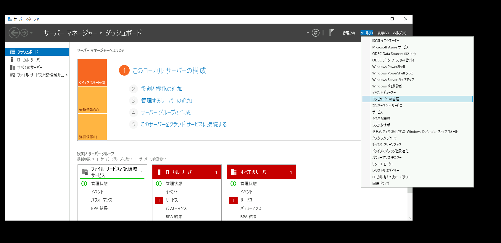</kbd>

1. ローカルユーザー(TomとJerry)を作成する  
    1. 左側コンソールツリーの[コンピュータの管理]-[システムツール]-[ローカル ユーザーとグループ]-[ユーザー]をクリックする  
    1. 左側コンソールツリーの[ユーザー]を右クリックし、コンテキストメニューの[新しいユーザー]をクリックする  
        <kbd>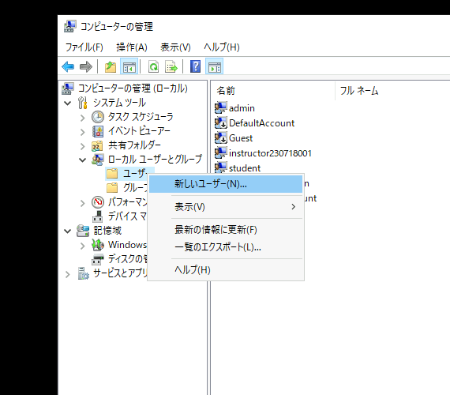</kbd>  
    1. [新しいユーザー]ウィンドウが表示されたことを確認する  
    1. 以下のパラメータを入力する

        | 項目 | パラメータ |
        | :----- | :----- |
        | ユーザー名 | Tom |
        | フル ネーム | <空欄> |
        | 説明 | <空欄> |  
        | パスワード | Pa$$w0rd |
        | パスワードの確認入力 | Pa$$w0rd |  

        - [ ] ユーザーは次回ログオン時にパスワードの変更が必要
        - [ ] ユーザーはパスワードの変更ができない
        - [x] パスワードを無期限にする
        - [ ] アカウントを無効にする
        <kbd>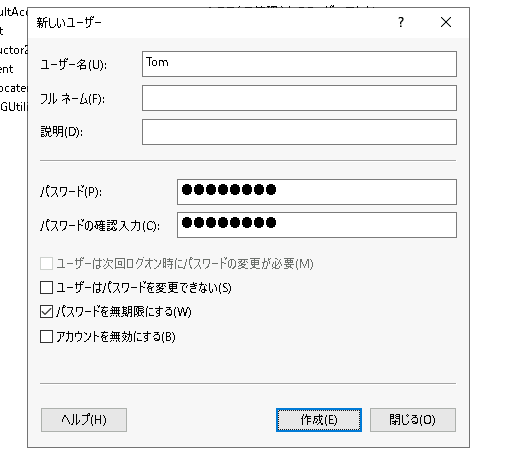</kbd> 
    1. 前項のパラメータを入力した後、[作成]ボタンをクリックする
    1. [閉じる]ボタンをクリックする
    1. 中央ペインのユーザーの一覧を参照し、"Tom" が作成されていることを確認する
        <kbd>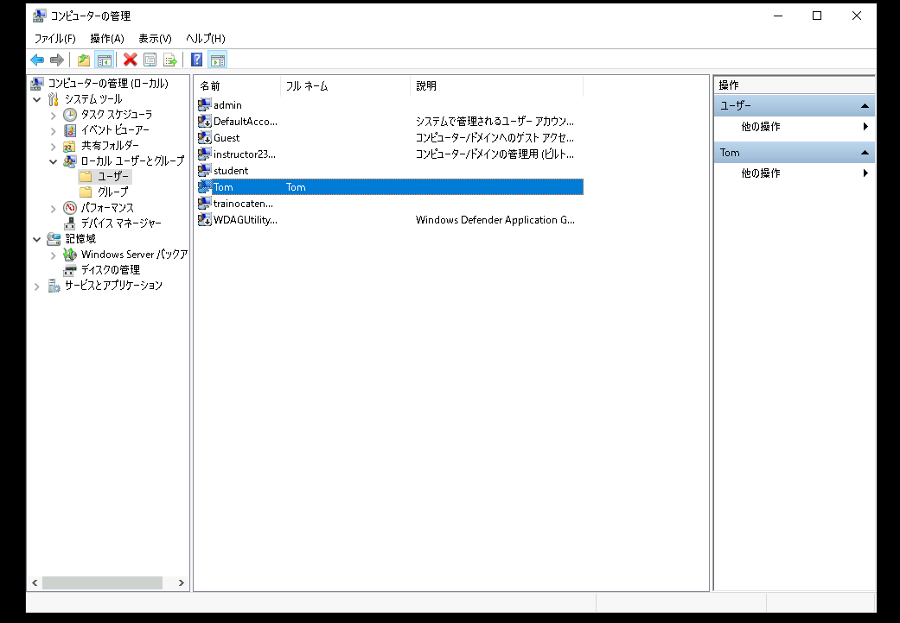</kbd> 

    1. 左側コンソールツリーの[ユーザー]を右クリックし、コンテキストメニューの[新しいユーザー]をクリックする  
    1. [新しいユーザー]ウィンドウが表示されたことを確認する  
    1. 以下のパラメータを入力する

        | 項目 | パラメータ |
        | :----- | :----- |
        | ユーザー名 | Jerry |
        | フル ネーム | <空欄> |
        | 説明 | <空欄> |  
        | パスワード | Pa$$w0rd |
        | パスワードの確認入力 | Pa$$w0rd |  

        - [ ] ユーザーは次回ログオン時にパスワードの変更が必要
        - [ ] ユーザーはパスワードの変更ができない
        - [x] パスワードを無期限にする
        - [ ] アカウントを無効にする
        <kbd>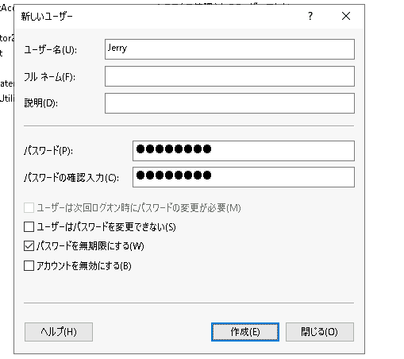</kbd> 
    1. 前項のパラメータを入力した後、[作成]ボタンをクリックする
    1. [閉じる]ボタンをクリックする
    1. 中央ペインのユーザーの一覧を参照し、"Jerry" が作成されていることを確認する
        <kbd>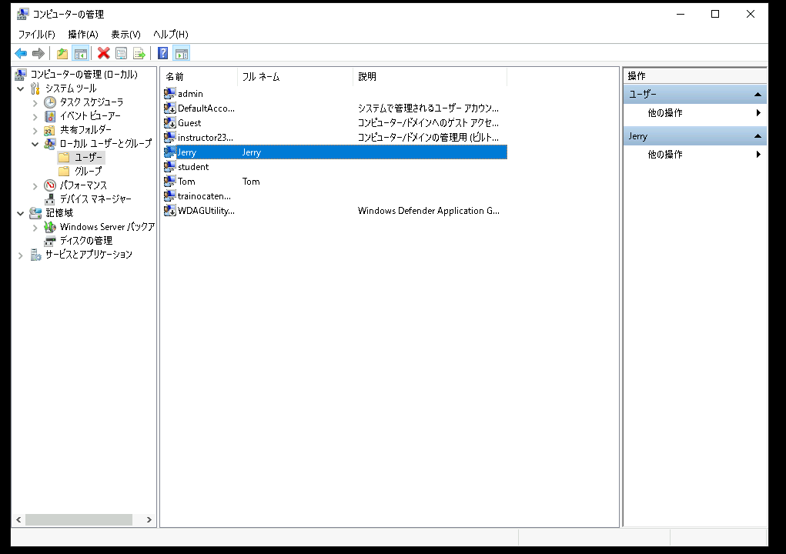</kbd> 


1. ローカルグループ(File Server Users)を作成する  
    1. 左側コンソールツリーの[コンピュータの管理]-[システムツール]-[ローカル ユーザーとグループ]-[グループ]をクリックする  
    1. 左側コンソールツリーの[グループ]を右クリックし、コンテキストメニューの[新しいグループ]をクリックする  
        <kbd>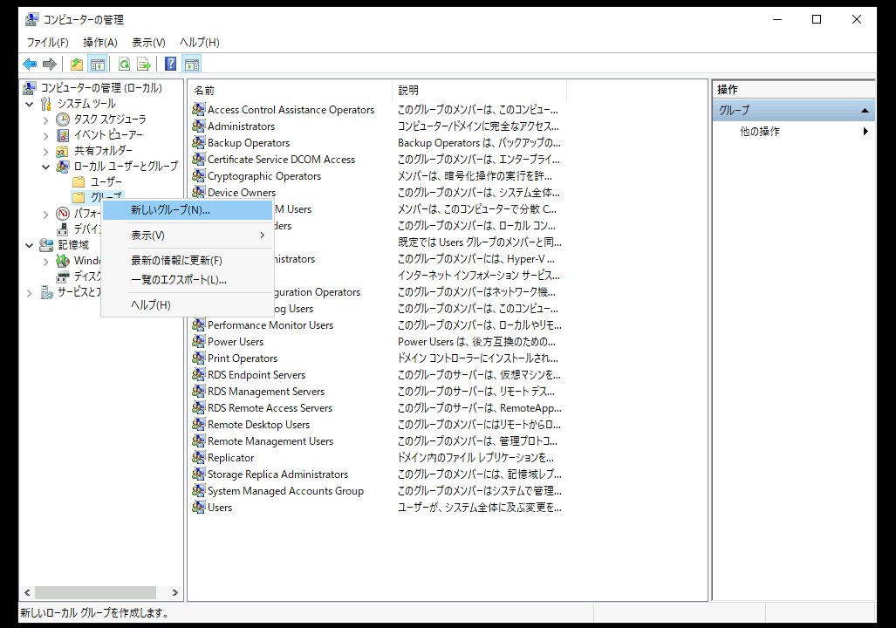</kbd> 
    1. [新しいグループ]ウィンドウが表示されたことを確認する  
        <kbd>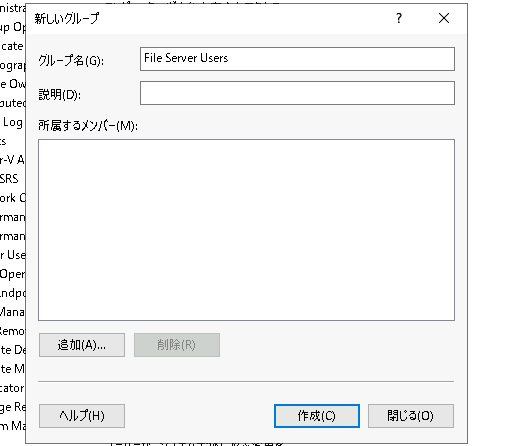</kbd> 
    1. 以下のパラメータを入力する  

        | 項目 | パラメータ |
        | :----- | :----- |
        | グループ名 | File Server Users |
        | 所属するメンバー | <空欄> |

    1. 前項のパラメータを入力した後、[作成]ボタンをクリックする  
    1. [閉じる]ボタンをクリックする  
    1. 中央ペインのグループの一覧を参照し、"File Server Users" が作成されていることを確認する  
        <kbd>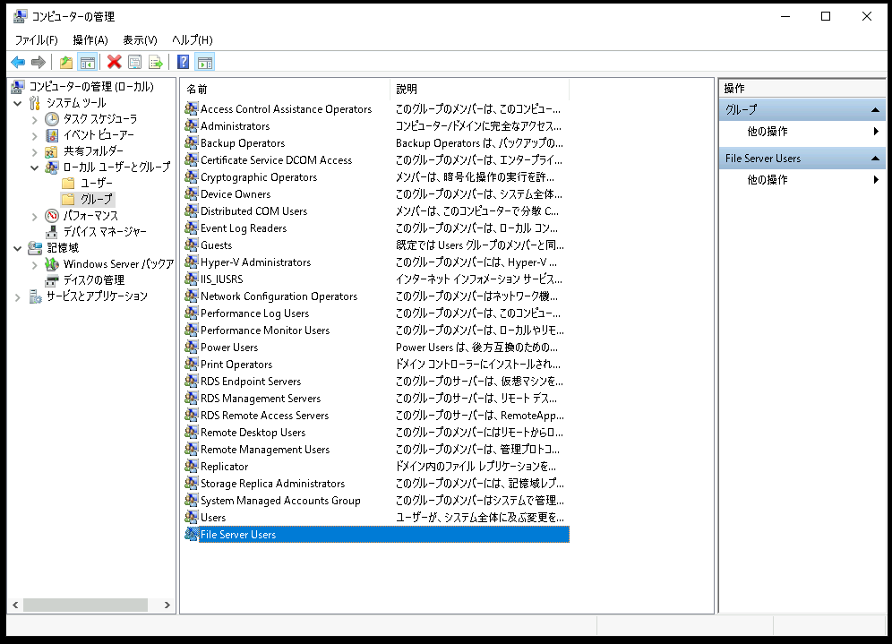</kbd> 

1. ローカルグループ(File Server Users)にユーザー(Jerry)を所属させる  
    1. 中央ペインのグループの一覧を参照し、[File Server Users]をクリックする  
    1. [File Server Users]を右クリックし、コンテキストメニューの[プロパティ]をクリックする  
        <kbd>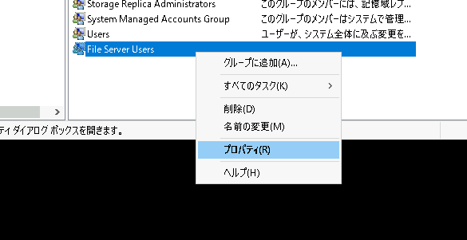</kbd> 
    1. 所属するメンバー欄の下の[追加]をクリックする  
        <kbd>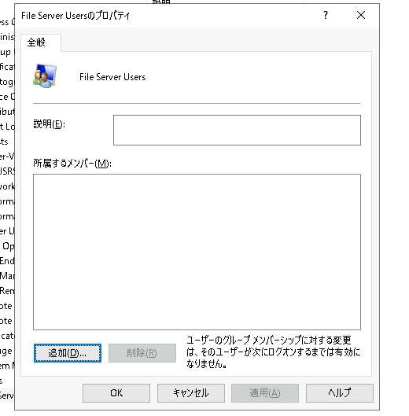</kbd> 
    1. [ユーザーの選択]ウィンドウが表示されたことを確認する  
        <kbd>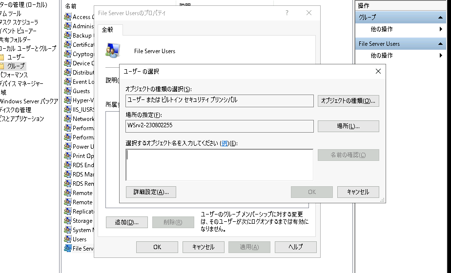</kbd> 
    1. "選択するオブジェクト名を入力してください" の欄に "Jerry" と入力する  
        <kbd>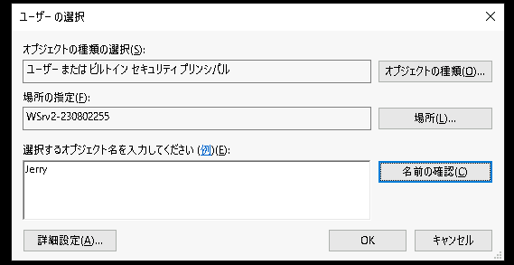</kbd> 
    1. [名前の確認]をクリックする  
    1. "<コンピュータ名>￥Jerry" の表記に下線がついたことを確認する  
        <kbd>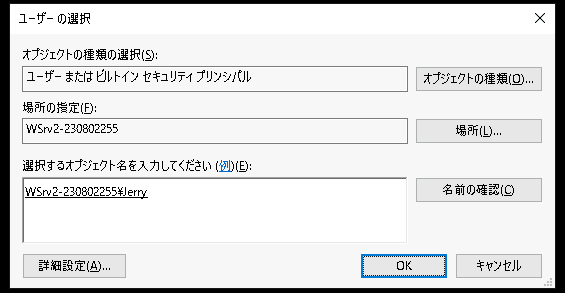</kbd> 
    1. [OK]をクリックする  
    1. [新しいグループ]ウィンドウの "所属するメンバー" に "Jerry" が表示されていることを確認する
        <kbd>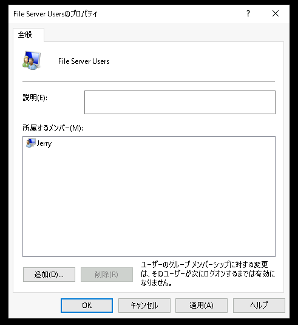</kbd> 
    1. [OK]をクリックする  

1. ローカルグループ(File Server Users)にユーザー(Tom)を所属させる  
    1. 中央ペインのグループの一覧を参照し、[File Server Users]をクリックする  
    1. [File Server Users]を右クリックし、コンテキストメニューの[プロパティ]をクリックする  
    1. 所属するメンバー欄の下の[追加]をクリックする  
    1. [ユーザーの選択]ウィンドウが表示されたことを確認する  
    1. "選択するオブジェクト名を入力してください" の欄に "Tom" と入力する  
    1. [名前の確認]をクリックする  
    1. "<コンピュータ名>￥Tom" の表記に下線がついたことを確認する  
    1. [OK]をクリックする  
    1. [新しいグループ]ウィンドウの "所属するメンバー" に "Tom" が表示されていることを確認する
    1. [OK]をクリックする  


---

## 3. フォルダ(C:\Share)を共有する  
この手順では、ファイルサーバーのデータを保存するフォルダ(C:\Share)を作成し、共有フォルダとしてネットワークに公開します。  

1. C:\Shareフォルダを作成する   
    1. ファイル エクスプローラーを起動する   
    1. Cドライブ直下にアクセスする  
    1. 右クリック コンテキストメニューの[新規作成]-[フォルダー]をクリックする
        <kbd>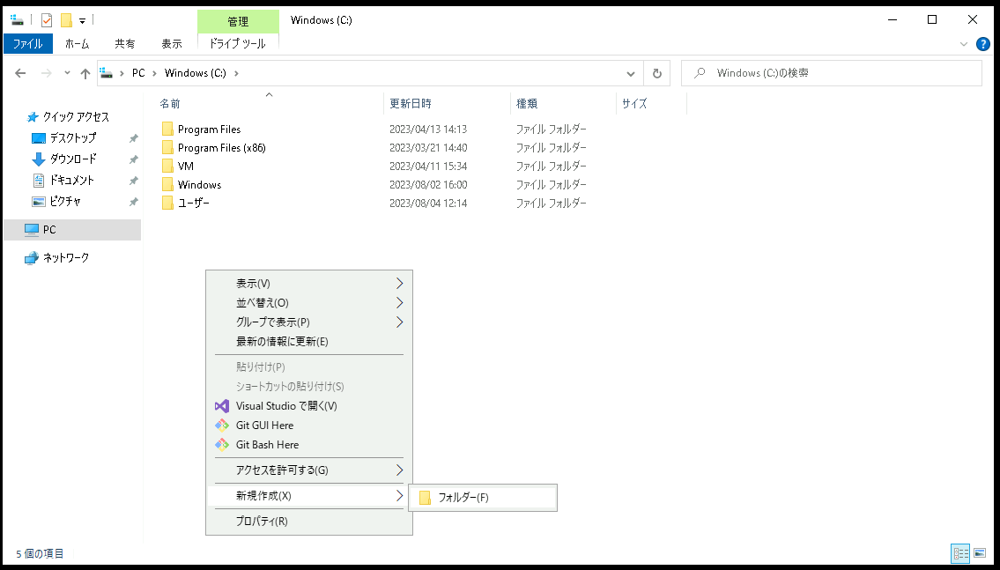</kbd> 
    1. 作成された新しいフォルダの名前を "Share" に変更する  
        <kbd>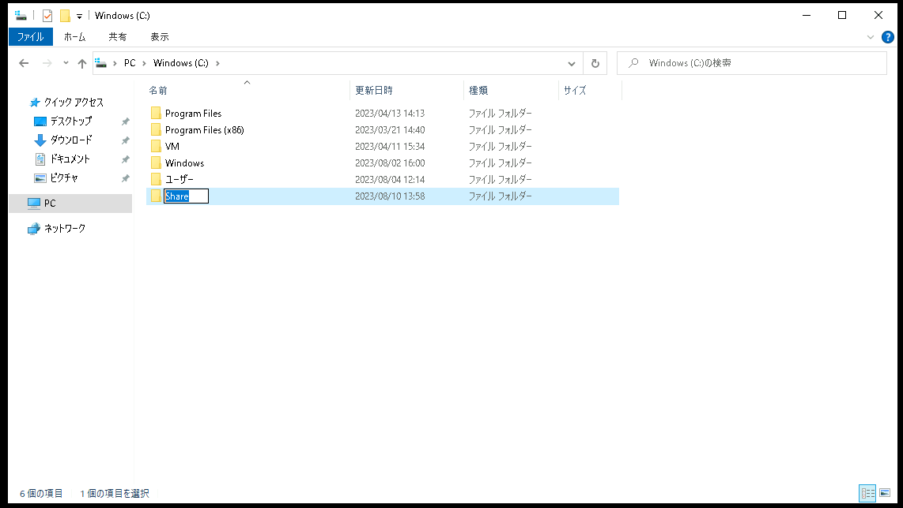</kbd> 

1. フォルダをネットワークに公開し、共有アクセス許可を設定する
    1. [Share]フォルダをクリックし、右クリック コンテキストメニューの[プロパティ]をクリックする
    1. [プロパティ]ウィンドウの[共有]タブをクリックする
    1. [詳細な共有] をクリックする
        <kbd>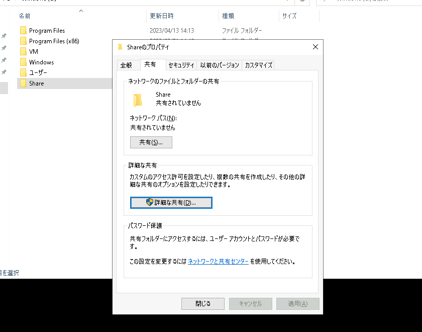</kbd> 
    1. 以下のパラメータを入力する

        - [x] このフォルダーを共有する

        | 項目 | パラメータ |
        | :----- | :----- |
        | 共有名 | Share |
        | 同時共有できるユーザー数 | 1677721 |
        | コメント| <空欄> |
    
        <kbd>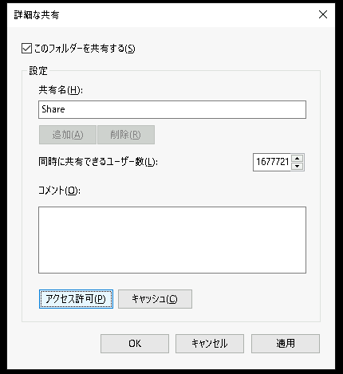</kbd> 

    1. [アクセス許可] をクリックする  
    1. [Shareのアクセス許可]ウィンドウが表示されたのを確認する  
        <kbd>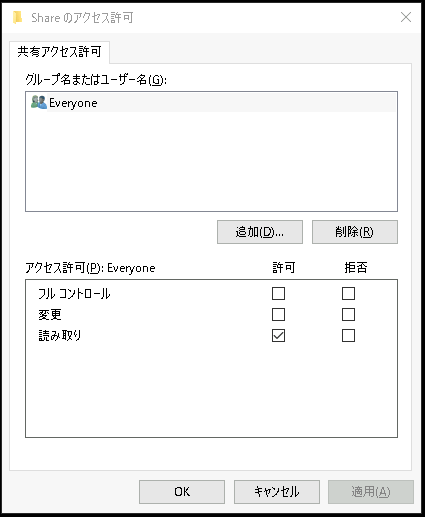</kbd> 
    1. [Everyone]をクリックして選択し、[フルコントロール]の "許可" にチェックをつける  
        <kbd>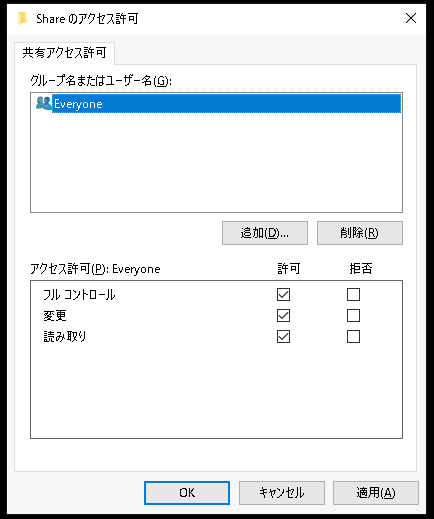</kbd> 
    1. [Shareのアクセス許可]ウィンドウで、[OK]をクリックする  
    1. [詳細な共有]ウィンドウで、[OK]をクリックする  
        <kbd>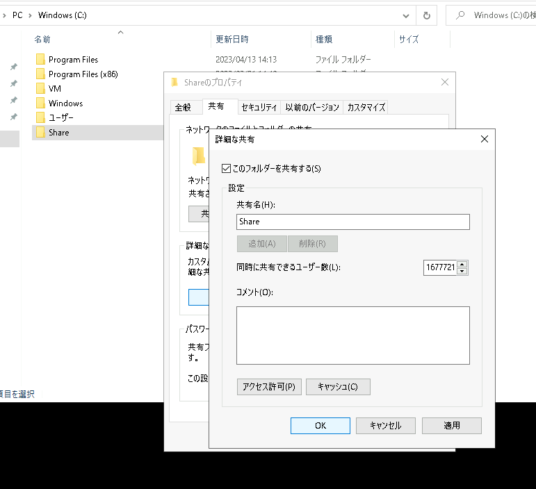</kbd> 
    1. [プロパティ]ウィンドウで、[閉じる]をクリックする  
        <kbd>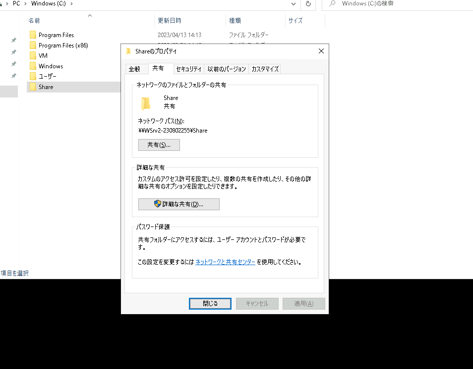</kbd>

1. 共有フォルダのステータスを確認する  
    1. PowerShellを起動する  
    1. 以下のコマンドを実行し、C:¥Shareフォルダが "Share" という共有名でネットワークに公開されていることを確認する  
        ＞ ***net share***  
    
        <kbd>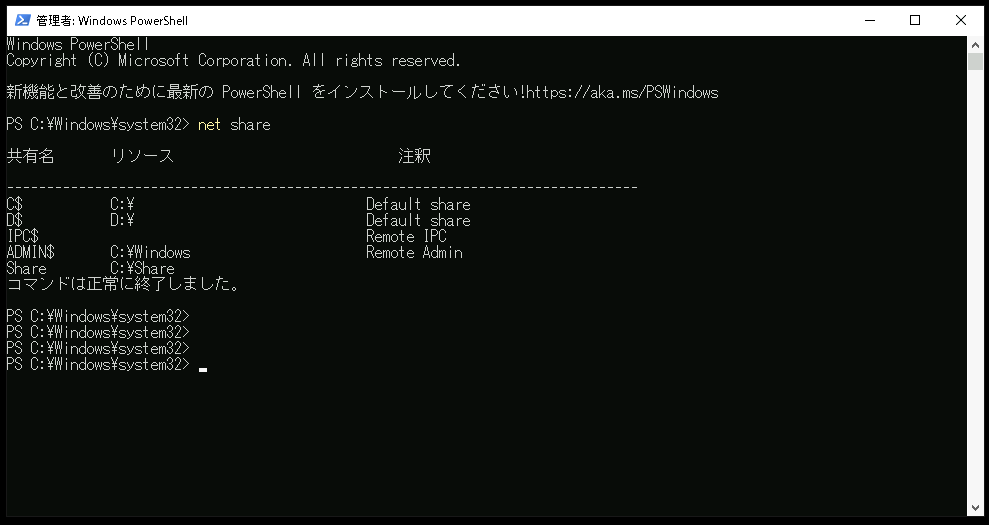</kbd>


---

## 4. NTFSアクセス許可を設定する  

1. C:\Shareフォルダの[セキュリティ]タブを開く   
    1. [Share]フォルダをクリックし、右クリック コンテキストメニューの[プロパティ]をクリックする  
    1. [プロパティ]ウィンドウの[セキュリティ]タブをクリックする  
        <kbd>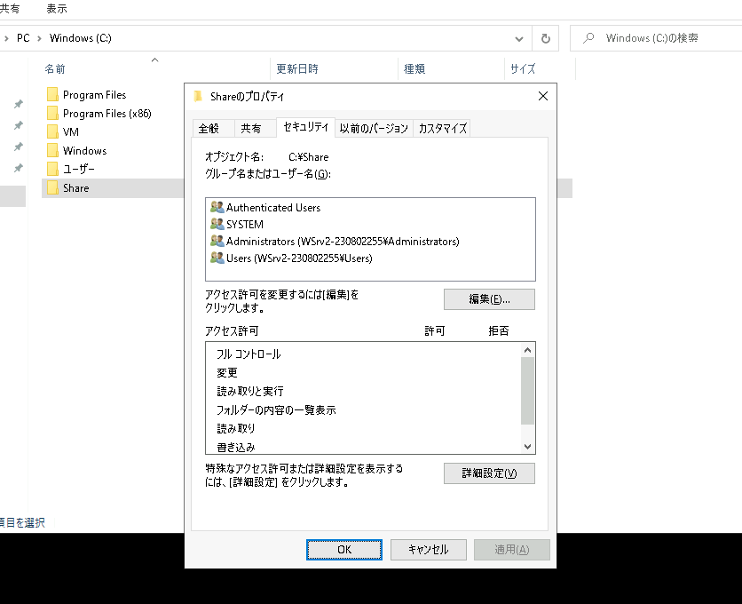</kbd>

1. "File Server Users"グループに読み書きの許可を与える  
    1. [編集]をクリックする  
    1. [Shareのアクセス許可]ウィンドウが表示されたことを確認する  
        <kbd>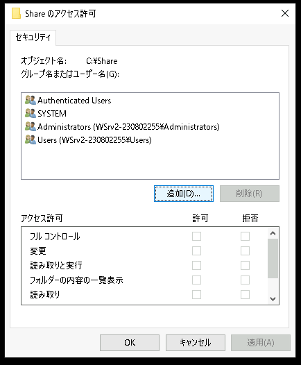</kbd>  
    1. [追加]をクリックする  
    1. [ユーザーまたはグループの選択]ウィンドウが表示されたことを確認する  
        <kbd>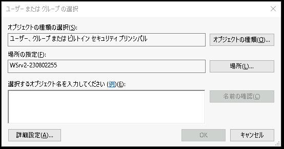</kbd>
    1. "選択するオブジェクト名を入力してください" の欄に "File Server Users" と入力する  
    1. [名前の確認]をクリックする  
    1. "<コンピュータ名>￥File Server Users" の表記に下線がついたことを確認する  
        <kbd>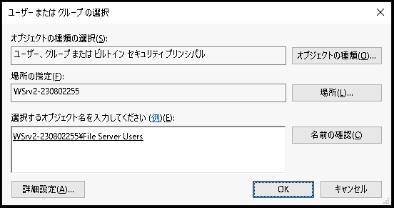</kbd> 
    1. [OK]をクリックする  
    1. [Shareのアクセス許可]ウィンドウで、"File Server Users"が追加されていることを確認する  
    1. [File Server Users]をクリックして選択する  
        <kbd>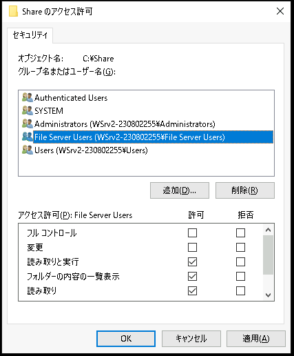</kbd> 
    1. [Shareのアクセス許可]ウィンドウ下部の "アクセス許可" を参照し、"変更" の "許可" にチェックをつける  
        <kbd>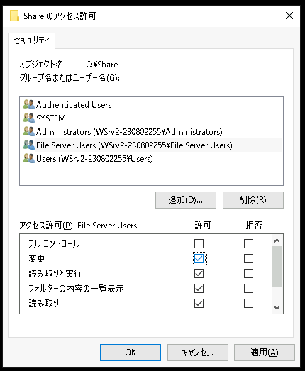</kbd> 
    1. [Shareのアクセス許可]ウィンドウで、[OK]をクリックする  
    1. [プロパティ]ウィンドウで、"File Server Users"が追加されていることを確認する  
        <kbd>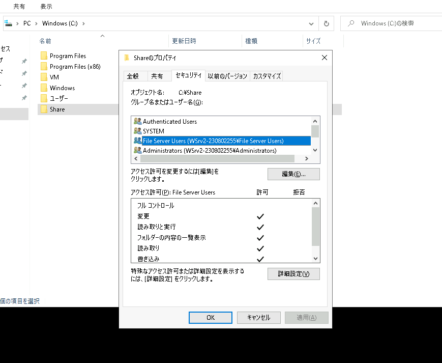</kbd> 

1. ユーザー "Tom" の書き込みを禁止する  
    1. [プロパティ]ウィンドウの[セキュリティ]タブで、[編集]をクリックする  
    1. [Shareのアクセス許可]ウィンドウが表示されたことを確認する  
    1. [追加]をクリックする  
    1. [ユーザーまたはグループの選択]ウィンドウが表示されたことを確認する  
    1. "選択するオブジェクト名を入力してください" の欄に "Tom" と入力する  
    1. [名前の確認]をクリックする  
    1. "<コンピュータ名>￥Tom" の表記に下線がついたことを確認する  
    1. [OK]をクリックする  
    1. [Shareのアクセス許可]ウィンドウで、"Tom" が追加されていることを確認する  
    1. [Tom]をクリックして選択する  
    1. [Shareのアクセス許可]ウィンドウ下部の "アクセス許可" を参照し、"書き込み" の "禁止" にチェックをつける  
        <kbd>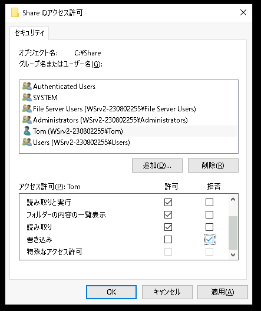</kbd> 
    1. [Shareのアクセス許可]ウィンドウで、[OK]をクリックする  
    1. 警告の[Windowsセキュリティ]ウィンドウで、[はい]をクリックする  
        <kbd>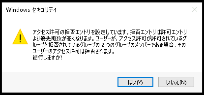</kbd>   
    1. [プロパティ]ウィンドウで、"Tom"が追加されていることを確認する  
        <kbd>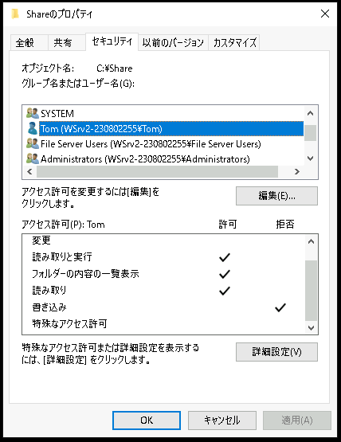</kbd>   
    1. [プロパティ]ウィンドウで、[OK]をクリックする   

---

## 5. Windowsファイルサーバーの動作を確認する


この演習では、WinClient(WC1)をクライアント デスクトップ環境と想定して、ファイルサーバーの動作確認に使用します。  
ファイルサーバーとクライアントデスクトップはワークグループ環境であるため、クライアントからファイルサーバーにアクセスするためには、それぞれのコンピュータに同じユーザー アカウントを作成する必要があります。  

1. Windows Clientに"admin"で接続する  
    1. Windows Client(WinClient)の管理画面に "admin" で接続する 
        <kbd>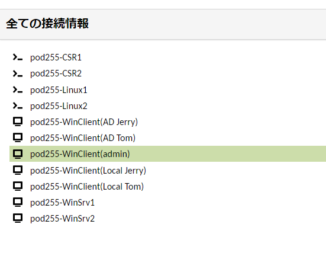</kbd>   
    1. [スタートメニュー]を右クリックし、コンテキストメニュー内の[Windows PowerShell(管理者)]をクリックする  
    1. [ユーザー アカウント制御]のポップアップで[はい]をクリックする  
    1. Windows PowerShellのウィンドウが表示されたことを確認する  
    1. 以下のコマンドを実行し、クライアント デスクトップ環境役のコンピュータ(WC1)に "admin" で接続していることを確認する  
        ＞ ***hostname***  
        ＞ ***whoami***         
        > 【補足】  
        > クライアント デスクトップ環境役のコンピュータであるWinClientは、"WC1-yyMMddX(年月日とPod番号)"形式のホスト名が設定されています。  
        <kbd>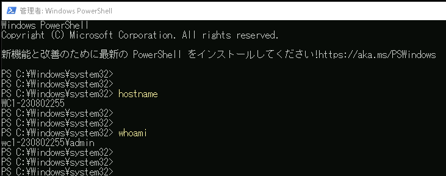</kbd>   

1. Windows Clientにローカルユーザー(TomとJerry)を作成する  
    1. Windows PowerShellで以下のコマンドを実行し、[ローカルユーザーとグループ]管理コンソールを起動する  
        ＞ ***lusrmgr.msc***  
        <kbd>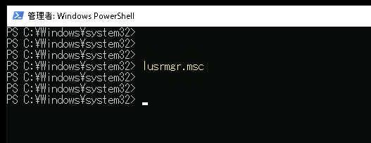</kbd>   
        <kbd>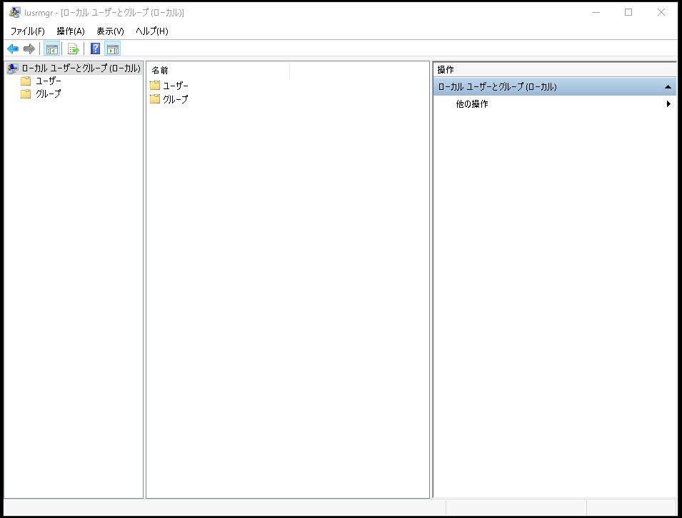</kbd>   

    1. 左側コンソールツリーの[ローカル ユーザーとグループ]-[ユーザー]をクリックする  
    1. 左側コンソールツリーの[ユーザー]を右クリックし、コンテキストメニューの[新しいユーザー]をクリックする  
    1. [新しいユーザー]ウィンドウが表示されたことを確認する  
    1. 以下のパラメータを入力する

        | 項目 | パラメータ |
        | :----- | :----- |
        | ユーザー名 | Tom |
        | フル ネーム | <空欄> |
        | 説明 | <空欄> |  
        | パスワード | Pa$$w0rd |
        | パスワードの確認入力 | Pa$$w0rd |  

        - [ ] ユーザーは次回ログオン時にパスワードの変更が必要  
        - [ ] ユーザーはパスワードの変更ができない  
        - [x] パスワードを無期限にする  
        - [ ] アカウントを無効にする  
        <kbd></kbd> 
    1. 前項のパラメータを入力した後、[作成]ボタンをクリックする
    1. [閉じる]ボタンをクリックする
    1. 中央ペインのユーザーの一覧を参照し、"Tom" が作成されていることを確認する

    1. 左側コンソールツリーの[ユーザー]を右クリックし、コンテキストメニューの[新しいユーザー]をクリックする  
    1. [新しいユーザー]ウィンドウが表示されたことを確認する  
    1. 以下のパラメータを入力する

        | 項目 | パラメータ |
        | :----- | :----- |
        | ユーザー名 | Jerry |
        | フル ネーム | <空欄> |
        | 説明 | <空欄> |  
        | パスワード | Pa$$w0rd |
        | パスワードの確認入力 | Pa$$w0rd |    

        - [ ] ユーザーは次回ログオン時にパスワードの変更が必要  
        - [ ] ユーザーはパスワードの変更ができない  
        - [x] パスワードを無期限にする  
        - [ ] アカウントを無効にする  
    1. 前項のパラメータを入力した後、[作成]ボタンをクリックする
    1. [閉じる]ボタンをクリックする
    1. 中央ペインのユーザーの一覧を参照し、"Jerry" が作成されていることを確認する
        <kbd>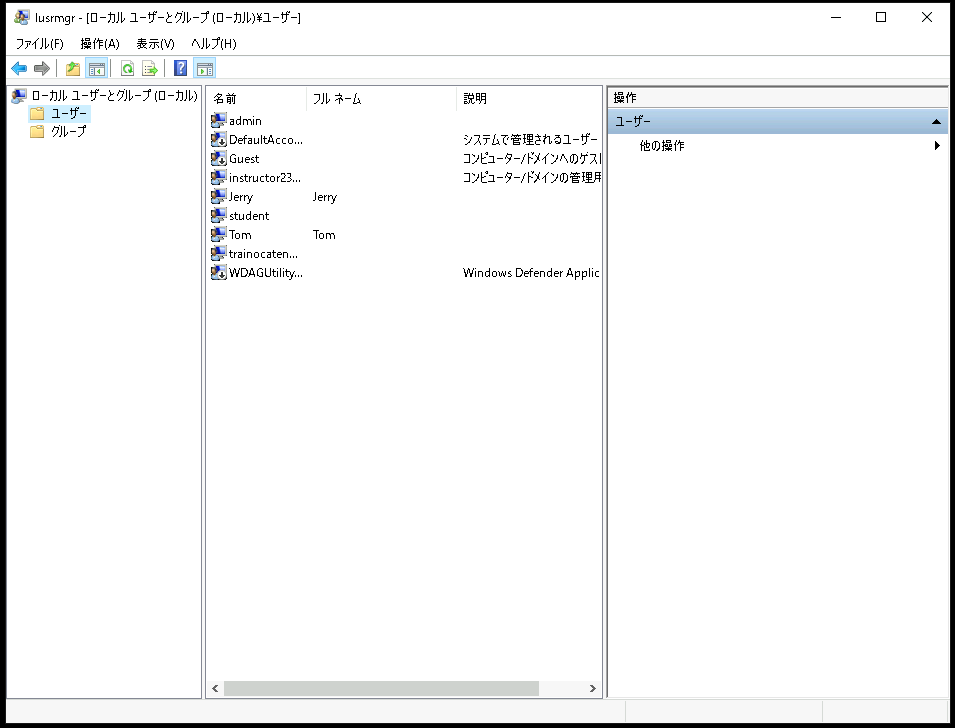</kbd> 


1. ローカルユーザーの管理接続(リモートデスクトップ)を許可する  
演習環境の管理接続には、リモートデスクトップのテクノロジーが利用されています。  
TomとJerryで管理接続をするためには、リモートデスクトップの許可が必要です。  
Windowsにはリモートデスクトップ接続を許可するためのローカル セキュリティグループ(Remote Desktop Users)が用意されています。  
TomとJerryをこのグループに所属させます。  

    1. [ローカルユーザーとグループ]管理コンソールで、左側コンソールツリーの[ローカル ユーザーとグループ]-[グループ]をクリックする
    1. 中央ペインのユーザーの一覧を参照し、[Remote Desktop Users]をクリックして選択する
    1. 右クリック コンテキストメニューの[プロパティ]をクリックする
        <kbd>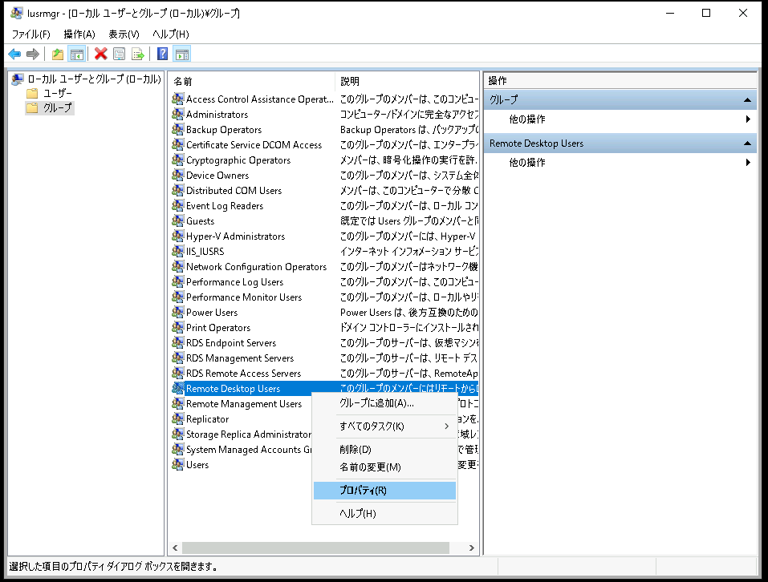</kbd> 
    1. [プロパティ]ウィンドウで、[追加]をクリックする
        <kbd>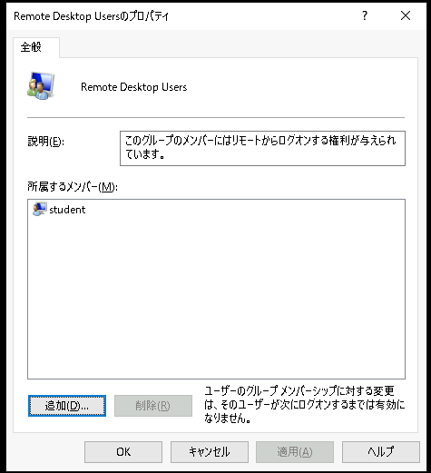</kbd> 
    1. [ユーザーの選択]ウィンドウが表示されたことを確認する  
    1. "選択するオブジェクト名を入力してください" の欄に "Tom" と入力する  
    1. [名前の確認]をクリックする  
    1. "<コンピュータ名>￥Tom" の表記に下線がついたことを確認する  
    1. [OK]をクリックする  
    1. [プロパティ]ウィンドウの "所属するメンバー" に "Tom" が表示されていることを確認する
    1. [プロパティ]ウィンドウで、[追加]をクリックする
    1. [ユーザーの選択]ウィンドウが表示されたことを確認する  
    1. "選択するオブジェクト名を入力してください" の欄に "Jerry" と入力する  
    1. [名前の確認]をクリックする  
    1. "<コンピュータ名>￥Jerry" の表記に下線がついたことを確認する  
    1. [OK]をクリックする  
    1. [プロパティ]ウィンドウの "所属するメンバー" に "Jerry" が表示されていることを確認する
    1. [プロパティ]ウィンドウで、[OK]をクリックする  
        <kbd>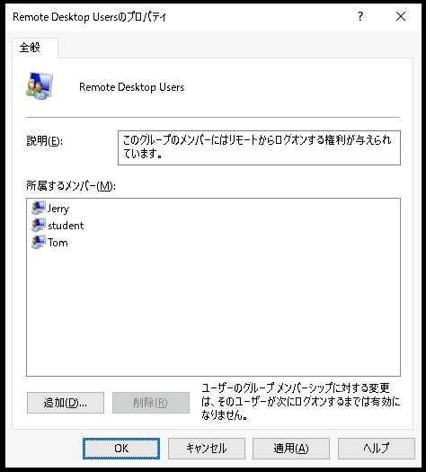</kbd> 
    1. [ローカルユーザーとグループ]管理コンソールを終了します。


1. Windows Clientに"Jerry"で接続する  
    1. Windows Client(WinClient)の管理画面に "Jerry" で接続する('Local Jerry'と'AD Jerry'がある場合は'Local Jerry'を使用する)  
        <kbd>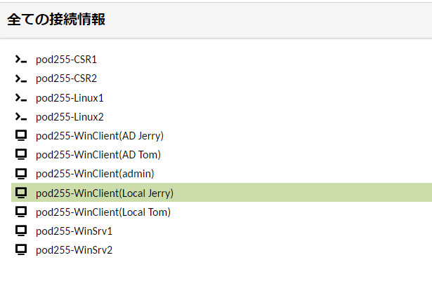</kbd>   
    1. [スタートメニュー]を右クリックし、コンテキストメニュー内の[Windows PowerShell]をクリックする('管理者'ではなく通常のPowerShellを起動する)  
    1. [ユーザー アカウント制御]のポップアップで[はい]をクリックする  
    1. Windows PowerShellのウィンドウが表示されたことを確認する  
    1. 以下のコマンドを実行し、クライアント デスクトップ環境役のコンピュータ(WC1)に "Jerry" で接続していることを確認する  
        ＞ ***hostname***  
        ＞ ***whoami***         
        <kbd>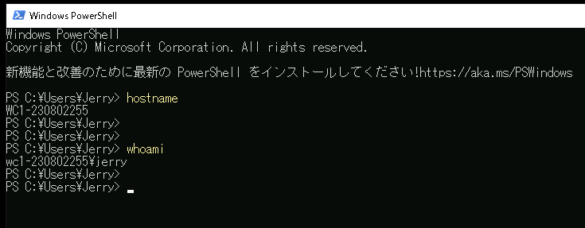</kbd>  
 
1. Jerryでファイルサーバーにアクセスする  
    1. ファイルエクスプローラを起動し、アドレス欄ファイルサーバーのUNCパス(\\\\10.X.2.105\\Share)を入力してEnterキーを押下する     
        <kbd>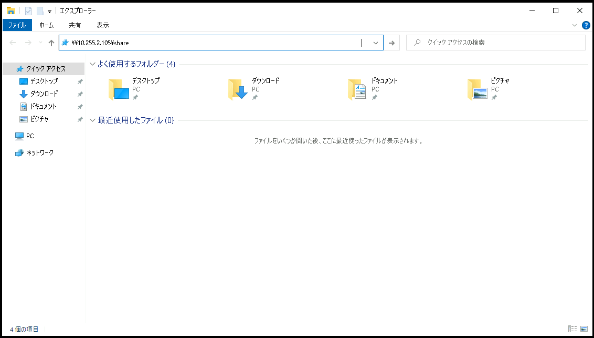</kbd>   
        > 【補足】  
        > UNCパスは、ファイルサーバーのアクセス時に使用するアドレス情報です。   
        > \\\\<サーバー名>\\<共有名>  
        > の様式で、ネットワーク上の共有フォルダを指定できます。  
    1. ファイルサーバーのShareフォルダにアクセスできることを確認する  
        <kbd>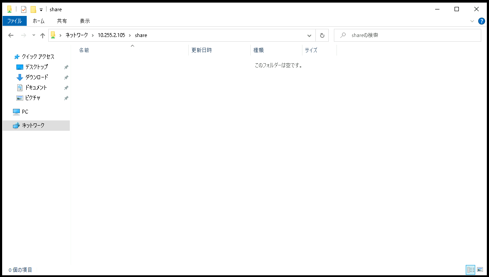</kbd> 
    1. Jerryでファイルサーバーの動作テストを実行する  
        > 【動作テストの観点】  
        > JerryはShareフォルダでファイルの読み書きができることを確認する  

        - [x] Shareフォルダに任意の名称のテキストファイルを作成できること  
        - [x] 作成したテキストファイルを開き、任意の文言を記入してファイルを保存できること  
        - [x] 保存されたファイルを開き、テキストファイルの中身を閲覧できること  
        <kbd>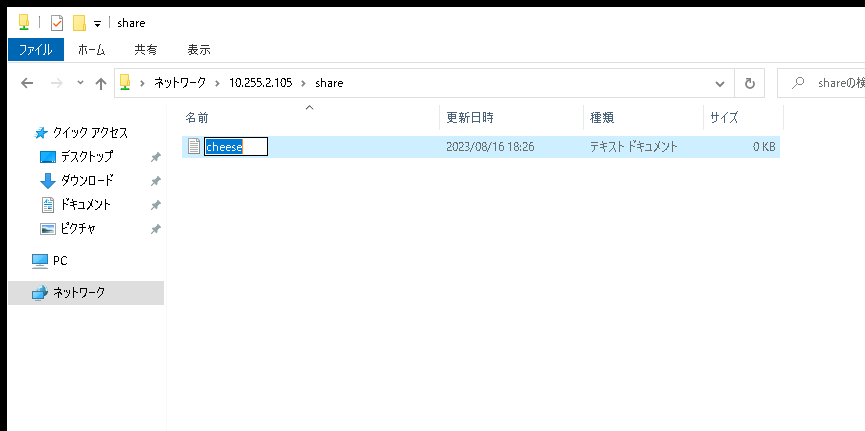</kbd> 
        <kbd>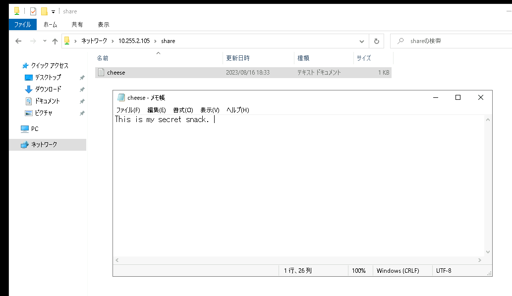</kbd> 

1. Windows Clientに"Tom"で接続する  
    1. Windows Client(WinClient)の管理画面に "Tom" で接続する('Local Tom'と'AD Tom'がある場合は'Local Tom'を使用する)  
        <kbd>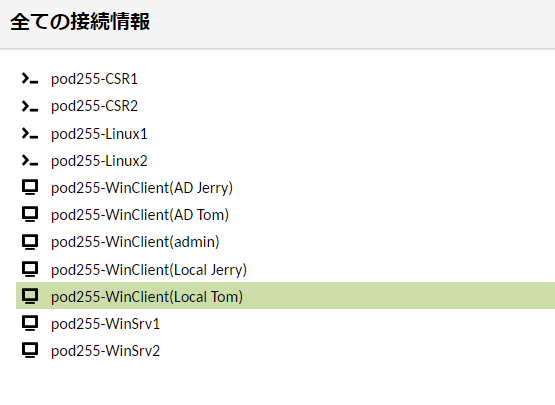</kbd> 
    1. [スタートメニュー]を右クリックし、コンテキストメニュー内の[Windows PowerShell]をクリックする('管理者'ではなく通常のPowerShellを起動する)  
    1. [ユーザー アカウント制御]のポップアップで[はい]をクリックする  
    1. Windows PowerShellのウィンドウが表示されたことを確認する  
    1. 以下のコマンドを実行し、クライアント デスクトップ環境役のコンピュータ(WC1)に "Tom" で接続していることを確認する  
        ＞ ***hostname***  
        ＞ ***whoami***         

1. Tomでファイルサーバーにアクセスする  
    1. ファイルエクスプローラを起動し、アドレス欄ファイルサーバーのUNCパス(\\\\10.X.2.105\\Share)を入力してEnterキーを押下する            
    1. ファイルサーバーのShareフォルダにアクセスできることを確認する  
        <kbd>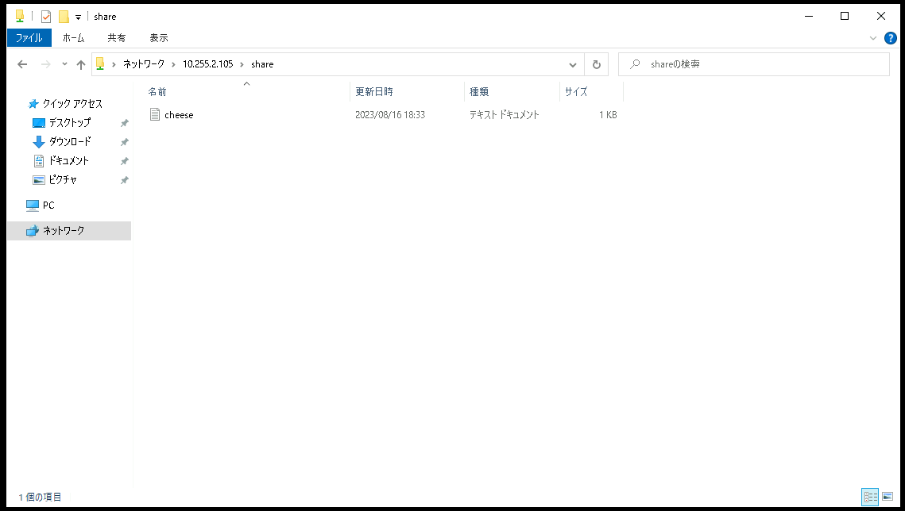</kbd> 
    1. Tomでファイルサーバーの動作テストを実行する  
        > 【動作テストの観点】  
        > TomはShareフォルダで、ファイルの読み取りはできるが、書き込みはできないことを確認する  

        - [x] Shareフォルダに新しいファイルを作成できないこと
        - [x] Jerryが作成したファイルの中身を閲覧できること 
        - [x] テキストファイルに任意の文言を記入してファイルを上書き保存しようとすると、アクセス権がない旨の警告が表示されること  
        <kbd>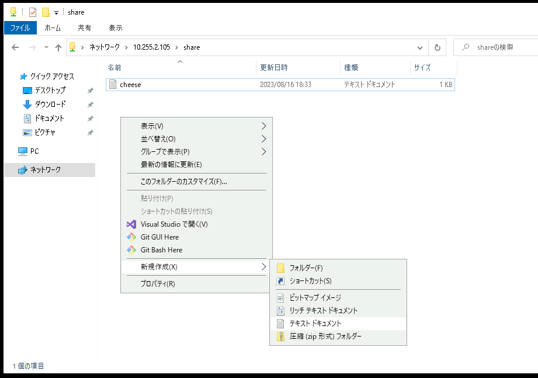</kbd> 
        <kbd>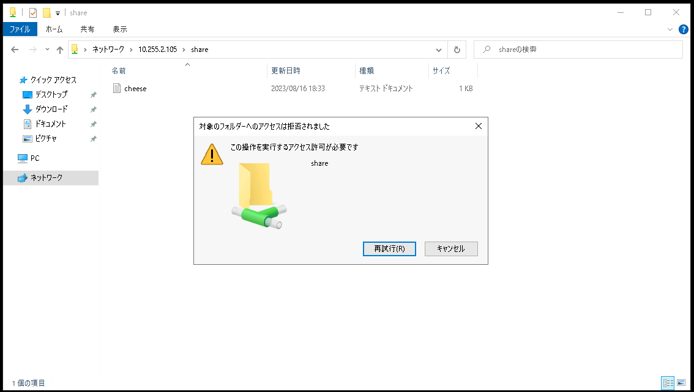</kbd> 
        <kbd></kbd> 
        <kbd>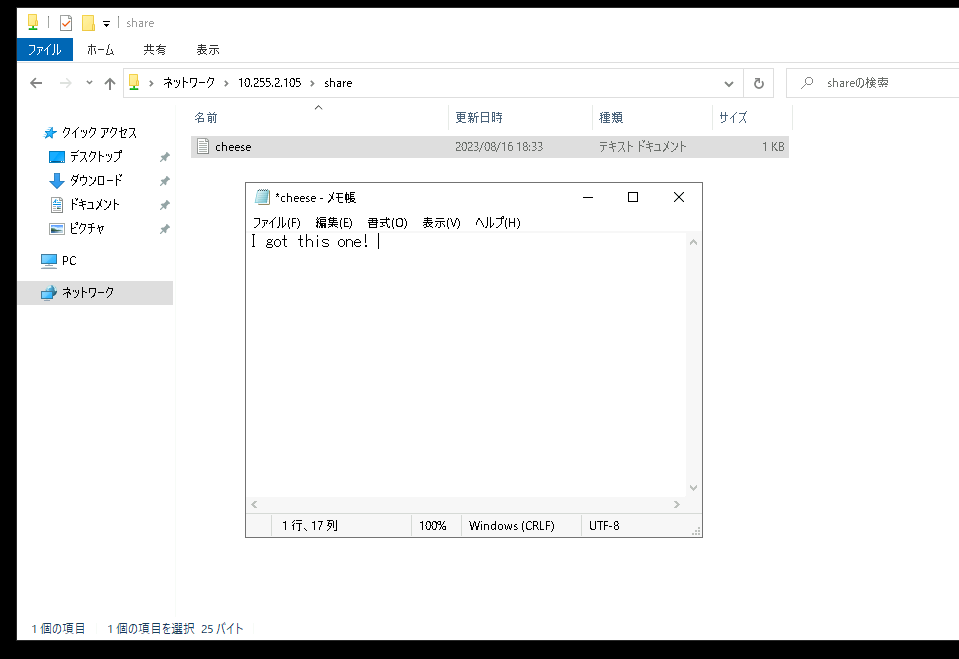</kbd> 
        <kbd>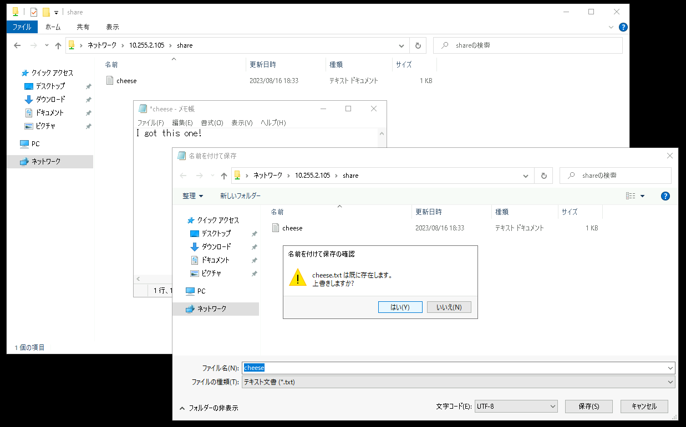</kbd> 
        <kbd>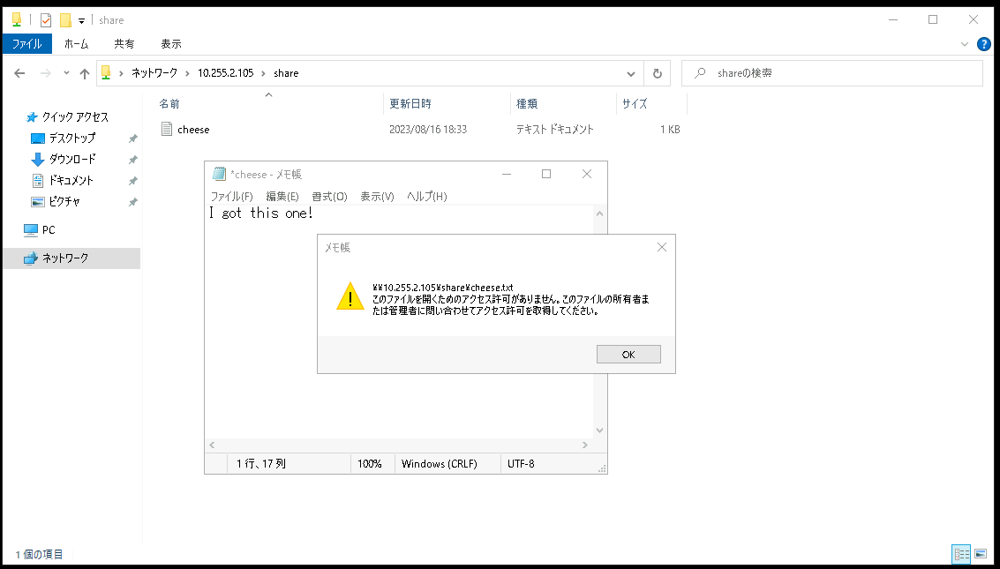</kbd> 

---

## 演習完了  
ここまでの手順で、以下の項目を学習できました。
- [x] Windowsワークグループ環境で使用するローカルユーザーを作成する  
- [x] ローカルユーザーの管理にローカルグループを利用する
- [x] 共有フォルダを作成してネットワークに公開する  
- [x] 共有フォルダに、共有アクセス権とNTFSアクセス権を設定する
- [x] NTFSアクセス権として、ファイルの読み書きの許可や禁止を設定する  
- [x] UNCパスを指定してファイルサーバーにアクセスする

