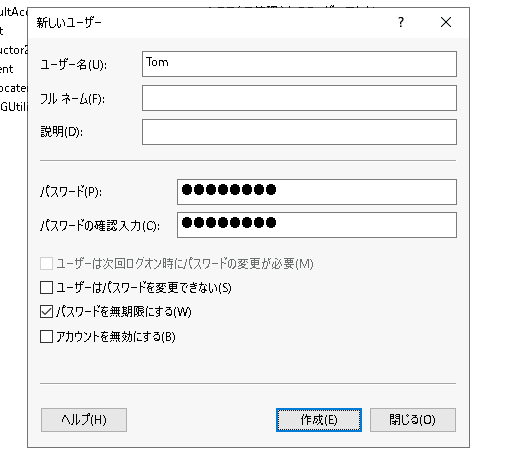
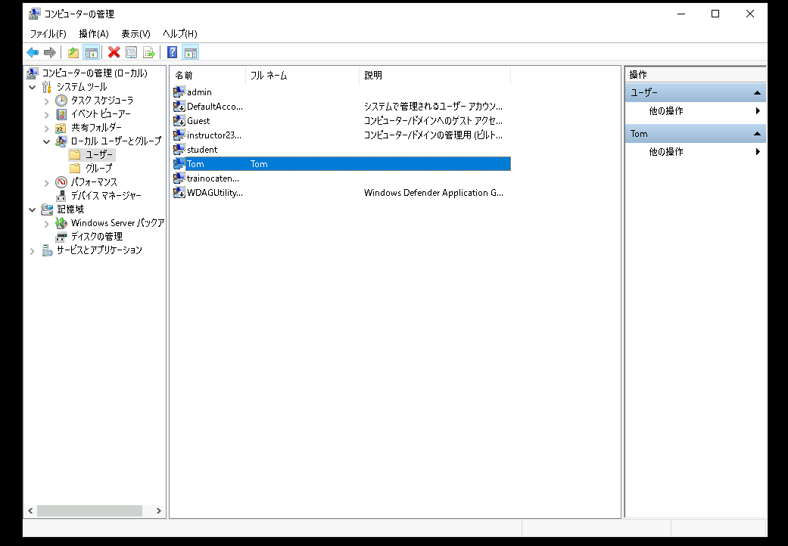
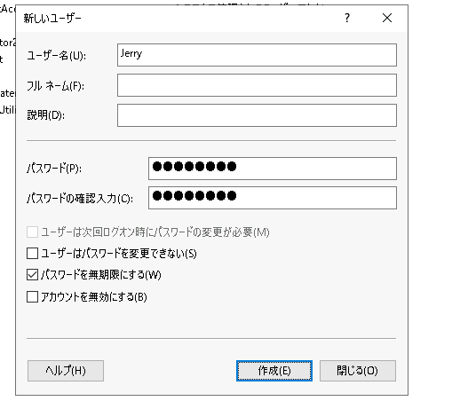
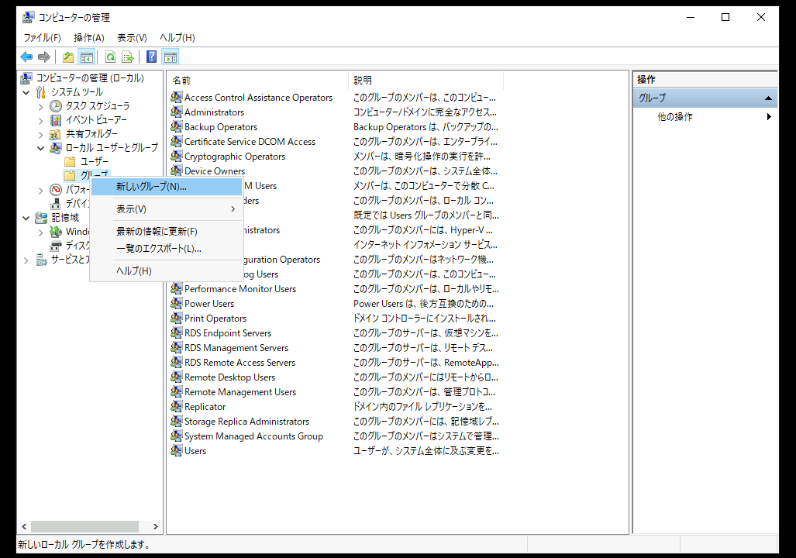
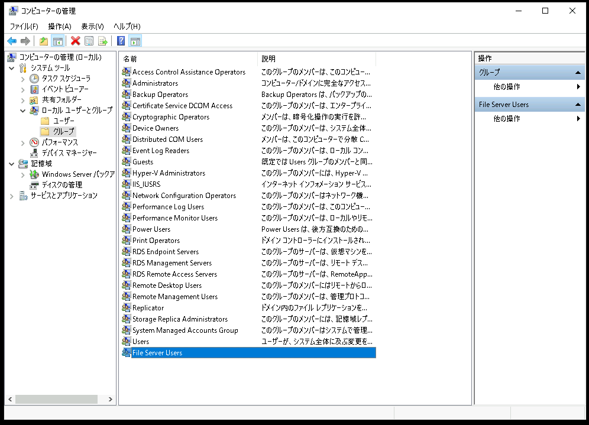

# Windows Serverでファイルサーバーを構築する
---

## 概要
この演習では、Windows Serverでファイルサーバーを構築する手順を学習します。   

"C:\Share" フォルダを作成し、クライアントからアクセス可能な共有フォルダとして公開します。  

## 演習の意図
    演習ガイドを参照して演習の意図をあらかじめ確認してください
[ppt]
- aaa  

## 演習における役割と、環境のパラメータ
- X: ご自身のPod番号
- Windowsファイルサーバー役: WinSrv2(WSrv2-yyMMddX)
- Windows Client: WinClient

## 注意
- 手順例の画像は<B>pod255</B>に準拠したパラメータのものです
- 手順内の<B>X</B>表記はご自身のpod番号に読み替えてください

---

## 1. Windowsファイルサーバー構築の準備
この演習では、Windows Server2(WinSrv2)をWindowsファイルサーバーとして構築します。  

1. Windowsファイルサーバー(WinSrv2)の管理画面に接続する  
1. [スタートメニュー]を右クリックし、コンテキストメニュー内の[Windows PowerShell(管理者)]をクリックする  
1. [ユーザー アカウント制御]のポップアップで[はい]をクリックする  
1. Windows PowerShellのウィンドウが表示されたことを確認する  
1. 以下のコマンドを実行し、Windowsファイルサーバー役のコンピュータ(WinSrv2)に接続していることを確認する  
    ＞ ***hostname***  
    
    > 【補足】  
    > Windowsファイルサーバー役のコンピュータであるWinSrv2には、"WSrv2-yyMMddX(年月日とPod番号)"形式のホスト名が設定されています。  

## 2. Windowsローカルユーザーアカウントの管理  
1. ローカルユーザー管理コンソールを起動する  
    1. [スタートメニュー]をクリックする  
    1. スタートメニュー内の[サーバー マネージャー]をクリックし、サーバーマネージャを起動する  
    1. サーバーマネージャーウィンドウ右上の[ツール]をクリックする  
    1. メニュー内の[コンピュータの管理]をクリックし、管理コンソールを起動する  
        <kbd></kbd>

1. ローカルユーザー(TomとJerry)を作成する  
    1. 左側コンソールツリーの[コンピュータの管理]-[システムツール]-[ローカル ユーザーとグループ]-[ユーザー]をクリックする  
    1. 左側コンソールツリーの[ユーザー]を右クリックし、コンテキストメニューの[新しいユーザー]をクリックする  
        <kbd></kbd>  
    1. [新しいユーザー]ウィンドウが表示されたことを確認する  
    1. 以下のパラメータを入力する

        | 項目 | パラメータ |
        | :----- | :----- |
        | ユーザー名 | Tom |
        | フル ネーム | <空欄> |
        | 説明 | <空欄> |  
        | パスワード | Pa$$w0rd |
        | パスワードの確認入力 | Pa$$w0rd |  

        - [ ] ユーザーは次回ログオン時にパスワードの変更が必要
        - [ ] ユーザーはパスワードの変更ができない
        - [x] パスワードを無期限にする
        - [ ] アカウントを無効にする
        <kbd></kbd> 
    1. 前項のパラメータを入力した後、[作成]ボタンをクリックする
    1. [閉じる]ボタンをクリックする
    1. 中央ペインのユーザーの一覧を参照し、"Tom" が作成されていることを確認する
        <kbd></kbd> 

    1. 左側コンソールツリーの[ユーザー]を右クリックし、コンテキストメニューの[新しいユーザー]をクリックする  
    1. [新しいユーザー]ウィンドウが表示されたことを確認する  
    1. 以下のパラメータを入力する

        | 項目 | パラメータ |
        | :----- | :----- |
        | ユーザー名 | Jerry |
        | フル ネーム | <空欄> |
        | 説明 | <空欄> |  
        | パスワード | Pa$$w0rd |
        | パスワードの確認入力 | Pa$$w0rd |  

        - [ ] ユーザーは次回ログオン時にパスワードの変更が必要
        - [ ] ユーザーはパスワードの変更ができない
        - [x] パスワードを無期限にする
        - [ ] アカウントを無効にする
        <kbd></kbd> 
    1. 前項のパラメータを入力した後、[作成]ボタンをクリックする
    1. [閉じる]ボタンをクリックする
    1. 中央ペインのユーザーの一覧を参照し、"Jerry" が作成されていることを確認する
        <kbd></kbd> 

1. ローカルグループ(File Server Users)を作成する  
    1. 左側コンソールツリーの[コンピュータの管理]-[システムツール]-[ローカル ユーザーとグループ]-[グループ]をクリックする  
    1. 左側コンソールツリーの[グループ]を右クリックし、コンテキストメニューの[新しいグループ]をクリックする  
        <kbd></kbd> 
    1. [新しいグループ]ウィンドウが表示されたことを確認する  
        <kbd></kbd> 
    1. 以下のパラメータを入力する  

        | 項目 | パラメータ |
        | :----- | :----- |
        | グループ名 | File Server Users |
        | 所属するメンバー | <空欄> |

    1. 前項のパラメータを入力した後、[作成]ボタンをクリックする  
    1. [閉じる]ボタンをクリックする  
    1. 中央ペインのグループの一覧を参照し、"File Server Users" が作成されていることを確認する  
        <kbd></kbd> 

1. ローカルグループ(File Server Users)にユーザー(Jerry)を所属させる  
    1. 中央ペインのグループの一覧を参照し、[File Server Users]をクリックする  
    1. [File Server Users]を右クリックし、コンテキストメニューの[プロパティ]をクリックする  
        <kbd></kbd> 
    1. 所属するメンバー欄の下の[追加]をクリックする  
        <kbd></kbd> 
    1. [ユーザーの選択]ウィンドウが表示されたことを確認する  
        <kbd></kbd> 
    1. "選択するオブジェクト名を入力してください" の欄に "Jerry" と入力する  
        <kbd></kbd> 
    1. [名前の確認]をクリックする  
    1. "<コンピュータ名>￥Jerry" の表記に下線がついたことを確認する  
        <kbd></kbd> 
    1. [OK]をクリックする  
    1. [新しいグループ]ウィンドウの "所属するメンバー" に "Jerry" が表示されていることを確認する
        <kbd></kbd> 
    1. [OK]をクリックする  

## 3. フォルダ(C:\Share)を作成する  
この手順では、ファイルサーバーのデータを保存するフォルダ(C:\Share)を作成します。  
フォルダは共有フォルダとしてネットワークに公開されます。  

詳細手順
  
1. ファイル エクスプローラーを起動する   
1. C:\Shareフォルダを作成する   
1. プロパティの[共有]タブをクリックする   
1. 

