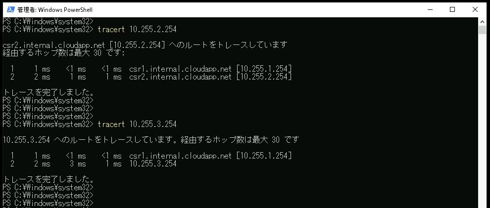
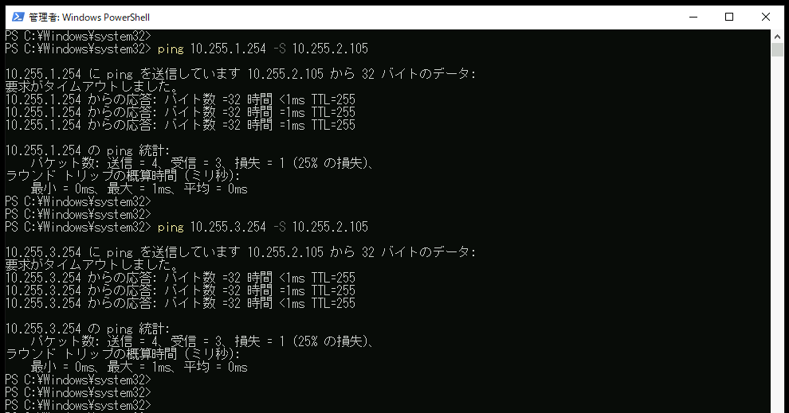

# Linuxの基本的なルーティングを設定する
---

## 概要
この演習では、Linux(CentOS7.9)のルーティングを手作業で設定します。
ルーティングテーブルに静的経路(Static Route)を作成するコマンドを実行し、新しいルーティングエントリを追加します。

Linux1では、2つのスタティックルートを作成します。  

Linux2では、Network1とNetwork2の経路情報を集約し、集約経路としてスタティックルートを構成します。  

## 演習の意図
    演習ガイドを参照して演習の意図をあらかじめ確認してください

## 演習における役割と、環境のパラメータ
- X: ご自身のPod番号
- Linux1: linux1
- Linux2: linux2
- Router1: CSR1
- Router2: CSR2
- Network1: 10.X.1.0/24
- Network2: 10.X.2.0/24
- Network3: 10.X.3.0/24

## 注意
- 手順例の画像は<B>pod255</B>に準拠したパラメータのものです
- 手順内の<B>X</B>表記はご自身のpod番号に読み替えてください

---

## 1. Linux1のStatic Routeを作成する

1. Linux1の管理画面に接続する  
    <kbd></kbd>
1. コマンドラインで以下のコマンドを実行し、Linux1にadminで接続していることを確認する  
    ＞ ***hostname***  
    ＞ ***whoami***  
    <kbd></kbd>

1. 以下のコマンドを実行し、Linux1の現在のネットワーク設定を確認する  
    ＞ ***ifconfig***  
    <kbd></kbd>
    > 【確認ポイント】
    > ifconfigコマンドを実行すると複数のネットワークアダプターの情報が表示されます。eth0とeth1に注目してください。
    > eth1が演習用のネットワーク(10.X.1.0/24)です。演習環境の他のサーバと通信するために使用します。
    > eth0は管理接続作業用のネットワーク(10.X.0.0/24)です。演習の中では操作しません。
<!-- 
Azure環境においては、DHCPで配布されるデフォルトゲートウェイが有効であるため、以下の手順は不要です。

1. コマンドラインに以下のコマンドを入力し、Linux1の現在のネットワーク設定を確認する  
    ＞ ***ip route***  
    <kbd></kbd>
    > 【確認ポイント】
    > ip routeコマンドは、ルーティングテーブルを表示するコマンドです。
    > 10.X.2.0/24や10.X.3.0/24をルーティングできるエントリが、まだ存在しないことを確認してください。
1. コマンドラインに以下のコマンドを入力し、Linux1が別ネットワークと通信できない状態であることを確認する  
    ＞ ***ping 10.X.1.254***  
    ＞ ***ping 10.X.2.254***  
    ＞ ***ping 10.X.3.254***  
    > 【確認ポイント】
    > 別ネットワークに対するルーティング情報がルーティングテーブルに登録されていないため、eth1と同じネットワーク(10.X.1.0/24)のIPアドレスとは通信できますが、別のネットワークとは通信できない状態であることを確認してください。
-->

1. 以下のコマンドを実行し、Network2(10.X.2.0/24)とNetwork3(10.X.3.0/24)を宛先とするルーティングについて、Router1をNextHopとしたエントリを登録する  
    ＞ ***sudo ip route add 10.X.2.0/24 via 10.X.1.254 dev eth1***   
    ＞ ***sudo ip route add 10.X.3.0/24 via 10.X.1.254 dev eth1***  
    <kbd></kbd>
1. 以下のコマンドを実行し、Network2(10.X.2.0/24)とNetwork3(10.X.3.0/24)のルーティングエントリが登録されていることを確認する  
    ＞ ***ip route***     
    <kbd></kbd>
1. 以下のコマンドを実行し、Router1(CSR1)を経由してNetwork2(10.X.2.0/24)とNetwork3(10.X.3.0/24)と通信できることを確認する
    ＞ ***traceroute 10.X.2.254***  
    ＞ ***traceroute 10.X.3.254***  
    <kbd></kbd>    

---

## 2. Linux1に永続的なStatic Routeを作成する

1. 作業説明
    前手順のip route addはルーティングテーブルにエントリを直接登録するコマンドです。  
    ルーティングテーブルのステータスとしては有効ですが、configとしては保存されない情報であるため、コンピュータを再起動するとエントリも失われます。  
    コンピュータ再起動後も有効なスタティックルートを登録するためには、スタティックルートを登録するconfigを作成する必要があります。  
    Linux(CentOS/7.9)におけるスタティックルートのconfigは "/etc/sysconfig/network-scripts/route-<IF名>" のファイルに記述できます。  

1. 以下のコマンドを実行し、永続的なStatic Routeの設定ファイル(/etc/sysconfig/network-scripts/route-eth1)を作成し、バックアップを作成(copy)する
    ＞ ***sudo touch /etc/sysconfig/network-scripts/route-eth1***  
    ＞ ***sudo cp /etc/sysconfig/network-scripts/route-eth1 cp /etc/sysconfig/network-scripts/route-eth1_bak***
    <kbd></kbd>
    > 【補足】
    > この後手順で、route-eth1ファイルを編集します。
    > 編集作業前にバックアップのファイルをcopyで作成しておくと、編集作業後にバックアップファイルとの差分を比較することで自身の作業内容を検査できます。
1. 以下のコマンドを実行し、Static Routeの設定ファイル(/etc/sysconfig/network-scripts/route-eth1)を編集する
    ＞ ***sudo vi /etc/sysconfig/network-scripts/route-eth1***  
    > 【編集内容:以下を追記する】
    > 10.X.2.0/24 via 10.X.1.254 dev eth1
    > 10.X.3.0/24 via 10.X.1.254 dev eth1
    >
    <kbd></kbd> 
    <kbd></kbd> 
1. 以下のコマンドを実行し、作業内容にミスがないことを確認する
    ＞ ***diff -u /etc/sysconfig/network-scripts/route-eth1 /etc/sysconfig/network-scripts/route-eth1_bak***  
    > 【補足】
    > diffコマンドは、ファイル間の差分を抽出します。
    > 編集作業開始前に作成したバックアップファイルとの差分を比較することで、作業内容が正確であること確認できます。  

    <kbd></kbd> 
1. 以下のコマンドを実行し、ネットワーク設定を再読み込みする
    ＞ ***sudo service network restart***  
    <kbd></kbd> 

1. 以下のコマンドを実行し、Network2(10.X.2.0/24)とNetwork3(10.X.3.0/24)のルーティングエントリが登録されていることを確認する  
    ＞ ***ip route***  
    <kbd></kbd> 

1. 以下のコマンドを実行し、Router1(CSR1)を経由してNetwork2(10.X.2.0/24)とNetwork3(10.X.3.0/24)と通信できることを確認する
    ＞ ***traceroute 10.X.2.254***  
    ＞ ***traceroute 10.X.3.254***  
    <kbd></kbd>    

---

## 3. Linux2に集約されたStatic Routeを作成する

1. Linux2の管理画面に接続する  
    <kbd></kbd>
1. コマンドラインで以下のコマンドを実行し、Linux2にadminで接続していることを確認する  
    ＞ ***hostname***  
    ＞ ***whoami***  
    <kbd></kbd>

1. 以下のコマンドを実行し、Linux2の現在のネットワーク設定を確認する  
    ＞ ***ifconfig***  
    <kbd></kbd>
    > 【確認ポイント】
    > ifconfigコマンドを実行すると複数のネットワークアダプターの情報が表示されます。eth0とeth1に注目してください。
    > eth1が演習用のネットワーク(10.X.3.0/24)です。演習環境の他のサーバと通信するために使用します。
    > eth0は管理接続作業用のネットワーク(10.X.0.0/24)です。演習の中では操作しません。

1. 以下のコマンドを実行し、Network1(10.X.1.0/24)とNetwork2(10.X.2.0/24)を宛先とするルーティングについて、Router2をNextHopとしたエントリを登録する  
    ＞ ***sudo ip route add 10.X.0.0/16 via 10.X.3.254 dev eth1***   
    <kbd></kbd>

## 2. Windows Server1のStatic Routeを確認する

1. Windows Server1のWindows PowerShellで以下のコマンドを実行し、Windows Server1のルーティングテーブルを確認する 
    ＞ ***route print***  
    <kbd></kbd>
    > 【確認ポイント】
    > [アクティブ ルート]として、10.X.2.0宛と10.X.3.0宛のルーティングエントリ行が作成されており、NextHop(ゲートウェイ)としてRouter1のIPアドレス(10.X.1.254)が指定されていることを確認します。
    > [固定ルート]としても、同じルーティング情報が登録されています。
1. 以下のコマンドを実行し、Windows Server1からNetwork2宛とNetwork3宛の疎通を確認する  
    ＞ ***ping 10.X.2.254 -S 10.X.1.104***  
    ＞ ***ping 10.X.3.254 -S 10.X.1.104***  
    <kbd></kbd>
    > 【補足】
    > "-S"オプションを付与することで、ping送信時の送信元IPアドレスを指定できます。
1. 以下のコマンドを実行し、Windows Server1からNetwork2宛とNetwork3宛の経路を確認する  
    ＞ ***tracert 10.X.2.254***  
    ＞ ***tracert 10.X.3.254***  
    <kbd></kbd>
    > 【確認ポイント】
    > route addコマンドでNextHopとして指定した10.X.1.254(Router1)を経由して宛先まで通信していることを確認する。

---

## 3. Windows Server2のStatic Routeを作成する

1. Windows Server2の管理画面に接続する  
    <kbd></kbd>
1. [スタートメニュー]を右クリックし、コンテキストメニュー内の[Windows PowerShell(管理者)]をクリックする  
1. [ユーザー アカウント制御]のポップアップで[はい]をクリックする  
1. Windows PowerShellのウィンドウが表示されたことを確認する  
1. 以下のコマンドを実行し、Windows Server2に接続していることを確認する  
    ＞ ***hostname***  
    <kbd></kbd>
    > 【補足】
    > Windows Server1のコンピュータ名には、"WSrv2-"という接頭辞がつけられています。
1. 以下のコマンドを実行し、Windows Server2のStatic Routeを作成する  
    ＞ ***route add -p 10.X.1.0 mask 255.255.255.0 10.X.2.253***  
    ＞ ***route add -p 10.X.3.0 mask 255.255.255.0 10.X.2.254***  
    <kbd></kbd>
    > 【学習のポイント】  
    > 演習ガイドのNetwork構成図も参照し、宛先ネットワークごとのNextHopに注目してください。  
    > Windows Server2がNetwork1(10.X.1.0/24)と通信するためのNextHopはRouter1(10.X.2.253)ですが、Network3(10.X.3.0/24)と通信するためのNextHopはRouter2(10.X.2.254)です。  

---

## 4. Windows Server2のStatic Routeを確認する

1. Windows Server2のWindows PowerShellで以下のコマンドを実行し、Windows Server2のルーティングテーブルを確認する 
    ＞ ***route print***  
    <kbd></kbd>
    > 【確認ポイント】  
    > [アクティブ ルート]として、以下のルーティングエントリが存在することを確認します。  
    > ・ 10.X.1.0宛のNextHop(ゲートウェイ)としてRouter1のIPアドレス(10.X.1.253)が指定されている  
    > ・ 10.X.3.0宛のNextHop(ゲートウェイ)としてRouter2のIPアドレス(10.X.1.254)が指定されている  
    > [固定ルート]としても、同じルーティング情報が登録されています。
1. 以下のコマンドを実行し、Windows Server2からNetwork1宛とNetwork3宛の疎通を確認する  
    ＞ ***ping 10.X.1.254 -S 10.X.2.105***  
    ＞ ***ping 10.X.3.254 -S 10.X.2.105***  
    <kbd></kbd>
    > 【補足】
    > "-S"オプションを付与することで、ping送信時の送信元IPアドレスを指定できます。
1. 以下のコマンドを実行し、Windows Server2(10.X.2.105)からWindows Server1(10.X.1.104)宛の経路を確認する  
    ＞ ***ping 10.X.1.104 -S 10.X.2.105*** 
    ＞ ***tracert 10.X.1.104***  
    <kbd></kbd>
    > 【学習のポイント】  
    > 別サブネットのIPアドレスと通信するためには、L3デバイスによるルーティングが必要です。  
    > 今回の環境では、Router1が2つのネットワーク(10.X.1.0/24と10.X.2.0/24)を相互に接続しています。  
    > Windows Server1とWindows Server2は、Router1をNextHopとするStatic Routeを構成したため、相互に通信できる状態です。  

---

## 5. Windows Clientのデフォルトゲートウェイを構成する

1. Windows Clientの管理画面にadminアカウントで接続する  
    <kbd></kbd>
1. [スタートメニュー]を右クリックし、コンテキストメニュー内の[Windows PowerShell(管理者)]をクリックする  
1. [ユーザー アカウント制御]のポップアップで[はい]をクリックする  
1. Windows PowerShellのウィンドウが表示されたことを確認する  
1. 以下のコマンドを実行し、Windows Clientにadminアカウントで接続していることを確認する  
    ＞ ***hostname***  
    ＞ ***whoami***  
    <kbd></kbd>
    > 【補足1】  
    > Windows Clientのコンピュータ名には、"WC-"という接頭辞がつけられています。  

    > 【補足2】  
    > whoamiはログインしているユーザーアカウント名を表示します。
    > 管理者アカウントであるadminでログインしていることを確認してください。  

1. 以下のコマンドを実行し、コントロールパネルの[ネットワーク接続]画面を表示する
    ＞ ***ncpa.cpl***  
    <kbd></kbd>
1. 2つのネットワーク アダプターのアイコンが表示されていることを確認する
    > 【補足】  
    > 演習環境のコンピュータには、複数のネットワークアダプターが接続されています。
    > このうち "[変更禁止]管理接続作業用NW" のアダプターは、受講者が演習環境にリモート接続するための通信環境を提供します。演習中に誤って設定を変更することがないように注意してください。
1. [内部NW]のアダプターを選択し、右クリック コンテキストメニューの[プロパティ]をクリックする
    <kbd></kbd>
1. [内部NWのプロパティ]ウィンドウが表示されることを確認する。
1. ウィンドウ中央部の項目から [インターネット プロトコル バージョン4(TCP/IPv4)]を選択し、[プロパティ]をクリックする
    <kbd></kbd>
1. [インターネット プロトコル バージョン4(TCP/IPv4)のプロパティ]ウィンドウが表示されることを確認する。
    <kbd></kbd>
1. 以下のパラメータを入力する。
    
    - [ ] IPアドレスを自動的に取得する
    - [x] 次のIPアドレスを使う

    | 項目 | パラメータ |
    | :----- | :----- |
    | IPアドレス | 10.X.1.103 |
    | サブネット マスク | 255.255.255.0 |
    | デフォルト ゲートウェイ | 10.X.1.254 |  

    - [ ] DNSサーバーのアドレスを自動的に取得する
    - [x] 次のDNSサーバーのアドレスを使う

    | 項目 | パラメータ |
    | :----- | :----- |
    | 優先DNSサーバー | <空欄> |
    | 代替DNSサーバー | <空欄> |

    <kbd></kbd>

1. [OK]をクリックする

1. [内部NWのプロパティ]ウィンドウで、[閉じる]をクリックする  
    <kbd></kbd>

    > 【補足】  
    > ネットワークアダプターの設定変更が保存されるのは、[閉じる]をクリックしたタイミングです。
    > アダプター プロパティのウィンドウで、[閉じる]をクリックするのを見落とさないように注意してください。

1. コントロールパネルの[ネットワーク接続]画面が表示されていることを確認する
    <kbd></kbd>

---

## 5. Windows Clientのデフォルトゲートウェイを設定を確認する

1. Windows ClientのWindows PowerShellで以下のコマンドを実行し、Windows Clientのデフォルトゲートウェイを確認する 
    ＞ ***ipconfig /all***  
    <kbd></kbd>
    > 【確認ポイント】
    > [イーサネット アダプター 内部NW:]のデフォルト ゲートウェイが、前の手順で設定したRouter1のIPアドレスであることを確認してください。

1. 以下のコマンドを実行し、Windows Clientのデフォルトゲートウェイを確認する 
    ＞ ***route print***  
    <kbd></kbd>
    > 【確認ポイント】  
    > [アクティブ ルート]として、以下のルーティングエントリが存在することを確認します。  
    > ・ 0.0.0.0宛のNextHop(ゲートウェイ)としてRouter1のIPアドレス(10.X.1.254)が指定されている  
    > [固定ルート]としても、同じルーティング情報が登録されています。
    > デフォルトゲートウェイを設定することにより、Windows OS内部で自動的にデフォルトルートが作成される動作に注目してください。

    > 【補足】
    > この演習環境においては、プラットフォームから提供されるデフォルトルート(10.X.0.1宛)が優先されるため、このコンピュータのルーティングは実際には変更されません。
    > この手順は、デフォルトゲートウェイの指定方法を理解するための演習であるとご認識ください。
