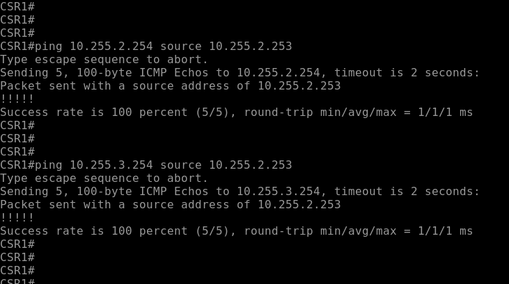
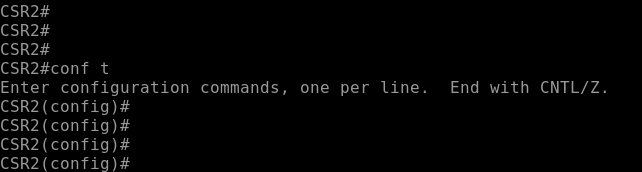
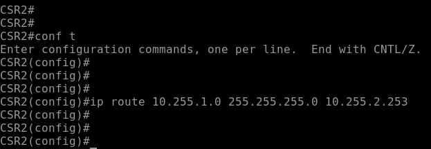
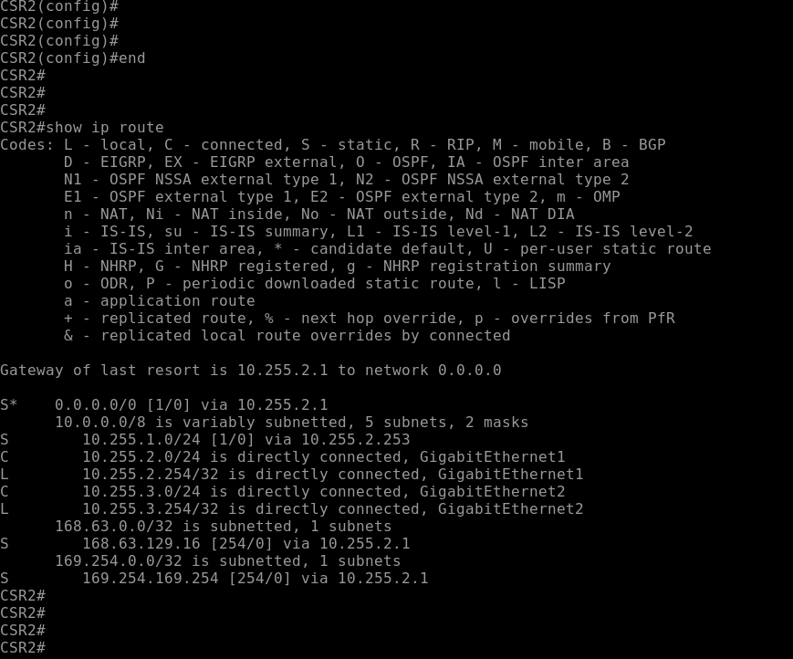

# Windowsの基本的なルーティングを設定する
---

## 概要
この演習では、Windows Serverのルーティングを手作業で設定します。
ルーティングテーブルに静的経路(Static Route)を作成するコマンドを実行し、新しいルーティングエントリを追加します。

Windows Server1では、2つのネットワーク(Network2とNetwork3)の経路情報として、Router1をNextHopに指定したStatic Routeを2つ作成します。

Windows Server2では、Network1の経路情報としてRouter1をNextHopに指定し、Network3の経路情報としてRouter2をNextHopに指定します。

## 演習の意図
    演習ガイドを参照して演習の意図をあらかじめ確認してください
[ppt]
- staticルートを構成し、Windows Serverからリモートネットワーク宛のルーティングを構成する

## 演習における役割と、環境のパラメータ
- X: ご自身のPod番号
- Windows Server1: WSrv1-yyMMddX (年月日とPod番号)
- Windows Server2: WSrv2-yyMMddX (年月日とPod番号)
- Windows Client: WinClient
- Router1: CSR1
- Router2: CSR2
- Network1: 10.X.1.0/24
- Network2: 10.X.2.0/24
- Network3: 10.X.3.0/24

## 注意
- 手順例の画像は<B>pod255</B>に準拠したパラメータのものです
- 手順内の<B>X</B>表記はご自身のpod番号に読み替えてください

---

## 1. Windows Server1のStatic Routeを作成する

1. Windows Server1の管理画面に接続する  
<kbd></kbd>
1. [スタートメニュー]を右クリックし、コンテキストメニュー内の[Windows PowerShell(管理者)]をクリックする  
<kbd></kbd>
1. [ユーザー アカウント制御]のポップアップで[はい]をクリックする  
<kbd></kbd>
1. Windows PowerShellのウィンドウが表示されたことを確認する  
<kbd></kbd>
1. 以下のコマンドを実行し、Windows Server1に接続していることを確認する  
    ＞ ***hostname***  
<kbd></kbd>
    
    > 【補足】
    > hostnameコマンドはコンピュータの名前を表示します。
    > 複数のWindowsコンピュータを操作する環境において、操作対象のコンピュータを取り違えるトラブルを予防するのに効果的です。
     Windows Server1のコンピュータ名には、"WSrv1-"という接頭辞がつけられています。
    
1. 以下のコマンドを実行し、Windows Server1のStatic Routeを作成する  
    ＞ ***route add -p 10.X.2.0 mask 255.255.255.0 10.X.1.254***  
    ＞ ***route add -p 10.X.3.0 mask 255.255.255.0 10.X.1.254***
<kbd></kbd>
    > 【補足1】
    > route addコマンドは、WindowsコンピュータにStatic Routeを作成します。
    > 以下の書式でパラメータを指定します。
    > route add <ネットワークアドレス> mask <サブネットマスク> <ネクストホップ>

    > 【補足2】
    > このコマンドで作成したStatic RouteはOSの再起動により削除される一時的な設定です。
    > "-p"オプションを付与することで永続的(Permanent)な設定として保存されます。

---

## 2. Windows Server1のStatic Routeを確認する

1. Windows Server1のWindows PowerShellで以下のコマンドを実行し、Windows Server1のルーティングテーブルを確認する 
    ＞ ***route print***  
<kbd></kbd>
    > 【確認ポイント】
    > [アクティブ ルート]として、10.X.2.0宛と10.X.3.0宛のルーティングエントリ行が作成されており、NextHop(ゲートウェイ)としてRouter1のIPアドレス(10.X.1.254)が指定されていることを確認します。
    > [固定ルート]としても、同じルーティング情報が登録されています。
1. 以下のコマンドを実行し、Windows Server1からNetwork2宛とNetwork3宛の疎通を確認する  
    ＞ ***ping 10.X.2.254 -S 10.X.1.104***  
    ＞ ***ping 10.X.3.254 -S 10.X.1.104***  
<kbd></kbd>
    > 【補足】
    > "-S"オプションを付与することで、ping送信時の送信元IPアドレスを指定できます。
1. 以下のコマンドを実行し、Windows Server1からNetwork2宛とNetwork3宛の経路を確認する  
    ＞ ***tracert 10.X.2.254***  
    ＞ ***tracert 10.X.3.254***  
<kbd></kbd>
    > 【確認ポイント】
    > route addコマンドでNextHopとして指定した10.X.1.254(Router1)を経由して宛先まで通信していることを確認する。

---

## 2. ルータ1のStatic Routeを確認する
1. 以下のコマンドを実行し、グローバルコンフィギュレーションモードから特権モードに遷移する  
    Router1(config)# ***end***  
<kbd></kbd>
1. 以下のコマンドを実行し、ルータ1のルーティングテーブルを表示する  
    Router1# ***show ip route***  
1. ルーティングテーブルに、Router2をNext Hop(10.X.2.254)とするNetwork3(10.X.3.0/24)宛の経路情報が登録されていることを確認する  
<kbd></kbd>
> 【補足】  
> ルーティング エントリ行の左端のアルファベットは、経路の学習方法を示します。
> "S" は "Static" の意味です。
1. 以下のコマンドを実行し、ルータ1のNetwork2のインターフェイスからルータ2への疎通を確認する  
    Router1# ***ping 10.X.2.254 source 10.X.2.253***
    Router1# ***ping 10.X.3.254 source 10.X.2.253***
<kbd></kbd>
1. 以下のコマンドを実行し、ルータ1のNetwork1のインターフェイスからルータ2への疎通がまだ確立できないことを確認する  
    Router1# ***ping 10.X.2.254 source 10.X.1.254***
    Router1# ***ping 10.X.3.254 source 10.X.1.254***
<kbd></kbd>

---

## 3. ルータ2のStatic Routeを構成する

1. ルータ2の管理画面に接続する  
<kbd></kbd>
1. 管理画面のプロンプト表記を確認し、ルータ2に接続していることを確認する  
<kbd></kbd>
1. 以下のコマンドを実行し、特権モードからグローバルコンフィギュレーションモードに遷移する  
    Router2# ***conf t***  
<kbd></kbd>
> 【補足】  
> Cisco IOSのコマンドは省略して入力できます。  
> conf tはconfigure terminalの省略形です。  
1. Router2からNetwork1(10.X.1.0/24)宛のStatic Routeを作成するコマンドを実行する  
    Router2(config)# ***ip route 10.X.1.0 mask 255.255.255.0 10.X.2.253***
<kbd></kbd>

---

## 4. ルータ2のStatic Routeを確認する
1. 以下のコマンドを実行し、グローバルコンフィギュレーションモードから特権モードに遷移する  
    Router2(config)# ***end***  
1. 以下のコマンドを実行し、ルータ2のルーティングテーブルを表示する  
    Router2# ***show ip route***  
1. ルーティングテーブルに、Router1をNext Hop(10.X.2.253)とするNetwork1(10.X.1.0/24)宛の経路情報が登録されていることを確認する  
<kbd></kbd>
1. 以下のコマンドを実行し、ルータ2のNetwork3のインターフェイスからルータ1への疎通を確認する  
    Router2# ***ping 10.X.2.253 source 10.X.3.254***
    Router2# ***ping 10.X.1.254 source 10.X.3.254***
<kbd></kbd>
> 【補足】  
> Network1とNetwork3の疎通を確立するためには、以下の2つの経路情報が必要です。
> ① Router1からNetwork3宛の経路情報
> ② Router2からNetwork1宛の経路情報
> ここまでの手順で、これらの経路情報をStatic Routeで2台のルータに構成しました。

---

## 5. ルータのconfigを保存する
1. ルータ1で以下のコマンドを実行し、configを保存する  
    Router1# ***write***  
<kbd></kbd>
1. ルータ2で以下のコマンドを実行し、configを保存する  
    Router2# ***wr***  
<kbd></kbd>
> 【補足】  
> Cisco IOSのコマンドは省略して入力できます。  
> wrはwriteの省略形です。 

---
