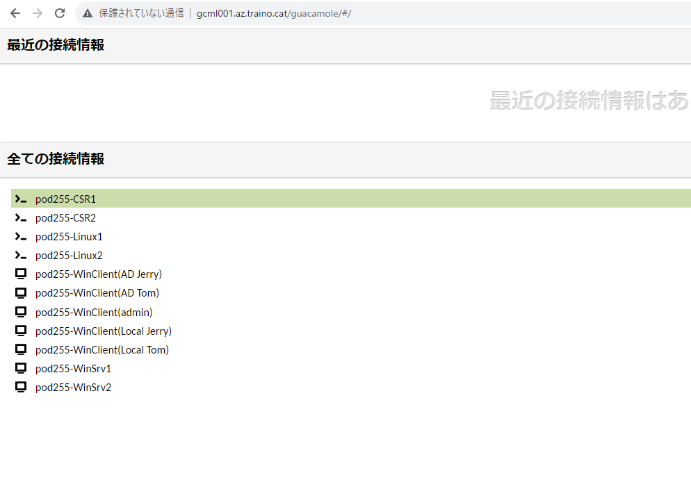
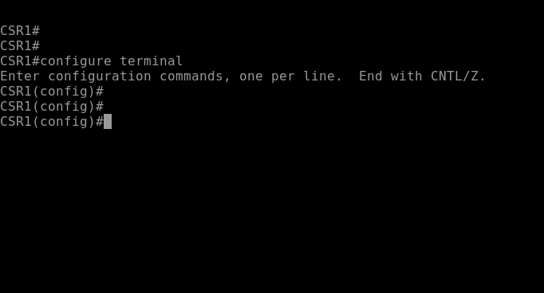

# Ciscoルータで基本的なルーティングを設定する
---

## 概要
この演習では、Ciscoルータのルーティングを手作業で設定します。
ルーティングテーブルに静的経路(Static Route)を作成するコマンドを実行し、新しいルーティングエントリを追加します。

## 演習の意図とデバイスの役割
    演習ガイドを参照して「演習の意図とデバイスの役割」をあらかじめ確認してください

## 注意
- 手順例の画像は<B>pod255</B>に準拠したパラメータのものです
- 手順内の<B>X</B>表記はご自身のpod番号に読み替えてください

---

## 1. ルータ1にStatic Routeを作成する

1. ルータ1の管理画面に接続する  

1. 管理画面のプロンプト表記を確認し、ルータ1に接続していることを確認する  

1. 以下のコマンドを実行し、特権モードからグローバルコンフィギュレーションモードに遷移する  
    Router1# ***congirure terminal***  

1. Static Routeを作成するコマンドを実行する
    Router1(config)# ***ip route 10.X.3.0 mask 255.255.255.0 10.X.2.254***

---

