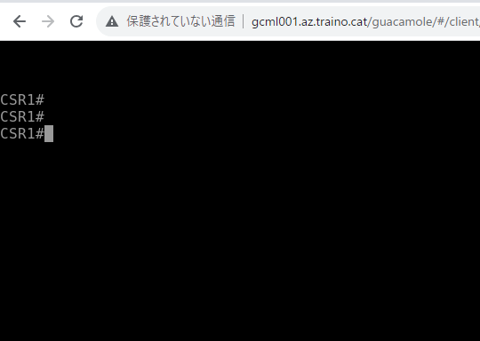
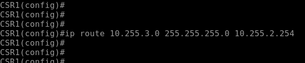
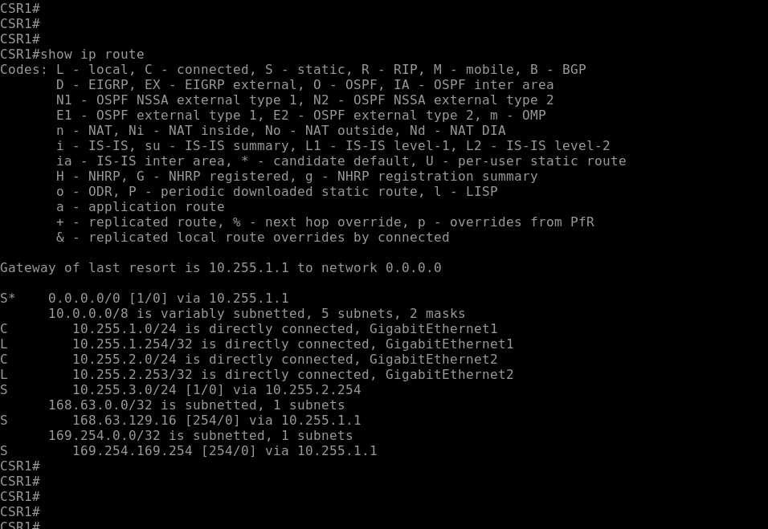
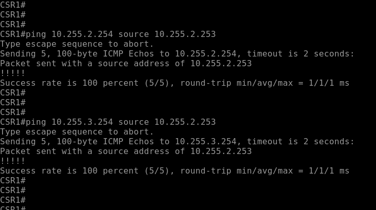
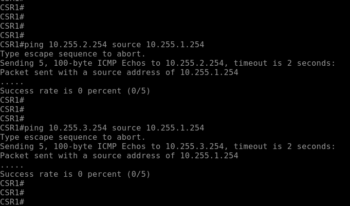

# Ciscoルータで基本的なルーティングを設定する
---

## 概要
この演習では、Ciscoルータのルーティングを手作業で設定します。
ルーティングテーブルに静的経路(Static Route)を作成するコマンドを実行し、新しいルーティングエントリを追加します。

## 演習の意図
    演習ガイドを参照して演習の意図をあらかじめ確認してください

## 演習における役割と、環境のパラメータ
- X: ご自身のPod番号
- Router1: CSR1
- Router2: CSR2
- Network1: 10.X.1.0/24
- Network2: 10.X.2.0/24
- Network3: 10.X.3.0/24

## 注意
- 手順例の画像は<B>pod255</B>に準拠したパラメータのものです
- 手順内の<B>X</B>表記はご自身のpod番号に読み替えてください

---

## 1. ルータ1にStatic Routeを作成する

1. ルータ1の管理画面に接続する  
<kbd></kbd>
1. 管理画面のプロンプト表記を確認し、ルータ1に接続していることを確認する  
<kbd></kbd>
1. 以下のコマンドを実行し、特権モードからグローバルコンフィギュレーションモードに遷移する  
    Router1# ***congirure terminal***  
<kbd></kbd>
1. Router1からNetwork3(10.X.3.0/24)宛のStatic Routeを作成するコマンドを実行する  
    Router1(config)# ***ip route 10.X.3.0 mask 255.255.255.0 10.X.2.254***
<kbd></kbd>

---

## 2. ルータ1のStatic Routeを確認する
1. 以下のコマンドを実行し、グローバルコンフィギュレーションモードから特権モードに遷移する  
    Router1(config)# ***end***  
<kbd></kbd>
1. 以下のコマンドを実行し、ルータ1のルーティングテーブルを表示する  
    Router1# ***show ip route***  
1. ルーティングテーブルに、Router2をNext Hop(10.X.2.254)とするNetwork3(10.X.3.0/24)宛の経路情報が登録されていることを確認する  
<kbd></kbd>
1. 以下のコマンドを実行し、ルータ1のNetwork2のインターフェイスからルータ2への疎通を確認する  
    Router1# ***ping 10.X.2.254 source 10.X.2.253***
    Router1# ***ping 10.X.3.254 source 10.X.2.253***
<kbd></kbd>
1. 以下のコマンドを実行し、ルータ1のNetwork1のインターフェイスからからルータ2への疎通がまだ確立できないことを確認する  
    Router1# ***ping 10.X.2.254 source 10.X.1.254***
    Router1# ***ping 10.X.3.254 source 10.X.1.254***
<kbd></kbd>

---
