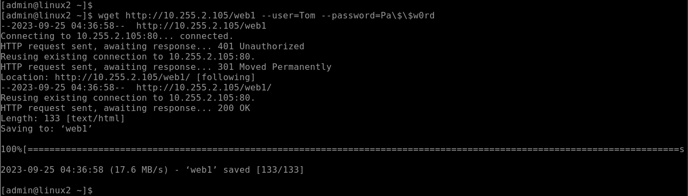
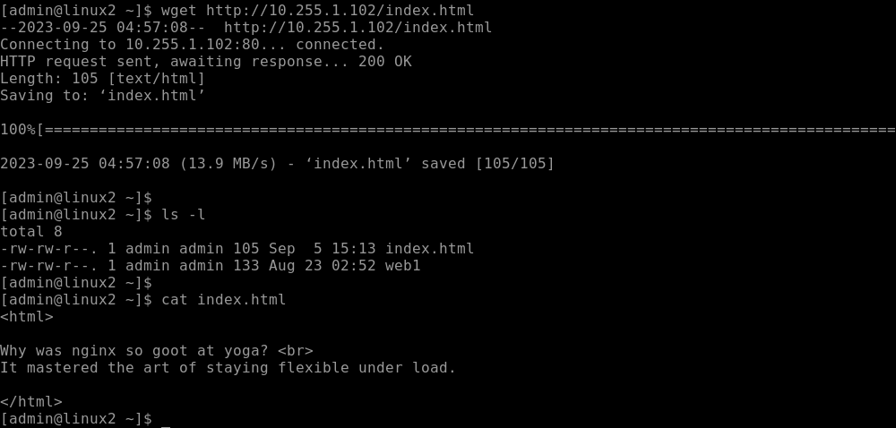

# Ciscoルータで実用的な企業ネットワークを構成する
---

## 概要
Ciscoルータで実用的な企業ネットワークを構成します。


## 演習の意図
    演習ガイドを参照して演習の意図をあらかじめ確認してください

## 演習の前提条件  
- Linux1のWebサーバー(NGINX)が構成済みであること
- Linux1のDNSサーバー(BIND)が構成済みであること
- Windows Server 2の Webサーバー(IIS)が構成済みであること
- Windows Server 2の DNSサーバーが構成済みであること

## 演習における役割と、環境のパラメータ
- X: ご自身のPod番号
- Router1: CSR1
- Router2: CSR2
- Network1: 10.X.1.0/24
- Network2: 10.X.2.0/24
- Network3: 10.X.3.0/24


## 注意
- 手順例の画像は<B>pod255</B>に準拠したパラメータのものです
- 手順内の<B>X</B>表記はご自身のpod番号に読み替えてください

---

## フィルタ前の動作確認

1. Web
    ＞ `wget http://10.255.2.105/web1 --user=Tom --password=Pa\$\$w0rd`
    ＞ ls  
    ＞ cat web1


    > 【補足】
    > \$記号はBashにおいて特別な効果がある記号文字です。  
    > そのため、パスワード文字列としてそのまま入力することはできません。  
    > \$記号をただの文字として使用するためには、バックスラッシュ(\もしくは￥)記号を付与してエスケープします。   


    ```
    [admin@linux2 ~]$ wget http://10.255.2.105/web1 --user=Tom --password=Pa\$\$w0rd
    --2023-09-25 04:36:58--  http://10.255.2.105/web1
    Connecting to 10.255.2.105:80... connected.
    HTTP request sent, awaiting response... 401 Unauthorized
    Reusing existing connection to 10.255.2.105:80.
    HTTP request sent, awaiting response... 301 Moved Permanently
    Location: http://10.255.2.105/web1/ [following]
    --2023-09-25 04:36:58--  http://10.255.2.105/web1/
    Reusing existing connection to 10.255.2.105:80.
    HTTP request sent, awaiting response... 200 OK
    Length: 133 [text/html]
    Saving to: ‘web1’

    100%[==============================================>] 133         --.-K/s   in 0s      

    2023-09-25 04:36:58 (17.6 MB/s) - ‘web1’ saved [133/133]

    [admin@linux2 ~]$ 
    [admin@linux2 ~]$ ls -l
    total 12
    -rw-rw-r--. 1 admin admin  133 Aug 23 02:52 web1
    [admin@linux2 ~]$ 
    [admin@linux2 ~]$ cat web1
    <html>

    <font size="7">
    Let's HTML document!
    </font>

    

    <a href="document.txt">
    link
    </a>

    </html>

    [admin@linux2 ~]$ 
    ```


    <kbd></kbd>  


wget http://10.X.1.102/index.html


    ```
    [admin@linux2 ~]$ wget http://10.255.1.102/index.html
    --2023-09-25 04:45:01--  http://10.255.1.102/index.html
    Connecting to 10.255.1.102:80... connected.
    HTTP request sent, awaiting response... 200 OK
    Length: 105 [text/html]
    Saving to: ‘index.html’

    100%[======================================================>] 105         --.-K/s   in 0s      

    2023-09-25 04:45:01 (7.76 MB/s) - ‘index.html’ saved [105/105]

    [admin@linux2 ~]$ 
    [admin@linux2 ~]$ ls -l
    total 8
    -rw-rw-r--. 1 admin admin 105 Sep  5 15:13 index.html
    -rw-rw-r--. 1 admin admin 133 Aug 23 02:52 web1
    [admin@linux2 ~]$ 
    [admin@linux2 ~]$ cat index.html 
    <html>

    Why was nginx so goot at yoga? <br>
    It mastered the art of staying flexible under load.

    </html>
    [admin@linux2 ~]$ 
    ```


    <kbd></kbd>  


1. DNS nslookupツールをインストールする 
    ＞ sudo yum -y install bind-utils
    ＞ yum list installed | grep bind-utils


<details>
<summary>[参考]yum実行時のログ出力例 (クリックで表示):</summary>

    ```
    [admin@linux2 ~]$ sudo yum -y install bind-utils
    Loaded plugins: langpacks
    Resolving Dependencies
    --> Running transaction check
    ---> Package bind-utils.x86_64 32:9.11.4-26.P2.el7_9.14 will be installed
    --> Finished Dependency Resolution

    Dependencies Resolved

    ========================================================================================================================================================================================
    Package                                 Arch                                Version                                               Repository                                      Size
    ========================================================================================================================================================================================
    Installing:
    bind-utils                              x86_64                              32:9.11.4-26.P2.el7_9.14                              updates-openlogic                              262 k

    Transaction Summary
    ========================================================================================================================================================================================
    Install  1 Package

    Total download size: 262 k
    Installed size: 584 k
    Downloading packages:
    bind-utils-9.11.4-26.P2.el7_9.14.x86_64.rpm                                                                                                                      | 262 kB  00:00:00     
    Running transaction check
    Running transaction test
    Transaction test succeeded
    Running transaction
    Installing : 32:bind-utils-9.11.4-26.P2.el7_9.14.x86_64                                                                                                                           1/1 
    Verifying  : 32:bind-utils-9.11.4-26.P2.el7_9.14.x86_64                                                                                                                           1/1 

    Installed:
    bind-utils.x86_64 32:9.11.4-26.P2.el7_9.14                                                                                                                                            

    Complete!
    [admin@linux2 ~]$ yum list installed | grep bind-utils
    bind-utils.x86_64              32:9.11.4-26.P2.el7_9.14       @updates-openlogic
    [admin@linux2 ~]$ 
    ```

</details>


1. Windows Server 1 と Windows Server 2のDNSに問い合わせできることを確認する  
    ＞ nslookup  
    ＞ server 10.X.1.104  
    ＞ Web1.example.local.  
    ＞ server 10.X.2.105   
    ＞ exit  


    ```
    [admin@linux2 ~]$ nslookup
    > server 10.255.1.104
    Default server: 10.255.1.104
    Address: 10.255.1.104#53
    > 
    > Web1.example.local.
    Server:10.255.1.104
    Address:10.255.1.104#53

    Web1.example.local canonical name = WSrv2-230802255.example.local.
    Name:WSrv2-230802255.example.local
    Address: 10.255.2.105
    > 
    > server 10.255.2.105
    Default server: 10.255.2.105
    Address: 10.255.2.105#53
    > 
    > Web2.example.local.
    Server:10.255.2.105
    Address:10.255.2.105#53

    Web2.example.localc anonical name = Linux1.example.local.
    Name:Linux1.example.local
    Address: 10.255.1.102
    > 
    > exit
    [admin@linux2 ~]$
    ```


## Router2(CSR2)のACLを構成する  

Linux2(10.X.3.106)からWindows Server 1(10.X.1.104)へのDNS問い合わせを許可する  
NW3(10.X.3.0/24)から、NW1(10.X.1.0/24)へのアクセスを禁止する  
全ホストから、Windows Server 2のWebサービスへのアクセスを許可する  
これ以外のすべての通信を拒否し、logにカウントする  


CSR2(config)# ip access-list extended ACL_PACKETFILTER   
CSR2(config-ext-nacl)# do show ip access-list ACL_PACKETFILTER
Extended IP access list ACL_PACKETFILTER
CSR2(config-ext-nacl)#
CSR2(config-ext-nacl)# permit udp host 10.255.3.106 host 10.255.1.104 eq 53  
CSR2(config-ext-nacl)# exit  
CSR2(config)# do show ip access-list ACL_PACKETFILTER             
Extended IP access list ACL_PACKETFILTER
    10 permit udp host 10.255.3.106 host 10.255.1.104 eq domain
CSR2(config)# 


<!--
ネットワークデバイスの一部機能を安定提供するために時刻合わせが必要になる場合があります。  
例えば、DHCPサーバー機能は時刻のズレがあると安定動作しない場合があります。
-->
CSR2# show clock  
7:58:03.663 UTC Mon Sep 25 2023
CSR2# 
CSR2# conf t
CSR2(config)# timezone JST 9 
CSR2(config)# end
CSR2#
CSR2# show clock  
16:00:03.663 JST Mon Sep 25 2023
CSR2#

    (option)
    CSR2# clock set 16:00:00 Sep 25 2023 
    CSR2#

CSR2# conf t
CSR2(config)# 
CSR2(config)# time-range WEEKDAYS 
CSR2(config-time-range)# periodic Monday Friday 00:00 to 23:59 
CSR2(config-time-range)# exit
CSR2(config)# 
CSR2(config)# do show time-range        
time-range entry: WEEKDAYS (active)
   periodic Monday Friday 0:00 to 23:59
CSR2(config)#  

CSR2(config)# ip access-list extended ACL_PACKETFILTER  
CSR2(config-ext-nacl)# 20 deny ip 10.255.3.0 0.0.0.255 10.255.1.0 0.0.0.255 time-range WEEKDAYS
CSR2(config-ext-nacl)# do show ip access-list ACL_PACKETFILTER                            
Extended IP access list ACL_PACKETFILTER
    10 permit udp host 10.255.3.106 host 10.255.1.104 eq domain
    20 deny ip 10.255.3.0 0.0.0.255 10.255.1.0 0.0.0.255 time-range WEEKDAYS (active)
CSR2(config-ext-nacl)#


CSR2(config)# ip access-list extended ACL_PACKETFILTER  
CSR2(config-ext-nacl)# 30 permit tcp any host 10.255.2.105 eq 80 443 1080 


<!--
宛先ポート番号の指定を複数個記述することもできます。  
-->
CSR2(config-ext-nacl)# 99 deny ip any any log 
CSR2(config-ext-nacl)# exit
CSR2(config)# do 
CSR2(config)# do sh ip access-list ACL_PACKETFILTER              
Extended IP access list ACL_PACKETFILTER
    10 permit udp host 10.255.3.106 host 10.255.1.104 eq domain
    20 deny ip 10.255.3.0 0.0.0.255 10.255.1.0 0.0.0.255 time-range WEEKDAYS (active)
    30 permit tcp any host 10.255.2.105 eq www 443 1080
    99 deny ip any any log
CSR2(config)#


CSR2(config)# interface GigabitEthernet 2
CSR2(config-if)# ip access-group ACL_PACKETFILTER in
CSR2(config-if)# exit
CSR2(config)# end
CSR2# 
CSR2#show ip interface GigabitEthernet 2 
GigabitEthernet2 is up, line protocol is up
  Internet address is 10.255.3.254/24
  Broadcast address is 255.255.255.255
  Address determined by DHCP
  MTU is 1500 bytes
  Helper address is not set
  Directed broadcast forwarding is disabled
  Outgoing Common access list is not set 
  Outgoing access list is not set
  Inbound Common access list is not set 
  Inbound  access list is ACL_PACKETFILTER                      ← "ACL_PACKETFILTER"がインターフェイスに適用されていることを確認する  
  Proxy ARP is enabled
  Local Proxy ARP is disabled
CSR2# 


保存
    CSR2# write

## 動作確認  


1. Web
    ＞ `wget http://10.255.2.105/web1 --user=Tom --password=Pa\$\$w0rd`
    ＞ ls  
    ＞ cat web1

    ```
    [admin@linux2 ~]$ wget http://10.255.2.105/web1 --user=Tom --password=Pa\$\$w0rd
    --2023-09-25 08:29:18--  http://10.255.2.105/web1
    Connecting to 10.255.2.105:80... connected.
    HTTP request sent, awaiting response... 401 Unauthorized
    Reusing existing connection to 10.255.2.105:80.
    HTTP request sent, awaiting response... 301 Moved Permanently
    Location: http://10.255.2.105/web1/ [following]
    --2023-09-25 08:29:18--  http://10.255.2.105/web1/
    Reusing existing connection to 10.255.2.105:80.
    HTTP request sent, awaiting response... 200 OK
    Length: 133 [text/html]
    Saving to: ‘web1.1’

    100%[=======================================>] 133         --.-K/s   in 0s      

    2023-09-25 08:29:18 (19.5 MB/s) - ‘web1.1’ saved [133/133]

    [admin@linux2 ~]$ 
    [admin@linux2 ~]$ ls -l
    total 16
    -rw-rw-r--. 1 admin admin 105 Sep  5 15:13 index.html
    -rw-rw-r--. 1 admin admin 133 Aug 23 02:52 web1
    -rw-rw-r--. 1 admin admin 133 Aug 23 02:52 web1.1
    [admin@linux2 ~]$ 
    [admin@linux2 ~]$ cat web1.1
    <html>

    <font size="7">
    Let's HTML document!
    </font>

    

    <a href="document.txt">
    link
    </a>

    </html>

    [admin@linux2 ~]$ 
    ```

Linux1 
    ＞ wget http://10.X.1.102/index.html

    ```
    [admin@linux2 ~]$ wget http://10.255.1.102/index.html
    --2023-09-25 08:19:23--  http://10.255.1.102/index.html
    Connecting to 10.255.1.102:80... failed: No route to host.
    [admin@linux2 ~]$ 
    ```


CSR2# show ip access-lists ACL_PACKETFILTER
Extended IP access list ACL_PACKETFILTER
    10 permit udp host 10.255.3.106 host 10.255.1.104 eq domain (2 matches)
    20 deny ip 10.255.3.0 0.0.0.255 10.255.1.0 0.0.0.255 time-range WEEKDAYS (active) (4 matches)
    30 permit tcp any host 10.255.2.105 eq www 443 1080 (32 matches)
    99 deny ip any any log (17 matches)
CSR2#


## NAPTを構成する  

CSR1(config)# ip access-list Standard ACL_NAPT  
CSR1(config-std-nacl)# permit 10.255.1.0 0.0.0.255  
CSR1(config-std-nacl)# exit  
CSR1(config)# ip nat inside source list ACL_NAPT interface GigabitEthernet 2 overload   

CSR1(config)# interface gigabitEthernet 1
CSR1(config-if)# ip nat inside 
CSR1(config-if)# exit 
CSR1(config)# interface gigabitEthernet 2
CSR1(config-if)# ip nat outside 
CSR1(config-if)# exit  
CSR1(config)# exit  

CSR1(config)# end  
CSR1# write   


CSR1(config)# end 


CSR1#show ip nat translations 
Pro  Inside global         Inside local          Outside local         Outside global
udp  10.255.2.253:513      10.255.1.104:53       10.255.2.105:57013    10.255.2.105:57013
tcp  10.255.2.253:5063     10.255.1.103:60735    10.255.2.105:80       10.255.2.105:80
udp  10.255.2.253:513      10.255.1.104:53       10.255.2.105:59623    10.255.2.105:59623
udp  10.255.2.253:513      10.255.1.104:53       10.255.2.105:64805    10.255.2.105:64805
tcp  10.255.2.253:5065     10.255.1.103:60739    10.255.2.105:1080     10.255.2.105:1080
udp  10.255.2.253:512      10.255.1.104:389      10.255.2.105:57013    10.255.2.105:57013
tcp  10.255.2.253:5062     10.255.1.103:60734    10.255.2.105:80       10.255.2.105:80
udp  10.255.2.253:513      10.255.1.104:53       10.255.2.105:61280    10.255.2.105:61280
udp  10.255.2.253:513      10.255.1.104:53       10.255.2.105:50277    10.255.2.105:50277
tcp  10.255.2.253:5064     10.255.1.103:60736    10.255.2.105:80       10.255.2.105:80
udp  10.255.2.253:513      10.255.1.104:53       10.255.2.105:59624    10.255.2.105:59624
udp  10.255.2.253:512      10.255.1.104:389      10.255.2.105:59731    10.255.2.105:59731
Total number of translations: 12

CSR1#


Webサーバーのログをみる


## 静的ルーティングを削除する  

1. Router1(CSR1)のStatic Routeを削除する  
    1. Router1(CSR1)の管理画面に接続する 

    1. 以下のコマンドを実行し、10.0.0.0/8ネットワークについて現在のルーティングエントリを確認する    
        ＞ ***show ip route 10.0.0.0***  

        ```
        CSR1#show ip route 10.0.0.0
        Routing entry for 10.0.0.0/8, 5 known subnets
        Attached (4 connections)
        Variably subnetted with 2 masks
        C        10.255.1.0/24 is directly connected, GigabitEthernet1
        L        10.255.1.254/32 is directly connected, GigabitEthernet1
        C        10.255.2.0/24 is directly connected, GigabitEthernet2
        L        10.255.2.253/32 is directly connected, GigabitEthernet2
        S        10.255.3.0/24 [1/0] via 10.255.2.254
        CSR1#
        ```

        > 【確認ポイント】
        > 10.X.3.0/24ネットワーク宛のルーティング情報として、Router2(CSR2)をNextHopとするStatic Routeが認識されていることを確認する  


    1. 以下のコマンドを実行し、特権モードからグローバルコンフィギュレーションモードに遷移する  
        ＞ ***conf t***  

        ```
        CSR1#conf t
        Enter configuration commands, one per line.  End with CNTL/Z.
        CSR1(config)#
        CSR1(config)#
        ```

    1. 以下のコマンドを実行し、Router1(CSR1)に作成されているStatic Routeを削除する    
        ＞ ***no ip route 10.X.3.0 255.255.255.0 10.X.2.254***  
        ＞ ***end***  
        ＞ ***show ip route 10.0.0.0***  

        ```
        CSR1(config)#no ip route 10.255.3.0 255.255.255.0 10.255.2.254
        CSR1(config)#end
        CSR1#show ip route 10.0.0.0
        Routing entry for 10.0.0.0/8, 4 known subnets
        Attached (4 connections)
        Variably subnetted with 2 masks
        C        10.255.1.0/24 is directly connected, GigabitEthernet1
        L        10.255.1.254/32 is directly connected, GigabitEthernet1
        C        10.255.2.0/24 is directly connected, GigabitEthernet2
        L        10.255.2.253/32 is directly connected, GigabitEthernet2
        CSR1#
        ```

1. Router2(CSR2)のStatic Routeを削除する  
    1. Router2(CSR2)の管理画面に接続する 

    1. 以下のコマンドを実行し、10.0.0.0/8ネットワークについて現在のルーティングエントリを確認する    
        ＞ ***show ip route 10.0.0.0***  

        ```
        CSR2#show ip route 10.0.0.0
        Routing entry for 10.0.0.0/8, 5 known subnets
        Attached (4 connections)
        Variably subnetted with 2 masks
        S        10.255.1.0/24 [1/0] via 10.255.2.253
        C        10.255.2.0/24 is directly connected, GigabitEthernet1
        L        10.255.2.254/32 is directly connected, GigabitEthernet1
        C        10.255.3.0/24 is directly connected, GigabitEthernet2
        L        10.255.3.254/32 is directly connected, GigabitEthernet2
        CSR2#
        ```

        > 【確認ポイント】
        > 10.X.1.0/24ネットワーク宛のルーティング情報として、Router1(CSR1)をNextHopとするStatic Routeが認識されていることを確認する  


    1. 以下のコマンドを実行し、Router2(CSR2)に作成されているStatic Routeを削除する    
        ＞ ***conf t***  
        ＞ ***no ip route 10.X.1.0 255.255.255.0 10.X.2.253***  
        ＞ ***end***  
        ＞ ***show ip route 10.0.0.0***  

        ```
        CSR2#show ip route 10.0.0.0
        CSR2#conf t
        Enter configuration commands, one per line.  End with CNTL/Z.
        CSR2(config)#   
        CSR2(config)#no ip route 10.255.1.0 255.255.255.0 10.255.2.253
        CSR2(config)#end
        CSR2#show ip route 10.0.0.0
        Routing entry for 10.0.0.0/8, 4 known subnets
        Attached (4 connections)
        Variably subnetted with 2 masks
        C        10.255.2.0/24 is directly connected, GigabitEthernet1
        L        10.255.2.254/32 is directly connected, GigabitEthernet1
        C        10.255.3.0/24 is directly connected, GigabitEthernet2
        L        10.255.3.254/32 is directly connected, GigabitEthernet2
        CSR2#
        ```

1. リモートネットワーク間(10.X.1.0/24と10.X.3.0//24間)の通信ができなくなったことを確認する
    1. Router2(CSR2)の管理画面に接続する 

    1. 以下のコマンドを実行し、10.0.0.0/8ネットワークについて現在のルーティングエントリを確認する    
        ＞ ***ping 10.X.1.254 source 10.X.3.254***  

        ```
        CSR2#ping 10.255.1.254 source 10.255.3.254
        Type escape sequence to abort.
        Sending 5, 100-byte ICMP Echos to 10.255.1.254, timeout is 2 seconds:
        Packet sent with a source address of 10.255.3.254 
        .....
        Success rate is 0 percent (0/5)
        CSR2#
        ```


## Router1(CSR1)で、BGPピアリングを構成する  

1. Router1(CSR1)の管理画面に接続する 

1. 以下のコマンドを実行し、特権モードからグローバルコンフィギュレーションモードに遷移する  
    ＞ ***conf t***  

    ```
    CSR1#conf t
    Enter configuration commands, one per line.  End with CNTL/Z.
    CSR1(config)#
    ```


1. 以下のコマンドを実行し、AS番号 65001 としてBGPプロセスをRouter-ID 10.X.100.1で開始する  
    ＞ ***router bgp 65001***
    ＞ ***bgp router-id 10.X.100.1***

    ```
    CSR1(config)#router bgp 65001
    CSR1(config-router)#bgp router-id 10.255.100.1
    ```


1. 以下のコマンドを実行し、BGPプロセスが開始されたことを確認する    
    ＞ ***do show ip protocols***

    ```
    CSR1(config-router)#do show ip protocols
    *** IP Routing is NSF aware ***

    Routing Protocol is "application"
    Sending updates every 0 seconds
    Invalid after 0 seconds, hold down 0, flushed after 0
    Outgoing update filter list for all interfaces is not set
    Incoming update filter list for all interfaces is not set
    Maximum path: 32
    Routing for Networks:
    Routing Information Sources:
        Gateway         Distance      Last Update
    Distance: (default is 4)

    Routing Protocol is "bgp 65001"
    Outgoing update filter list for all interfaces is not set
    Incoming update filter list for all interfaces is not set
    IGP synchronization is disabled
    Automatic route summarization is disabled
    Maximum path: 1
    Routing Information Sources:
        Gateway         Distance      Last Update
    Distance: external 20 internal 200 local 200

    CSR1(config-router)#
    ```

    > 【確認ポイント】
    > Routing Protocol is "bgp 65001" のセクションが表示されていることを確認する  

1. 以下のコマンドを実行し、AS番号 65001 としてBGPプロセスをRouter-ID 10.X.100.1で開始する  
    ＞ ***router bgp 65001***
    ＞ ***bgp router-id 10.X.100.1***

    ```
    CSR1(config)#router bgp 65001
    CSR1(config-router)#bgp router-id 10.255.100.1
    ```


    CSR1(config-router)#neighbor 10.255.2.254 remote-as 65002

    CSR1(config-router)#do show ip bgp summary
    BGP router identifier 10.255.100.1, local AS number 65001
    BGP table version is 1, main routing table version 1

    Neighbor        V           AS MsgRcvd MsgSent   TblVer  InQ OutQ Up/Down  State/PfxRcd
    10.255.2.254    4        65002       0       0        1    0    0 00:00:03 Idle

    CSR1(config-router)#


    StateがIdleであることを確認する


## Router2(CSR2)で、BGPピアリングを構成する  


1. Router2(CSR2)の管理画面に接続する 

1. 以下のコマンドを実行し、AS番号 65002 としてBGPプロセスをRouter-ID 10.X.100.2で開始する  
    CSR2(config)#router bgp  65002
    CSR2(config-router)#bgp router-id 10.255.100.2
    CSR2(config-router)#do show ip protocols
    *** IP Routing is NSF aware ***

    Routing Protocol is "application"
    Sending updates every 0 seconds
    Invalid after 0 seconds, hold down 0, flushed after 0
    Outgoing update filter list for all interfaces is not set
    Incoming update filter list for all interfaces is not set
    Maximum path: 32
    Routing for Networks:
    Routing Information Sources:
        Gateway         Distance      Last Update
    Distance: (default is 4)

    Routing Protocol is "bgp 65002"
    Outgoing update filter list for all interfaces is not set
    Incoming update filter list for all interfaces is not set
    IGP synchronization is disabled
    Automatic route summarization is disabled
    Maximum path: 1
    Routing Information Sources:
        Gateway         Distance      Last Update
    Distance: external 20 internal 200 local 200

    CSR2(config-router)#


1. 以下のコマンドを実行し、Router1(CSR1)をAS番号65001のBGPネイバーとして構成する   
    ＞ ***neighbor 10.255.2.253 remote-as 65001***

    ```
    CSR2(config-router)#neighbor 10.255.2.253 remote-as 65001
    ```


1. 以下のコマンドを実行し、Router1(CSR1)とRouter2(CSR2)がBGPのピアリング関係を構築していることを確認する  
    ＞ ***do show ip bgp summary***

    ```
    CSR2(config-router)#do show ip bgp summary
    BGP router identifier 10.255.100.2, local AS number 65002
    BGP table version is 1, main routing table version 1

    Neighbor        V           AS MsgRcvd MsgSent   TblVer  InQ OutQ Up/Down  State/PfxRcd
    10.255.2.253    4        65001       4       4        1    0    0 00:00:02        0
    ```

    
    > 【確認ポイント】
    > 10.X.2.253(Router1/CSR1)のエントリの "State/PfxRcd" が 0 であること (Idleでないこと) を確認する。  


1. Router2(CSR2)が、まだ経路情報をRouter1(CSR1)から受信していないことを確認する  
    ＞ ***do show ip route***

    ```
    CSR2(config-router)#do show ip route
    Codes: L - local, C - connected, S - static, R - RIP, M - mobile, B - BGP
        D - EIGRP, EX - EIGRP external, O - OSPF, IA - OSPF inter area 
        N1 - OSPF NSSA external type 1, N2 - OSPF NSSA external type 2
        E1 - OSPF external type 1, E2 - OSPF external type 2, m - OMP
        n - NAT, Ni - NAT inside, No - NAT outside, Nd - NAT DIA
        i - IS-IS, su - IS-IS summary, L1 - IS-IS level-1, L2 - IS-IS level-2
        ia - IS-IS inter area, * - candidate default, U - per-user static route
        H - NHRP, G - NHRP registered, g - NHRP registration summary
        o - ODR, P - periodic downloaded static route, l - LISP
        a - application route
        + - replicated route, % - next hop override, p - overrides from PfR
        & - replicated local route overrides by connected

    Gateway of last resort is 10.255.2.1 to network 0.0.0.0

    S*    0.0.0.0/0 [1/0] via 10.255.2.1
        10.0.0.0/8 is variably subnetted, 4 subnets, 2 masks
    C        10.255.2.0/24 is directly connected, GigabitEthernet1
    L        10.255.2.254/32 is directly connected, GigabitEthernet1
    C        10.255.3.0/24 is directly connected, GigabitEthernet2
    L        10.255.3.254/32 is directly connected, GigabitEthernet2
        168.63.0.0/32 is subnetted, 1 subnets
    S        168.63.129.16 [254/0] via 10.255.2.1
        169.254.0.0/32 is subnetted, 1 subnets
    S        169.254.169.254 [254/0] via 10.255.2.1
    CSR2(config-router)#
    ```

    > 【確認ポイント】
    > ルーティングエントリ左端のCodeが "B" (BGP)である経路は、まだRouter1(CSR1)のルーティングテーブルには存在しないことを確認する。  


1. 以下のコマンドを実行し、Router1(CSR1)とRouter2(CSR2)がBGPのピアリング関係を構築していることを確認する  
    ＞ ***do show ip bgp summary***

    ```
    CSR1(config-router)#do show ip bgp summary
    BGP router identifier 10.255.100.1, local AS number 65001
    BGP table version is 1, main routing table version 1

    Neighbor        V           AS MsgRcvd MsgSent   TblVer  InQ OutQ Up/Down  State/PfxRcd
    10.255.2.254    4        65002       4       4        1    0    0 00:00:20        0
    ```

    > 【確認ポイント】
    > 10.X.2.254(Router2/CSR2)のエントリの "State/PfxRcd" が 0 であること (Idleでないこと) を確認する。  


1. Router1(CSR1)が、まだ経路情報をRouter2(CSR2)から受信していないことを確認する  
    ＞ ***do show ip route***

    ```
    CSR1(config-router)#do show ip route
    Codes: L - local, C - connected, S - static, R - RIP, M - mobile, B - BGP
        D - EIGRP, EX - EIGRP external, O - OSPF, IA - OSPF inter area 
        N1 - OSPF NSSA external type 1, N2 - OSPF NSSA external type 2
        E1 - OSPF external type 1, E2 - OSPF external type 2, m - OMP
        n - NAT, Ni - NAT inside, No - NAT outside, Nd - NAT DIA
        i - IS-IS, su - IS-IS summary, L1 - IS-IS level-1, L2 - IS-IS level-2
        ia - IS-IS inter area, * - candidate default, U - per-user static route
        H - NHRP, G - NHRP registered, g - NHRP registration summary
        o - ODR, P - periodic downloaded static route, l - LISP
        a - application route
        + - replicated route, % - next hop override, p - overrides from PfR
        & - replicated local route overrides by connected

    Gateway of last resort is 10.255.1.1 to network 0.0.0.0

    S*    0.0.0.0/0 [1/0] via 10.255.1.1
        10.0.0.0/8 is variably subnetted, 4 subnets, 2 masks
    C        10.255.1.0/24 is directly connected, GigabitEthernet1
    L        10.255.1.254/32 is directly connected, GigabitEthernet1
    C        10.255.2.0/24 is directly connected, GigabitEthernet2
    L        10.255.2.253/32 is directly connected, GigabitEthernet2
        168.63.0.0/32 is subnetted, 1 subnets
    S        168.63.129.16 [254/0] via 10.255.1.1
        169.254.0.0/32 is subnetted, 1 subnets
    S        169.254.169.254 [254/0] via 10.255.1.1
    CSR1(config-router)#
    ```

    > 【確認ポイント】
    > ルーティングエントリ左端のCodeが "B" (BGP)である経路は、まだRouter1(CSR1)のルーティングテーブルには存在しないことを確認する。  


Static Routeを削除する


## 


1. 以下のコマンドを実行し、特権モードからグローバルコンフィギュレーションモードに遷移する  
    Router1# ***configure terminal***  

アドレスファミリでかく  
BGP peer をくむ  
物理NWをアドバタイズさせる  

(option)
loopback
再配送

filterring

コミュニティでdropさせる


@@@@@@@@@@@@@@@@@@@@@@@@@@@@@@@@@@@@@@@@@@@@@@@@@@@@@@@@@@@@@@@@@@@@@@@@@@@@@@@@@@@@@@@@@@@@@@@@@@@@@@@@@@@@@@@@@@@@@@@@@@@@@@@@@@@
@@@@@@@@@@@@@@@@@@@@@@@@@@@@@@@@@@@@@@@@@@@@@@@@@@@@@@@@@@@@@@@@@@@@@@@@@@@@@@@@@@@@@@@@@@@@@@@@@@@@@@@@@@@@@@@@@@@@@@@@@@@@@@@@@@@
@@@@@@@@@@@@@@@@@@@@@@@@@@@@@@@@@@@@@@@@@@@@@@@@@@@@@@@@@@@@@@@@@@@@@@@@@@@@@@@@@@@@@@@@@@@@@@@@@@@@@@@@@@@@@@@@@@@@@@@@@@@@@@@@@@@
@@@@@@@@@@@@@@@@@@@@@@@@@@@@@@@@@@@@@@@@@@@@@@@@@@@@@@@@@@@@@@@@@@@@@@@@@@@@@@@@@@@@@@@@@@@@@@@@@@@@@@@@@@@@@@@@@@@@@@@@@@@@@@@@@@@
@@@@@@@@@@@@@@@@@@@@@@@@@@@@@@@@@@@@@@@@@@@@@@@@@@@@@@@@@@@@@@@@@@@@@@@@@@@@@@@@@@@@@@@@@@@@@@@@@@@@@@@@@@@@@@@@@@@@@@@@@@@@@@@@@@@


---
