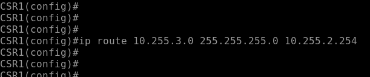
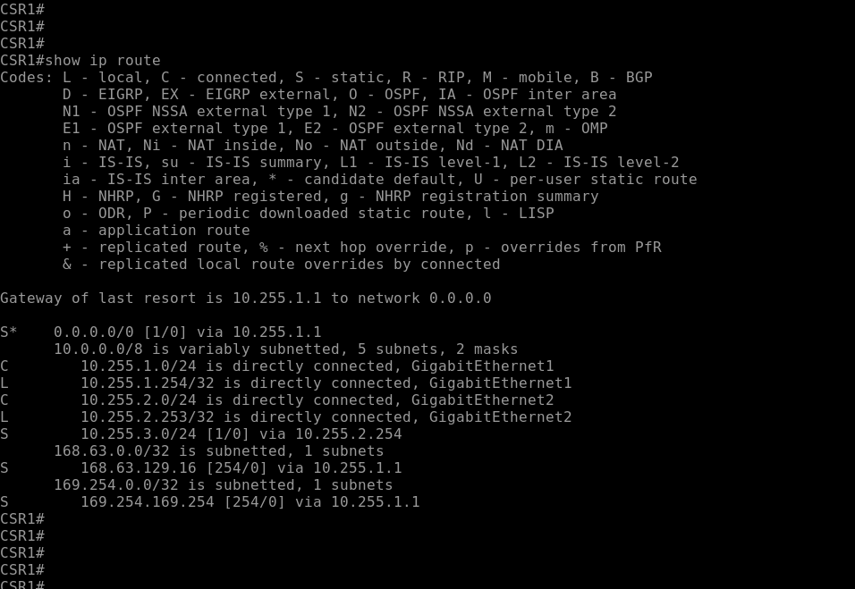
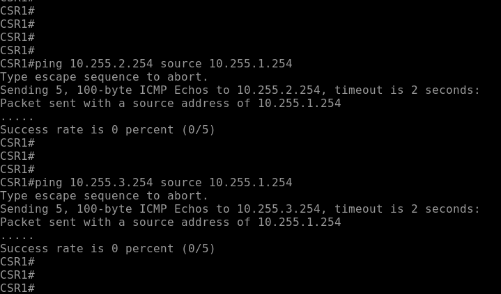

# Ciscoルータで実用的な企業ネットワークを構成する
---

## 概要
Ciscoルータで実用的な企業ネットワークを構成します。


## 演習の意図
    演習ガイドを参照して演習の意図をあらかじめ確認してください

## 演習の前提条件  
- Linux1のWebサーバー(NGINX)が構成済みであること
- Linux1のDNSサーバー(BIND)が構成済みであること
- Windows Server 2の Webサーバー(IIS)が構成済みであること


## 演習における役割と、環境のパラメータ
- X: ご自身のPod番号
- Router1: CSR1
- Router2: CSR2
- Network1: 10.X.1.0/24
- Network2: 10.X.2.0/24
- Network3: 10.X.3.0/24


## 注意
- 手順例の画像は<B>pod255</B>に準拠したパラメータのものです
- 手順内の<B>X</B>表記はご自身のpod番号に読み替えてください

---

## フィルタ前の動作確認

1. Web
    ＞ `wget http://10.255.2.105/web1 --user=Tom --password=Pa\$\$w0rd`
    ＞ ls  
    ＞ cat web1


    > 【補足】
    > \$記号はBashにおいて特別な効果がある記号文字です。  
    > そのため、パスワード文字列としてそのまま入力することはできません。  
    > \$記号をただの文字として使用するためには、バックスラッシュ(\もしくは￥)記号を付与してエスケープします。   


    ```
    [admin@linux2 ~]$ wget http://10.255.2.105/web1 --user=Tom --password=Pa\$\$w0rd
    --2023-09-25 04:36:58--  http://10.255.2.105/web1
    Connecting to 10.255.2.105:80... connected.
    HTTP request sent, awaiting response... 401 Unauthorized
    Reusing existing connection to 10.255.2.105:80.
    HTTP request sent, awaiting response... 301 Moved Permanently
    Location: http://10.255.2.105/web1/ [following]
    --2023-09-25 04:36:58--  http://10.255.2.105/web1/
    Reusing existing connection to 10.255.2.105:80.
    HTTP request sent, awaiting response... 200 OK
    Length: 133 [text/html]
    Saving to: ‘web1’

    100%[==============================================>] 133         --.-K/s   in 0s      

    2023-09-25 04:36:58 (17.6 MB/s) - ‘web1’ saved [133/133]

    [admin@linux2 ~]$ 
    [admin@linux2 ~]$ ls -l
    total 12
    -rw-rw-r--. 1 admin admin  133 Aug 23 02:52 web1
    [admin@linux2 ~]$ 
    [admin@linux2 ~]$ cat web1
    <html>

    <font size="7">
    Let's HTML document!
    </font>

    

    <a href="document.txt">
    link
    </a>

    </html>

    [admin@linux2 ~]$ 
    ```


    <kbd></kbd>  


wget http://10.X.1.102/index.html


    ```
    [admin@linux2 ~]$ wget http://10.255.1.102/index.html
    --2023-09-25 04:45:01--  http://10.255.1.102/index.html
    Connecting to 10.255.1.102:80... connected.
    HTTP request sent, awaiting response... 200 OK
    Length: 105 [text/html]
    Saving to: ‘index.html’

    100%[======================================================>] 105         --.-K/s   in 0s      

    2023-09-25 04:45:01 (7.76 MB/s) - ‘index.html’ saved [105/105]

    [admin@linux2 ~]$ 
    [admin@linux2 ~]$ ls -l
    total 8
    -rw-rw-r--. 1 admin admin 105 Sep  5 15:13 index.html
    -rw-rw-r--. 1 admin admin 133 Aug 23 02:52 web1
    [admin@linux2 ~]$ 
    [admin@linux2 ~]$ cat index.html 
    <html>

    Why was nginx so goot at yoga? <br>
    It mastered the art of staying flexible under load.

    </html>
    [admin@linux2 ~]$ 
    ```


    <kbd></kbd>  


1. DNS nslookupツールをインストールする 
    ＞ sudo yum -y install bind-utils
    ＞ yum list installed | grep bind-utils


<details>
<summary>[参考]yum実行時のログ出力例 (クリックで表示):</summary>

    ```
    [admin@linux2 ~]$ sudo yum -y install bind-utils
    Loaded plugins: langpacks
    Resolving Dependencies
    --> Running transaction check
    ---> Package bind-utils.x86_64 32:9.11.4-26.P2.el7_9.14 will be installed
    --> Finished Dependency Resolution

    Dependencies Resolved

    ========================================================================================================================================================================================
    Package                                 Arch                                Version                                               Repository                                      Size
    ========================================================================================================================================================================================
    Installing:
    bind-utils                              x86_64                              32:9.11.4-26.P2.el7_9.14                              updates-openlogic                              262 k

    Transaction Summary
    ========================================================================================================================================================================================
    Install  1 Package

    Total download size: 262 k
    Installed size: 584 k
    Downloading packages:
    bind-utils-9.11.4-26.P2.el7_9.14.x86_64.rpm                                                                                                                      | 262 kB  00:00:00     
    Running transaction check
    Running transaction test
    Transaction test succeeded
    Running transaction
    Installing : 32:bind-utils-9.11.4-26.P2.el7_9.14.x86_64                                                                                                                           1/1 
    Verifying  : 32:bind-utils-9.11.4-26.P2.el7_9.14.x86_64                                                                                                                           1/1 

    Installed:
    bind-utils.x86_64 32:9.11.4-26.P2.el7_9.14                                                                                                                                            

    Complete!
    [admin@linux2 ~]$ yum list installed | grep bind-utils
    bind-utils.x86_64              32:9.11.4-26.P2.el7_9.14       @updates-openlogic
    [admin@linux2 ~]$ 
    ```

</details>


1. Windows Server 1 と Windows Server 2のDNSに問い合わせできることを確認する  
    ＞ nslookup  
    ＞ server 10.X.1.104  
    ＞ Web1.example.local.  
    ＞ server 10.X.2.105   
    ＞ exit  


    ```
    [admin@linux2 ~]$ nslookup
    > server 10.255.1.104
    Default server: 10.255.1.104
    Address: 10.255.1.104#53
    > 
    > Web1.example.local.
    Server:10.255.1.104
    Address:10.255.1.104#53

    Web1.example.local canonical name = WSrv2-230802255.example.local.
    Name:WSrv2-230802255.example.local
    Address: 10.255.2.105
    > 
    > server 10.255.2.105
    Default server: 10.255.2.105
    Address: 10.255.2.105#53
    > 
    > Web2.example.local.
    Server:10.255.2.105
    Address:10.255.2.105#53

    Web2.example.localc anonical name = Linux1.example.local.
    Name:Linux1.example.local
    Address: 10.255.1.102
    > 
    > exit
    [admin@linux2 ~]$
    ```


## Router2(CSR2)のACLを構成する  

Linux2(10.X.3.106)からWindows Server 1(10.X.1.104)へのDNS問い合わせを許可する  
NW3(10.X.3.0/24)から、NW1(10.X.1.0/24)へのアクセスを禁止する  
全ホストから、Windows Server 2のWebサービスへのアクセスを許可する  
これ以外のすべての通信を拒否し、logにカウントする  


CSR2(config)# ip access-list extended ACL_PACKETFILTER   
CSR2(config-ext-nacl)# do show ip access-list ACL_PACKETFILTER
Extended IP access list ACL_PACKETFILTER
CSR2(config-ext-nacl)#
CSR2(config-ext-nacl)# permit udp host 10.255.3.106 host 10.255.1.104 eq 53  
CSR2(config-ext-nacl)# exit  
CSR2(config)# do show ip access-list ACL_PACKETFILTER             
Extended IP access list ACL_PACKETFILTER
    10 permit udp host 10.255.3.106 host 10.255.1.104 eq domain
CSR2(config)# 


<!--
ネットワークデバイスの一部機能を安定提供するために時刻合わせが必要になる場合があります。  
例えば、DHCPサーバー機能は時刻のズレがあると安定動作しない場合があります。
-->
CSR2# show clock  
7:58:03.663 UTC Mon Sep 25 2023
CSR2# 
CSR2# conf t
CSR2(config)# timezone JST 9 
CSR2(config)# end
CSR2#
CSR2# show clock  
16:00:03.663 JST Mon Sep 25 2023
CSR2#

    (option)
    CSR2# clock set 16:00:00 Sep 25 2023 
    CSR2#

CSR2# conf t
CSR2(config)# 
CSR2(config)# time-range WEEKDAYS 
CSR2(config-time-range)# periodic Monday Friday 00:00 to 23:59 
CSR2(config-time-range)# exit
CSR2(config)# 
CSR2(config)# do show time-range        
time-range entry: WEEKDAYS (active)
   periodic Monday Friday 0:00 to 23:59
CSR2(config)#  

CSR2(config)# ip access-list extended ACL_PACKETFILTER  
CSR2(config-ext-nacl)# 20 deny ip 10.255.3.0 0.0.0.255 10.255.1.0 0.0.0.255 time-range WEEKDAYS
CSR2(config-ext-nacl)# do show ip access-list ACL_PACKETFILTER                            
Extended IP access list ACL_PACKETFILTER
    10 permit udp host 10.255.3.106 host 10.255.1.104 eq domain
    20 deny ip 10.255.3.0 0.0.0.255 10.255.1.0 0.0.0.255 time-range WEEKDAYS (active)
CSR2(config-ext-nacl)#


CSR2(config)# ip access-list extended ACL_PACKETFILTER  
CSR2(config-ext-nacl)# 30 permit tcp any host 10.255.2.105 eq 80 443 1080 


<!--
宛先ポート番号の指定を複数個記述することもできます。  
-->
CSR2(config-ext-nacl)# 99 deny ip any any log 
CSR2(config-ext-nacl)# exit
CSR2(config)# do 
CSR2(config)# do sh ip access-list ACL_PACKETFILTER              
Extended IP access list ACL_PACKETFILTER
    10 permit udp host 10.255.3.106 host 10.255.1.104 eq domain
    20 deny ip 10.255.3.0 0.0.0.255 10.255.1.0 0.0.0.255 time-range WEEKDAYS (active)
    30 permit tcp any host 10.255.2.105 eq www 443 1080
    99 deny ip any any log
CSR2(config)#


CSR2(config)# interface GigabitEthernet 2
CSR2(config-if)# ip access-group ACL_PACKETFILTER in
CSR2(config-if)# exit
CSR2(config)# end
CSR2# 
CSR2#show ip interface GigabitEthernet 2 
GigabitEthernet2 is up, line protocol is up
  Internet address is 10.255.3.254/24
  Broadcast address is 255.255.255.255
  Address determined by DHCP
  MTU is 1500 bytes
  Helper address is not set
  Directed broadcast forwarding is disabled
  Outgoing Common access list is not set 
  Outgoing access list is not set
  Inbound Common access list is not set 
  Inbound  access list is ACL_PACKETFILTER                      ← "ACL_PACKETFILTER"がインターフェイスに適用されていることを確認する  
  Proxy ARP is enabled
  Local Proxy ARP is disabled
CSR2# 


## 動作確認  


1. Web
    ＞ `wget http://10.255.2.105/web1 --user=Tom --password=Pa\$\$w0rd`
    ＞ ls  
    ＞ cat web1

    ```
    [admin@linux2 ~]$ wget http://10.255.2.105/web1 --user=Tom --password=Pa\$\$w0rd
    --2023-09-25 08:29:18--  http://10.255.2.105/web1
    Connecting to 10.255.2.105:80... connected.
    HTTP request sent, awaiting response... 401 Unauthorized
    Reusing existing connection to 10.255.2.105:80.
    HTTP request sent, awaiting response... 301 Moved Permanently
    Location: http://10.255.2.105/web1/ [following]
    --2023-09-25 08:29:18--  http://10.255.2.105/web1/
    Reusing existing connection to 10.255.2.105:80.
    HTTP request sent, awaiting response... 200 OK
    Length: 133 [text/html]
    Saving to: ‘web1.1’

    100%[=======================================>] 133         --.-K/s   in 0s      

    2023-09-25 08:29:18 (19.5 MB/s) - ‘web1.1’ saved [133/133]

    [admin@linux2 ~]$ 
    [admin@linux2 ~]$ ls -l
    total 16
    -rw-rw-r--. 1 admin admin 105 Sep  5 15:13 index.html
    -rw-rw-r--. 1 admin admin 133 Aug 23 02:52 web1
    -rw-rw-r--. 1 admin admin 133 Aug 23 02:52 web1.1
    [admin@linux2 ~]$ 
    [admin@linux2 ~]$ cat web1.1
    <html>

    <font size="7">
    Let's HTML document!
    </font>

    

    <a href="document.txt">
    link
    </a>

    </html>

    [admin@linux2 ~]$ 
    ```

Linux1 
    ＞ wget http://10.X.1.102/index.html

    ```
    [admin@linux2 ~]$ wget http://10.255.1.102/index.html
    --2023-09-25 08:19:23--  http://10.255.1.102/index.html
    Connecting to 10.255.1.102:80... failed: No route to host.
    [admin@linux2 ~]$ 
    ```


CSR2# show ip access-lists ACL_PACKETFILTER
Extended IP access list ACL_PACKETFILTER
    10 permit udp host 10.255.3.106 host 10.255.1.104 eq domain (2 matches)
    20 deny ip 10.255.3.0 0.0.0.255 10.255.1.0 0.0.0.255 time-range WEEKDAYS (active) (4 matches)
    30 permit tcp any host 10.255.2.105 eq www 443 1080 (32 matches)
    99 deny ip any any log (17 matches)
CSR2#


@@@@@@@@@@@@@@@@@@@@@@@@@@@@@@@@@@@@@@@@@@@@@@@@@@@@@@@@@@@@@@@@@@@@@@@@@@@@@@@@@@@@@@@@@@@@@@@@@@@@@@@@@@@@@@@@@@@@@@@@@@@@@@@@@@@
@@@@@@@@@@@@@@@@@@@@@@@@@@@@@@@@@@@@@@@@@@@@@@@@@@@@@@@@@@@@@@@@@@@@@@@@@@@@@@@@@@@@@@@@@@@@@@@@@@@@@@@@@@@@@@@@@@@@@@@@@@@@@@@@@@@
@@@@@@@@@@@@@@@@@@@@@@@@@@@@@@@@@@@@@@@@@@@@@@@@@@@@@@@@@@@@@@@@@@@@@@@@@@@@@@@@@@@@@@@@@@@@@@@@@@@@@@@@@@@@@@@@@@@@@@@@@@@@@@@@@@@
@@@@@@@@@@@@@@@@@@@@@@@@@@@@@@@@@@@@@@@@@@@@@@@@@@@@@@@@@@@@@@@@@@@@@@@@@@@@@@@@@@@@@@@@@@@@@@@@@@@@@@@@@@@@@@@@@@@@@@@@@@@@@@@@@@@
@@@@@@@@@@@@@@@@@@@@@@@@@@@@@@@@@@@@@@@@@@@@@@@@@@@@@@@@@@@@@@@@@@@@@@@@@@@@@@@@@@@@@@@@@@@@@@@@@@@@@@@@@@@@@@@@@@@@@@@@@@@@@@@@@@@


1. Router1の管理画面に接続する  
    <kbd></kbd>
1. 管理画面のプロンプト表記を確認し、Router1に接続していることを確認する  
    <kbd></kbd>
1. 以下のコマンドを実行し、特権モードからグローバルコンフィギュレーションモードに遷移する  
    Router1# ***configure terminal***  
    <kbd></kbd>
1. Router1からNetwork3(10.X.3.0/24)宛のStatic Routeを作成するコマンドを実行する  
    Router1(config)# ***ip route 10.X.3.0 mask 255.255.255.0 10.X.2.254***
    <kbd></kbd>

---

## 2. Router1のStatic Routeを確認する
1. 以下のコマンドを実行し、グローバルコンフィギュレーションモードから特権モードに遷移する  
    Router1(config)# ***end***  
    <kbd></kbd>
1. 以下のコマンドを実行し、Router1のルーティングテーブルを表示する  
    Router1# ***show ip route***  
1. ルーティングテーブルに、Router2をNext Hop(10.X.2.254)とするNetwork3(10.X.3.0/24)宛の経路情報が登録されていることを確認する  
    <kbd></kbd>
    > 【補足】  
    > ルーティング エントリ行の左端のアルファベットは、経路の学習方法を示します。
    > "S" は "Static" の意味です。
1. 以下のコマンドを実行し、Router1のNetwork2のインターフェイスからRouter2への疎通を確認する  
    Router1# ***ping 10.X.2.254 source 10.X.2.253***  
    Router1# ***ping 10.X.3.254 source 10.X.2.253***    
    <kbd></kbd>  
    
    > 【補足】  
    > Cisco IOSにおけるpingの実行結果の解釈は、以下のとおりです  

    |表記|意味|
    |:-----|:-----|
    |!|応答あり(通信成功)|
    |.|応答なし(失敗)|
    |U|到達不能(失敗)|   
1. 以下のコマンドを実行し、Router1のNetwork1のインターフェイスからRouter2への疎通がまだ確立できないことを確認する  
    Router1# ***ping 10.X.2.254 source 10.X.1.254***  
    Router1# ***ping 10.X.3.254 source 10.X.1.254***  
    <kbd></kbd>


---

## 3. Router2のStatic Routeを構成する

1. Router2の管理画面に接続する  
    <kbd></kbd>
1. 管理画面のプロンプト表記を確認し、Router2に接続していることを確認する  
    <kbd></kbd>
1. 以下のコマンドを実行し、特権モードからグローバルコンフィギュレーションモードに遷移する  
    Router2# ***conf t***  
    <kbd></kbd>
    > 【補足】  
    > Cisco IOSのコマンドは省略して入力できます。  
    > conf tはconfigure terminalの省略形です。  
1. Router2からNetwork1(10.X.1.0/24)宛のStatic Routeを作成するコマンドを実行する  
    Router2(config)# ***ip route 10.X.1.0 mask 255.255.255.0 10.X.2.253***
    <kbd></kbd>

---

## 4. Router2のStatic Routeを確認する
1. 以下のコマンドを実行し、グローバルコンフィギュレーションモードから特権モードに遷移する  
    Router2(config)# ***end***  
1. 以下のコマンドを実行し、Router2のルーティングテーブルを表示する  
    Router2# ***show ip route***  
1. ルーティングテーブルに、Router1をNext Hop(10.X.2.253)とするNetwork1(10.X.1.0/24)宛の経路情報が登録されていることを確認する  
    <kbd></kbd>
1. 以下のコマンドを実行し、Router2のNetwork3のインターフェイスからRouter1への疎通を確認する  
    Router2# ***ping 10.X.2.253 source 10.X.3.254***  
    Router2# ***ping 10.X.1.254 source 10.X.3.254***  
    <kbd></kbd>
    > 【補足】  
    > Network1とNetwork3の疎通を確立するためには、以下の2つの経路情報が必要です。
    > ① Router1からNetwork3宛の経路情報
    > ② Router2からNetwork1宛の経路情報
    > ここまでの手順で、これらの経路情報をStatic Routeで2台のルータに構成しました。


---

## 5. ルータのconfigを保存する
1. Router1で以下のコマンドを実行し、configを保存する  
    Router1# ***write***  
    <kbd></kbd>
1. Router2で以下のコマンドを実行し、configを保存する  
    Router2# ***wr***  
    <kbd></kbd>
> 【補足】  
> Cisco IOSのコマンドは省略して入力できます。  
> wrはwriteの省略形です。 


---
