# Windows ServerでPKI環境を構築する

---

## 演習の意図
    演習ガイドを参照して演習の意図をあらかじめ確認してください

## 演習における役割と、環境のパラメータ
- X: ご自身のPod番号  
- 認証局(証明書サーバー)役: WinSrv1(WSrv1-yyMMddX)  
- HTTPS Webサーバー役: WinSrv2(WSrv2-yyMMddX)
- クライアント デスクトップ環境: WinClient(WC1-yyMMddX)  

## 注意
- 手順例の画像は<B>pod255</B>に準拠したパラメータのものです
- 手順内の<B>X</B>表記はご自身のpod番号に読み替えてください

---

## 認証局の役割を追加する  
## 証明書要求を作成する  
## 発行する  
## 割り当てる  
## 警告が表示される
## (オプション)GPOで配布する


---

## Active Directory証明書サービスの役割を追加  
1. Windows 認証局(WinSrv1)の管理画面に接続する  

1. 役割と機能の追加ウィザードを開始する  
    1. [スタートメニュー]をクリックする  
    1. スタートメニュー内の[サーバー マネージャー]をクリックし、サーバーマネージャを起動する    
    1. サーバーマネージャーのダッシュボード画面内の[役割と機能の追加]をクリックする   
    1. [役割と機能の追加ウィザード]ウィンドウが起動したことを確認する  

1. Active Directory証明書サービスの役割を追加する
    1. [役割と機能の追加ウィザード]ウィンドウの[開始する前に]画面で、[次へ]をクリックする  
    1. [インストールの種類]画面で、[次へ]をクリックする  
    1. [サーバーの選択]画面で、[次へ]をクリックする  
    1. [サーバーの役割]画面で、以下のパラメータを選択する  

        - [x] Active Directory証明書サービス   
    
        > 【補足】  
        > "Active Directory証明書サービス"のチェックをつけると、[Active Directory証明書サービスに必要な機能を追加しますか？]の確認ポップアップが表示されます。  
        > [Active Directory証明書サービスに必要な機能を追加しますか？]ウィンドウで、[機能の追加] をクリックします。  

        <kbd>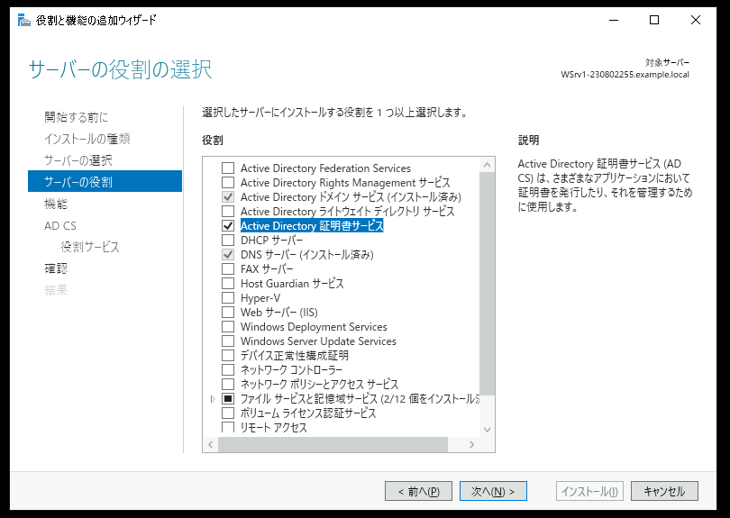</kbd>  

    1. [サーバーの役割]画面で、上のパラメータを選択したことを確認し、[次へ]をクリックする  
    1. [機能の選択]画面で、[次へ]をクリックする  
    1. [AD CS]画面で、[次へ]をクリックする   
    1. [役割サービス]画面で、以下のパラメータを選択する  

        - [x] 証明機関
        - [ ] オンラインレスポンダー
        - [ ] ネットワークデバイス登録サービス  
        - [x] 証明機関Web登録
        - [ ] 証明書の登録Webサービス  
        - [ ] 証明書の登録ポリシーWebサービス   

        > 【補足】  
        > "証明機関Web登録"のチェックをつけると、[証明機関Web登録 に必要な機能を追加しますか？]の確認ポップアップが表示されます。  
        > [証明機関Web登録 に必要な機能を追加しますか？]ウィンドウで、[機能の追加] をクリックします。  

    1. [役割サービス]画面で、[次へ]をクリックする  
    1. [Webサーバーの役割(IIS)]画面で、[次へ]をクリックする  
    1. [役割サービスの選択]画面で、[次へ]をクリックする  
        <kbd>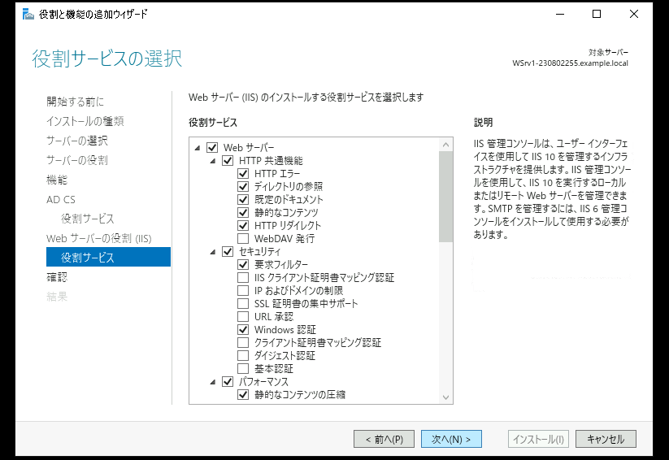</kbd>  
    1. [確認]画面で、[インストール]をクリックする  
    1. [結果]画面で、インストール進捗を示すプログレスバーが右端に到達するまで数分間待機する  
    1. [結果]画面で、インストールが正常に完了したことを確認し、[閉じる]をクリックする  
        <kbd>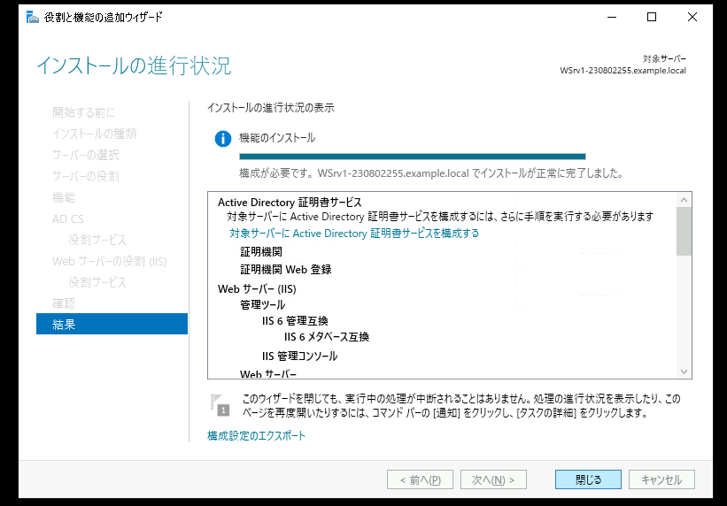</kbd> 


## Active Directory証明書サービスを構成する   
1. Windows 認証局(WinSrv1)の管理画面に接続する  

1. Active Directory証明書サービス構成ウィザードを開始する  
    1. サーバーマネージャを起動する    
    1. サーバーマネージャーのダッシュボード画面上部の通知アイコンをクリックし、"展開後構成"の[対象サーバーにActive Directory証明書サービスを構成する]をクリックする  
        <kbd>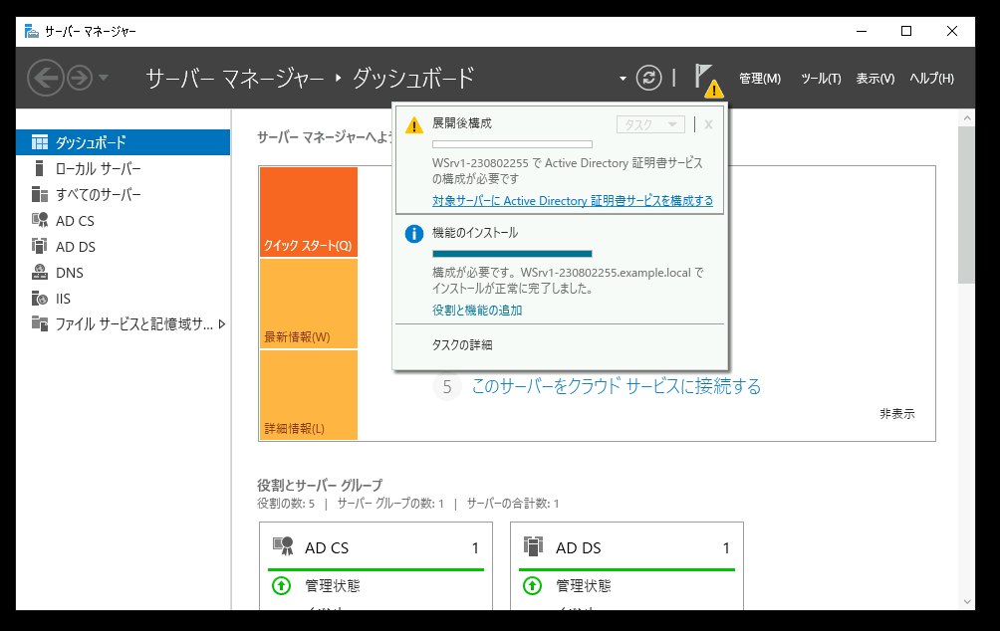</kbd>      
    1. [AD CSの構成]ウィンドウが起動したことを確認する  
        <kbd>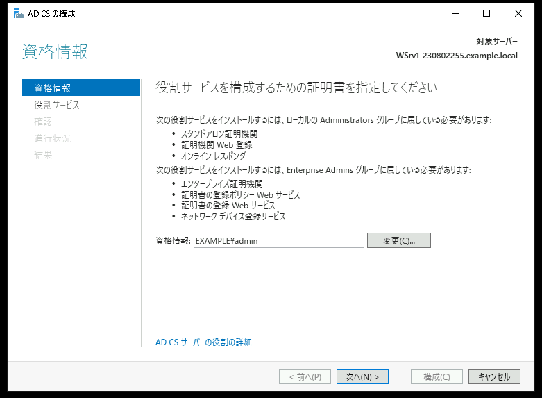</kbd>  

1. AD CS(Active Directory証明書サービス)を構成する    

    1. [AD CS構成]ウィンドウの[資格情報]画面で、[次へ]をクリックする  
    1. [AD CS構成]ウィンドウの[役割サービス]画面で、以下のパラメータを選択する   

        構成する役割サービスの選択:  
        - [x] 証明機関  
        - [x] 証明機関Web登録
        - [ ] オンラインレスポンダー
        - [ ] ネットワークデバイス登録サービス
        - [ ] 証明書の登録Webサービス  
        - [ ] 証明書の登録ポリシーWebサービス   

        <kbd>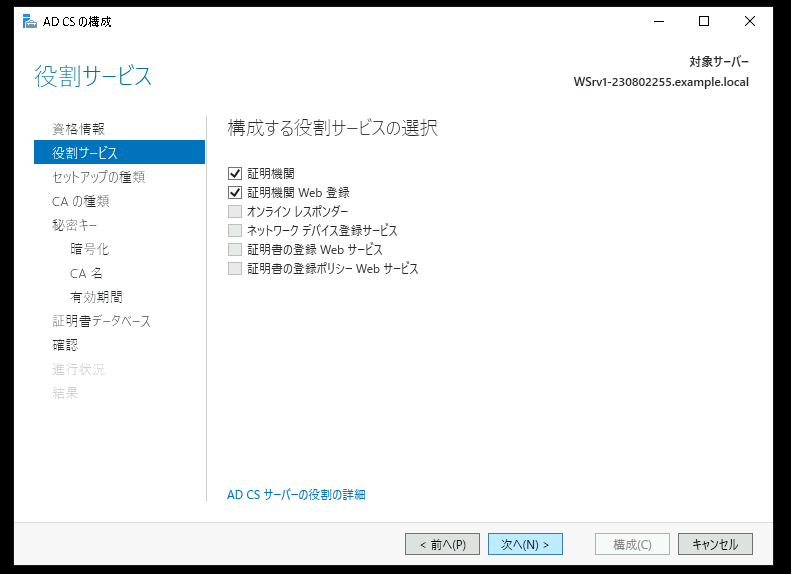</kbd>  

    1. [AD CS構成]ウィンドウの[役割サービス]画面で、[次へ]をクリックする    

    1. [AD CS構成]ウィンドウの[セットアップの種類]画面で、以下のパラメータを選択する   
        
        - [ ] エンタープライズCA
        - [x] スタンドアロンCA  

        <kbd>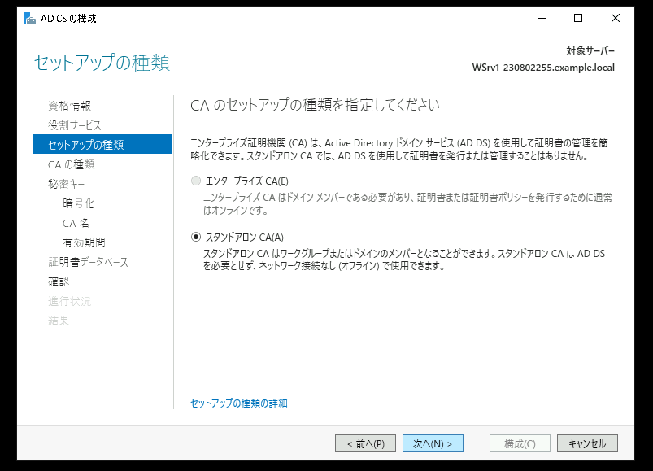</kbd>  

    1. [AD CS構成]ウィンドウの[セットアップの種類]画面で、[次へ]をクリックする    

    1. [AD CS構成]ウィンドウの[CAの種類]画面で、以下のパラメータを選択する   
        
        - [x] ルートCA
        - [ ] 下位CA   

        <kbd>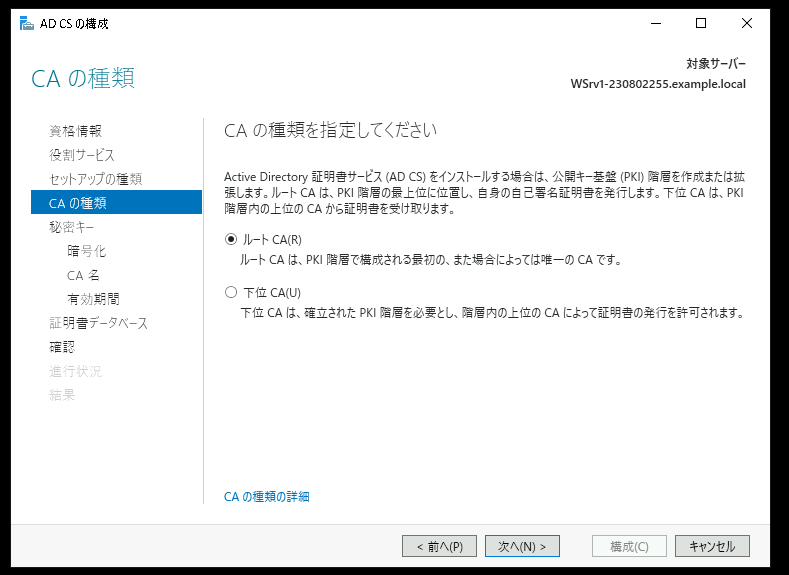</kbd>  

    1. [AD CS構成]ウィンドウの[CAの種類]画面で、[次へ]をクリックする    

    1. [AD CS構成]ウィンドウの[秘密キー]画面で、以下のパラメータを選択する   
        
        - [x] 新しい秘密キーを作成する
        - [ ] 既存の秘密キーを使用する     
            - [ ] 証明書を選択し、関連付けられている秘密キーを使用する       
            - [ ] このコンピューターの既存の秘密キーを選択する       

        <kbd>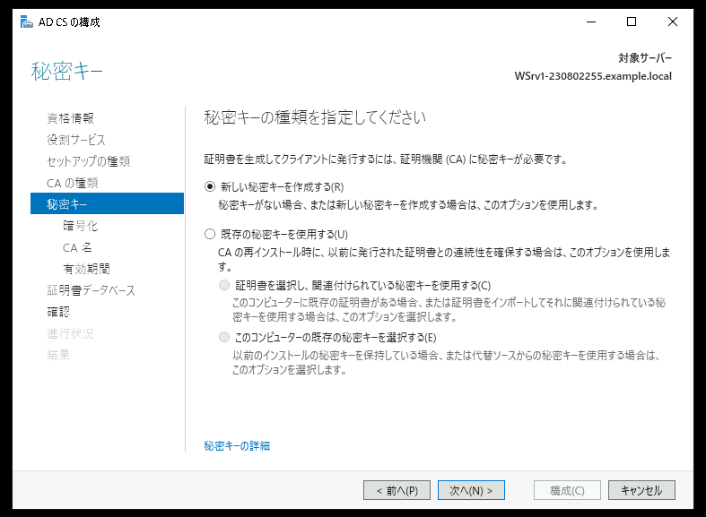</kbd>  

    1. [AD CS構成]ウィンドウの[秘密キー]画面で、[次へ]をクリックする    

    1. [AD CS構成]ウィンドウの[暗号化]画面で、以下のパラメータを選択する   
        
        暗号化プロバイダーの選択:  
        | RSA#Microsoft Software Key Storage Privoder | 
        | :----- | 

        キー長の選択:  
        | 2048 | 
        | :----- | 

        このCAから発行された証明書の署名に使用するハッシュアルゴリズムを選択:  
        | SHA256 | 
        | :----- | 

        - [ ] CAが秘密キーにアクセスするときに、管理者による操作を許可する       
   

        <kbd>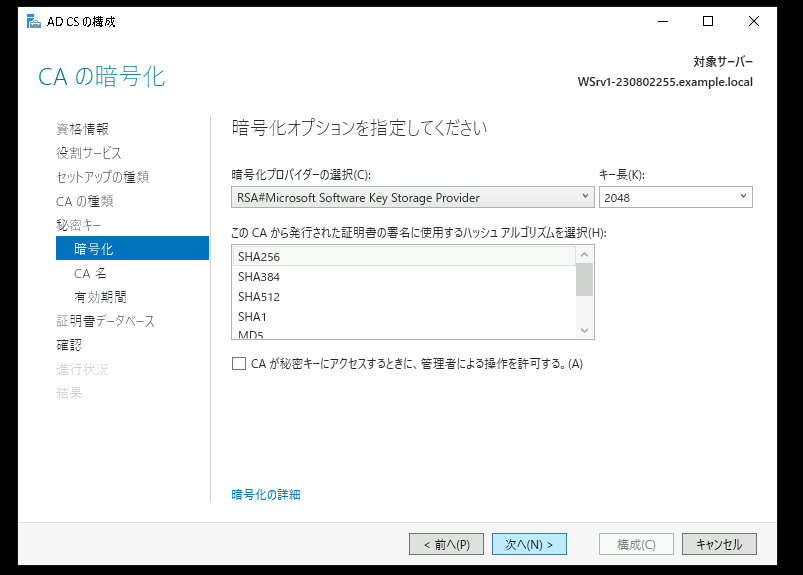</kbd>  

    1. [AD CS構成]ウィンドウの[暗号化]画面で、[次へ]をクリックする    

    1. [AD CS構成]ウィンドウの[CAの名前]画面で、以下のパラメータを入力する   
        
        このCAの共通名:  
        | WinCA | 
        | :----- | 

        識別名のサフィックス:  
        | DC=example, DC=local | 
        | :----- | 

        識別名のプレビュー:  
        | CN=WinCA, DC=example, DC=local | 
        | :----- | 
   

        <kbd>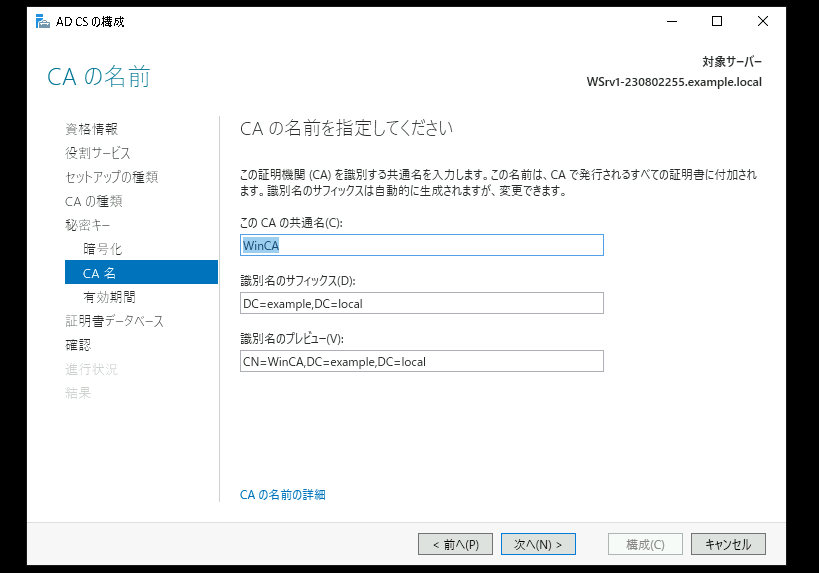</kbd>  

    1. [AD CS構成]ウィンドウの[CAの名前]画面で、[次へ]をクリックする    

    1. [AD CS構成]ウィンドウの[有効期間]画面で、以下のパラメータを入力する   
        
        この証明機関(CA)に対して生成される証明書の有効期間を選択:  
        | 5 年間 | 
        | :----- | 

        <kbd>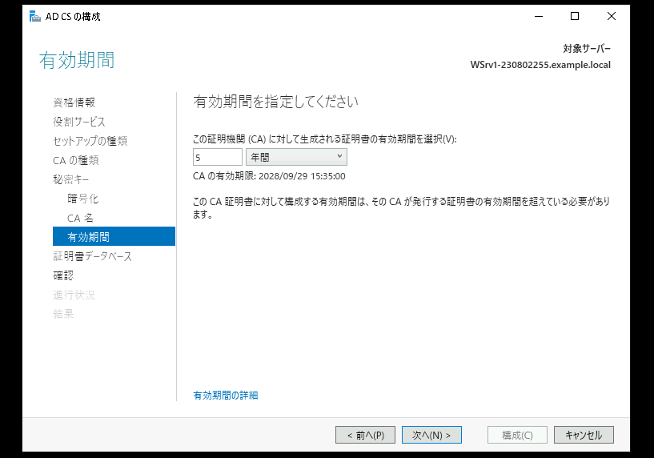</kbd>  

    1. [AD CS構成]ウィンドウの[有効期間]画面で、[次へ]をクリックする    

    1. [AD CS構成]ウィンドウの[CAデータベース]画面で、以下のパラメータを入力する   
        
        証明書データベースの場所:   
        | C:\\Windows\\system32\\CertLog | 
        | :----- | 

        証明書データベースのログの場所:   
        | C:\\Windows\\system32\\CertLog | 
        | :----- | 

        <kbd>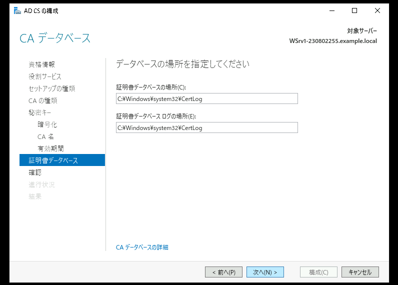</kbd>  

    1. [AD CS構成]ウィンドウの[CAデータベース]画面で、[次へ]をクリックする    

    1. [AD CS構成]ウィンドウの[確認]画面で、[構成]をクリックする  
         <kbd>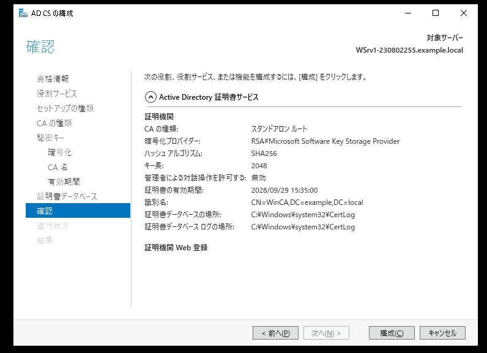</kbd>         

    1. [AD CS構成]ウィンドウの[結果]画面で、[閉じる]をクリックする  
         <kbd>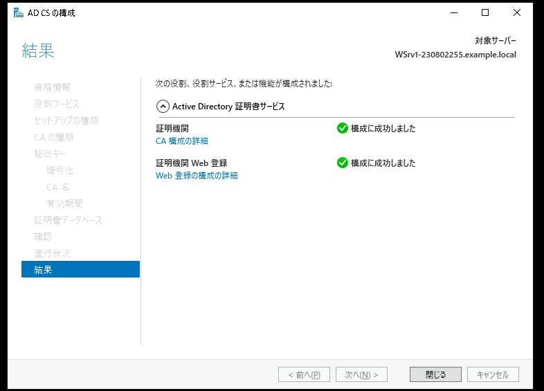</kbd>         


## Active Directory証明書サービスを構成後の確認   

1. Windows 認証局(WinSrv1)の管理画面に接続する  

1. 証明機関管理コンソールを起動できることを確認する    
    1. サーバーマネージャーウィンドウ右上の[ツール]をクリックする  
    1. メニュー内の[証明機関]をクリックし、証明機関管理コンソールを起動する  
        <kbd>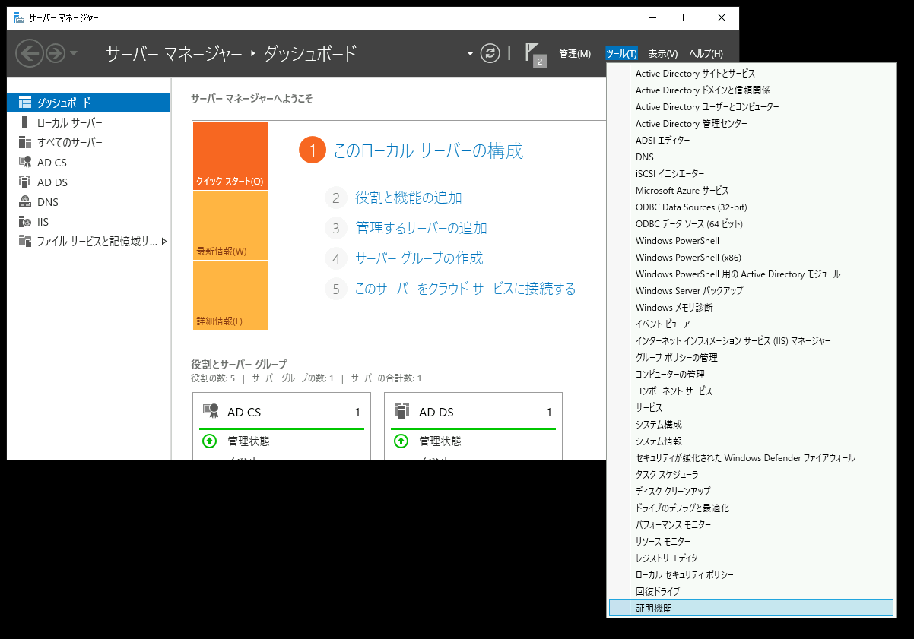</kbd> 
    1. [証明機関]管理コンソールが起動したことを確認する
        <kbd>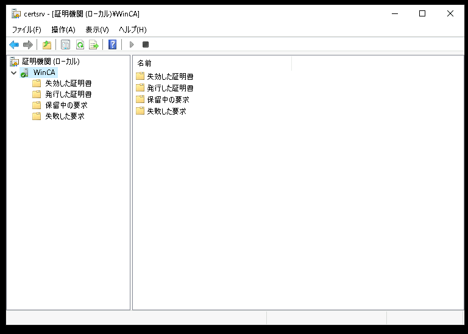</kbd> 

1. 認証局としての自己署名証明書(ルート証明書)が作成されていることを確認する  
    1. [証明書]管理コンソールを起動する
        1. Windows スタートメニューを右クリックし、コンテキストメニュー内の[ファイル名を指定して実行]をクリックする  
        1. [ファイル名を指定して実行]ウィンドウが起動したことを確認する  
        1. [ファイル名を指定して実行]ウィンドウで、以下のパラメータを入力する  

            名前:   
            | certlm.msc | 
            | :----- | 

            <kbd>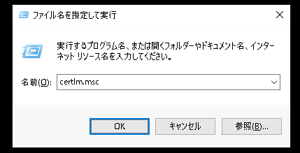</kbd> 

        1. [ファイル名を指定して実行]ウィンドウで、[OK]をクリックする    

        1. [ユーザーアカウント制御]のポップアップで、[はい]をクリックする  

        1. [証明書]管理コンソールが起動したことを確認する  

            <kbd>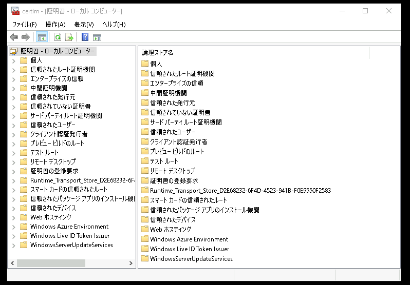</kbd>  

    1. Windows Server 2が所有している電子証明書を確認する          
        1. 左側コンソールツリーの[証明書 - ローカル コンピューター]-[個人]-[証明書]をクリックする  
            <kbd>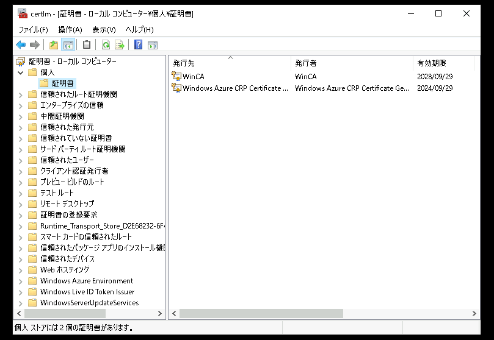</kbd>  
        1. ウィンドウ右側ペインの証明書の一覧を参照し、発行者が "WinCA" である証明書をクリックして選択する  
        1. "WinCA" の証明書を右クリックし、コンテキストメニュー内の[開く]をクリックする    
            <kbd>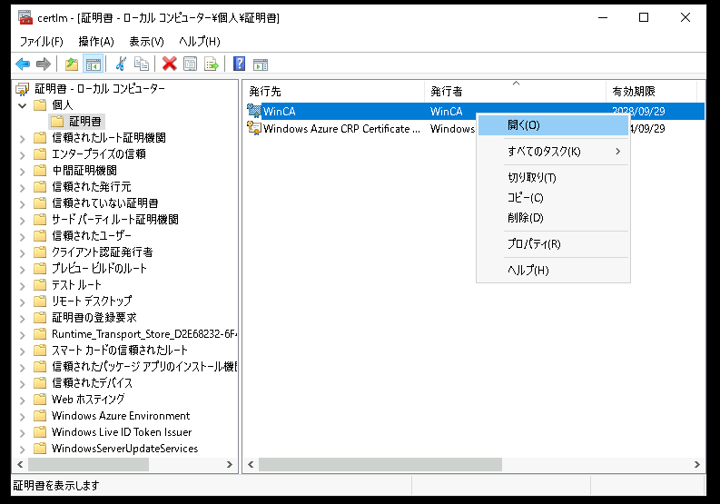</kbd>  
        1. [証明書]ウィンドウが表示されたことを確認する  
            <kbd>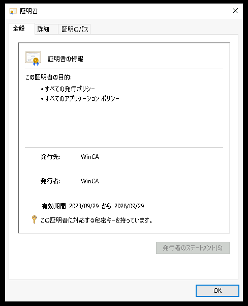</kbd>  
    
    1. 証明書のパラメータを確認する   

        1. [証明書]ウィンドウの[全般]タブに記載されているパラメータを確認する  

            > 【確認ポイント】  
            > - [x] 発行先 が "WinCA" であること   
            > - [x] 発行元 が "WinCA" であること    
            > - [x] "この証明書に対応する秘密キーを持っています"と表記されていうこと  

        1. [証明書]ウィンドウの[詳細]タブに記載されているパラメータを確認する  

            > 【確認ポイント】  
            > - [x] 有効期間の開始 が 現在日時よりも前であること   
            > - [x] 有効期間の終了 が 現在日時よりも後であること   
            > - [x] 発行者 が "WinCA, example, local" であること   
            > - [x] サブジェクト が "WinCA, example, local" であること   
            
            <kbd>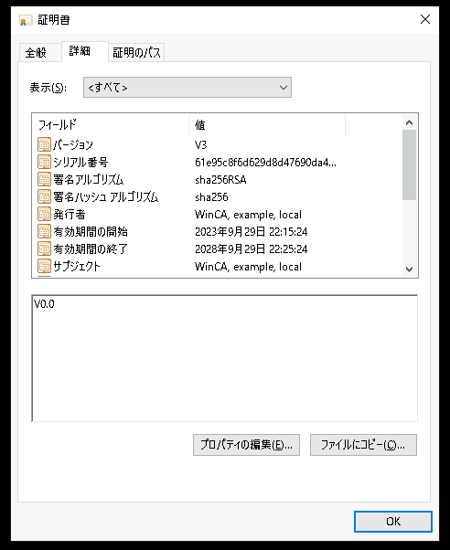</kbd>  
    
        1. [証明書]ウィンドウの[照明のパス]タブに記載されているパラメータを確認する  

            > 【確認ポイント】  
            > - [x] "WinCA"の"証明書の状態"が "この証明書は問題ありません。" であること  

            <kbd>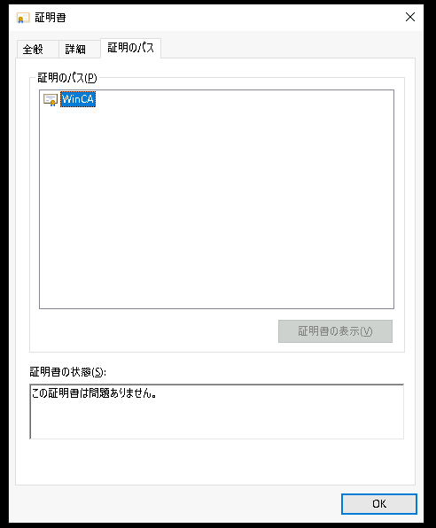</kbd>  

1. 証明機関Web登録サービスが起動していることを確認する  

    1. IIS管理コンソールを起動する  
        1. サーバーマネージャーウィンドウ右上の[ツール]をクリックする  
        1. メニュー内の[インターネット インフォメーション サービス(IIS) マネージャー]をクリックし、IIS管理コンソールを起動する  
        1. [インターネット インフォメーション サービス(IIS) マネージャー]が起動したことを確認する  
    
    1. CertSrvアプリケーションが動作していることを確認する  
        1. 左側コンソールツリーの[＜サーバー名＞]-[サイト]-[Default Web Site]-[CertSrv]をクリックする          
        1. ウィンドウ右側ペインの[アプリケーションの管理]メニューの[*:80(http)参照]をクリックする  
            <kbd>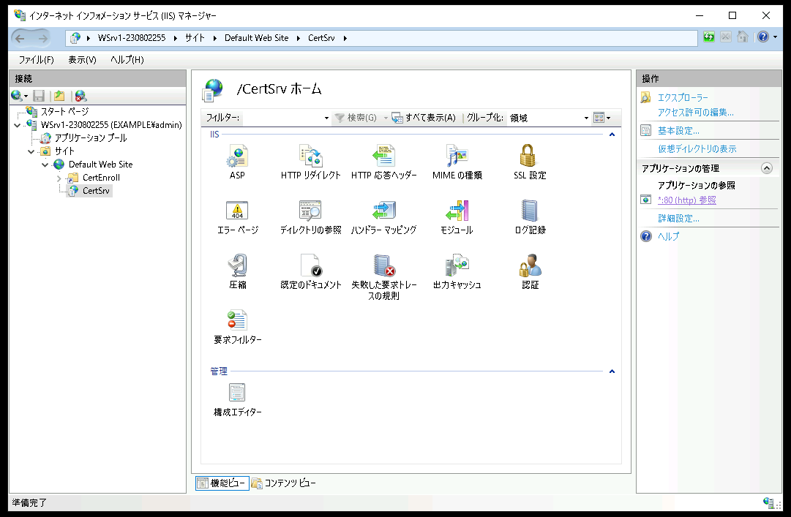</kbd>  
        1. Webブラウザ(Microsoft Edge)が起動したことを確認する  

    1. 証明機関Web登録サービスのWebアプリケーションにアクセスできることを確認する  
            <kbd>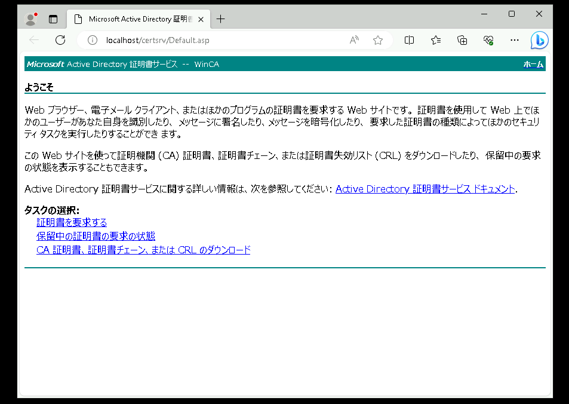</kbd>  

---  

## Window Server 2で証明書署名要求(CSR)を作成する  

1. HTTPS Webサーバー(WinSrv2)の管理画面に接続する  

1. [証明書]管理コンソールを起動する
    1. Windows スタートメニューを右クリックし、コンテキストメニュー内の[ファイル名を指定して実行]をクリックする  
    1. [ファイル名を指定して実行]ウィンドウが起動したことを確認する  
    1. [ファイル名を指定して実行]ウィンドウで、以下のパラメータを入力する  

        名前:   
        | certlm.msc | 
        | :----- | 

    1. [ファイル名を指定して実行]ウィンドウで、[OK]をクリックする    
    1. [ユーザーアカウント制御]のポップアップで、[はい]をクリックする  
    1. [証明書]管理コンソールが起動したことを確認する  

1. カスタム要求の作成ウィザードを起動する  
    1. 左側コンソールツリーの[証明書 - ローカル コンピューター]-[個人]-[証明書]をクリックする  
    1. 左側コンソールツリーの[証明書 - ローカル コンピューター]-[個人]-[証明書]を右クリックし、コンテキストメニュー内の[すべてのタスク]-[詳細設定操作]-[カスタム要求の作成]をクリックする  
        <kbd>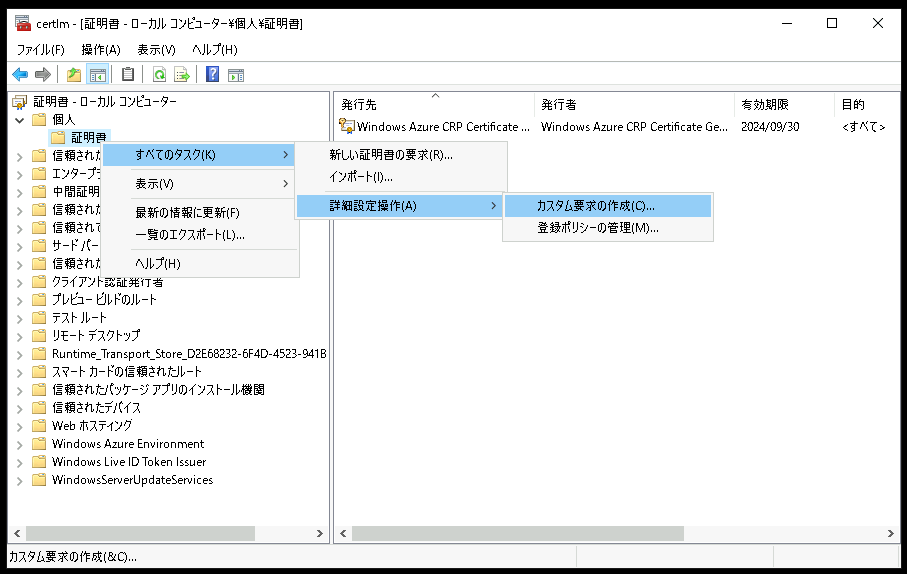</kbd> 
    1. [証明書の登録]ウィンドウが表示されたことを確認する  
        <kbd>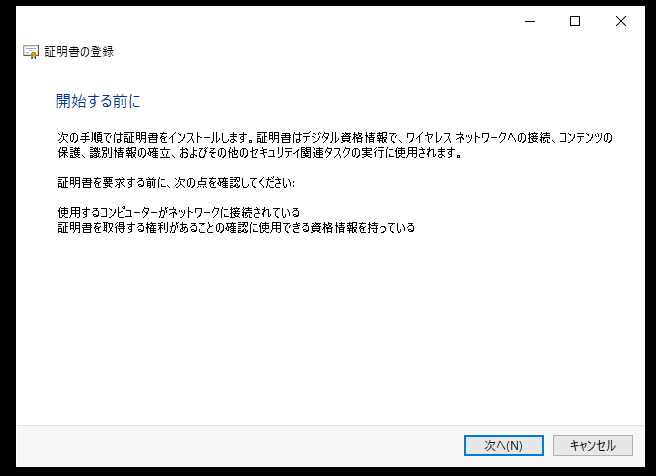</kbd> 

1. カスタム要求を作成する  
    1. [証明書の登録]ウィンドウの[開始する前に]画面で、[次へ]をクリックする  
        <kbd></kbd> 
    1. [証明書の登録]ウィンドウの[証明書の登録ポリシーの選択]画面で、[次へ]をクリックする  
        <kbd>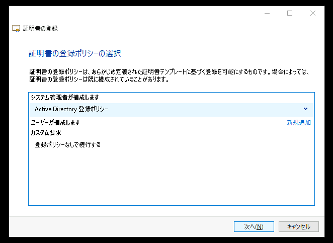</kbd> 
    1. [証明書の登録]ウィンドウの[カスタム要求]画面で、[次へ]をクリックする  
        <kbd>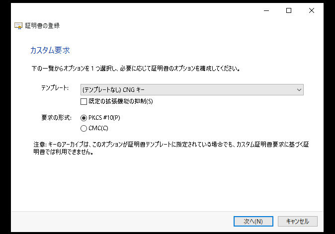</kbd> 
    1. [証明書の登録]ウィンドウの[証明書情報]画面で、[詳細]の展開ボタンをクリックする  
    1. [証明書の登録]ウィンドウの[証明書情報]画面で、[プロパティ]をクリックする  
        <kbd>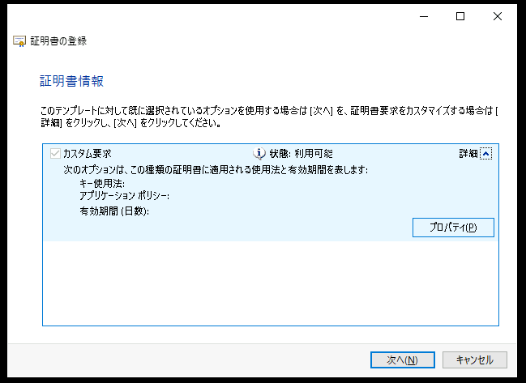</kbd> 
    1. [証明書のプロパティ]ウィンドウが表示されたことを確認する    
        <kbd>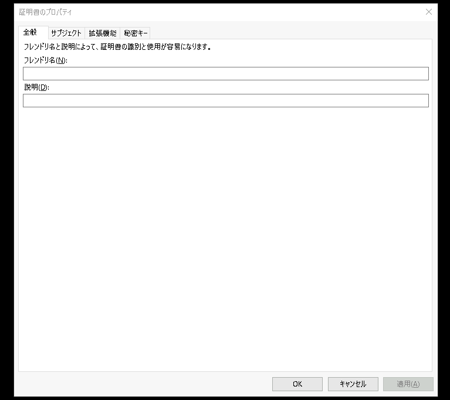</kbd> 

    1. [証明書のプロパティ]ウィンドウの[全般]タブで、以下のパラメータを入力する     

        フレンドリ名:   
        | HttpsCert | 
        | :----- | 

        説明:   
        | <空欄> | 

        <kbd>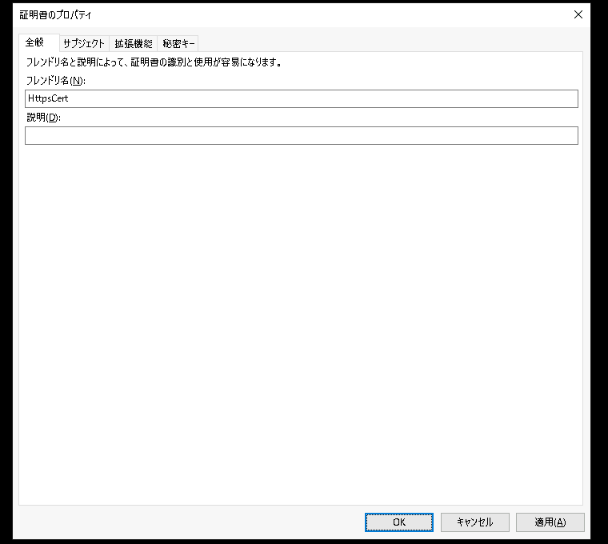</kbd> 

    1. [証明書のプロパティ]ウィンドウの[全般]タブで、[適用]をクリックする      
    1. [証明書のプロパティ]ウィンドウの[サブジェクト]タブをクリックして選択する  
        <kbd>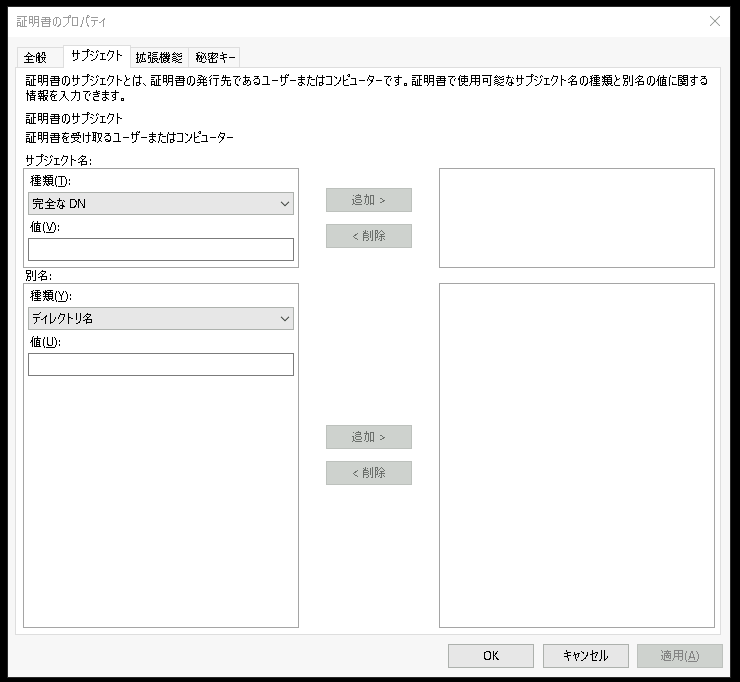</kbd>  

    1. [証明書のプロパティ]ウィンドウの[サブジェクト]タブで、以下のパラメータを入力する     

        共通名:   
        | CN=WinSrv2.example.local |     
        | :----- | 

        別名:   
        | DNS | 
        | :----- | 
        | Web1.example.local |

        | IPアドレス(v4) | 
        | :----- | 
        | 10.X.2.105 |

        <kbd>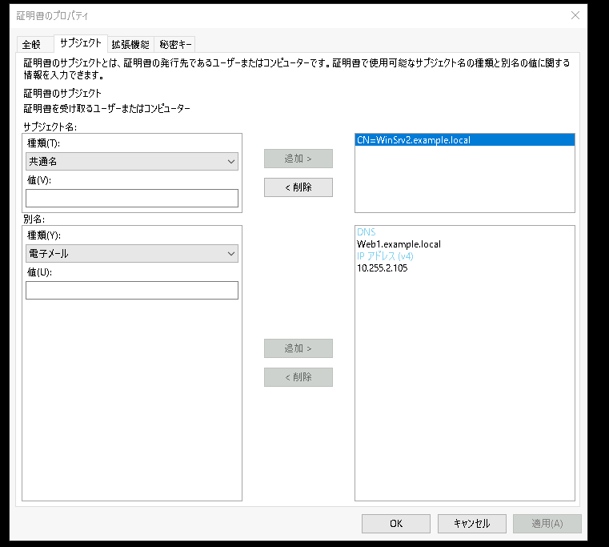</kbd> 

        詳細手順:  

        1. "サブジェクト名" の "種類" で、 "共通名" を選択する  
        1. "サブジェクト名" の "値" に、"WinSrv2.example.local" を入力する
        1. "サブジェクト名" の [追加] をクリックする  
        1. "サブジェクト名" として "CN=WinSrv2.example.local" が追加されたことを確認する  
        1. "別名" の "種類" で、 "DNS" を選択する  
        1. "別名" の "値" に、"Web1.example.local" を入力する
        1. "別名" の [追加] をクリックする  
        1. "別名" として "DNS Web1.example.local" が追加されたことを確認する  
        1. "別名" の "種類" で、 "IPアドレス(v4)" を選択する  
        1. "別名" の "値" に、"10.X.2.105" を入力する
        1. "別名" の [追加] をクリックする  
        1. "別名" として "IPアドレス(v4) 10.X.2.105" が追加されたことを確認する  

    1. [証明書のプロパティ]ウィンドウの[サブジェクト]タブで、[適用]をクリックする  

    1. [証明書のプロパティ]ウィンドウの[拡張機能]タブをクリックして選択する    
        <kbd>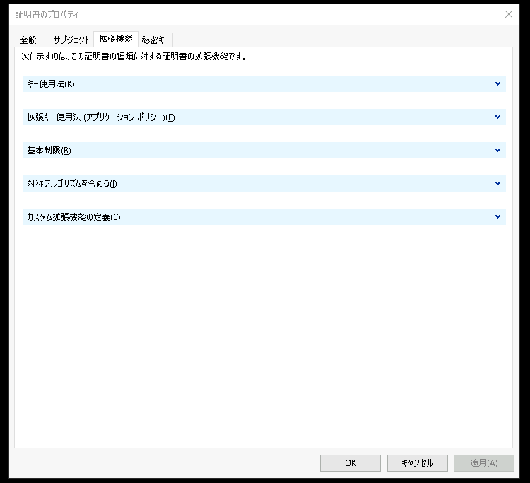</kbd>  

    1. [証明書のプロパティ]ウィンドウの[拡張機能]タブの[キー使用法]の展開ボタンをクリックする      
        <kbd>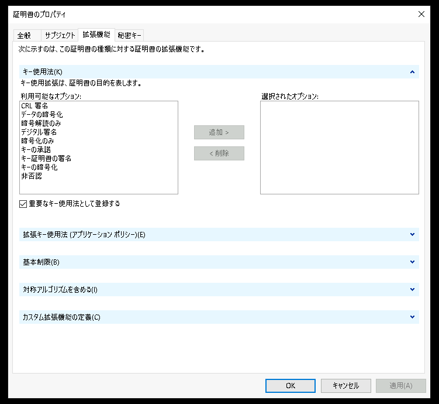</kbd>  


    1. [証明書のプロパティ]ウィンドウの[拡張機能]タブの[キー使用法]で、以下のパラメータを選択する        

        | 選択されたオプション |     
        | :----- | 
        | デジタル署名 |
        | キーの暗号化 |

        <kbd>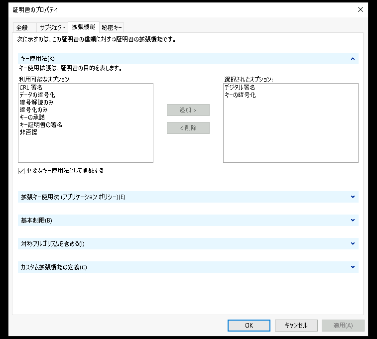</kbd>  

        詳細手順:  

        1. "キー使用法" の "利用可能なオプション" で、 "デジタル署名" をクリックして選択する  
        1. "キー使用法" の [追加] をクリックする  
        1. "キー使用法" の "利用可能なオプション" で、 "キーの暗号化" をクリックして選択する  
        1. "キー使用法" の [追加] をクリックする  

    1. [証明書のプロパティ]ウィンドウの[拡張機能]タブの[拡張キー使用法]の展開ボタンをクリックする      
        <kbd>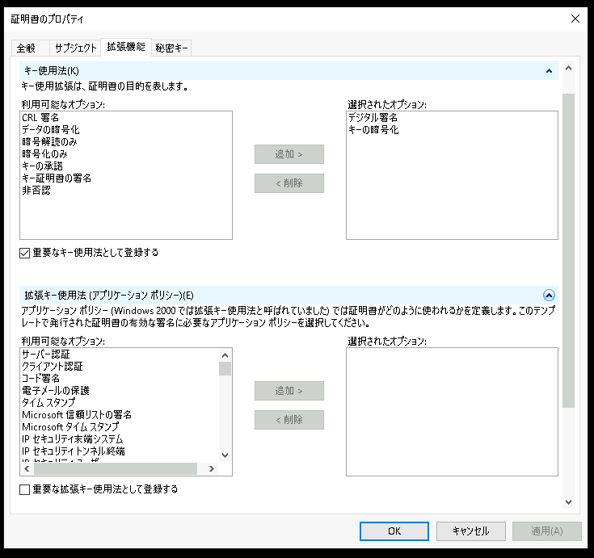</kbd>  

    1. [証明書のプロパティ]ウィンドウの[拡張機能]タブの[拡張キー使用法]で、以下のパラメータを選択する        

        | 選択されたオプション |     
        | :----- | 
        | サーバー認証 |

        詳細手順:  

        1. "拡張キー使用法" の "利用可能なオプション" で、 "サーバー認証" をクリックして選択する   
        1. "拡張キー使用法" の [追加] をクリックする   

        <kbd>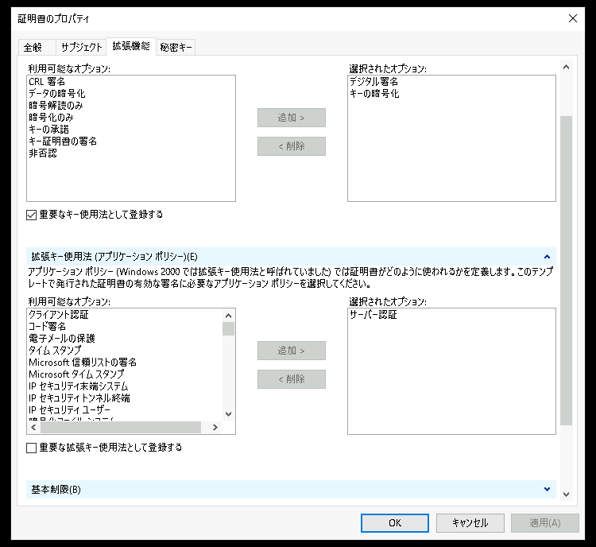</kbd>  

    1. [証明書のプロパティ]ウィンドウの[拡張機能]タブで、[適用]をクリックする   

    1. [証明書のプロパティ]ウィンドウの[秘密キー]タブをクリックして選択する    
        <kbd>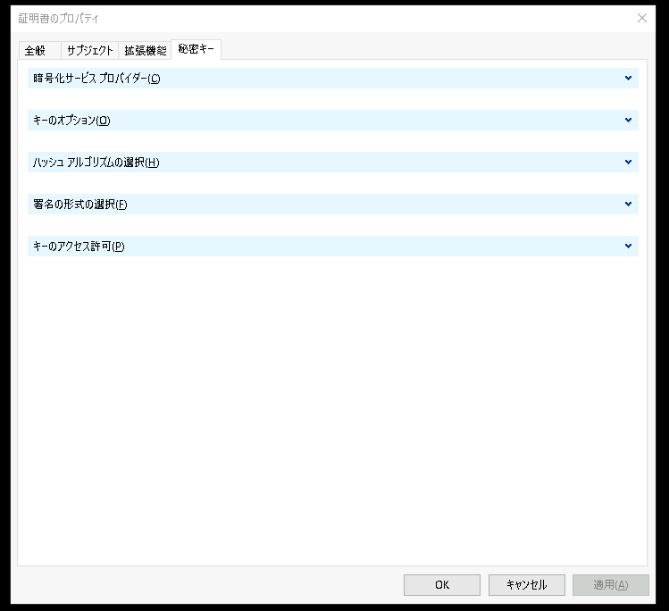</kbd>  

    1. [証明書のプロパティ]ウィンドウの[秘密キー]タブの[キーのオプション]の展開ボタンをクリックする      
        <kbd>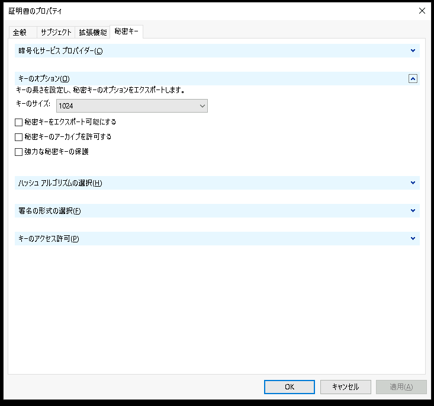</kbd>  
    1. [証明書のプロパティ]ウィンドウの[秘密キー]タブの[キーのオプション]で、以下のパラメータを選択する        

        キーのサイズ: 
        | 2048 |     
        | :----- |  

        - [x] 秘密キーをエクスポート可能にする  
        - [ ] 秘密キーのアーカイブを許可する   
        - [ ] 強力な秘密キーの保護     

        <kbd>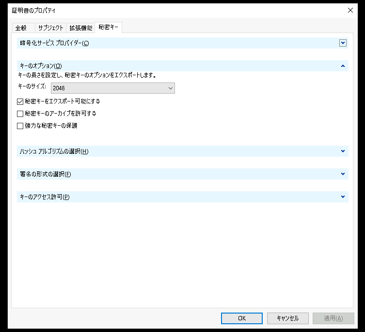</kbd>  


    1. [証明書のプロパティ]ウィンドウの[秘密キー]タブの[ハッシュアルゴリズムの選択]の展開ボタンをクリックする      
        <kbd>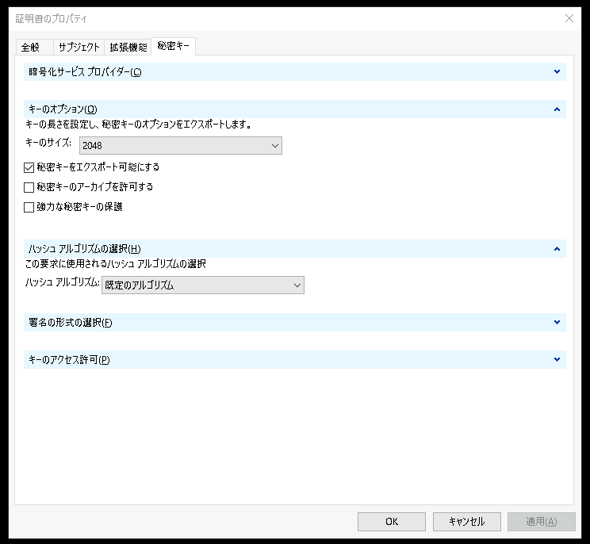</kbd>  

    1. [証明書のプロパティ]ウィンドウの[秘密キー]タブの[ハッシュアルゴリズムの選択]で、以下のパラメータを選択する   

        ハッシュアルゴリズム: 
        | sha256 |    
        | :----- |  

        <kbd>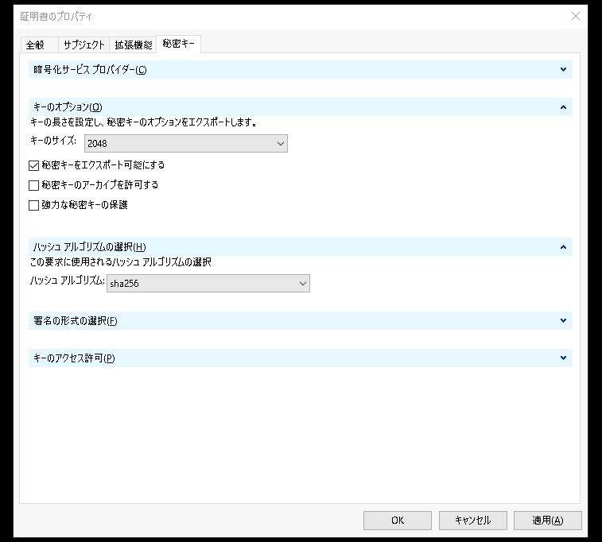</kbd>  

    1. [証明書のプロパティ]ウィンドウの[ハッシュアルゴリズムの選択]タブで、[適用]をクリックする   

    1. [証明書のプロパティ]ウィンドウで、[OK]をクリックする   

    1. [証明書の登録]ウィンドウの[証明書情報]画面で、[次へ]をクリックする  
        <kbd>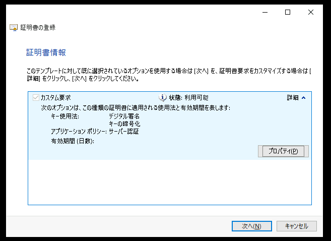</kbd> 


    1. [証明書の登録]ウィンドウの[オフライン要求を保存する場所を指定してください]画面で、以下のパラメータを入力する  

        ファイル名: 
        | C:\\Share\\HttpsCert.csr |    
        | :----- |  

        ファイル形式:
        - [x] Base64
        - [ ] バイナリ

        <kbd>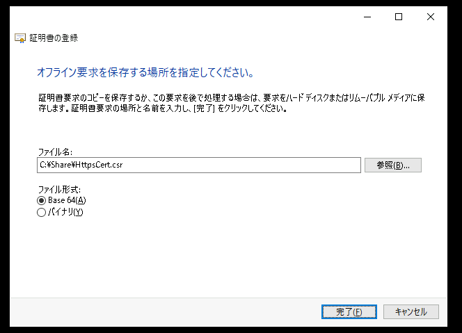</kbd> 

    1. [証明書の登録]ウィンドウの[オフライン要求を保存する場所を指定してください]画面で、[完了]をクリックする  

1. 証明書署名要求(CSRファイル)が作成されていることを確認する  
    
    1. "C:\\Share" フォルダを開く  
    1. "HttpsCert.csr" ファイルが保存されていることを確認する  

        <kbd>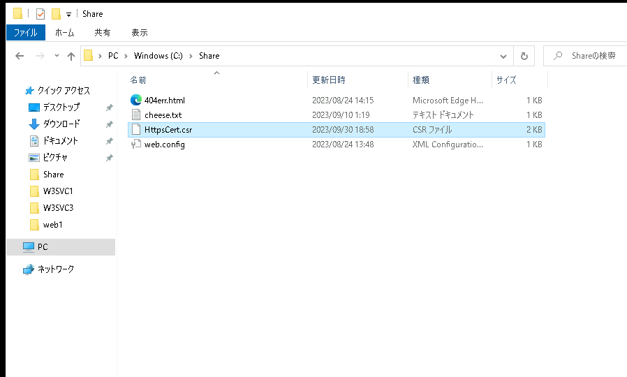</kbd> 

1. (オプション.省略可) "HttpsCert.csr" ファイルをメモ帳(notepad)で開き、Base64エンコードされた証明書署名要求が記述されていることを確認する 
    <kbd>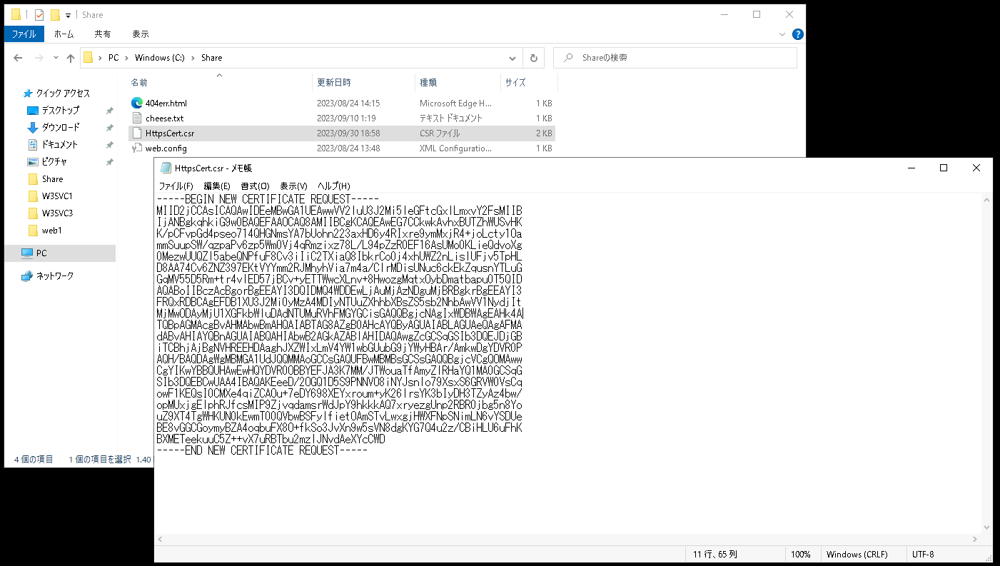</kbd> 


1. (オプション.省略可) 秘密キーが "C:\\ProgramData\\Microsoft\\Crypto\\RSA\\MachineKeys" フォルダに保存されていることを確認する  
    <kbd>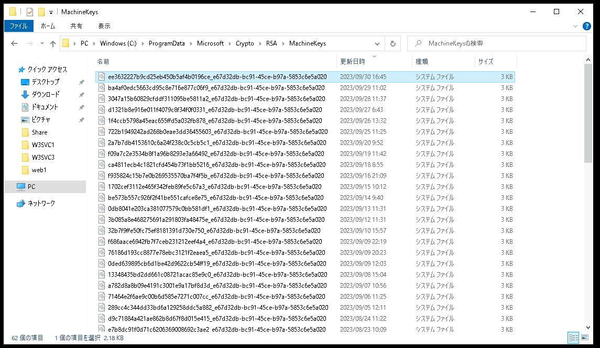</kbd> 


---  

<!--
【補足】
NAPTのconfigがCSR1に残っている場合、WinSrv2からWinSrv1に通信できません。  
これは、戻りのパケットの送信元IPアドレスがNAPT変換されて、WinSrv2の認識とは異なる値になるためです。  

例: DNS Query src 10.X.2.105 dest 10.X.1.104  
    DNS Response src 10.X.2.253 dest 10.X.2.105  

WinSrv2で通信パケット(DNS Response)は受信できていますが、アプリケーションでは正しく処理されません。  
興味のある方は、Wiresharkでパケットキャプチャーしてみてください。  
-->


## 証明書の発行を要求する   

1. HTTPS Webサーバー(WinSrv2)の管理画面に接続する  

1. 証明機関Web登録サービスにアクセスする    

    1. WinSrv2でWebブラウザ(Google Chrome)を起動する  
    1. Webブラウザのアドレス欄に [http:/AD.example.local/certsrv] と入力し、[Enter]キーを押下する  
    1. 証明機関Web登録サービスにアクセスしたことを確認する 

        kbd>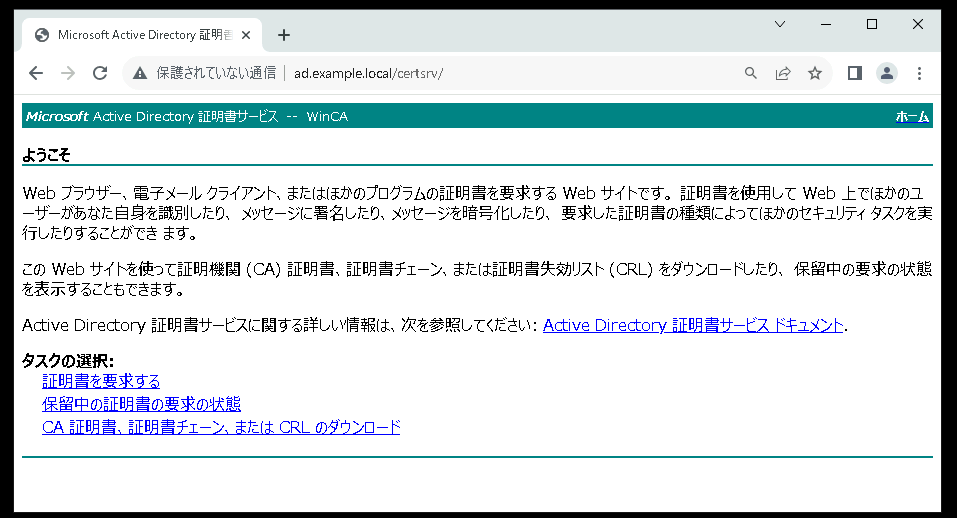</kbd> 

1. 証明機関Web登録サービスで、証明書の発行を要求する  
    1. [証明書を要求する]をクリックする  
    1. [証明書の要求の詳細設定]をクリックする  
    1. [証明書の要求または更新要求の送信]ページで、以下のパラメータを入力する  
        
        保存された要求:  
        | <"C:\\Share\\HttpsCert.csr"ファイルの中身の文字列全文を貼り付ける> |    
        | :----- |  

        追加属性:  
        | <空欄> |    
        | :----- |  


        手順:
        1. メモ帳(notepad)を起動し、"C:\\Share\\HttpsCert.csr" ファイルを開く
        1. 先頭の"-----BEGIN NEW CERTIFICATE REQUEST-----"行から、末尾の"-----END NEW CERTIFICATE REQUEST-----"行までの全文をコピーする  
        1. Webページのフォームに貼りつける  

        kbd>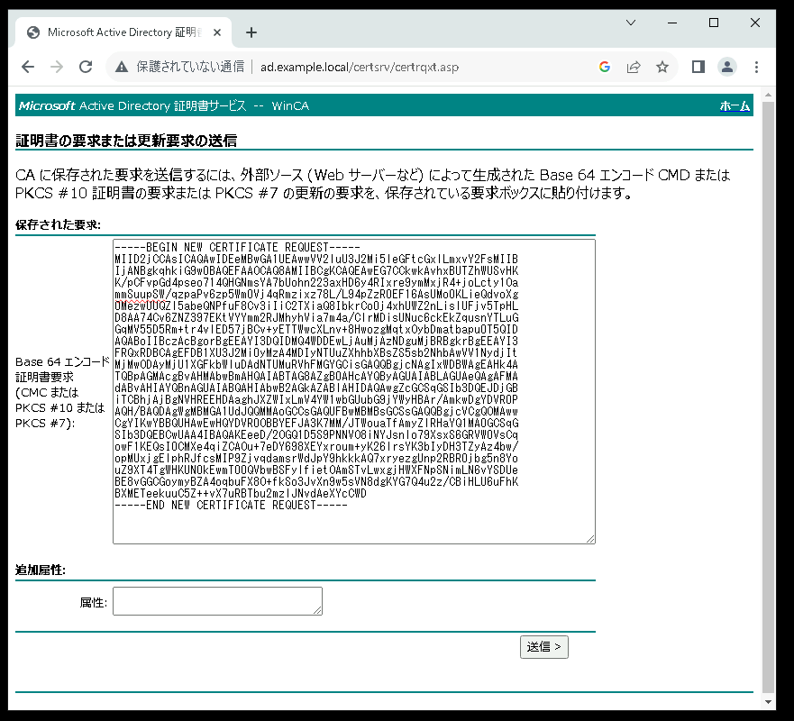</kbd> 

    1. [証明書の要求または更新要求の送信]ページで、[送信>]をクリックする  
    1. [保留中の証明書]ページで、"要求ID" の数字を確認する  

        kbd>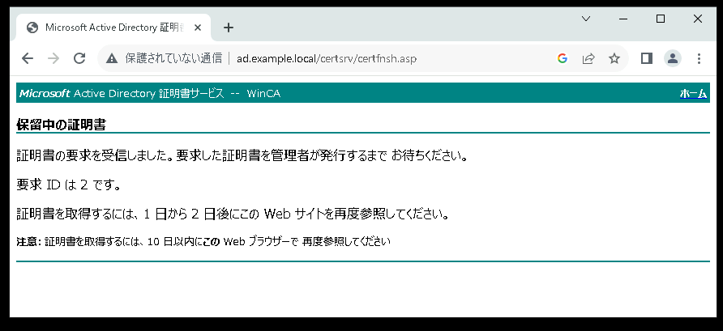</kbd> 

        > 【補足】  
        > 画像例の場合、要求IDは2です。  
        > この要求IDの数字は、次手順の証明書発行操作の際に必要です。  


## 証明書要求を承認し、証明書を発行する   


1. Windows 認証局(WinSrv1)の管理画面に接続する   


1. 証明機関管理コンソールを起動する     
    1. サーバーマネージャーウィンドウ右上の[ツール]をクリックする  
    1. メニュー内の[証明機関]をクリックし、証明機関管理コンソールを起動する  
    1. [証明機関]管理コンソールが起動したことを確認する

1. 証明書の要求を承認する  
    1. 左側コンソールツリーの[証明機関]-[WinCA]-[保留中の要求]をクリックして選択する  


@@@@@@@@@@@@@@@@@@@@@@@@@@@@@@@@@@@@@@@@@@@@@@@@@@@@@@@@@@@@@@@@@@@@@@@@@@@@@@@@@@@@@@@@@@@@@@@@@@
@@@@@@@@@@@@@@@@@@@@@@@@@@@@@@@@@@@@@@@@@@@@@@@@@@@@@@@@@@@@@@@@@@@@@@@@@@@@@@@@@@@@@@@@@@@@@@@@@@
@@@@@@@@@@@@@@@@@@@@@@@@@@@@@@@@@@@@@@@@@@@@@@@@@@@@@@@@@@@@@@@@@@@@@@@@@@@@@@@@@@@@@@@@@@@@@@@@@@
@@@@@@@@@@@@@@@@@@@@@@@@@@@@@@@@@@@@@@@@@@@@@@@@@@@@@@@@@@@@@@@@@@@@@@@@@@@@@@@@@@@@@@@@@@@@@@@@@@
@@@@@@@@@@@@@@@@@@@@@@@@@@@@@@@@@@@@@@@@@@@@@@@@@@@@@@@@@@@@@@@@@@@@@@@@@@@@@@@@@@@@@@@@@@@@@@@@@@
@@@@@@@@@@@@@@@@@@@@@@@@@@@@@@@@@@@@@@@@@@@@@@@@@@@@@@@@@@@@@@@@@@@@@@@@@@@@@@@@@@@@@@@@@@@@@@@@@@
@@@@@@@@@@@@@@@@@@@@@@@@@@@@@@@@@@@@@@@@@@@@@@@@@@@@@@@@@@@@@@@@@@@@@@@@@@@@@@@@@@@@@@@@@@@@@@@@@@
@@@@@@@@@@@@@@@@@@@@@@@@@@@@@@@@@@@@@@@@@@@@@@@@@@@@@@@@@@@@@@@@@@@@@@@@@@@@@@@@@@@@@@@@@@@@@@@@@@
@@@@@@@@@@@@@@@@@@@@@@@@@@@@@@@@@@@@@@@@@@@@@@@@@@@@@@@@@@@@@@@@@@@@@@@@@@@@@@@@@@@@@@@@@@@@@@@@@@
@@@@@@@@@@@@@@@@@@@@@@@@@@@@@@@@@@@@@@@@@@@@@@@@@@@@@@@@@@@@@@@@@@@@@@@@@@@@@@@@@@@@@@@@@@@@@@@@@@


## 3. Webサーバー(IIS)インストール後の動作確認  
1. IIS管理コンソールを起動する  
    1. サーバーマネージャーウィンドウ右上の[ツール]をクリックする  
    1. メニュー内の[インターネット インフォメーション サービス(IIS) マネージャー]をクリックし、IIS管理コンソールを起動する  
        <kbd>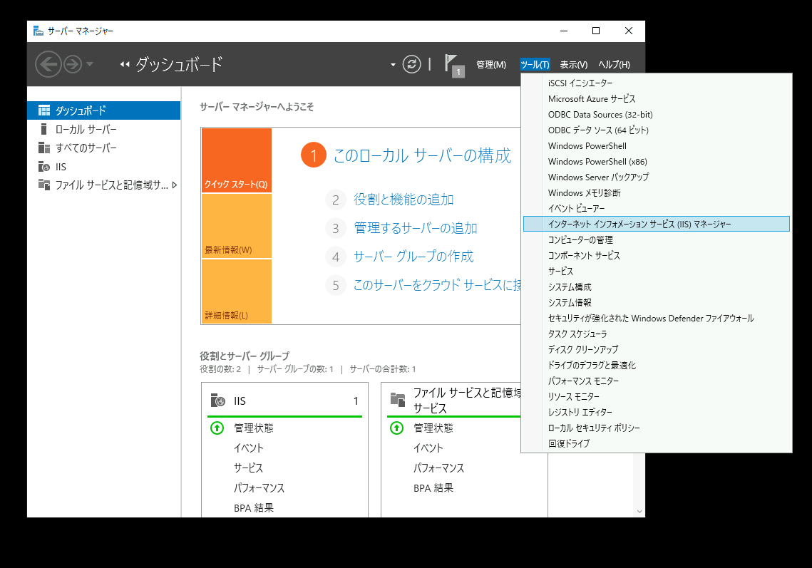</kbd> 
    1. [インターネット インフォメーション サービス(IIS) マネージャー]が起動したことを確認する
    1. 左側コンソールツリーの[＜サーバー名＞]-[サイト]-[Default Web Site]をクリックする  
    1. ウィンドウ右側ペインの[操作]メニューの[Webサイトの管理]-[再起動]をクリックし、エラーが発生しないことを確認する  
        <kbd></kbd> 

1. Web コンテンツ フォルダを確認する
    1. ファイル エクスプローラーを起動する   
    1. "C:\\inetpub" フォルダにアクセスする   
        > 【補足】  
        > "C:\\inetpub" フォルダは、IISインストール時に自動的に作成されます。  
        > このフォルダには、IISのサービス提供に必要なファイルが保存されています。  
    1. "C:\\inetpub" フォルダ内の "wwwroot" フォルダにアクセスする  
        > 【補足】  
        > "C:\\inetpub\\wwwroot" フォルダは、IISの "Default Web Site" のWeb コンテンツ フォルダです。   
    1. IISの初期Webページのファイルが作成されていることを確認する
        <kbd>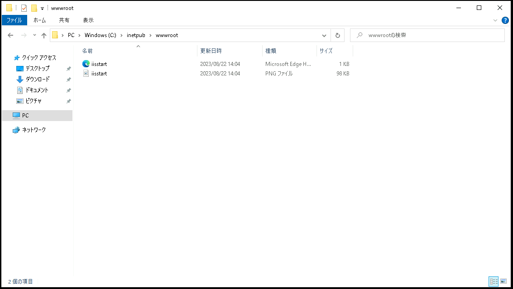</kbd> 

1. ClientのWebブラウザからWebアクセスする  
    1. 操作コンピュータを変更するため、演習環境のトップページに戻る  
    1. Windows Client(WinClient)の管理画面に "admin" で接続する   
    1. WinClientでWebブラウザ(Google Chrome)を起動する  
    1. Webブラウザのアドレス欄に [http://10.X.1.105] と入力し、[Enter]キーを押下する  
    1. IISの初期Webページが表示されることを確認する  
        <kbd>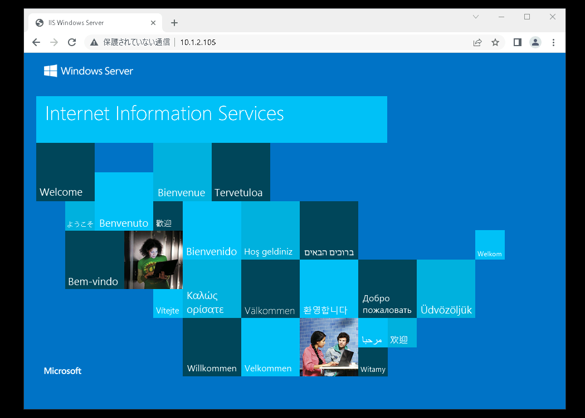</kbd> 


## 4. Webコンテンツを作成して公開する

1. Webコンテンツ作成のため、Webコンテンツフォルダにアクセスする  
    1. 操作コンピュータを変更するため、演習環境のトップページに戻る  
    1. Windows Webサーバー(WinSrv2)の管理画面に接続する  
    1. "C:\\inetpub" フォルダにアクセスする  

1. WebコンテンツフォルダのNTFSアクセス権を変更し、管理者アカウント(admin)にフルコントロール許可を与える  
    1. "wwwroot" フォルダ("C:\\inetpub\\wwwroot")をクリックし、右クリック コンテキストメニューの[プロパティ]をクリックする
    1. [プロパティ]ウィンドウの[セキュリティ]タブをクリックする  
    1. [編集]をクリックする  
    1. [wwwrootのアクセス許可]ウィンドウが表示されたことを確認する  
    1. [追加]をクリックする  
    1. [ユーザーまたはグループの選択]ウィンドウが表示されたことを確認する  
    1. "選択するオブジェクト名を入力してください" の欄に "admin" と入力する  
    1. [名前の確認]をクリックする  
    1. "<コンピュータ名>￥admin" の表記に下線がついたことを確認する  
    1. [OK]をクリックする  
    1. [wwwrootのアクセス許可]ウィンドウで、"admin"が追加されていることを確認する  
    1. [admin]をクリックして選択する  
    1. [wwwrootのアクセス許可]ウィンドウ下部の "アクセス許可" を参照し、"フルコントロール" の "許可" にチェックをつける  
        <kbd></kbd> 
    1. [wwwrootのアクセス許可]ウィンドウで、[OK]をクリックする  
    1. [プロパティ]ウィンドウで、"admin"が追加されていることを確認する  
        <kbd>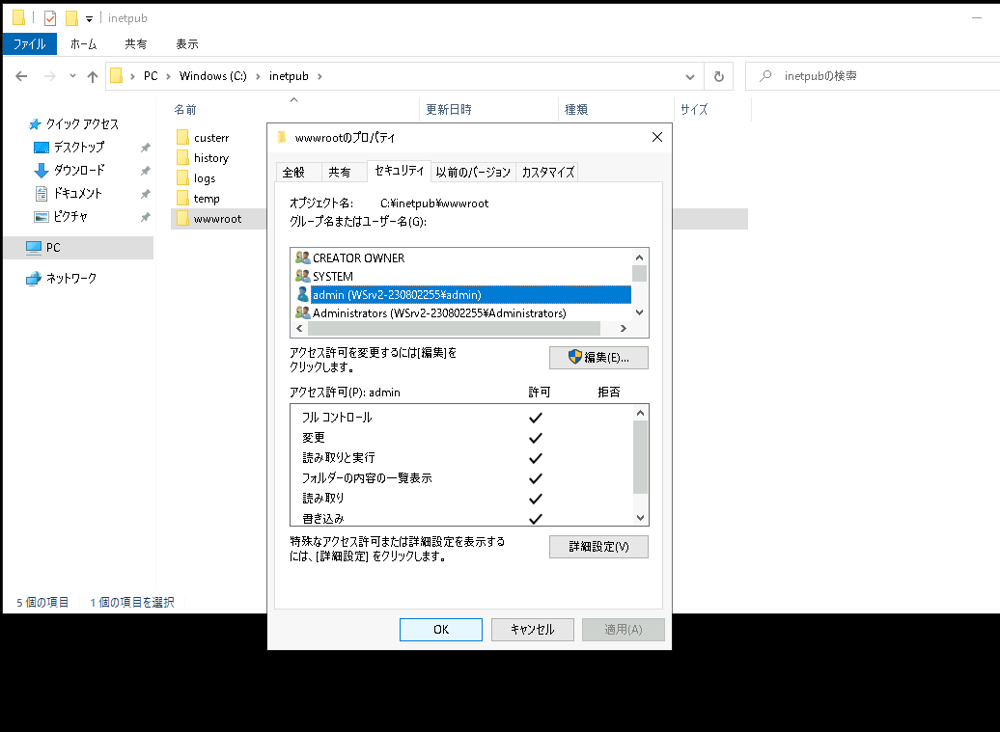</kbd> 
    1. [プロパティ]ウィンドウで、[OK]をクリックする  

1. ファイル エクスプローラの設定を変更し、ファイルの拡張子を表示させる  
    1. ファイル エクスプローラ上部メニューの[表示]タブをクリックする  
    1. [表示/非表示]項目の[ファイル名拡張子]のチェックを有効化する
        <kbd></kbd> 

1. Webコンテンツとしてテキストファイル("C:\\inetpub\\wwwroot\\web1\\document.txt")を作成する
    1. 右クリック コンテキストメニューの[新規作成]-[フォルダー]をクリックする
    1. 作成された新しいフォルダの名前を "web1" に変更する  
        <kbd></kbd> 
    1. "web1"フォルダ("C:\\inetpub\\wwwroot\\web1\\")にアクセスする
    1. 右クリック コンテキストメニューの[新規作成]-[テキスト ドキュメント]をクリックする
    1. 作成された新しいテキストファイルの名前を "document.txt" に変更する  

1. テキストファイル("C:\\inetpub\\wwwroot\\web1\\document.txt")に任意の文字列を記入して保存する
        <kbd>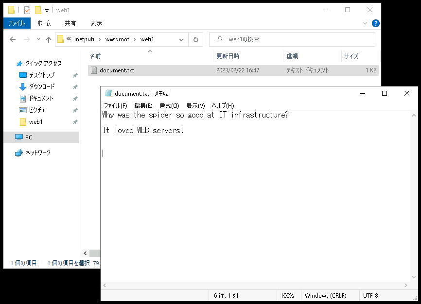</kbd> 

1. ClientのWebブラウザからWebアクセスする  
    1. 操作コンピュータを変更するため、演習環境のトップページに戻る  
    1. Windows Client(WinClient)の管理画面に "admin" で接続する   
    1. WinClientでWebブラウザ(Google Chrome)を起動する  
    1. Webブラウザのアドレス欄に [http://10.X.2.105/web1/document.txt] と入力し、[Enter]キーを押下する  
    1. Webコンテンツとして"document.txt"を参照できたことを確認する  
        <kbd></kbd> 


## 5. HTMLファイルを作成してWebコンテンツとして公開する  

1. HTMLファイル作成のため、Webコンテンツフォルダにアクセスする  
    1. 操作コンピュータを変更するため、演習環境のトップページに戻る  
    1. Windows Webサーバー(WinSrv2)の管理画面に接続する  
    1. "C:\\inetpub\\wwwroot\\web1" フォルダにアクセスする  

1. テキストファイルの拡張子を変更して、HTMLファイルを作成する  
    1. 右クリック コンテキストメニューの[新規作成]-[テキスト ドキュメント]をクリックする  
    1. 作成された新しいテキストファイルの名前を "index.html" に変更する  

        > 【補足】  
        > ファイルの拡張子を ".txt" から ".html" に変更すると、警告のポップアップが表示されます。  
        > ポップアップで[はい]をクリックします。  

        <kbd>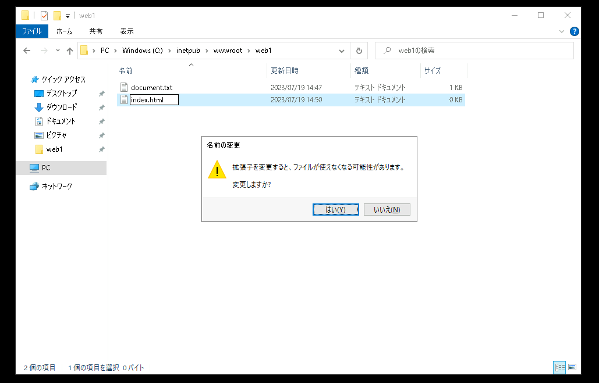</kbd> 

1. HTMLファイルをメモ帳(notepad.exe)で編集する  
    1. "index.html" ファイルをクリックして選択する
    1. 右クリック コンテキストメニューの[プログラムから開く]-[別のプログラムを選択]をクリックする  
        <kbd>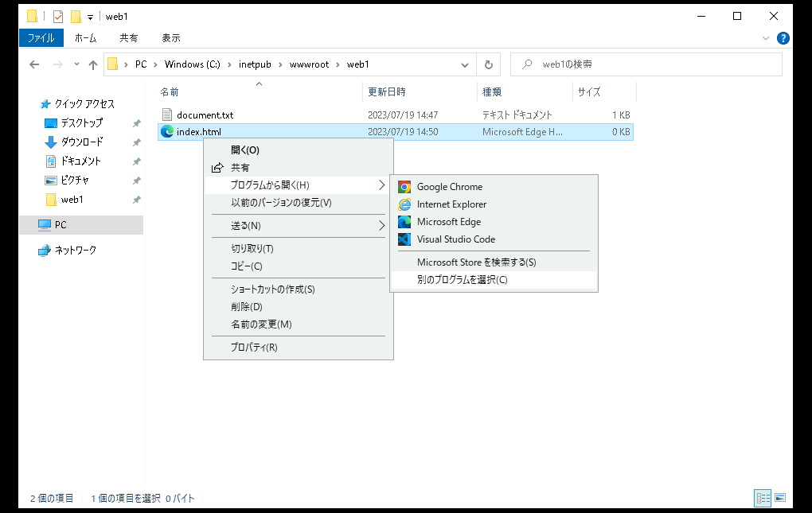</kbd> 
    1. [このファイルを開く方法を選んでください]ウィンドウが表示されたことを確認する  
    1. [その他のアプリ]をクリックする  
    1. メニュー内の[メモ帳]をクリックして選択し、[OK]をクリックする  
        <kbd></kbd> 
    1. メモ帳で "index.html" ファイルを開いたことを確認する
        <kbd>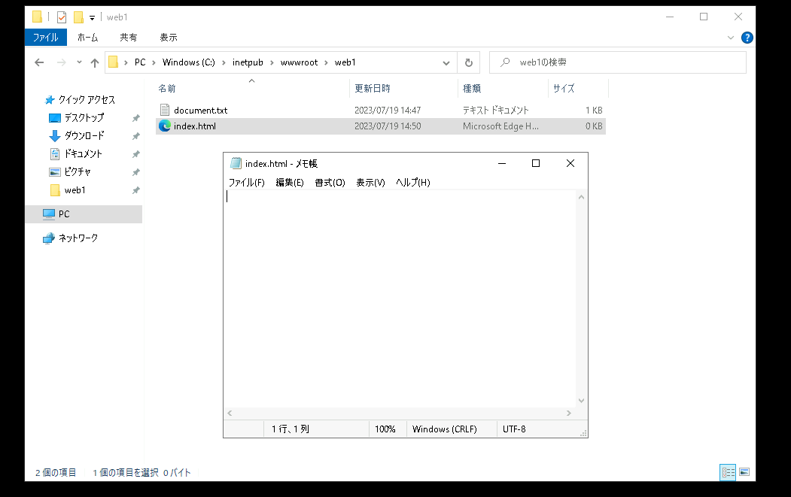</kbd> 


1. HTMLテキストを記述する  
    1. "index.html" ファイルに以下のHTMLテキストを記述する  

        ```
        <html>

        <font size="7">
        Let's HTML document!
        </font>

        

        <a href="document.txt">
        link
        </a>

        </html>
        ```

        <kbd>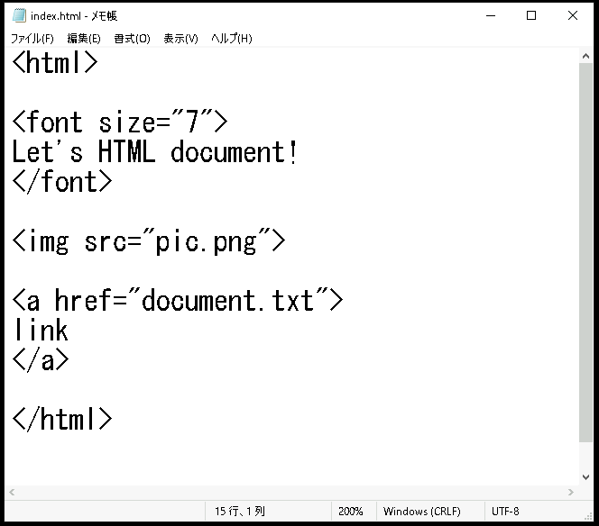</kbd>

    1. "index.html" ファイルを上書き保存する  


1. 画像ファイルを作成する  
    1. [Windowsメニュー] - [Windowsアクセサリ] - [ペイント] をクリックし、ペイントツールを起動する
        <kbd>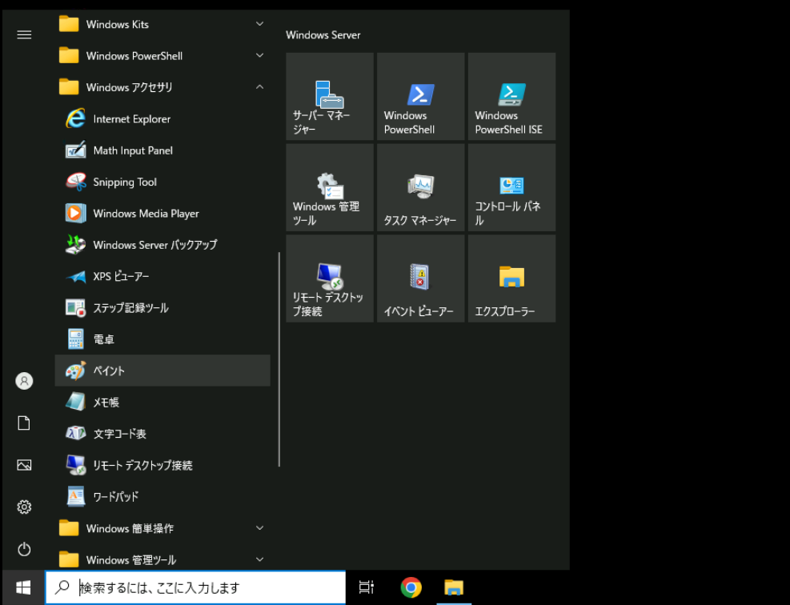</kbd> 
    1. Webコンテンツとして任意の絵を描画する    
        <kbd></kbd>  
    1. ペイントで作成した絵を、web1フォルダにpic.pngとして保存する  
        <kbd>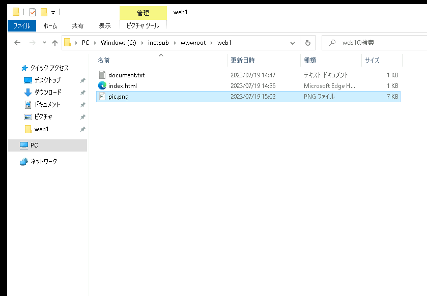</kbd>  


1. ClientのWebブラウザからWebアクセスする  
    1. 操作コンピュータを変更するため、演習環境のトップページに戻る  
    1. Windows Client(WinClient)の管理画面に "admin" で接続する   
    1. WinClientでWebブラウザ(Google Chrome)を起動する  
    1. Webブラウザのアドレス欄に [http://10.X.2.105/web1/index.html] と入力し、[Enter]キーを押下する  
    1. Webコンテンツとして"index.html"を参照できたことを確認する  
        <kbd></kbd> 
        > 【動作テストの観点】  
        > 作成したWebコンテンツが利用できることを確認する  

        - [x] HTMLタグによる文字のフォント変更が有効であること  
        - [x] Webページのなかで画像を表示できること  
        - [x] リンクをクリックし、document.txtページに遷移できること  
                

## 6. Virtual Hostingで複数のWebサイトを提供する  
 
1. WebサーバーでIIS管理ツールを起動する  
    1. 操作コンピュータを変更するため、演習環境のトップページに戻る  
    1. Windows Webサーバー(WinSrv2)の管理画面に接続する  
    1. サーバーマネージャーウィンドウ右上の[ツール]をクリックする  
    1. メニュー内の[インターネット インフォメーション サービス(IIS) マネージャー]をクリックし、IIS管理コンソールを起動する     

1. 新しいサイトを追加する
    1. 左側コンソールツリーの[＜サーバー名＞]-[サイト]をクリックする   
    1. 右クリック コンテキストメニューの[Webサイトの追加]をクリックする  
        <kbd>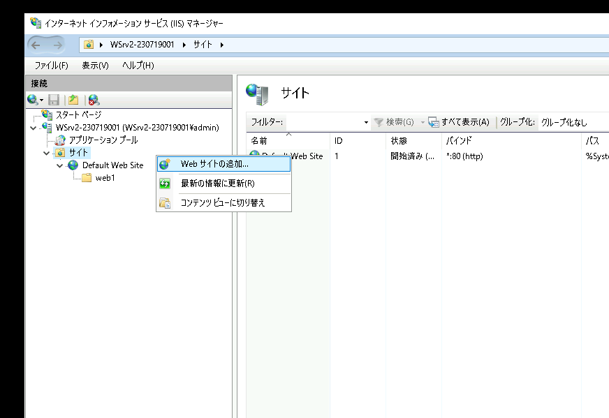</kbd> 
    1. [Webサイトの追加]ウィンドウが表示されたことを確認する  
    1. 以下のパラメータを入力する

        | 項目 | パラメータ |
        | :----- | :----- |
        | サイト名 | Web Share |
        | アプリケーション プール | <既定値> |
        | 物理パス | C:\\Share |  
        | 種類 | http |
        | IPアドレス | 未使用のIPアドレスすべて |  
        | ポート | 1080 |  
        | ホスト名 | <空欄> |  
        - [x] Webサイトを直ちに開始する  

        <kbd></kbd> 

    1. "Web Share" の Webサイトが追加されたことを確認する
        <kbd>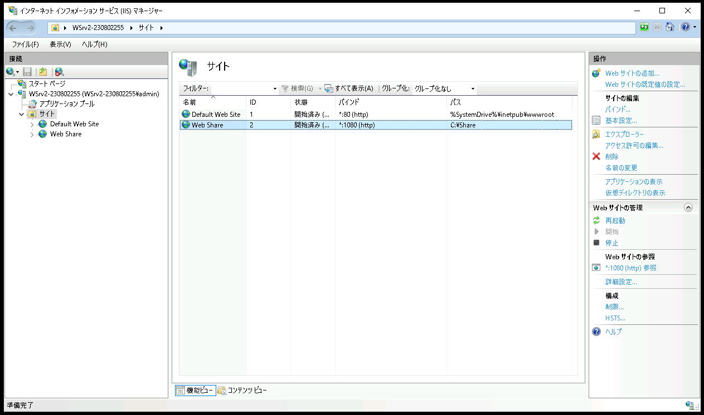</kbd> 

    1. 追加したサイト(Web Share)の待ち受けポート番号を確認する  

        1. [スタートメニュー]を右クリックし、コンテキストメニュー内の[Windows PowerShell(管理者)]をクリックする  
        1. [ユーザー アカウント制御]のポップアップで[はい]をクリックする  
        1. Windows PowerShellのウィンドウが表示されたことを確認する  
        1. 以下のコマンドを実行し、Webサーバーが1080ポートで待ち受けしていることを確認する  
            ＞ ***netstat -ano***     
            > 【補足】  
            > netstatはネットワーク関連のステータス情報を表示するコマンドです。  
            > -ano オプションを付与することで、OSが待ち受け(リスニング)しているポート番号とプロセスの対応を確認できます。  

            <kbd>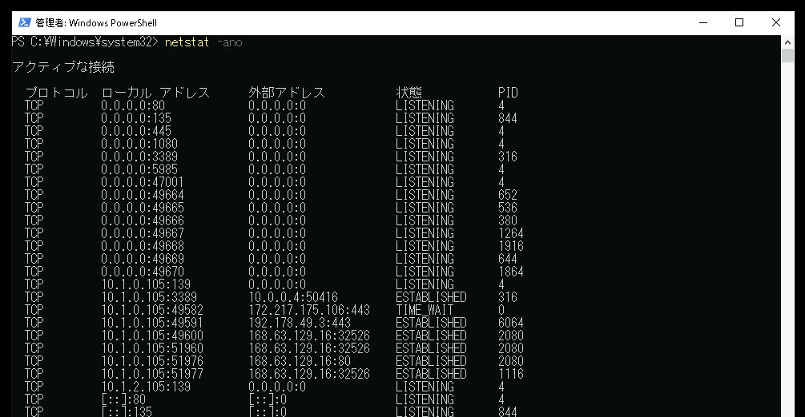</kbd>   
            
            > 【確認ポイント】  
            - [x] ローカルアドレス "0.0.0.0:1080" のエントリが存在することを確認する

    <!--
    不要 
    1. "C:\\Share"のNTFSアクセス権を構成する    
        1. "Web Share" のコンテンツディレクトリ("C:\\Share")をクリックし、右クリック コンテキストメニューの[プロパティ]をクリックする
        1. [プロパティ]ウィンドウの[セキュリティ]タブをクリックする  
        1. [編集]をクリックする  
        1. [Shareのアクセス許可]ウィンドウが表示されたことを確認する  
        1. [追加]をクリックする  
        1. [ユーザーまたはグループの選択]ウィンドウが表示されたことを確認する  
        1. "選択するオブジェクト名を入力してください" の欄に "IIS_IUSRS" と入力する  
        1. [名前の確認]をクリックする  
        1. "<コンピュータ名>￥IIS_IUSRS" の表記に下線がついたことを確認する  
            <kbd></kbd> 
        1. [OK]をクリックする  
        1. [Shareのアクセス許可]ウィンドウで、"IIS_IUSRS"が追加されていることを確認する  
        1. [Shareのアクセス許可]ウィンドウで、[OK]をクリックする  
        1. [プロパティ]ウィンドウで、"IIS_IUSRS"が追加されていることを確認する  
            <kbd></kbd> 
        1. [プロパティ]ウィンドウで、[OK]をクリックする  
    -->


1. ClientのWebブラウザからWebアクセスする  
    1. 操作コンピュータを変更するため、演習環境のトップページに戻る  
    1. Windows Client(WinClient)の管理画面に "admin" で接続する   
    1. WinClientでWebブラウザ(Google Chrome)を起動する  
    1. Webブラウザのアドレス欄に [http://10.X.2.105:1080/cheese.txt] と入力し、[Enter]キーを押下する  
    1. Webコンテンツとして"cheese.txt"を参照できたことを確認する  
        <kbd></kbd>   
        > 【動作テストの観点】  
        > Web Shareのサイトのコンテンツにアクセスできたことを確認する    

        - [x] ポート番号1080を指定したアドレスでアクセスできること  

    1. Webブラウザのアドレス欄に [http://10.X.2.105:1080/] と入力し、[Enter]キーを押下する  

    1. トップページの情報はまだ参照できないことを確認する  
        <kbd>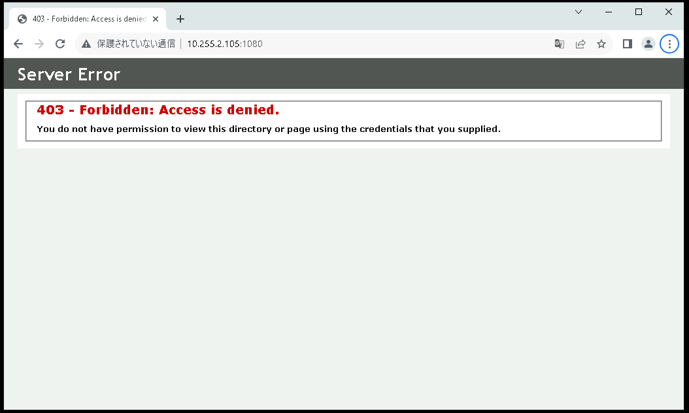</kbd>   
        > 【補足】  
        > 次の手順でディレクトリ参照を有効化することで、トップページにもアクセスできるようになります。    

---  

## 7. ディレクトリ参照を使用する

1. WebサーバーでIIS管理ツールを起動する  
    1. 操作コンピュータを変更するため、演習環境のトップページに戻る  
    1. Windows Webサーバー(WinSrv2)の管理画面に接続する  
    1. サーバーマネージャーウィンドウ右上の[ツール]をクリックする  
    1. メニュー内の[インターネット インフォメーション サービス(IIS) マネージャー]をクリックし、IIS管理コンソールを起動する     

1. "Web Share"サイトでディレクトリ参照を有効化する  
    1. 左側コンソールツリーの[＜サーバー名＞]-[サイト]-[Web Share]をクリックする  
    1. ウィンドウ中央ペインの[ディレクトリ参照]をダブルクリックする  
        <kbd></kbd> 
    1. ウィンドウ右側ペインの[操作]メニューの[有効にする]をクリックする  
        <kbd></kbd> 
    1. ディレクトリ参照が有効化されたことにより、ウィンドウ中央ペインの項目のチェックボックスのグレーアウトが解除されていたことを確認する  
        <kbd>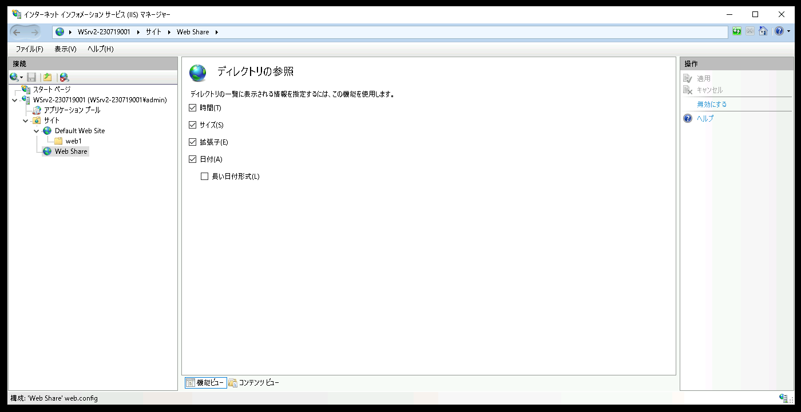</kbd> 

1. ClientのWebブラウザからWebアクセスする  
    1. 操作コンピュータを変更するため、演習環境のトップページに戻る  
    1. Windows Client(WinClient)の管理画面に "admin" で接続する   
    1. WinClientでWebブラウザ(Google Chrome)を起動する  
    1. Webブラウザのアドレス欄に [http://10.X.2.105:1080/] と入力し、[Enter]キーを押下する  
    1. ディレクトリ参照により、トップページにアクセスすることでWebコンテンツフォルダに保存されたファイル一覧を参照できたことを確認する  
        <kbd></kbd>   

1. IISのconfigファイル(web.config)を非表示にする  
    1. 操作コンピュータを変更するため、演習環境のトップページに戻る  
    1. Windows Webサーバー(WinSrv2)の管理画面に接続する  
    1. "C:\\Share" フォルダにアクセスする  
    1. "web.config" ファイルをクリックして選択し、右クリック コンテキストメニューの[プロパティ]をクリックする  
    1. [全般]タブの[隠しファイル]のチェックボックスを有効化する  
        <kbd>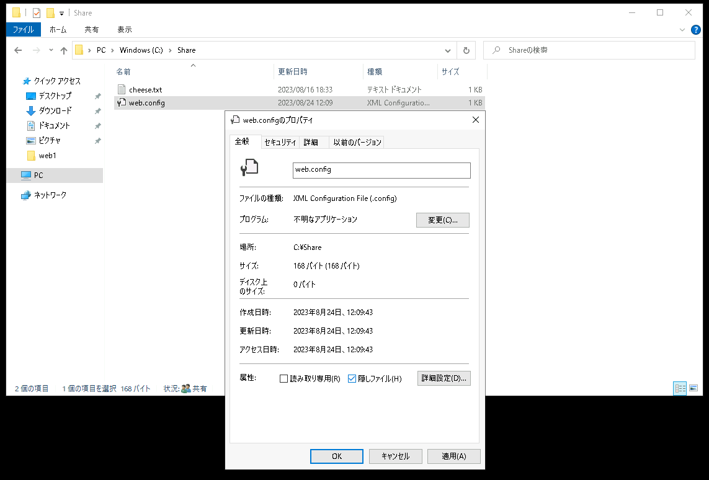</kbd> 
    1. [プロパティ]ウィンドウの[OK]をクリックする  
    1. "web.config"ファイルがファイルエクスプローラ ウィンドウで非表示状態になったことを確認する  
    1. ファイル エクスプローラの設定を変更して隠しファイルを表示状態にして、"web.config" が削除されていないことを確認する  
        1. ファイル エクスプローラ上部メニューの[表示]タブをクリックする  
        1. [表示/非表示]項目の[隠しファイル]のチェックを有効化する
            <kbd></kbd> 
    1. "web.config"ファイルがファイルエクスプローラ ウィンドウで表示されていることを確認する  


1. ClientのWebブラウザからWebアクセスする  
    1. 操作コンピュータを変更するため、演習環境のトップページに戻る  
    1. Windows Client(WinClient)の管理画面に "admin" で接続する   
    1. WinClientでWebブラウザ(Google Chrome)を起動する  
    1. Webブラウザのアドレス欄に [http://10.X.2.105:1080/] と入力し、[Enter]キーを押下する  
    1. "web.config"ファイルが表示されていないことを確認する  
        > 【補足】  
        > 画面に変化がない場合は、Chromeの画面をリロード(再読み込み)してください。    
            <kbd>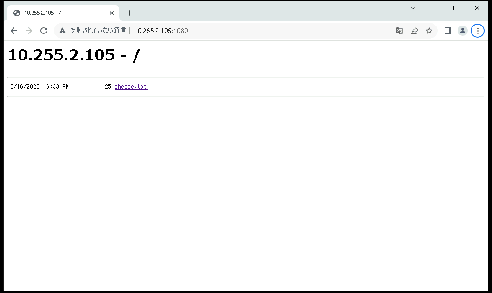</kbd> 

---  

## 8. エラーページをカスタマイズする

1. 変更前のエラーページを確認する    
    1. WinClientでWebブラウザ(Google Chrome)を起動する  
    1. Webブラウザのアドレス欄に [http://10.X.2.105:1080/missurl.txt] と入力し、[Enter]キーを押下する  
    1. IISの既定のエラーページが表示される状態であることを確認する  
        <kbd></kbd> 

1. エラーページ ファイルを作成する  
    1. 操作コンピュータを変更するため、演習環境のトップページに戻る  
    1. Windows Webサーバー(WinSrv2)の管理画面に接続する  
    1. "C:\\Share" フォルダにアクセスする  
    1. 右クリック コンテキストメニューの[新規作成]-[テキスト ドキュメント]をクリックする  
    1. 作成された新しいテキストファイルの名前を "404err.html" に変更する  
    1. "404err.html" ファイルをクリックして選択する  
    1. 右クリック コンテキストメニューの[プログラムから開く]-[別のプログラムを選択]をクリックする  
    1. [このファイルを開く方法を選んでください]ウィンドウが表示されたことを確認する  
    1. [その他のアプリ]をクリックする  
    1. メニュー内の[メモ帳]をクリックして選択し、[OK]をクリックする  
    1. メモ帳で "404err.html" ファイルを開いたことを確認する
    1. "404err.html" ファイルに以下のHTMLテキストを記述する  

        ```
        <html>
        <meta charset="UTF-8">

        指定されたファイルがありません。

        <a href="/">トップページ</a>に戻ってください。

        </html>
        ```

        <kbd></kbd>

    1. "404err.html" ファイルを上書き保存する  
    

1. Webサイト(Web Share)の設定のエラーページを設定する  
    1. IIS管理コンソールを起動する 
    1. 左側コンソールツリーの[＜サーバー名＞]-[サイト]-[Web Share]をクリックする  
    1. ウィンドウ中央ペインの[エラー ページ]をダブルクリックする  
        <kbd>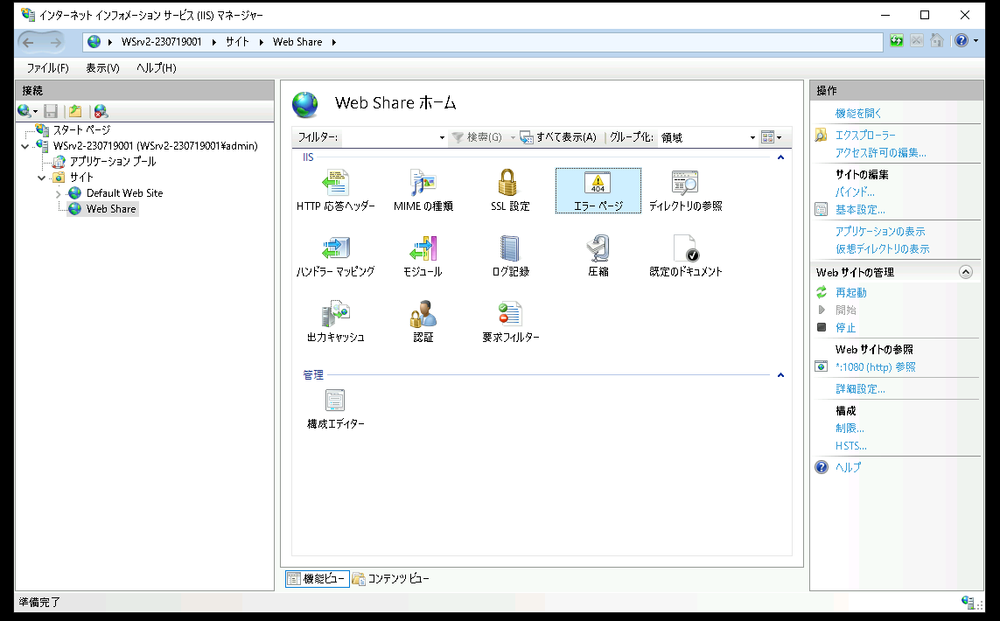</kbd>  

    1. ウィンドウ中央ペインで、状態コード[404]のエントリをクリックして選択する
        <kbd>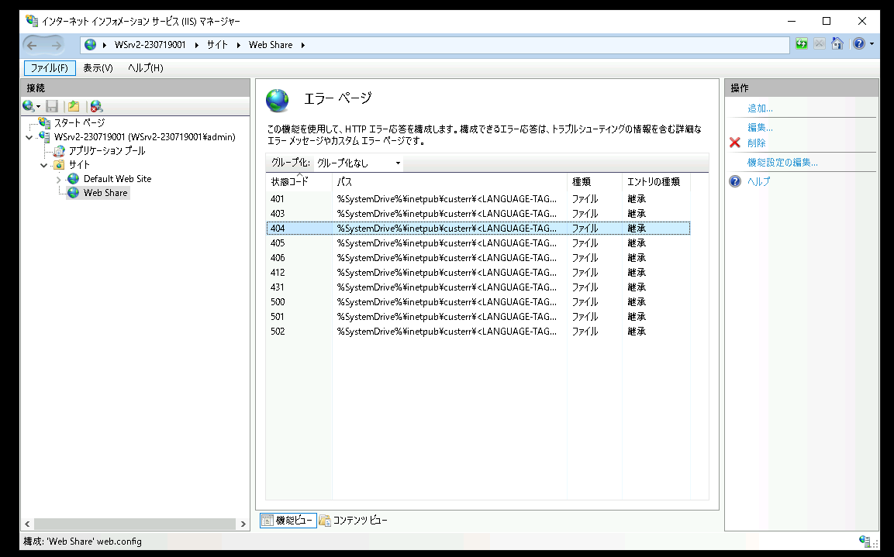</kbd>  

    1. ウィンドウ右側ペインの[操作]メニューの[編集]をクリックする  
    1. [カスタムエラーページの編集]ウィンドウが表示されたことを確認する
    1. 以下のパラメータを入力する
        応答動作:  
        - [ ] 静的ファイルのコンテンツをエラー応答に挿入する
        - [x] このサイトでURLを実行する  
        - [ ] 302リダイレクトによる応答  

        
        | 項目 | パラメータ |
        | :----- | :----- | 
        | URL(サイトのルートに対する相対パス) | /404err.html |        

        <kbd>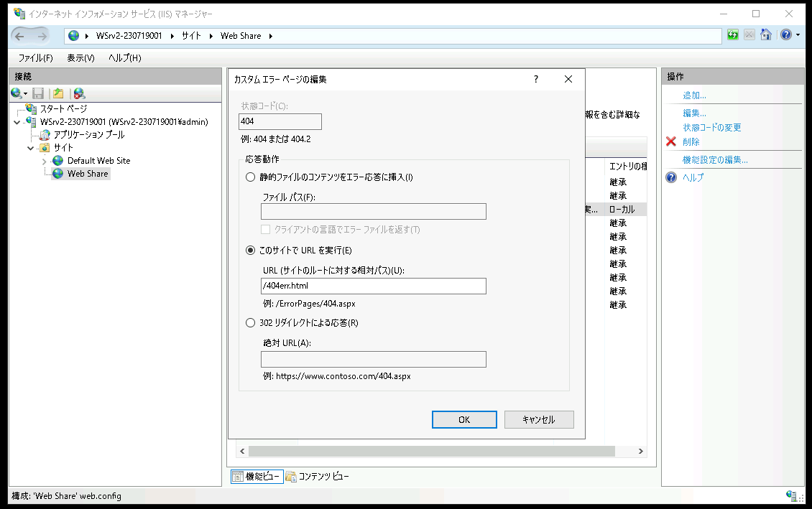</kbd>  

    1. [カスタムエラーページの編集]ウィンドウで、[OK]をクリックする  
    1. 状態コード[404]のエントリのパスが "/404err.html" であることを確認する
        <kbd></kbd> 


1. ClientのWebブラウザから、存在しないアドレスにWebアクセスする  
    1. 操作コンピュータを変更するため、演習環境のトップページに戻る  
    1. Windows Client(WinClient)の管理画面に "admin" で接続する   
    1. WinClientでWebブラウザ(Google Chrome)を起動する  
    1. Webブラウザのアドレス欄に [http://10.X.2.105:1080/missurl.txt] と入力し、[Enter]キーを押下する   
    1. カスタムしたエラーページが表示されることを確認する   
        > 【補足】  
        > 画面に変化がない場合は、Chromeの画面をリロード(再読み込み)してください。   


        <kbd>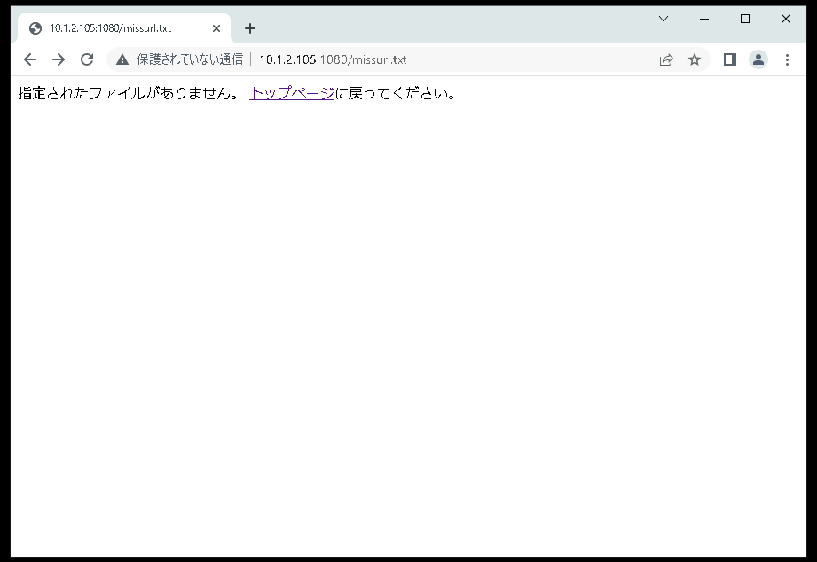</kbd> 


## 9. IISの役割サービス(基本認証、HTTPリダイレクト)を追加インストールする


1. 役割と機能の追加ウィザードを開始する  
    1. 操作コンピュータを変更するため、演習環境のトップページに戻る  
    1. Windows Webサーバー(WinSrv2)の管理画面に接続する   
    1. [スタートメニュー]をクリックする  
    1. スタートメニュー内の[サーバー マネージャー]をクリックし、サーバーマネージャを起動する    
    1. サーバーマネージャーのダッシュボード画面内の[役割と機能の追加]をクリックする   
    1. [役割と機能の追加ウィザード]ウィンドウが起動したことを確認する  

1. Webサーバー(IIS)の役割サービスを追加する
    1. [役割と機能の追加ウィザード]ウィンドウの[開始する前に]画面で、[次へ]をクリックする  
    1. [インストールの種類]画面で、[次へ]をクリックする  
    1. [サーバーの選択]画面で、[次へ]をクリックする  
    1. [サーバーの役割]画面で、以下のパラメータを追加選択する  

        - [x] [Webサーバー(IIS)]-[Webサーバー]-[HTTP共通機能]-[HTTPリダイレクト]  
        - [x] [Webサーバー(IIS)]-[Webサーバー]-[セキュリティ]-[基本認証]  
        <kbd></kbd> 
        <kbd>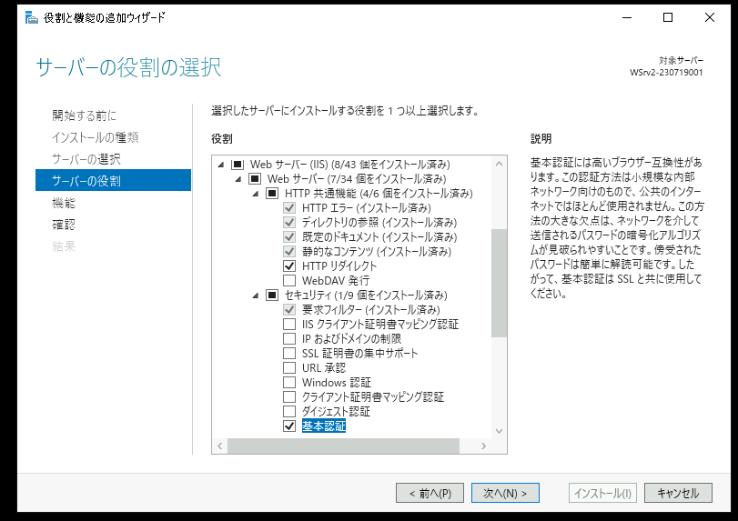</kbd>    

    1. [サーバーの役割]画面で、上のパラメータを選択したことを確認し、[次へ]をクリックする  
    1. [機能の選択]画面で、[次へ]をクリックする  
    1. [確認]画面で、[インストール]をクリックする  
        <kbd></kbd> 
    1. [結果]画面で、インストール進捗を示すプログレスバーが右端に到達するまで数分間待機する  
    1. [結果]画面で、インストールが正常に完了したことを確認し、[閉じる]をクリックする  
 

## 10. HTTPリダイレクトを構成する  

1. 新しい仮想ディレクトリのためのフォルダ(C:\\inetpub\\oldpage)を作成する
    1. ファイルエクスプローラで "C:\\inetpub" にアクセスする  
    1. 新しいフォルダを作成する  
    1. 作成したフォルダの名前を "oldpage" に変更する  
        <kbd>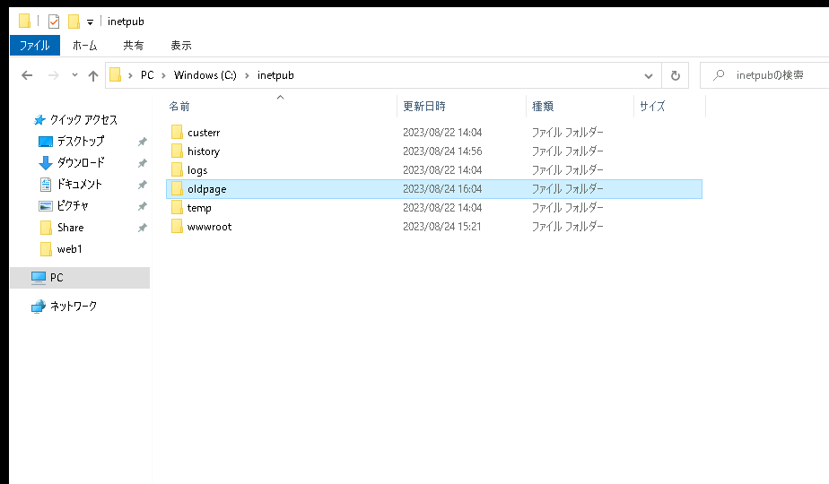</kbd> 

1. 新しい仮想ディレクトリ("oldpage")を追加する  
    1. IIS管理コンソール(インターネット インフォメーション サービス(IIS) マネージャー)をすでに起動している場合は、IIS管理コンソールのウィンドウを閉じて終了し、再度IIS管理コンソールを起動する  
    > 【補足】  
    > 前の手順で追加インストールした役割サービスを管理コンソール画面に表示するために、IIS管理コンソールの再起動が必要です。  
    1. 左側コンソールツリーの[＜サーバー名＞]-[サイト]-[Default Web Site]をクリックする  
    1. 右クリック コンテキストメニューの[仮想ディレクトリの追加]をクリックする  
        <kbd>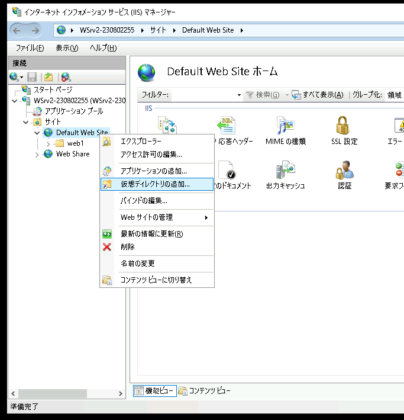</kbd> 
    1. [仮想ディレクトリの追加]ウィンドウが表示されたことを確認する  
    1. 以下のパラメータを入力する  

        | 項目 | パラメータ |  
        | :----- | :----- |  
        | エイリアス | oldpage |    
        | 物理パス | C:\\inetpub\\oldpage |      

        <kbd>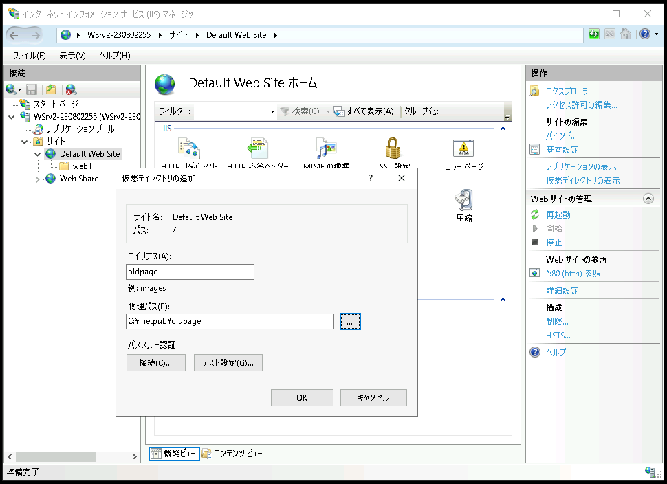</kbd> 

    1. [仮想ディレクトリの追加]ウィンドウで[OK]をクリックする  

1. HTTPリダイレクトを構成する
    1. 左側コンソールツリーの[＜サーバー名＞]-[サイト]-[Default Web Site]-[oldpage]をクリックする  
    1. ウィンドウ中央ペインの[HTTPリダイレクト]をダブルクリックする  
        <kbd>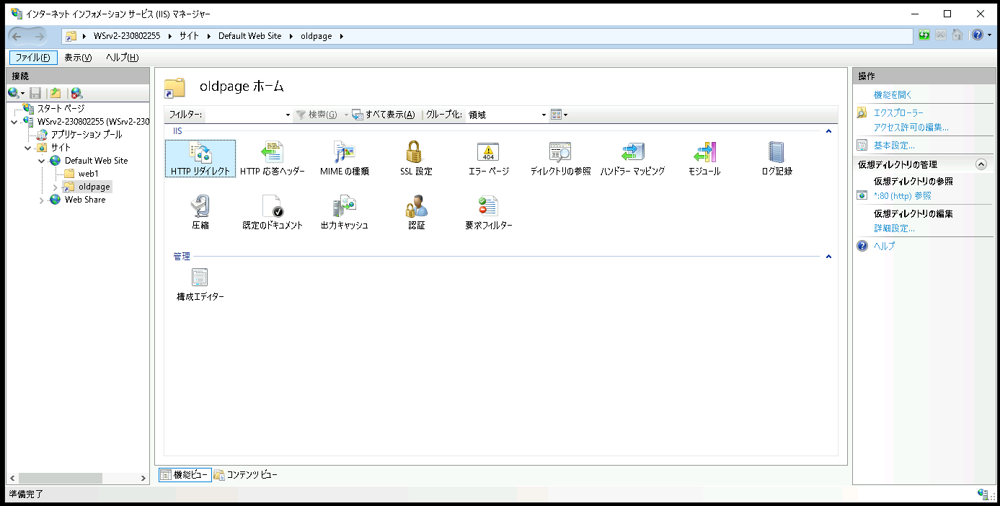</kbd> 

    1. 以下のパラメータを入力する  

        - [x] このリダイレクト先に要求をリダイレクト
        | 項目 | パラメータ |  
        | :----- | :----- |  
        | <アドレス欄> | http://10.X.2.105:1080/ |       

        <kbd></kbd> 

    1. ウィンドウ右側ペインの[操作]メニューの[適用]をクリックする  

1. ClientのWebブラウザから仮想ディレクトリ(oldpage)にWebアクセスし、リダイレクトの動作を確認する    
    1. 操作コンピュータを変更するため、演習環境のトップページに戻る  
    1. Windows Client(WinClient)の管理画面に "admin" で接続する   
    1. WinClientでWebブラウザ(Google Chrome)を起動する  
    1. Webブラウザのアドレス欄に [http://10.X.2.105/oldpage] と入力し、[Enter]キーを押下する  
        <kbd>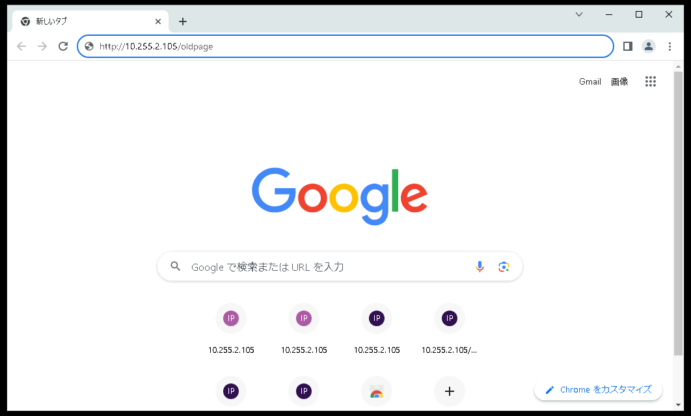</kbd> 
    1. HTTPリダイレクト処理により、別のWebサイト (http://10.X.2.105:1080/) に接続したことを確認する  
        <kbd>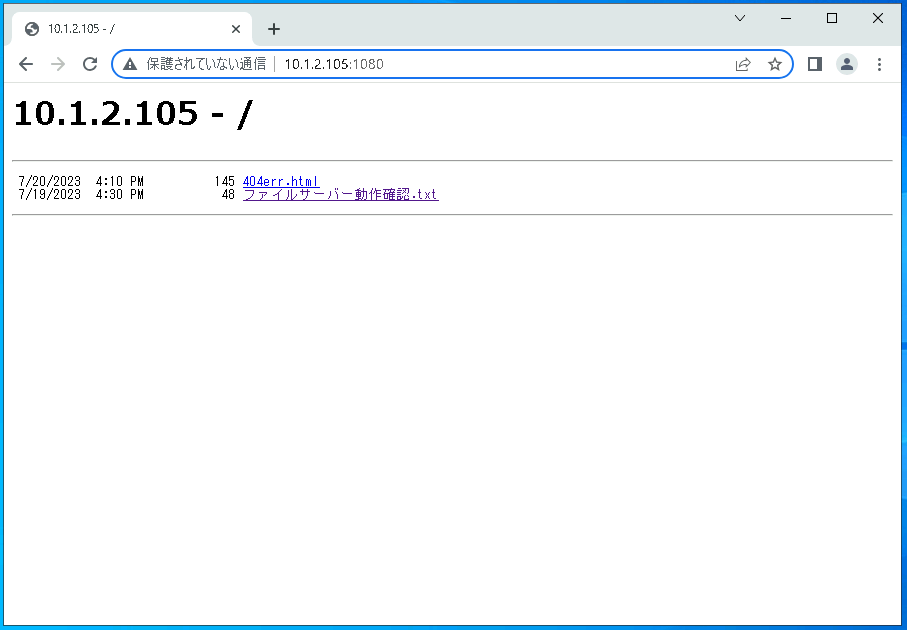</kbd> 

---

## 11. HTTP基本認証を構成する  

1. 認証の設定変更メニューを表示する      
    1. 操作コンピュータを変更するため、演習環境のトップページに戻る  
    1. Windows Webサーバー(WinSrv2)の管理画面に接続する   
    1. IIS管理コンソールを起動する  
    1. 左側コンソールツリーの[＜サーバー名＞]-[サイト]-[Default Web Site]-[web1]をクリックする  
    1. ウィンドウ中央ペインの[認証]をダブルクリックする  
        <kbd>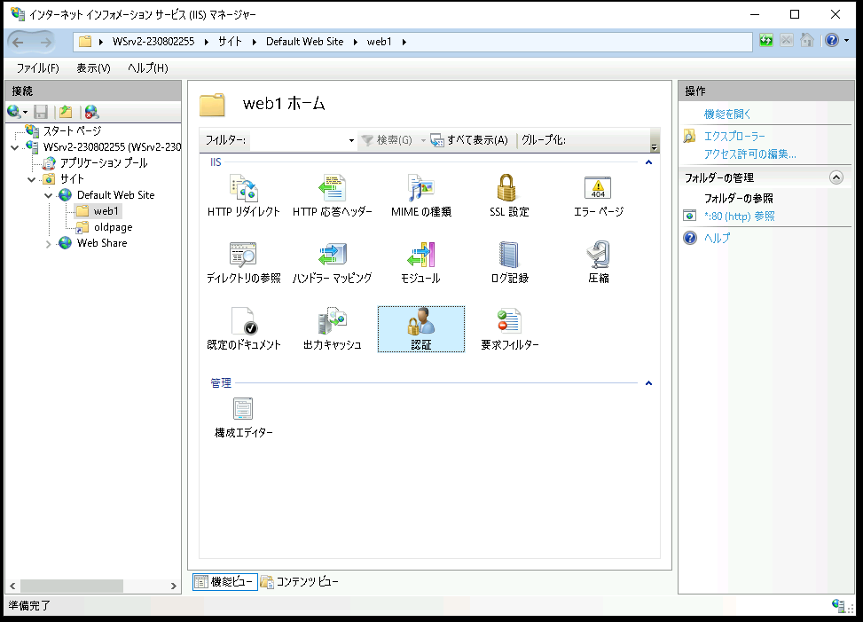</kbd>  

1. HTTP基本認証を有効化する    
    1. ウィンドウ中央ペインで、[基本認証]のエントリをクリックして選択する  
        <kbd>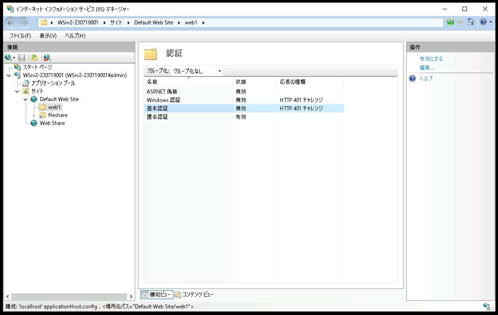</kbd>  
    1. ウィンドウ右側ペインの[操作]メニューの[有効にする]をクリックする  

    1. [基本認証]のエントリの状態が "有効" であることを確認する  
        <kbd></kbd>  

1. 匿名アクセス(匿名認証)を無効にする    
    1. ウィンドウ中央ペインで、[匿名認証]のエントリをクリックして選択する  
        <kbd></kbd>  
    1. ウィンドウ右側ペインの[操作]メニューの[無効にする]をクリックする  
    1. [匿名認証]のエントリの状態が "無効" であることを確認する  
        <kbd>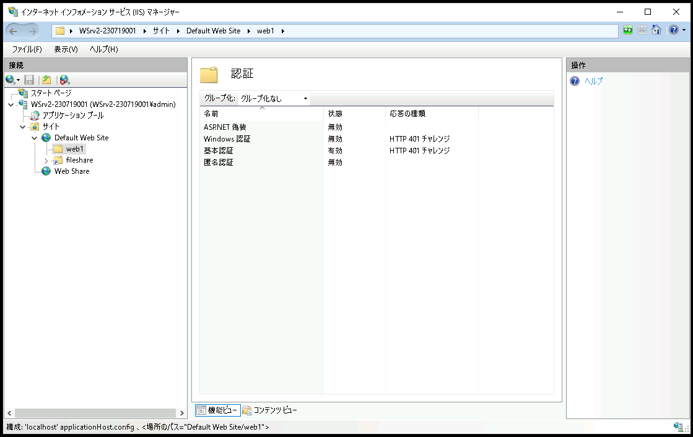</kbd>  

1. ClientのWebブラウザから仮想ディレクトリ(web1)にWebアクセスし、基本認証の動作を確認する    
    1. 操作コンピュータを変更するため、演習環境のトップページに戻る  
    1. Windows Client(WinClient)の管理画面に "admin" で接続する   
    1. WinClientでWebブラウザ(Google Chrome)を起動する  
    1. Webブラウザのアドレス欄に [http://10.X.2.105/web1] と入力し、[Enter]キーを押下する  
    1. 認証情報を入力するポップアップが表示されたことを確認する  
        <kbd>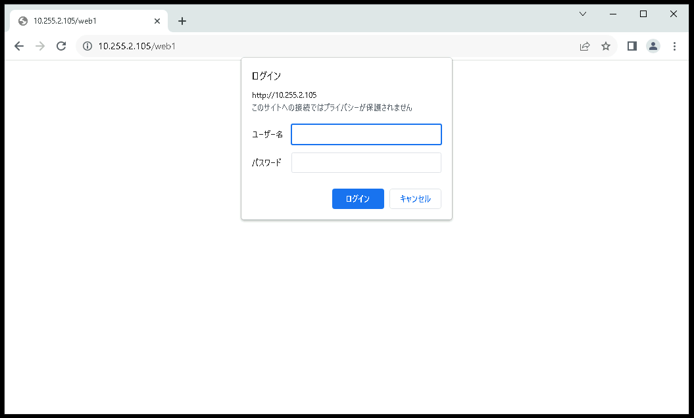</kbd> 
    1. 以下のパラメータを入力する  
        | 項目 | パラメータ |  
        | :----- | :----- |  
        | ユーザー名 | Tom |   
        | パスワード | Pa$$w0rd |   
    1. 上のパラメータを入力し、[ログイン]をクリックする  
    1. 基本認証を経て、Webコンテンツを利用できることを確認する
        <kbd>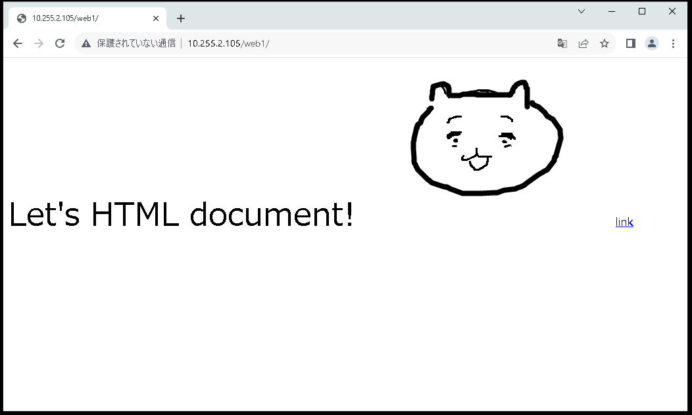</kbd> 


---

## 演習完了  
ここまでの手順で、以下の項目を学習できました。
- [x] Webサーバー(IIS)の役割を追加する
- [x] Webコンテンツを公開する
- [x] HTMLファイルを作成する
- [x] 複数のWebサイトをホストする
- [x] ディレクトリ参照を構成する
- [x] エラーページを変更する
- [x] HTTPリダイレクトを構成する
- [x] 基本認証を構成する


## 参考資料
- Apple storeの「まもなくです」は、実は「503」エラーである
    - https://claypier.com/apple-store-coming_soon-503/

