# RADIUS認証環境を構築する  

---

## 演習の意図
    演習ガイドを参照して演習の意図をあらかじめ確認してください

## 演習における役割と、環境のパラメータ
- X: ご自身のPod番号  
- RADIUSサーバー役: WinSrv2(WSrv2-yyMMddX)
- ユーザー データベース役(Active Directory ドメインコントローラー): WinSrv1(WSrv1-yyMMddX)  
- RADIUSクライアント役: Router2  
- ユーザー: WinClient(WC1-yyMMddX)  

## 注意
- 手順例の画像は<B>pod255</B>に準拠したパラメータのものです
- 手順内の<B>X</B>表記はご自身のpod番号に読み替えてください

---


## RADIUS用のActive Directoryユーザーグループを作成する  

1. Active Directory サーバー(WinSrv1)の管理画面に接続する  
1. Active Directoryユーザー 管理コンソール("Active Directoryユーザーとコンピューター")を起動する  
1. [Active Directory ユーザーとコンピューター]-[example.local]-[Groups]に、新しいActive Directory ユーザーグループ(G_NwAdmins)を以下のパラメータで作成する  

    | 項目 | パラメータ |
    | :----- | :----- |
    | グループ名 | G_NwAdmins |
    | グループ名(Windows2000より以前) | G_NwAdmins |

    グループのスコープ:  
    - [ ] ドメイン ローカル  
    - [x] グローバル  
    - [ ] ユニバーサル  

    グループの種類:  
    - [x] セキュリティ  
    - [ ] 配布  

    > 【注意】  
    > "G_NwAdmins"グループのスコープは "グローバル" を選択します  

1. 作成した"G_NwAdmins"グループのメンバーとして、Active Directoryユーザーの"Tom"を追加する  

1. [Active Directory ユーザーとコンピューター]-[example.local]-[Groups]に、新しいActive Directory ユーザーグループ(DL_Router_RemoteConnect)を以下のパラメータで作成する  

    | 項目 | パラメータ |
    | :----- | :----- |
    | グループ名 | DL_Router_RemoteConnect |
    | グループ名(Windows2000より以前) | DL_Router_RemoteConnect |

    グループのスコープ:  
    - [x] ドメイン ローカル  
    - [ ] グローバル  
    - [ ] ユニバーサル  

    グループの種類:  
    - [x] セキュリティ  
    - [ ] 配布  


    > 【注意】  
    > "DL_Router_RemoteConnect"グループのスコープは "ドメインローカル" を選択します   

1. 作成した"DL_Router_RemoteConnect"グループのメンバーとして、Active Directoryグループの"G_NwAdmins"を追加する  

    > 【補足】
    > この演習では、Active DirectoryユーザーのTomがRouterに管理接続できるように構成します。  
    > 最終的に、以下のフローでTomのRouter管理接続が許可されます。  


    ```mermaid
    graph TD;
        TomがClientからRouterに管理接続-->RADIUSクライアントのRouter
        RADIUSクライアントのRouter-->RADIUSサーバーのネットワークポリシーサーバー;
        RADIUSサーバーのネットワークポリシーサーバー-->認証サーバーのActiveDirectory;
        認証サーバーのActiveDirectory-->DL_Router_RemoteConnectグループ;
        DL_Router_RemoteConnectグループ-->メンバーのG_NwAdminsグループ;
        メンバーのG_NwAdminsグループ-->メンバーのTomユーザー;
        メンバーのTomユーザー-->Tomの管理接続を許可する;
        
    ```


---   

## RADIUSサーバーの役割を追加  

1. RADIUSサーバー(WinSrv2)の管理画面に接続する  

1. 役割と機能の追加ウィザードを開始する  
    1. [スタートメニュー]をクリックする  
    1. スタートメニュー内の[サーバー マネージャー]をクリックし、サーバーマネージャを起動する    
    1. サーバーマネージャーのダッシュボード画面内の[役割と機能の追加]をクリックする   
    1. [役割と機能の追加ウィザード]ウィンドウが起動したことを確認する  

1. RADIUSサーバー("ネットワーク ポリシーとアクセス サービス")の役割を追加する
    1. [役割と機能の追加ウィザード]ウィンドウの[開始する前に]画面で、[次へ]をクリックする  
    1. [インストールの種類]画面で、[次へ]をクリックする  
    1. [サーバーの選択]画面で、[次へ]をクリックする  
    1. [サーバーの役割]画面で、以下のパラメータを選択する  

        - [x] ネットワーク ポリシーとアクセス サービス  

        > 【補足】  
        > "ネットワーク ポリシーとアクセス サービス"のチェックをつけると、[ネットワーク ポリシーとアクセス サービスに必要な機能を追加しますか？]の確認ポップアップが表示されます。  
        > [ネットワーク ポリシーとアクセス ービスに必要な機能を追加しますか？]ウィンドウで、[機能の追加] をクリックします。  

        <kbd>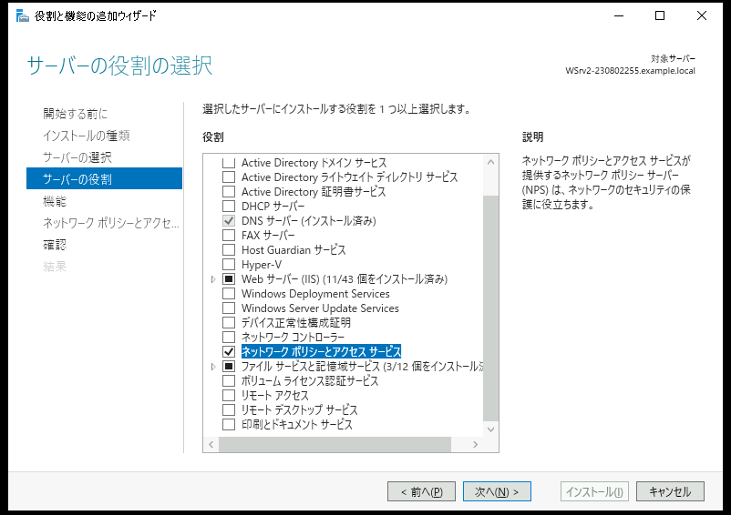</kbd> 

    1. [サーバーの役割]画面で、上のパラメータを選択したことを確認し、[次へ]をクリックする  
    1. [機能の選択]画面で、[次へ]をクリックする  
    1. [ネットワーク ポリシーとアクセス サービス]画面で、[次へ]をクリックする  
    1. [確認]画面で、[インストール]をクリックする  
    1. [結果]画面で、インストール進捗を示すプログレスバーが右端に到達するまで数分間待機する  
    1. [結果]画面で、インストールが正常に完了したことを確認し、[閉じる]をクリックする  
        <kbd>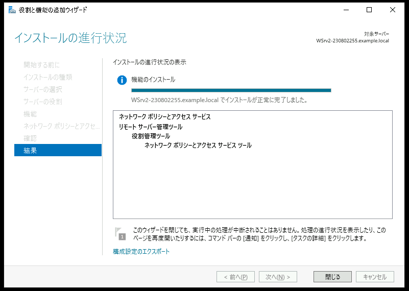</kbd> 

---  

## RADIUSクライアントをNPSに登録する    

1. ネットワーク ポリシー サーバー(NPS)管理コンソールを起動する  
    1. サーバーマネージャーウィンドウ右上の[ツール]をクリックする  
    1. メニュー内の[ネットワーク ポリシー サーバー]をクリックし、NPS管理コンソールを起動する  
        <kbd>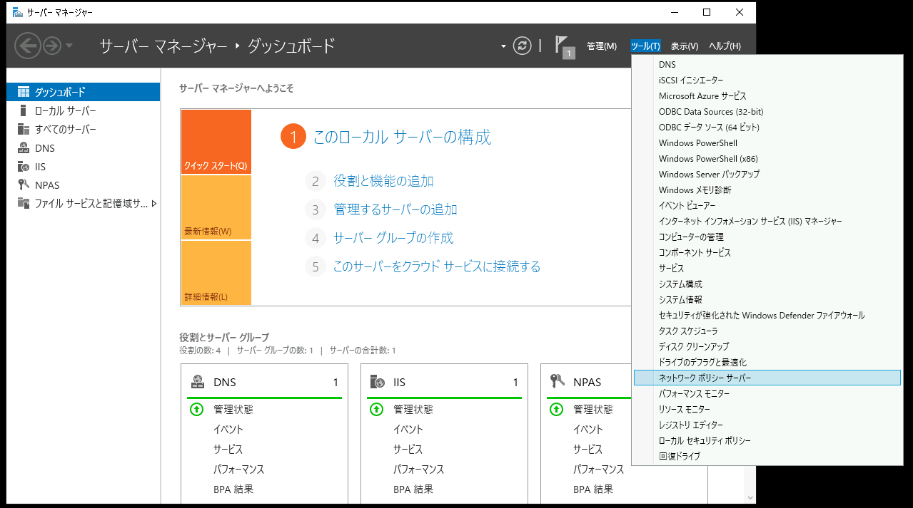</kbd> 
    1. [ネットワーク ポリシー サーバー]管理コンソールが起動したことを確認する  
        <kbd>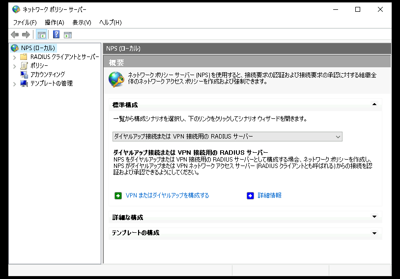</kbd> 

1. RADIUSクライアントを新規登録する  
    1. 左側コンソールツリーの[NPS(ローカル)]-[RADIUSクライアントとサーバー]-[RADIUSクライアント]をクリックする  
    1. [RADIUSクライアント]を右クリックし、コンテキストメニュー内の[新規]をクリックする  
        <kbd>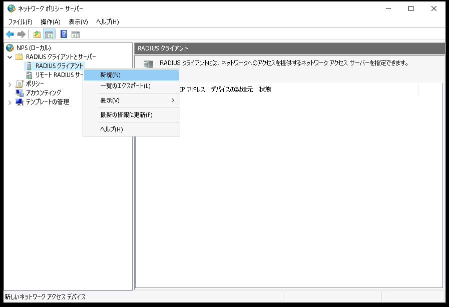</kbd>  

    1. [新しいRADIUSクライアント]ウィンドウが表示されたことを確認する  
        <kbd>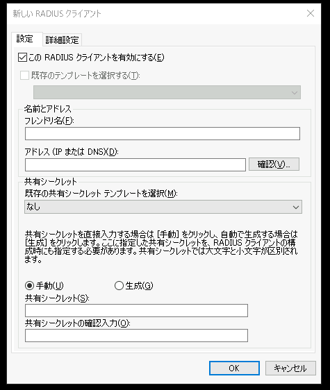</kbd>  

    1. [新しいRADIUSクライアント]ウィンドウで、以下のパラメータを入力する  

        - [x] このRADIUSクライアントを有効にする  

        - [ ] 既存のテンプレートを選択する    

        フレンドリ名:
        | Router2 | 
        | :----- | 

        アドレス(IPまたはDNS):
        | 10.X.2.254 | 
        | :----- | 

        既存の共有シークレット テンプレートを選択する:
        | なし | 
        | :----- | 

        - [x] 手動  
        - [ ] 生成     

        共有シークレット:
        | Pa\$\$w0rd | 
        | :----- | 

        共有シークレットの確認入力:
        | Pa\$\$w0rd | 
        | :----- | 

        <kbd>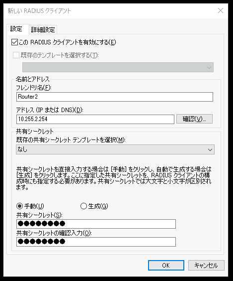</kbd>  

        <!--
        > 【補足】
        > アドレスはDNS名で指定することもできます。
        > 今回の演習では、Router2のどのインターフェイスからパケットが発信されるかを意識するため、IPアドレスを明示的に指定しています。
        -->


1. RADIUSクライアントの登録を確認する  

    1. [RADIUSクライアント]の一覧に、Router2の情報が追加されていることを確認する  
    
        <kbd>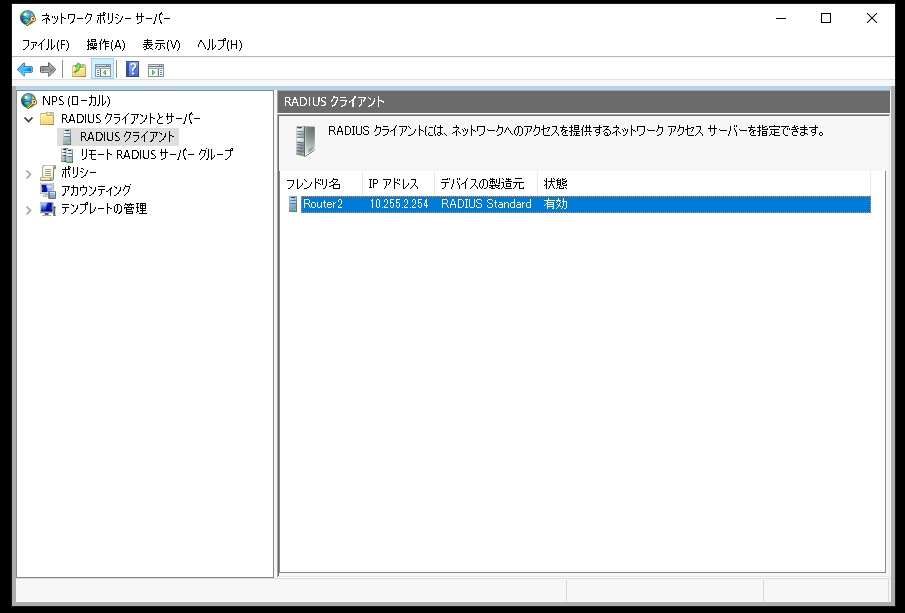</kbd>  


---  

## ネットワークポリシーを構成する    
 
1. 左側コンソールツリーの[NPS(ローカル)]-[ポリシー]-[ネットワーク ポリシー]をクリックする  
1. [ネットワーク ポリシー]を右クリックし、コンテキストメニュー内の[新規]をクリックする  
    <kbd>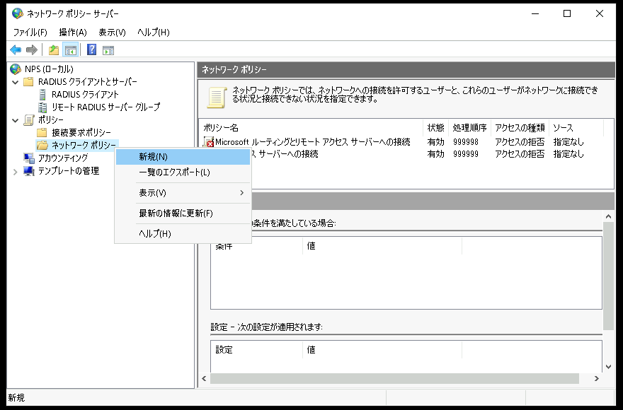</kbd>  

1. [新しいネットワーク ポリシー]ウィンドウが表示されたことを確認する  
    <kbd>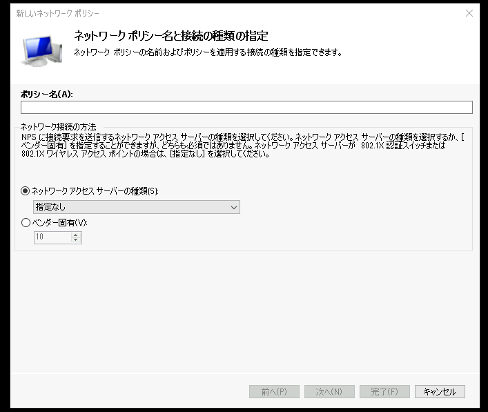</kbd>  

1. [新しいネットワーク ポリシー]ウィンドウで、以下の手順の操作をする  

    1. [ネットワークポリシー名と接続の種類の指定]画面で、以下のパラメータを入力する  

        ポリシー名:  
        `Active Directory Authentication`   

        - [x] ネットワークアクセスサーバーの種類    
        `指定なし`   

        - [ ] ベンダー固有
        `10`   

        <kbd>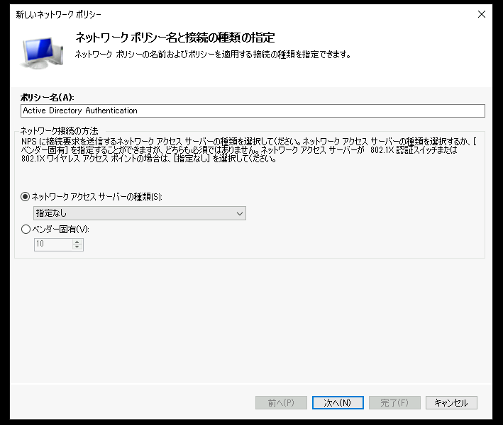</kbd>  

    1. [ネットワークポリシー名と接続の種類の指定]画面で、[次へ]をクリックする  

    1. [条件の指定]画面で、[追加]をクリックする   
        <kbd>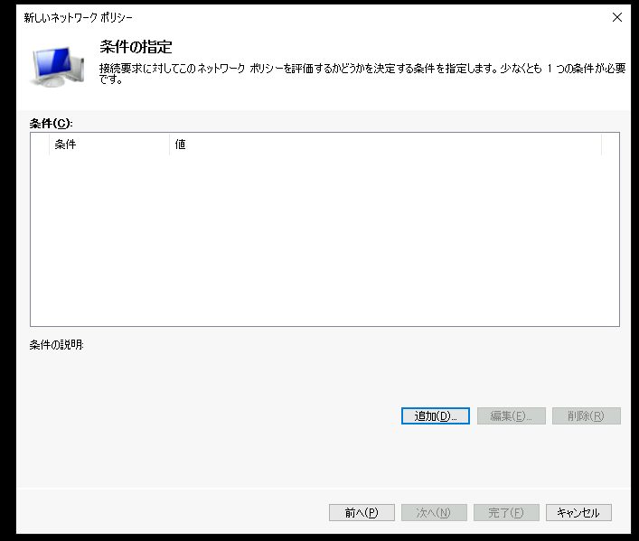</kbd>  
    1. [条件の選択]ウィンドウが表示されたことを確認する   
    1. [条件の選択]ウィンドウで、[ユーザーグループ]をクリックして選択する    
    1. [条件の選択]ウィンドウで、[追加]をクリックする  
        <kbd>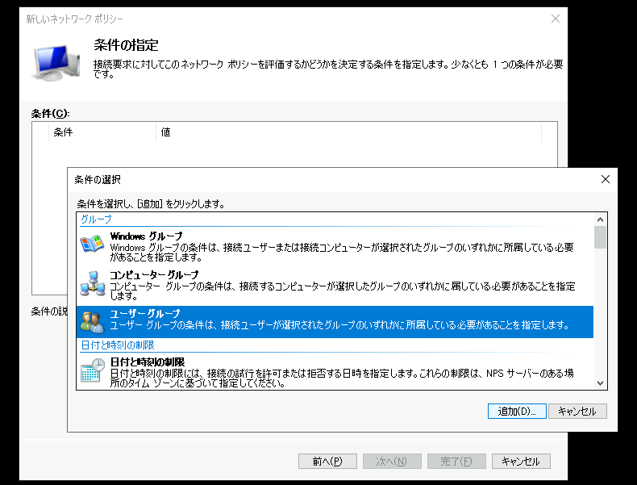</kbd>  
    1. [ユーザーグループ]ウィンドウが表示されたことを確認する   
        <kbd>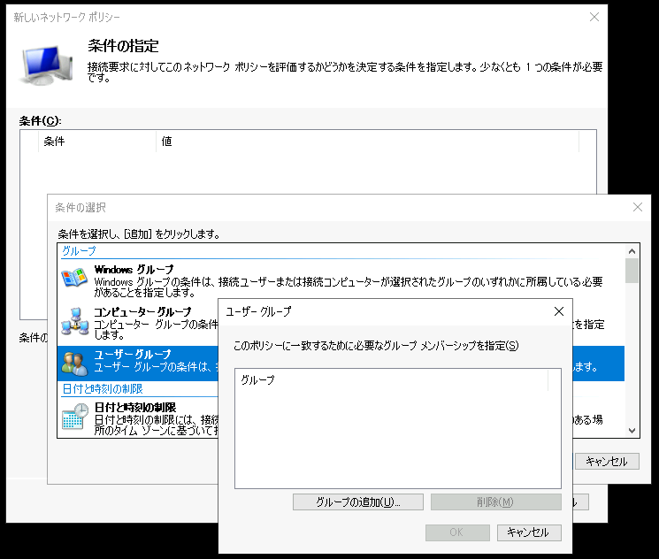</kbd>  
    1. [ユーザーグループ]ウィンドウで、[グループの追加]をクリックする  
    1. [グループの選択]ウィンドウが表示されたことを確認する   
        <kbd>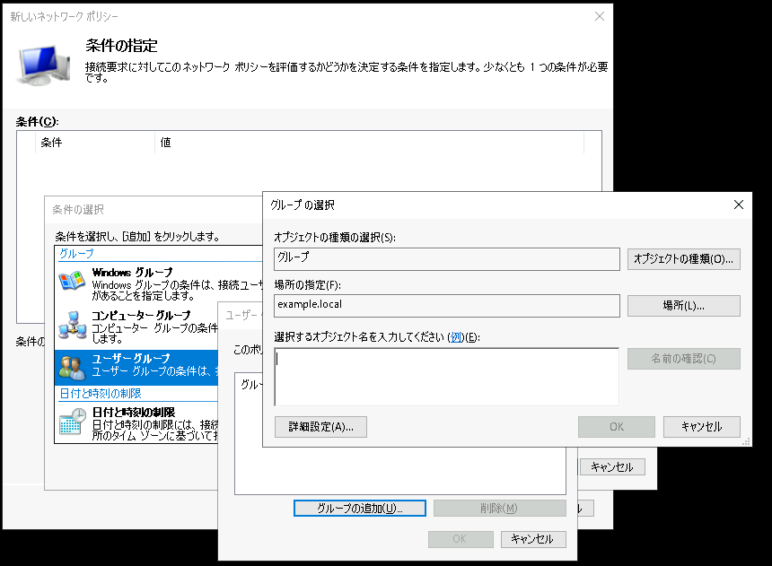</kbd>  

    1. [グループの選択]ウィンドウで、以下のパラメータを入力する  

        選択するオブジェクト名を入力してください:  
        `DL_Router_RemoteConnect`
    
    1. [グループの選択]ウィンドウで、[名前の確認]をクリックする  
    1. [ネットワーク資格情報の入力]ウィンドウが表示されたことを確認する   
    1. [ネットワーク資格情報の入力]ウィンドウで、以下のパラメータを入力する  
        
        ユーザー名:  
        `Spike`  

        パスワード:  
        `Pa$$w0rd`

        <kbd>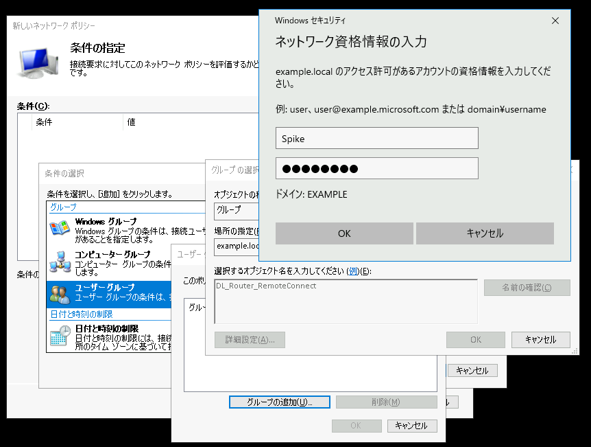</kbd>  


    1. [ネットワーク資格情報の入力]ウィンドウで、[OK]をクリックする    
    1. [グループの選択]ウィンドウで、[OK]をクリックする  
    1. [ユーザーグループ]ウィンドウで、[OK]をクリックする

        <kbd>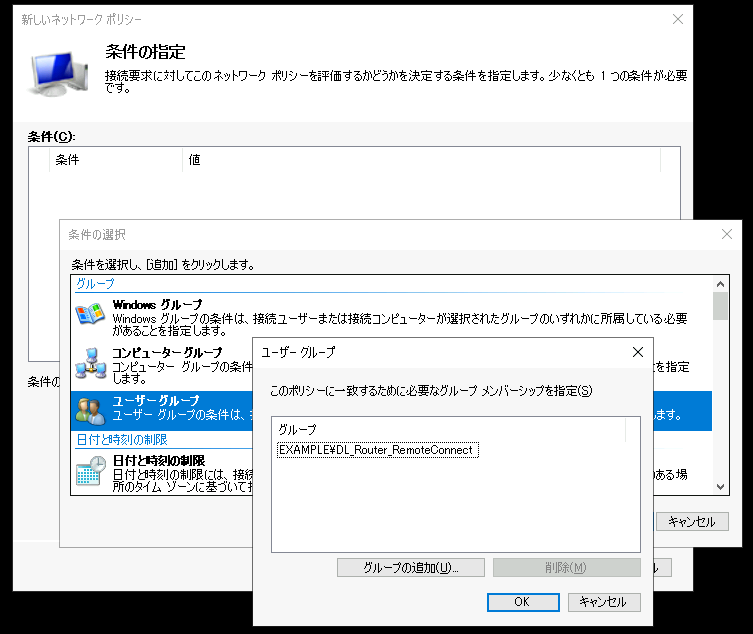</kbd>  

    1. [条件の指定]画面で、[次へ]をクリックする  
        <kbd>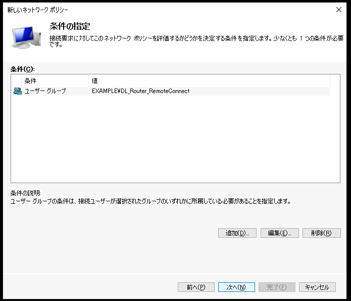</kbd>  

    1. [アクセス許可の指定]画面で、[次へ]をクリックする  
        <kbd>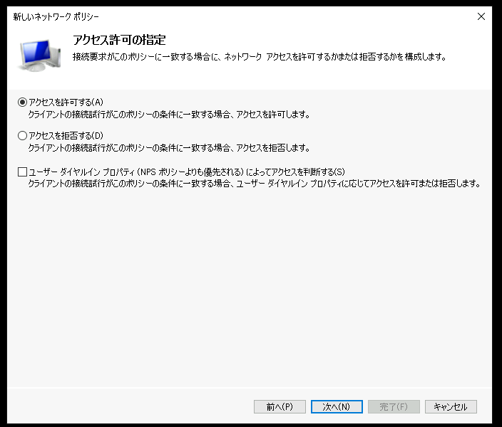</kbd>  

    1. [認証方法の構成]画面で、以下のパラメータを選択する  
    
        EAPの種類:  
        `<空欄>`  

        セキュリティレベルの低い認証方法:  
        - [x] Microsoft暗号化認証バージョン 2 (MS-CHAP v2)   
            - [x] パスワードの期限が切れた後も、ユーザーにパスワードの変更を許可する   
        - [x] Microsoft暗号化認証 (MS-CHAP)   
            - [x] パスワードの期限が切れた後も、ユーザーにパスワードの変更を許可する  
        - [ ] 暗号化認証 (CHAP)  
        - [x] 暗号化されていない認証 (PAP、SAP)  
        - [ ] 認証方法をネゴシエートせずにクライアントに接続を許可する   
        
        <kbd>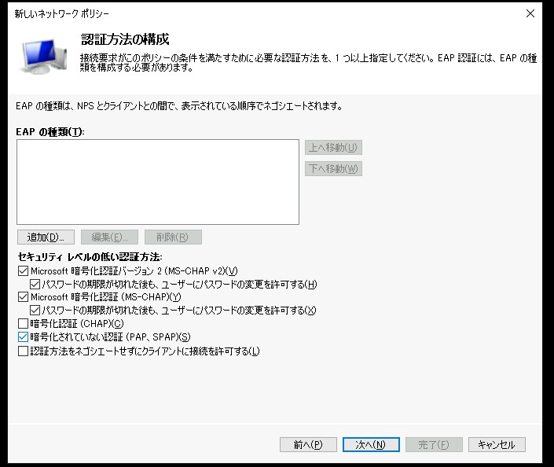</kbd>  
        
    1. [認証方法の構成]画面で、[次へ]をクリックする  

    1. [接続要求ポリシー]のポップアップで、[いいえ]をクリックする  

        <kbd>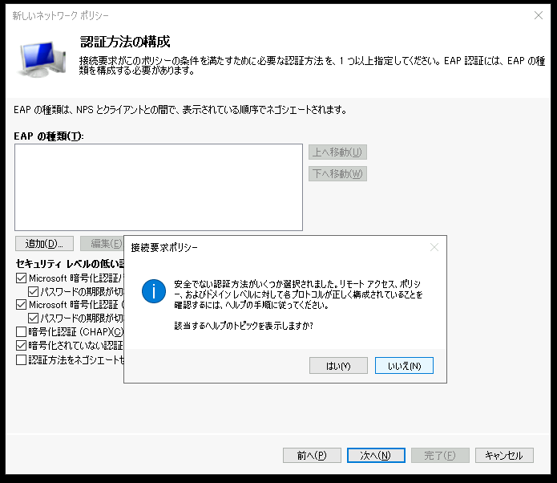</kbd>  

    1. [制約の構成]画面で、[次へ]をクリックする   

        <kbd>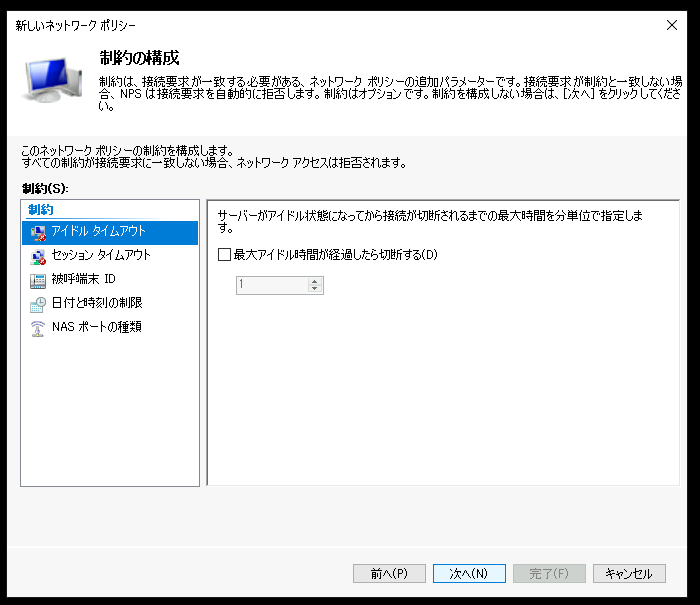</kbd>  

    1. [設定の構成]画面で、[次へ]をクリックする  

        <kbd>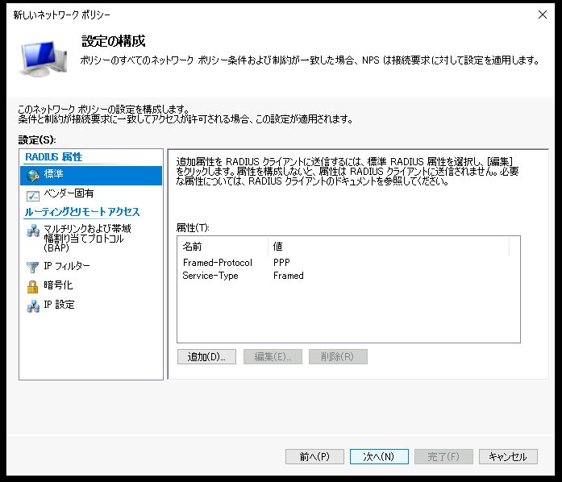</kbd>  

    1. [新しいネットワーク ポリシーの完了]画面で、[完了]をクリックする  

        <kbd>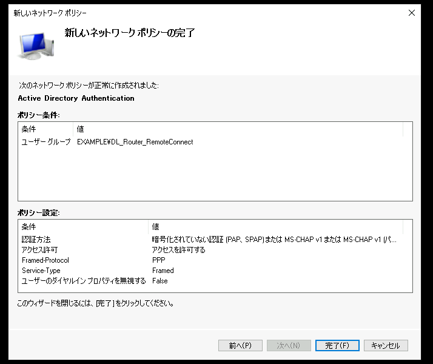</kbd>  

1. ネットワークポリシーを確認する  

    1. [ネットワーク ポリシー]の一覧に、[Active Directory Authentication]が追加されていることを確認する  
    
        <kbd>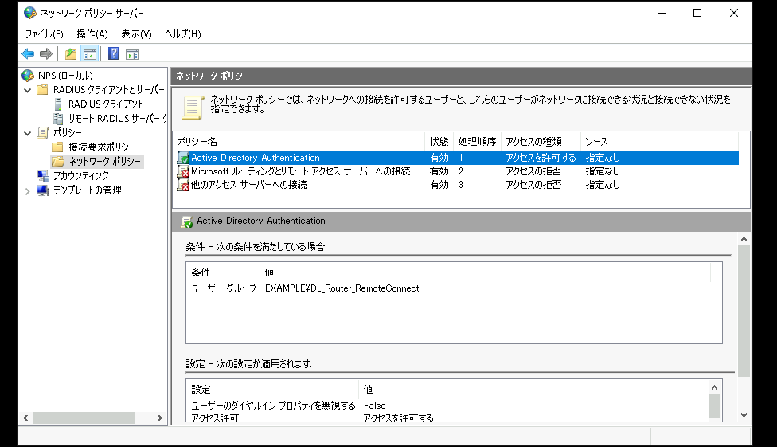</kbd>  


---

## 演習完了  
ここまでの手順で、以下の項目を学習できました。
- [x] 


